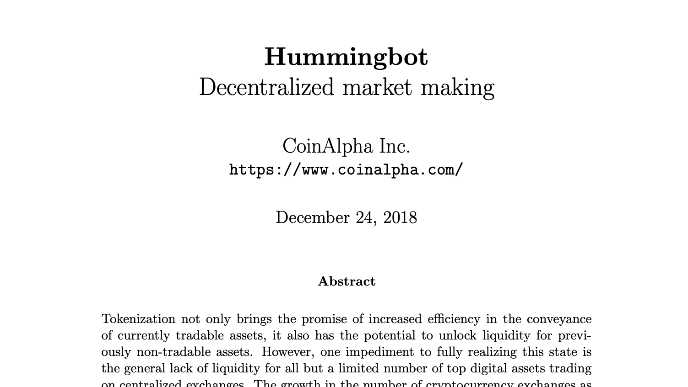

# Hummingbot Whitepaper

This summary encapsulates the original [Hummingbot whitepaper](/hummingbot.pdf), authored by CoinAlpha Inc. in 2018, before the project's launch. The whitepaper is a seminal document that outlines the theoretical and practical frameworks for an open-source market-making bot.

<!-- more -->

## Background
The whitepaper begins with an analysis of market liquidity. It articulates its significance in the financial ecosystem, discusses the challenges in digital asset markets, and identifies the barriers to market making in both traditional and digital economies. This analysis sets the stage for introducing Hummingbot, highlighting the need for improved liquidity solutions.

## Decentralized Market Making
In this section, the whitepaper advocates the advantages of a decentralized approach to market making. It presents Hummingbot as a crucial tool that could redistribute market making from centralized entities to individual and institutional participants. The platform's design accommodates a diverse user base, from tech enthusiasts to professional investors.

## Strategies
Delving into the core functionalities, the whitepaper details various trading strategies that Hummingbot supports. It provides comprehensive information on how users can employ these strategies to contribute to market liquidity and profit from market-making and arbitrage opportunities.

## The Hummingbot Client
The final section of the whitepaper describes the client's architecture, focusing on user security and operational reliability. The Hummingbot client is designed to support a decentralized, user-centric approach to market making, reflecting the decentralized ethos of blockchain technology.

Illustrations within the whitepaper elucidate the operational aspects of Hummingbot. This makes the whitepaper not only informative but also a practical guide for users interested in automated trading.

The original Hummingbot whitepaper of 2018 offers a comprehensive blueprint for what has become an essential tool in the cryptocurrency trading community. It serves as the definitive source for understanding the motivations, technology, and aspirations driving the Hummingbot project.
