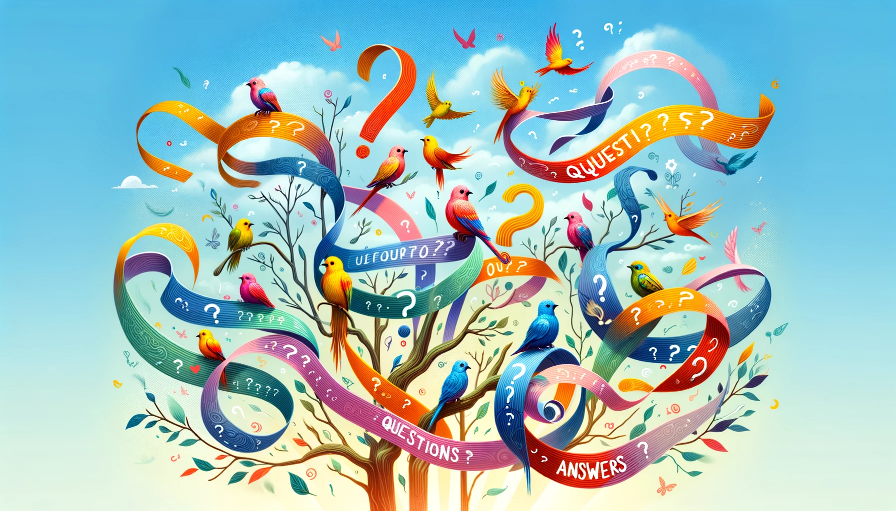

# Improvements to the Discord Support Program

Fourteen months have passed since the introduction of the [Discord Support Program](https://snapshot.org/#/hbot-ip.eth/proposal/0x588779179d0229db7de2de9e231f3baafb1fcdbde16bcc93bf34b65280e36a1a), an initiative designed to foster active involvement and collaborative problem-solving within the Hummingbot Discord community channels. This program has enabled the Foundation team to engage community developers and users in mutual support, freeing up our resources to focus on areas such as enhancing documentation, creating user guides, and improving the Hummingbot codebase.

But with the introduction of new Hummingbot features like [Dashboard](https://github.com/hummingbot/dashboard) and [V2 Strategies](/v2-strategies/), newer members of our community have struggling to keep pace with troubleshooting and issue resolution. In response, the Foundation team has intensified its engagement with community members on Discord by answering questions. Moreover, we are committed to keeping our community members abreast of the newest Hummingbot developments on the [roadmap](/blog/hummingbot-2024-technical-roadmap-innovating-for-the-future/), including the imminent launch of the Condor Telegram bot, custom screeners, and advanced AI capabilities.

## Key Changes

In order to increase community participation in answering questions and making the program fairer and more transparent, we're excited to announce some changes to the Discord Support Program, such as the new **Discord Leaderboard** in HBOT Tracker!

<!-- more -->

### Public Leaderboard

Check out the new **Discord Leaderboard** tab in the HBOT Tracker Google Sheet to see the top community members who have earned HBOT for providing support on Discord.

So far, a total of 3,841,201 HBOT has been distributed with participation from 28 unique providers. Our public leaderboard showcases the top contributors, with community contributor **`hbminerfan`** leading the way. **`ctraderxt`** and Hummingbot CTO **`dardonacci`** follow closely behind.

[:material-google-spreadsheet: HBOT Tracker](https://docs.google.com/spreadsheets/d/1mI1evL-_BNbQtLL_gvblPJoYmnOm4zV0prSgo-7Klz8/edit?usp=sharing){ .md-button .md-button--primary}

### New Discord Roles

Community members who have signed up to provide support now have the 👋 **support-contributor** role on Discord, so that they are differentiated from other users.

We have also created a new **support-evaluator** role on Discord. Previously, only Foundation staff members could grant points for answers, with the caveat that they could not grant points for their own answers. Going forward, we will assign this role to the most experienced contributors from the community, which will enable both designated community members and Foundation team members to award points for quality answers.

The initial appointees include active members of the Discord Support Program, such as **`wojak`**, **`hbminerfan`**, and **`MementoMori`**. As the number of community support providers grow, we plan to expand this list of support evaluators in lockstep.

### Increased Weekly Payouts

In the recently approved [HGP-50](https://snapshot.org/#/hbot.eth/proposal/0xc13f3b9fdaded22d1ce0b5528c9146fb2a762c41deed88e6c64e798465414738) governance proposal, HBOT holders approved the continuation of the Discord Support Program for 2024, allocating a **100,000 HBOT budget per week** to be used to reward users who provide quality answers to questions other users ask on Discord.

### Revised Point System

Previously, evaluators could only assign 1 or 2 points for answers. We add a third point category and formalize the differences between the point categories:

  - 1 point for a basic answer
  - 2 points for answers concerning V2 Strategies, Dashboard, and other new/advanced Hummingbot features
  - 3 points for going the extra mile in assisting users and hand-holding them through their issues via in a Discord thread.

These changes are designed to incentive community members who offer practical and effective solutions, especially related to recently released features. At the end of each week, these points are tallied to compute each user's HBOT earned.

### Broader Reward Distribution

We have changed the maximum reward percentage that a single user can earn will be reduced from **20%** to **10%** of the weekly payout. This adjustment will enable a broader distribution of rewards among community members.

## How to Participate

Becoming a part of this exciting and rewarding program is simple:

1. Complete the [New Hummingbot Contributor Form](https://forms.gle/9jcm45HvU2XsBsm49) to agree to the terms and conditions and provide your Ethereum address.
2. Foundation staff awards accepted users a `support-contributor` badge
3. Start assisting others in the Hummingbot Discord server across any public channels or threads on the [Hummingbot Discord](https://discord.gg/hummingbot) by answer their questions or helping them with installation.

## Evaluation Process

Discord users with the **`support-evaluator`** role may add a 1️⃣, 2️⃣ or 3️⃣ emoji to answers and threads provided by users who have the **`support-contributor`** badge. Each thread or set of messages is scored, so that a single conversation with a user is treated as an single answer, which is assigned 1, 2, or 3 points.

Currently, the Foundation team manually tracks evaluated responses in the [Discord Support Program Tracker](https://docs.google.com/spreadsheets/d/1mI1evL-_BNbQtLL_gvblPJoYmnOm4zV0prSgo-7Klz8/edit?usp=sharing) and computes the weekly rewards earned by each support provider. We plan to automate this process in the future.

At the end of the month, contributors will receive their total bounties earned, [either in USDC or HBOT](../launching-usdc-payouts-for-bounty-recipients/index.md) based on the current preference they indicated in the onboarding form.

---

We believe these updates will greatly contribute to achieving a more transparent, decentralized, and fair system for distributing incentives among our Discord community members. If community members have feedback and suggestions to further improve this system, please let us know!

[:raised_hand: Join Program](https://forms.gle/9jcm45HvU2XsBsm49){ .md-button .md-button--primary}
