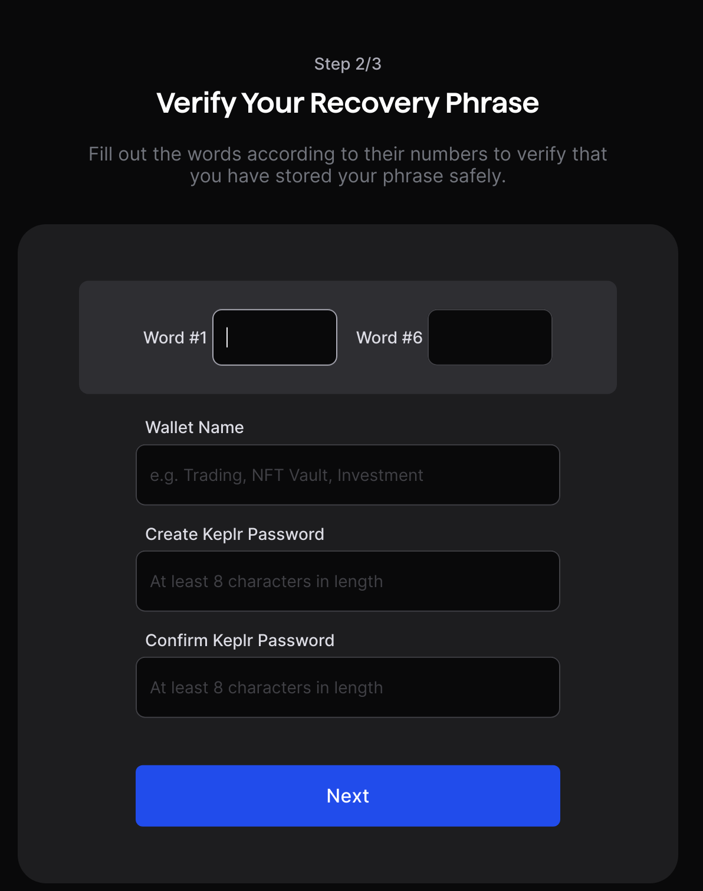

# Using Injective Helix with Hummingbot

<!--  -->

*by [Emerald](https://github.com/peterwilli)*

Welcome to the Injective Helix Hummingbot Connector Guide, your comprehensive resource for integrating and trading on Injective's decentralized exchange using Hummingbot. Injective Helix leverages the Injective Protocol, a decentralized layer-1 blockchain, to offer fast and secure trading with minimal fees.

With Injective Helix, users can access network-wide liquidity, trade with privacy, and enjoy a seamless trading experience on a user-friendly interface.

The platform supports various trading pairs both on spot and margin. Combined with Hummingbot, it allows traders to execute their strategies with ease.

## What You'll Learn

- Setting up a wallet and allow it to trade according to your strategy
- Make a demo market making strategy
- Tips and tricks when making your own strategies on Injective and Hummingbot

Let's get started!

<!-- more -->

## Prerequisites

- Some skills in the terminal
- [Injective](https://coinmarketcap.com/currencies/injective/) tokens (for paying the fees and trading). You can start for free if you use the Injective faucet later on in the tutorial.

## Installation

### Installing Docker

Docker is a software platform that allows one to build and deploy applications quickly by packaging software into standardized units called 'containers' that have everything the software needs to run. This makes Docker the easiest way to install and maintain Hummingbot.

The author's main operating system is Mac and Linux, but Windows is supported.

- Windows
- Mac
- Linux

### Installing Hummingbot

1. Open the terminal, and go to a directory that you wish to install Hummingbot in.

2. Run `git clone https://github.com/hummingbot/hummingbot.git --depth=1`, this will download the latest Hummingbot release from GitHub.

3. Run `cd hummingbot` to go to the Hummingbot working directory.

4. Run `docker compose up -d` to spawn your Hummingbot instance

## Setting up Hummingbot with Injective

Injective can be configured for automated trading in various ways, we are going to focus on the most secure and user-friendly way: account delegation.

With account delegation, you have not one but 2 accounts. The first account is your portfolio, this is where your money resides.

The second account is the trading account, which does your day-to-day trading. The trading account has the permission to trade using the money on your portfolio account, but can't take the money out or move it anywhere else.

### Setting up your wallets

For ease of use, we will use Keplr, which is a Cosmos Wallet that supports multiple accounts, making it easy to make a trading and portfolio account.

Note: In the real world, you want these 2 accounts separated, but for now this is ok. See tips and tricks at the bottom of this document for more details.

#### Installing Keplr

1. Go to [keplr.app](https://keplr.app) on your favorite browser (Chrome, Brave, Firefox etc. work) and hit the "Install Keplr" button

2. Follow the browser-specific installation procedure.

#### Create the Portfolio account

1. Open the extension in your browser, you should see this screen. Click the "Create new wallet" button: 

2. Click "Create new recovery phrase": 

3. When the warning appears, select "understood" and choose between a 12 or 24 word seed in the next screen. This seed will give you access to all your coins that you keep on Keplr!

4. It is important to write them down, and hide them so that only you know the seed. 24 words is more secure than 12 but is more cumbersome to write down.

5. If you ever lose access to your computer or your data, you can recover your entire wallet using the paper with the words

6. In the next screen, the application will ask you to enter 2 random words that you have written down, this is to double-check if you have written them down correctly. 

7. Find the 2 words it asked for and write them down in the verification window
8. Name the wallet "Hummingbot Portfolio"
9. If this is the first time setting up, create a password that is used to log in to Keplr, then hit "next".
10. In the chain selection screen, find Injective and turn it on, then hit save: 

#### Create the Trading account

1. Repeat the process above, but name the wallet "Hummingbot Trading"
2. You should have something like this now when you click on the account icon on the top right of the extension pane: 

While you have Keplr open, note a few things (we will need these later):

- Portfolio wallet address
- Trading wallet seed phrase
- Portfolio wallet seed phrase

### Delegation

We now need to make sure the trading wallet has access to the portfolio wallet's funds for trading. For this we use delegation.

#### Prerequisites

You need funds on the portfolio and trading wallet to pay for the fees for trading and granting the permissions to the trading wallet. For simplicity, we focus on main net only.

You can use the Injective faucet to add some small funds to pay for fees on your wallets, however, we recommend buying Injective and putting a small portion (0.1 INJ, for example) on the trading account for the fees, and a larger portion (whatever you are comfortable with to trade) on your portfolio account.

If you don't wish to buy INJ and add funds to your accounts, you can go to the faucet here: <https://inj.supply>

1. In the terminal, run `docker compose exec hummingbot bash` to log into the Hummingbot Docker shell.

2. Download Emerald's Account Delegation script (it is much more user-friendly than the official account delegation script, it isn't merged yet into hummingbot) by running `wget https://raw.githubusercontent.com/peterwilli/ModernDragonHoard/6bba346ecd8e425ef2c8351732a6801106701322/hummingbot/connector/exchange/injective_v2/account_delegation_script.py`

3. Activate the hummingbot environment: `conda activate hummingbot`

4. Run `python account_delegation_script.py --help` to see all the options of account delegation.

5. Configure the delegation as you wish

6. Take a look at the market IDs, and see which ones you want to trade on. For example: https://lcd.injective.network/injective/exchange/v1beta1/spot/markets for spot markets and https://lcd.injective.network/injective/exchange/v1beta1/derivative/markets for derivative markets.
7. For example, with this call, you allow to the trading account to trade INJ-USDT on the derivatives market (replace trading_account_address with your actual trading account address you noted earlier): `python account_delegation_script.py --network mainnet --grantee_address trading_account_address --granter_subaccount_index 0 --derivative_market_ids 0x9b9980167ecc3645ff1a5517886652d94a0825e54a77d2057cbbe3ebee015963`

8. You will get a prompt to enter your private key, in here, you can paste the portfolio wallet seed phrase we noted earlier. Once you did that, a transaction should go out that finalizes the authorization. If you get an error, make sure your account has enough Injective on its balance to pay for the fees.

### Connecting to Hummingbot

Now we will connect the trading account to Hummingbot! Exit the Hummingbot container by running the `exit` command.

1. Run `docker compose attach hummingbot` to get into the actual Hummingbot instance. Press enter at confirmations until you have to enter a password. Type a password that you remember, you need it later to log in / decrypt the keys again. This process is entirely local, there is no "password reset"!

2. After you set up your password, you're in the main area, that looks like this:

3. Now we will connect the Injective trading wallet to the Hummingbot, in the main window, type `connect injective_v2` or `connect injective_v2_perpetual` depending on if you want to use spot or perpetual markets and press enter.

4. You are being asked a few questions. Answer as follows and press enter:

5. After all is done, you should see "connected to injective_v2". You can now start using strategies with Injective in the most secure way!

## Tips & Tricks

### Trading on a home server

In the tutorial we used Delegated Accounts, this has security benefits, for example, reducing the value of the device that your bot is running on (as it does not contain your actual private key), making it less enticing to steal.

For example, in my setup, my trading bot is running in my bedroom, day and night on a second hand Mac Mini M2 with 16GB RAM that costed roughly $600, but you can get them even cheaper with 8Gb, which is enough for Hummingbot. The power consumption is roughly 7 watts, if you have solar panels, this basically runs for free, even in the winter. This is a cheap and reliable alternative to running on cloud servers.

### Optimizing your strategy for Injective

Be careful when opening example strategies and live trading on Injective! Every action, even so much as canceling an order, costs a tiny fraction of your Injective in fees. Make sure there's some "fuel" on your trading account, I typically try to have between 0.01 and 0.1 Injective on the trading account which is enough to go for months.

Optimize your strategies for Injective, and avoid the same mistake that I made (my bot was silently draining roughly 100 inj because it made hundreds of orders per second).

Only place or cancel orders when you have to, and try to avoid refreshing orders too often! (In my experience, checking the difference between current order price or amount v.s. what your strategy wants to place and see if it goes past a certain threshold rules out the biggest draining in fees).

Do not add too much Injective to your trading account, this is to protect against your strategy making too many orders and drain your wallet to pay for fees!