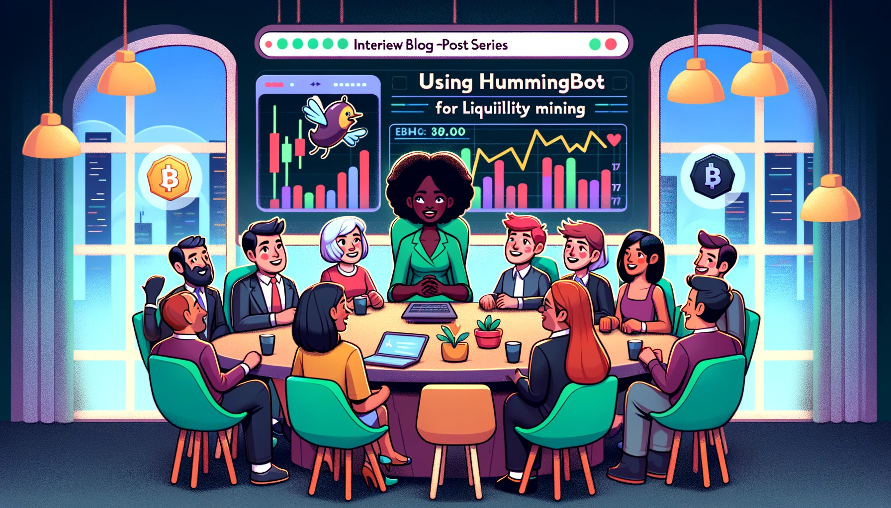

# Interview with Liquidity Miner Lorenzo

It's been just over two months since the launch of our Liquidity Mining program. With intense competition, miners have been diligently striving to ascend our leaderboard. We've witnessed an increase in miners joining the program and investing substantial asset amounts.

In this post, we introduce Lorenzo Boyice, a relatively new member of our community who has consistently ranked in the Weekly Top 10 for the past few weeks. In 2010, he faced a dilemma when hackers demanded a 21 Bitcoin ransom to unlock his computer files. Now, as a software engineer, he began investing in cryptocurrencies in late 2018/early 2019. Through liquidity mining, his current monthly return ranges between 3-5%.

<!-- more -->

**Disclaimer: The views expressed in this interview are solely those of the interviewee and do not represent the opinions of hummingbot.io. Hummingbot does not guarantee nor claim to guarantee profits.**

### Could you share a bit about your background?

I earned my Bachelor's degree in Computer Science from the University of Missouri, Columbia, where I built a robust foundation in the field. Post-graduation, I started my career in the tech industry in Kansas City at Garmin. Initially, I worked in their aviation department, developing software for pilots, which was a revelation to me. After gaining substantial industry experience, I seized an excellent opportunity at Google, where I have been a software developer for around three years.

### Did you discover Hummingbot or liquidity mining first? How?

I encountered Hummingbot first. As an avid crypto enthusiast, I was exploring ways to maximize profits from my crypto assets beyond simply holding them. My research into staking, arbitrage, automated trading, and bots led me to Hummingbot, initially for arbitrage opportunities. However, upon delving into its documentation, I discovered liquidity mining and became deeply involved with your platform. I've been using Hummingbot for about a month now and am thoroughly impressed with its capabilities.

### When did you begin investing in crypto?

My crypto journey began in 2011 during high school when a virus locked my computer files, halting my music production. The hackers demanded a 21 Bitcoin ransom, which was my first encounter with Bitcoin. Although I paid the ransom, I didn’t delve deeper into Bitcoin until 2018. That's when I began mining Bitcoin and other altcoins, leading to a deeper understanding of cryptocurrency and trading on exchanges.

### How has your experience with Hummingbot been?

Hummingbot has been fantastic, offering an ideal blend of modularity and decentralization. Its open-source nature is particularly appealing. The setup process took less than an hour, thanks to my technical background. However, the guides and videos are extremely helpful for those without such experience. I'm eagerly looking forward to the upcoming training sessions to enhance my financial trading skills.

### As a top liquidity miner, how has your experience been with liquidity mining?

It's been a positive experience. The concept of passive income through liquidity mining, as explained in your whitepaper, resonated with me. I'm drawn to the decentralized nature of the platform, which empowers individual investors and fosters a community supporting various tokens and projects.

### Did you already own the tokens used in liquidity mining campaigns?

Before joining the program, my portfolio primarily consisted of Bitcoin, Ethereum, and a few Binance coins. The program introduced me to numerous altcoins, presenting new investment opportunities.

### Have you been profitable so far?

Yes, I've been profitable, although determining the direct profitability can be challenging. My returns from liquidity mining have been significant, contributing to an estimated annual return of 40-50%. Initially, I earned about 3-5% monthly.

![ocean.jpeg]

### What strategies do you employ in liquidity mining?

I began with pure market making and have experimented with multiple order strategies, settling on using three orders for optimal performance.

### Have you set up multiple bot instances?

Yes, I initially tested Hummingbot on an old computer before transitioning to cloud-based instances on Google Cloud. I've experimented with running up to eight bots simultaneously, eventually focusing on 2-3 for specific token pairs.

### Do you find the current strategies user-friendly for new miners?

The strategies are accessible for beginners. However, more emphasis on educating traders about advanced features like inventory skew and setting spreads would be beneficial. This is why I'm enrolled in the advanced training.

### How often do you adjust your bot settings based on market trends?

Initially, I frequently tweaked settings to understand the market. Now, I adopt a weekly approach to analyze markets and adjust positions.

### What pairs are you currently trading, and why?

I trade ZIL/BNB, ZIL/USDT, and RLC/ETH. My selection is based on both my belief in the potential of these projects and the rewards for providing market liquidity.

### Besides Hummingbot, what tools do you use for trading?

I occasionally use CoinGecko, CoinMarketcap, and primarily TradingView, focusing on signals like EMA, MACD, and volume.

### Any key insights from using Hummingbot?

It's crucial to rely on multiple sources or signals for trading decisions, especially in volatile markets. Combining different signals allows for more accurate and effective trading strategies with Hummingbot.

### Any trading tips for fellow miners?

Trust your instincts and make decisive choices. It's important to commit to a decision and be prepared to adjust as needed.

### Learn More

- [Hummingbot Miner’s app](https://miners.hummingbot.io): current liquidity mining campaigns
- [Hummingbot Help Center](https://support.hummingbot.io/)
- [Liquidity mining free trainings](https://www.eventbrite.com/e/learn-to-use-hummingbot-crypto-market-making-live-training-session-tickets-100968806418)
- [Liquidity mining whitepaper](../../../liquidity-mining.pdf)
- [Getting started](https://support.hummingbot.io/miner/getting-started)

For exchanges and projects interested in liquidity mining, please contact us at [partnerships@hummingbot.io](mailto:partnerships@hummingbot.io).
