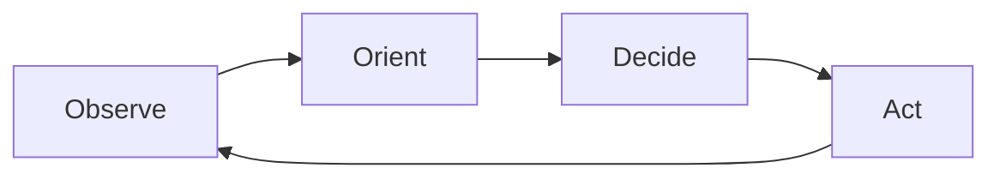

# Introducing Condor: The Open Source Harness for Trading Agents

We're excited to introduce **[Condor](/condor)**, an open source harness for building and running autonomous Trading Agents. Condor connects LLM-powered decision-making to deterministic trade execution via the Hummingbot API, enabling traders to deploy AI agents that can observe markets, reason about strategy, and execute trades across 50+ exchanges and blockchains.

This post introduces **Trading Agents** as an open standard, explains the architecture that makes them work, and walks through how you can create and manage them in Condor.

<!-- more -->

## Trading Agents

A **Trading Agent** is an autonomous software system that makes trading decisions and executes trades on behalf of a user. Unlike traditional algorithmic bots that follow rigid, pre-programmed rules, a trading agent uses large language models to interpret market conditions, adapt to changing dynamics, and learn from experience.

### Why Now?

When Hummingbot launched in 2019, it democratized market making. For the first time, individual traders and small firms could run the same strategies that professional market makers use on Wall Street — providing liquidity across dozens of exchanges without a quant team.

But there was a ceiling. As traders grew their operations — more exchanges, more chains, more clients, more capital — they hit the limits of what a single person could manage. Monitoring bots, adjusting parameters, responding to market conditions, handling edge cases: these tasks don't scale. A successful market maker eventually needs an operations team.

**Condor removes that ceiling.**

Where Hummingbot gives a person the ability run an algorithmic trading bot, Condor lets one person manage a *swarm* of autonomous agents — each observing markets, adapting to conditions, and executing strategies independently. For the first time, a single person can start and run a professional market making operation.

### Building Trust

Condor is built and maintained by [Hummingbot Foundation](https://hummingbot.org), a non-profit organization. The Foundation's revenue is linked to usage of the Hummingbot open source software across our connected exchanges, so our incentive is simple: build the best, most trustworthy open source trading infrastructure possible.

Autonomous agents that control real capital need to be trustworthy. As AI trading agents become more capable, they've also become targets for supply chain attacks — malicious skills, compromised scripts, and dependency injection.

The most effective defense is an integrated system built and maintained by a single trusted source. Condor is that system: the agent harness, execution layer, and skills all come from Hummingbot Foundation and are designed to work together.

### An Open Standard

We're defining Trading Agents as an open standard — a specification for how autonomous trading systems should be structured, how they manage context and provision it to LLMs, and how they interact with data collection and trade execution infrastructure. The standard enables:

- **Portability**: Agents are defined as structured Markdown files. Move them, share them, version them with git.
- **Auditability**: Every agent session logs each turn as a structured snapshot and appends key decisions to a human-readable journal. No black boxes.
- **Interoperability**: Any LLM (Claude, Codex, Gemini, Kimi, etc) can power the reasoning layer for agents. While agents created in Condor use Hummingbot API as the execution layer, support for other execution frameworks is possible.

## Trading Agent Architecture

A Trading Agent implements an architecture that cleanly separates probabilistic reasoning from deterministic execution.

### OODA

Trading Agents follow an iterative process similar to the [**OODA loop**](https://en.wikipedia.org/wiki/OODA_loop), a decision-making framework developed by military strategist John Boyd for fighter pilots. 

Fighter pilots use OODA to make split-second decisions in dynamic, adversarial environments. Markets share similar characteristics: incomplete information, adversarial participants, and a premium on speed and adaptability.

In algorithmic trading terms, OODA stands for:

- **Observe**: Gather data about the current state about the market
- **Orient**: Distilling the market data and interpreting it
- **Decide**: Determine a set of orders to place or cancel
- **Act**: Execute the orders reliably

A Trading Agent's loop follows OODA, but **different parts of this loop have different requirements**:

- **Observe** and **Act** must be deterministic—fetching market data and placing orders should produce consistent, predictable results
- **Orient** and **Decide** benefit from probabilistic reasoning—interpreting complex situations and weighing tradeoffs is where LLMs excel

This separation is the foundation of the Trading Agent architecture.

### The Agentic Loop (Probabilistic)

The agentic loop is the continuous OODA cycle that ticks through time. Each tick:

1. **Observe**: Fetch portfolio state, active positions, and market data via Hummingbot API
2. **Orient**: Load the journal (learnings, current state, recent actions) and build context
3. **Decide**: The LLM reasons about strategy and determines what actions to take
4. **Act**: Execute decisions via MCP tools, then record results to journal

The loop is **probabilistic** because the LLM powers the Orient and Decide phases. Given the same market conditions, the agent might reason differently and make different decisions. This variability is a feature—it enables adaptation, nuanced judgment, and the potential for agents to improve over time through techniques like [autoresearch](https://github.com/karpathy/autoresearch).

### The Execution Layer (Deterministic)

The [Hummingbot API](/hummingbot-api) handles the Observe and Act phases. It provides:

- **Data collection**: Standardized access to order books, candles, balances, and positions across 50+ exchanges
- **Market access**: Connectors to spot, perp, and AMM exchanges, along with Solana and EVM networks
- **Trade execution**: Run configurable executors that abstract common trading workflows and track performance
- **Bot management**: Deploy and manage containerized bots for long-running strategies

The execution layer is **deterministic**—the same instruction always produces the same result. For example, when you create a [Position Executor](/strategies/v2-strategies/executors/positionexecutor) with a 2% take profit, 1% stop loss, and 60-second time limit, it will manage the position exactly according to those parameters using the [Triple Barrier Method](https://www.mlfinlab.com/en/latest/labeling/tb_meta_labeling.html). This predictability is critical for auditability and trust.

The [Hummingbot MCP Server](/mcp) and [Hummingbot Skills](/skills) bridge the two layers, giving the LLM structured access to execution capabilities while maintaining clear boundaries.

## Condor

Condor is an open source AI agent harness, similar to [OpenClaw](https://github.com/anthropics/openClaw). Just as OpenClaw helps you create and manage agents that automate personal productivity tasks, Condor helps you create and manage agents that perform trading tasks.

Condor provides AI-mediated trading tools—a free, open source alternative to products like [Binance AI Pro](https://www.binance.com/en/academy/articles/binance-ai-pro-guide-what-it-is-and-how-to-use-it):

- **Trading Agents**: Build autonomous agents that execute strategies over time with persistent state
- **Trading tools**: Portfolio management, order execution, and position tracking via Hummingbot API
- **Risk management**: Built-in guardrails that prevent agents from exceeding configured limits

### Why Telegram?

Telegram offers several advantages as a trading interface:

- **Cross-device continuity**: Seamlessly switch between mobile and desktop while managing your agents
- **Trading UI**: Rich message formatting, inline buttons, and real-time notifications for trade alerts
- **Team access**: Run one Condor instance and add multiple user IDs to enable team-based trading

If you already have a Mac Mini running OpenClaw, installing Condor alongside it should be straightforward since they share the same deployment pattern.

### Installation

See the [Condor documentation](/condor) for installation instructions.

### Design

Each Trading Agent follows a standard structure stored in the `~/condor/agents/` directory:

- **agent.md**: Defines what the agent does. YAML frontmatter sets configuration (tick interval, risk limits, connectors); Markdown instructions guide the LLM on goals and rules.

- **sessions/**: Each time you start an agent, it creates a new session containing:
    - **journal.md**: The agent's working memory—learnings accumulated over time, current state, recent actions, and quantitative history for analysis
    - **snapshots/**: Point-in-time captures of agent state for debugging and replay

Condor's architecture enables **session continuity across interfaces**. The `~/condor` directory stores all agent state, and Condor uses ACP (Agent Communication Protocol) to connect to your LLM. This means you can start a conversation on Telegram and continue it in Claude Code—same session, same agent state, same conversation history.

## Usage

The `/agent` command lets you connect your LLM of choice and build Trading Agents. This featu re is still a work in progress—see the [Condor documentation](/condor) for the latest usage instructions.

## What's Next

Condor is in active development. On the roadmap:

- **Agent templates**: Pre-built strategies for common trading styles
- **Backtesting**: Test agents against historical data before deployment
- **Multi-agent coordination**: Run multiple agents that share insights
- **Web dashboard**: Monitor agents without Telegram

The next cohort of [Hummingbot Botcamp](https://www.botcamp.xyz/cohorts/cohort13/landing) will teach users how to build Trading Agents with Condor.

## Get Started

Install Condor using the [Hummingbot API Quickstart](/installation/hummingbot-api), which deploys everything you need: the Hummingbot API server, Gateway for DEX trading, and Condor as a Telegram bot.

Condor is in active development. Share feedback and contribute ideas:

- **Public**: Join the [#condor-feedback](https://discord.gg/hummingbot) channel on Discord
- **Private focus group**: DM a Foundation team member on Discord to join

---

*Condor is open source software. Use at your own risk. Always start with small amounts and monitor agent behavior carefully.*
