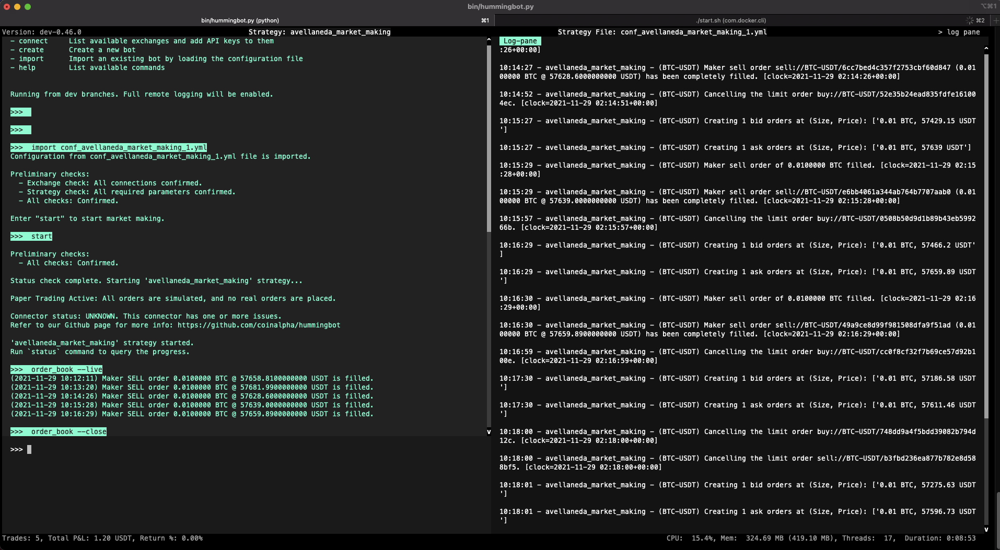
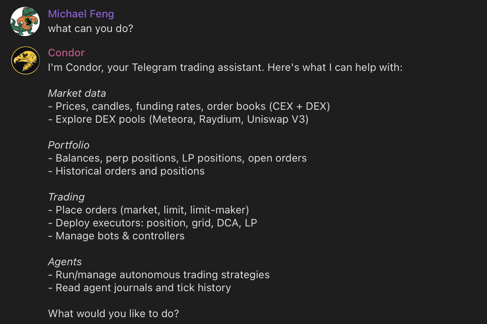
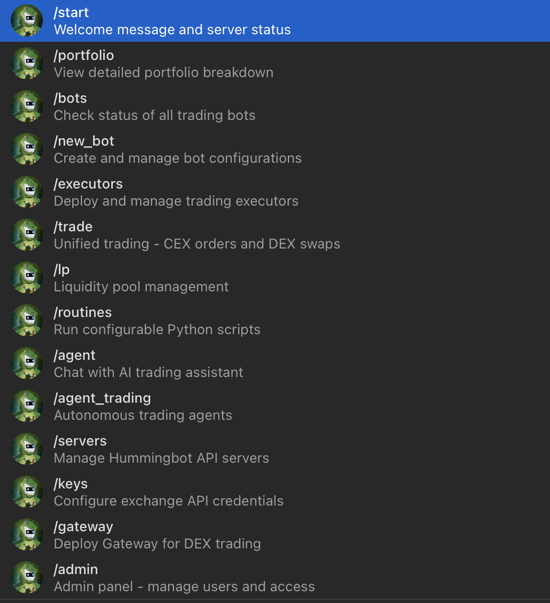
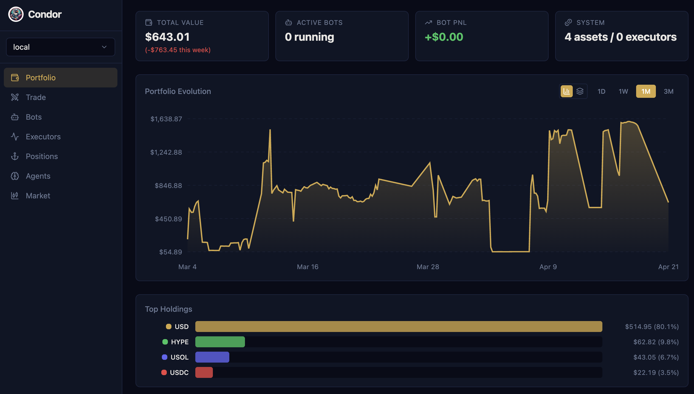
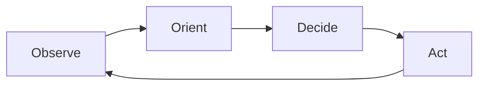
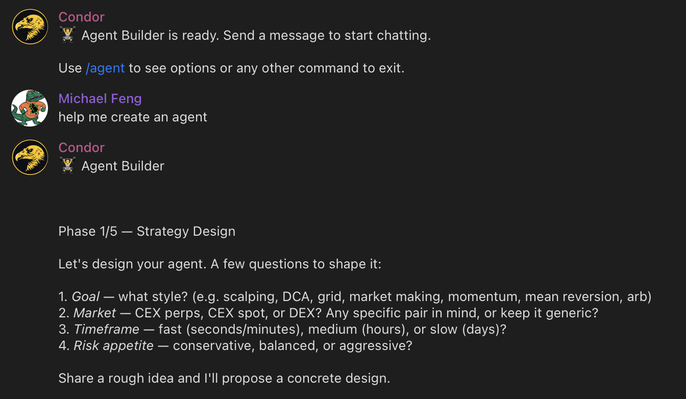

# Introducing Condor: The Open Source Harness for Trading Agents


We're excited to introduce **[Condor](https://condor.hummingbot.org)**, an open source harness that connects LLMs to the Hummingbot trading infrastructure. Condor lets you use natural language to execute trades, run trading bots, and deploy autonomous trading agents across 50+ exchanges and blockchains.

<!-- more -->

## The Condor Harness

Condor is an open source AI agent harness, similar to [OpenClaw](https://github.com/anthropics/openClaw). Just as OpenClaw helps you create and manage agents that automate personal productivity tasks, Condor helps you create and manage agents that automate trading tasks, as well perform trades using natural language.

### Motivation

When Hummingbot launched in 2019, it democratized market making. For the first time, individual traders and small firms could run the same strategies that professional market makers use on Wall Street.



But there was a ceiling. As traders grew their operations — more exchanges, more chains, more clients, more capital — they hit the limits of what a single person could manage. Monitoring bots, adjusting parameters, responding to market conditions, handling edge cases: these tasks don't scale.

**Condor removes that ceiling.** Where Hummingbot gives a person the ability to run an algorithmic trading bot, Condor lets one person manage a *swarm* of autonomous agents — each observing markets, adapting to conditions, and executing strategies independently.

### Security

Autonomous agents that control real capital need to be secure and trustworthy. As AI trading agents become more capable, they've also become targets for supply chain attacks — malicious skills, compromised scripts, and dependency injection. The most effective defense is an integrated system built and maintained by a single trusted source.

Condor is that system. It's built and maintained by [Hummingbot Foundation](https://hummingbot.org), a non-profit organization whose revenue is linked to usage of the Hummingbot open source software across our connected exchanges. Our incentive is simple: build the best, most trustworthy open source trading infrastructure possible.

The Foundation safeguards against supply chain attacks through strict guidelines on library dependencies and continual review to minimize attack surface. For example, the recent [Hummingbot v2.14 release](/release-notes/2.14.0) removed Axios, a recently compromised HTTP library, from Gateway.

Unlike broader agent frameworks, Condor strictly separates reasoning from execution. This two-layer architecture provides key advantages:

- **Speed**: Deterministic systems handle time-critical trades (stop-losses, take-profits) without LLM latency
- **Efficiency**: Deterministic code handles routine operations, reducing token consumption significantly
- **Security**: The execution layer constrains what an AI agent can actually perform
- **Standardization**: One unified interface across 50+ exchanges and blockchains eliminates API complexity

### Capabilities

Condor provides AI-mediated trading tools—a free, open source alternative to products like [Binance AI Pro](https://www.binance.com/en/academy/articles/binance-ai-pro-guide-what-it-is-and-how-to-use-it). It integrates with LLMs (Claude, GPT, Gemini, etc.) to help you:



#### 1. Execute Trades

Use natural language to place orders, swap tokens, and manage positions across centralized and decentralized exchanges. Query your portfolio, check balances, and analyze market data—all through conversation.

#### 2. Run Trading Bots

Deploy and manage the same [Hummingbot scripts and controllers](/strategies/v2-strategies/controllers) that power algorithmic trading strategies. Each bot runs in a Docker container with its own configuration, and you can monitor logs, adjust parameters, and stop/start bots through the Condor interface.

#### 3. Run Trading Agents

Build and deploy autonomous **Trading Agents** that observe markets, reason about strategy, and execute trades independently. Trading Agents combine LLM-powered decision-making with deterministic trade execution, enabling a single person to manage a swarm of agents.

See the [Condor documentation](https://condor.hummingbot.org) for installation instructions.

### Telegram Interface

After you start Condor and message your bot on Telegram, you'll see a menu of available commands:



Most users start with `/start` to check server status, then `/keys` to configure exchange API credentials, and `/portfolio` to verify their balances are loading correctly.

Key commands include:

- `/start`: Display the main menu and check Hummingbot API server status
- `/keys`: Manage exchange API credentials securely
- `/portfolio`: View balances across all connected exchanges
- `/bots`: List and manage running Hummingbot bot containers
- `/agents`: List, create, and deploy Trading Agents

Telegram offers several advantages as a trading interface: cross-device continuity between mobile and desktop, rich message formatting with inline buttons, real-time notifications for trade alerts, and team access by adding multiple user IDs.

### Web Dashboard

For users who prefer a browser-based experience, Condor provides a web dashboard. Run `/web` in Telegram to get a secure login link:

```
🌐 Web Dashboard

Open this link in your browser:
http://localhost:8088/login?token=XSNKl6bjWKGce-mcCYSWWgcyC5EvgzFrFqgCGIIop0s

Link valid for 5 minutes.
```



The dashboard offers:

- **Portfolio**: Track balances and positions across connected exchanges
- **Trading**: Execute orders, view order books, and manage positions
- **Executors**: Create, monitor, and stop automated trading executors
- **Agents**: Monitor agent sessions, review performance snapshots, and examine learnings
- **Bots**: Launch, monitor, and manage trading bots

The dashboard maintains synchronized state with Telegram—start a trade on one platform and monitor it on the other.

## Trading Agents

A **Trading Agent** is an autonomous software system that makes trading decisions and executes trades on behalf of a user. Unlike traditional algorithmic bots that follow rigid, pre-programmed rules, a Trading Agent uses large language models to interpret market conditions, adapt to changing dynamics, and learn from experience.

### Probabilistic vs. Deterministic

The most critical challenge in trading agent design is that **LLMs and trade execution have fundamentally different requirements**:

- **LLMs are probabilistic**: the same input may produce different outputs. This is a feature for reasoning—but a bug for execution.
- **Trade execution must be deterministic**: the same instruction must always produce the same result, every time.

Mixing these two concerns is the root cause of most trading agent failures—unpredictable behavior, unexpected actions, and hard-to-audit logic.

Condor solves this by **strictly separating the two layers**:

| Layer | Role | Technology |
|-------|------|------------|
| **Probabilistic (Agent)** | Interprets market conditions, reasons about strategy, decides what to do | LLM (Claude, GPT, Gemini) |
| **Deterministic (Execution)** | Converts decisions into orders with reliability and auditability | Hummingbot API |

**The Execution Layer** provides deterministic infrastructure via [Hummingbot API](/hummingbot-api): data collection across 50+ exchanges, connectors to spot/perp/AMM exchanges plus Solana and EVM networks, configurable [executors](https://condor.hummingbot.org/executors/overview) that manage positions with precise parameters, and bot management for long-running strategies. The same instruction always produces the same result.

**The Agentic Layer** is probabilistic—given identical market conditions, the agent might reason differently. This variability enables adaptation and nuanced judgment. Each tick, the agent fetches market data, loads its learnings and context, reasons about strategy within defined limits, then executes decisions and records results.

By cleanly separating these concerns, you can audit, test, and improve each layer independently.

### Agent Builder Mode

Trading Agents follow an iterative process based on the [**OODA loop**](https://en.wikipedia.org/wiki/OODA_loop), a decision-making framework developed by military strategist John Boyd for fighter pilots. Fighter pilots use OODA to make split-second decisions in dynamic, adversarial environments. Markets share similar characteristics: incomplete information, adversarial participants, and a premium on speed and adaptability.




The key insight: **different phases have different requirements**. Observe and Act must be deterministic—fetching data and placing orders should produce consistent results. Orient and Decide benefit from probabilistic reasoning—interpreting complex situations and weighing tradeoffs is where LLMs excel.

The `/agent` command enters Agent Builder mode, which connects your LLM to Hummingbot API via [MCP tools](/mcp). Agent Builder mode guides you through creating a Trading Agent using this framework:



- **Observe**: Define what data your agent needs—order books, candles, positions, balances, funding rates
- **Orient**: Build routines to process the data—custom indicators, signal generators, market filters
- **Decide**: Hand decision-making logic to the LLM—strategy rules, entry/exit conditions, position sizing
- **Act**: Use Hummingbot API to execute actions reliably—place orders, manage positions, deploy executors

Describe your strategy in natural language, and Agent Builder will create the `agent.md` file with appropriate configs and limits.

### The Trading Agent Standard

We're defining the **Trading Agent** as an open standard — a specification for how autonomous trading systems should be structured. The standard enables:

- **Portability**: Trading Agents are defined as structured Markdown files. Move them, share them, version them with git.
- **Auditability**: Every session logs each turn as a structured snapshot and appends key decisions to a human-readable journal.
- **Interoperability**: Any LLM can power the reasoning layer. While Trading Agents use Hummingbot API as the execution layer, support for other execution frameworks is possible.

Each Trading Agent is a directory in `~/condor/trading-agents/` containing structured Markdown files:

```
~/condor/trading-agents/grid-trader/
├── agent.md          # Definition: configs, limits, and instructions
├── learnings.md      # Persistent knowledge across sessions
└── sessions/
    └── 2026-03-27-001/
        ├── journal.md    # Session working memory
        └── snapshots/    # Point-in-time state captures
```

**agent.md** defines the agent. YAML frontmatter specifies configuration; Markdown body provides instructions:

```yaml
---
name: Grid Trader
tick_interval: 60
connectors:
  - binance_perpetual

configs:
  trading_pair: BTC-USDT
  grid_levels: 5
  spread_percentage: 0.5

limits:
  max_position_size: 1000
  max_drawdown_percentage: 5
  daily_loss_limit: 100
---

## Goal
Maintain a grid of limit orders around the current price...

## Rules
1. Never exceed position limits
2. Cancel all orders if drawdown exceeds threshold
```

**configs** control agent behavior—trading pairs, order sizes, spread percentages. Agents can *suggest* config changes based on their learnings, but users must approve changes.

**limits** are guardrails the agent cannot exceed. Unlike configs, limits can *only* be modified by the user, never by the agent. This ensures safety constraints remain intact even as agents learn and adapt.

**learnings.md** persists across sessions. When an agent discovers that certain spreads work better during Asian hours, it records these insights. Each new session loads accumulated learnings to inform decision-making.

**sessions/** contains session-specific state including journal entries and point-in-time snapshots for debugging.

### Risk Management

Every agent includes a built-in Risk Engine that validates both pre-tick conditions and individual tool calls:

| Parameter | Default | Description |
|-----------|---------|-------------|
| `max_position_size_quote` | $500 | Maximum size per position |
| `max_daily_loss_quote` | $50 | Daily loss limit |
| `max_drawdown_pct` | 10% | Maximum drawdown from peak |
| `max_open_executors` | 5 | Maximum concurrent positions |
| `max_single_order_quote` | $100 | Maximum single order size |
| `max_cost_per_day_usd` | $5 | Daily LLM cost limit |
| `cooldown_after_loss_sec` | 300 | Pause after hitting loss limit |

See the full [Trading Agents](https://condor.hummingbot.org/trading-agents/overview) documentation for detailed information on [Positions](https://condor.hummingbot.org/trading-agents/positions), [Executors](https://condor.hummingbot.org/executors/overview), [Bots](https://condor.hummingbot.org/bots/overview), and [Routines](https://condor.hummingbot.org/routines/overview).

## What's Next

Condor is in active development. On the roadmap:

- **Agent templates**: Pre-built strategies for common trading styles
- **Backtesting**: Test agents against historical data before deployment
- **Multi-agent coordination**: Run multiple agents that share insights and learnings
- **Enhanced web dashboard**: Full-featured browser interface for agent management

The next cohort of [Hummingbot Botcamp](https://www.botcamp.xyz/cohorts/cohort13/landing) will teach users how to build Trading Agents.

## Get Started

Ready to try Condor? Follow the [Getting Started Guide](https://condor.hummingbot.org/getting-started/overview) to install Condor and deploy your first agent.

Condor is in active development. Share feedback and contribute ideas:

- **Discord**: Join the [#condor-feedback](https://discord.gg/hummingbot) channel for discussion
- **GitHub**: Create issues in the [Condor repo](https://github.com/hummingbot/condor/issues) for bugs and enhancements

---

*Condor is open source software. Use at your own risk. Always start with small amounts and monitor agent behavior carefully.*
