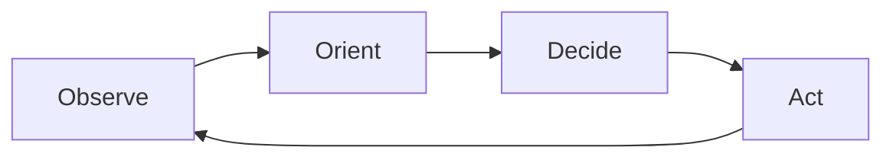
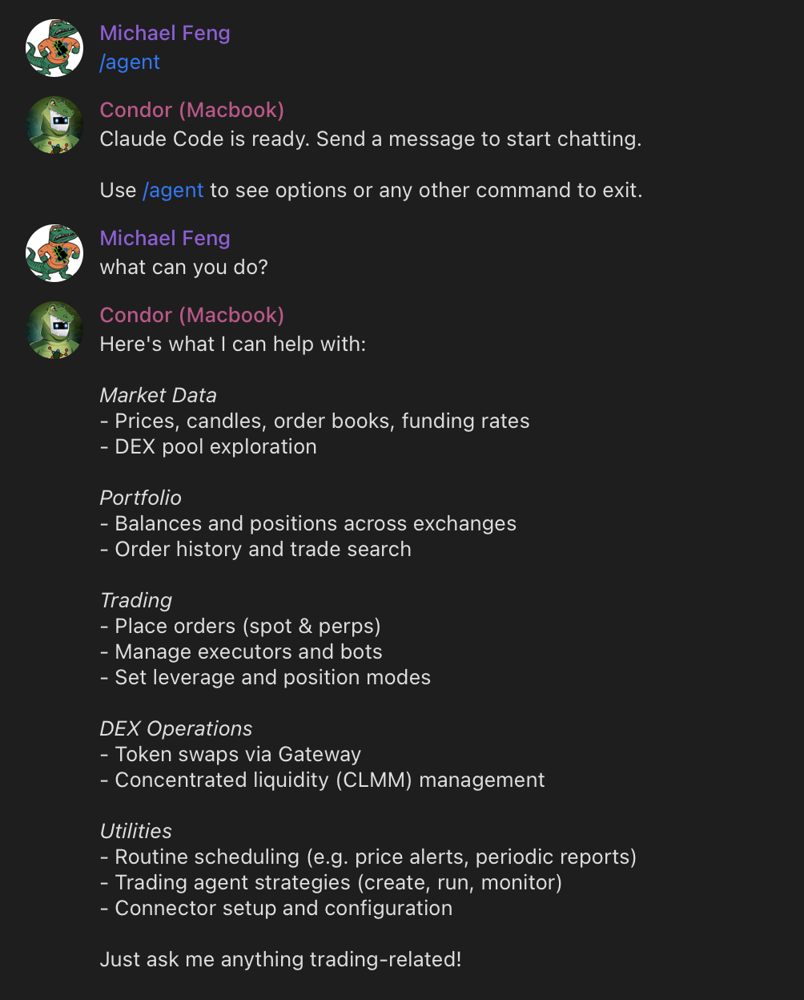

# Introducing Condor: The Open Source Harness for Trading Agents


We're excited to introduce **[Condor](/condor)**, an open source harness for building and running autonomous trading agents. Condor connects LLM-powered decision-making to deterministic trade execution via the Hummingbot API, enabling traders to deploy AI agents that can observe markets, reason about strategy, and execute trades across 50+ exchanges and blockchains.

This post introduces the **Condor Trading Agent (CTA)** standard, explains the architecture that makes CTAs work, and walks through how you can create and manage them using the Condor harness.

<!-- more -->

## Trading Agents

A **Trading Agent** is an autonomous software system that makes trading decisions and executes trades on behalf of a user. Unlike traditional algorithmic bots that follow rigid, pre-programmed rules, a trading agent uses large language models to interpret market conditions, adapt to changing dynamics, and learn from experience.

### Why Now?


When Hummingbot launched in 2019, it democratized market making. For the first time, individual traders and small firms could run the same strategies that professional market makers use on Wall Street — providing liquidity across dozens of exchanges without a quant team.

But there was a ceiling. As traders grew their operations — more exchanges, more chains, more clients, more capital — they hit the limits of what a single person could manage. Monitoring bots, adjusting parameters, responding to market conditions, handling edge cases: these tasks don't scale. A successful market maker eventually needs an operations team.

**Condor removes that ceiling.**

Where Hummingbot gives a person the ability run an algorithmic trading bot, Condor lets one person manage a *swarm* of autonomous CTAs — each observing markets, adapting to conditions, and executing strategies independently. For the first time, a single person can start and run a professional market making operation.

### Building Trust

Condor is built and maintained by [Hummingbot Foundation](https://hummingbot.org), a non-profit organization. The Foundation's revenue is linked to usage of the Hummingbot open source software across our connected exchanges, so our incentive is simple: build the best, most trustworthy open source trading infrastructure possible.

Autonomous agents that control real capital need to be trustworthy. As AI trading agents become more capable, they've also become targets for supply chain attacks — malicious skills, compromised scripts, and dependency injection.

The most effective defense is an integrated system built and maintained by a single trusted source. Condor is that system: the agent harness, execution layer, and skills all come from Hummingbot Foundation and are designed to work together.

### An Open Standard

We're defining the **Condor Trading Agent (CTA)** as an open standard — a specification for how autonomous trading systems should be structured, how they manage context and provision it to LLMs, and how they interact with data collection and trade execution infrastructure. The CTA standard enables:

- **Portability**: CTAs are defined as structured Markdown files. Move them, share them, version them with git.
- **Auditability**: Every CTA session logs each turn as a structured snapshot and appends key decisions to a human-readable journal. No black boxes.
- **Interoperability**: Any LLM (Claude, Codex, Gemini, Kimi, etc) can power the reasoning layer for CTAs. While CTAs created in Condor use Hummingbot API as the execution layer, support for other execution frameworks is possible.

See the full [Trading Agents](https://condor.hummingbot.org/trading-agents/overview) documentation for detailed information on [Positions](https://condor.hummingbot.org/trading-agents/inventory), [Executors](https://condor.hummingbot.org/executors/overview), [Bots](https://condor.hummingbot.org/bots/overview), and [Routines](https://condor.hummingbot.org/routines/overview).

## Condor Trading Agents

The CTA architecture separates what LLMs do well—reasoning under uncertainty—from what traditional software does well—reliable, repeatable execution.

### Probabilistic vs. Deterministic

The most critical challenge in trading agent design is that **LLMs and trade execution have fundamentally different requirements**:

- **LLMs are probabilistic**: the same input may produce different outputs. This is a feature for reasoning—but a bug for execution.
- **Trade execution must be deterministic**: the same instruction must always produce the same result, every time.

Mixing these two concerns is the root cause of most trading agent failures—unpredictable behavior, unexpected actions, and hard-to-audit logic.

Condor solves this by **strictly separating the two layers**:

| Layer | Role | Technology |
|-------|------|------------|
| **Probabilistic (Agent)** | Interprets market conditions, reasons about strategy, decides what to do | LLM (Claude, GPT, Gemini) |
| **Deterministic (Execution)** | Converts decisions into orders with reliability and auditability | Hummingbot API |

By cleanly separating these concerns, you can audit, test, and improve each layer independently.

### The OODA Framework

CTAs follow an iterative process based on the [**OODA loop**](https://en.wikipedia.org/wiki/OODA_loop), a decision-making framework developed by military strategist John Boyd for fighter pilots.


Fighter pilots use OODA to make split-second decisions in dynamic, adversarial environments. Markets share similar characteristics: incomplete information, adversarial participants, and a premium on speed and adaptability.



In trading terms:

- **Observe**: Gather market data—order books, positions, balances
- **Orient**: Interpret the data in context of strategy and history
- **Decide**: Determine which orders to place, modify, or cancel
- **Act**: Execute the orders reliably

The key insight: **different phases have different requirements**. Observe and Act must be deterministic—fetching data and placing orders should produce consistent results. Orient and Decide benefit from probabilistic reasoning—interpreting complex situations and weighing tradeoffs is where LLMs excel.

This separation is the foundation of the CTA architecture.

### Two Layers

**The Execution Layer** handles Observe and Act. The [Hummingbot API](/hummingbot-api) provides deterministic infrastructure:

- **Data collection**: Order books, candles, balances, and positions across 50+ exchanges
- **Market access**: Connectors to spot, perp, and AMM exchanges, plus Solana and EVM networks
- **Trade execution**: Configurable [executors](/strategies/v2-strategies/executors/positionexecutor) that manage positions with precise parameters
- **Bot management**: Deploy and manage containerized bots for long-running strategies

The execution layer is predictable—the same instruction always produces the same result. A Position Executor with 2% take profit, 1% stop loss, and 60-second time limit will manage the position exactly according to those parameters using the [Triple Barrier Method](https://www.mlfinlab.com/en/latest/labeling/tb_meta_labeling.html).

**The Agentic Layer** handles Orient and Decide. Each tick through the OODA loop:

1. **Observe**: Fetch portfolio state and market data via Hummingbot API
2. **Orient**: Load the agent's learnings, session journal, and configs to build context
3. **Decide**: The LLM reasons about strategy within the bounds of defined limits
4. **Act**: Execute decisions via MCP tools, then record results and update learnings

This layer is probabilistic—given identical market conditions, the agent might reason differently. This variability enables adaptation, nuanced judgment, and the potential for CTAs to improve over time through techniques like [autoresearch](https://github.com/karpathy/autoresearch).

The [Hummingbot MCP Server](/mcp) and [Hummingbot Skills](/mcp/skills) bridge the two layers, giving the LLM structured access to execution capabilities while maintaining clear boundaries.

The execution layer is built on two key abstractions:

- **[Positions](https://condor.hummingbot.org/trading-agents/inventory)**: A virtual portfolio tracking spot, LP, and perp positions—enabling agent isolation and standardized performance measurement
- **[Executors](https://condor.hummingbot.org/executors/overview)**: Self-contained trading operations (Position, Grid, LP, DCA, TWAP) with standardized P&L reporting in quote currency

### The CTA Standard

Each CTA is a directory in `~/condor/agents/` containing structured Markdown files:

```
~/condor/agents/grid-trader/
├── agent.md          # Definition: configs, limits, and instructions
├── learnings.md      # Persistent knowledge across sessions
└── sessions/
    └── 2026-03-27-001/
        ├── journal.md    # Session working memory
        └── snapshots/    # Point-in-time state captures
```

**agent.md** defines the CTA. YAML frontmatter specifies configuration; Markdown body provides instructions:

```yaml
---
name: Grid Trader
tick_interval: 60
connectors:
  - binance_perpetual

configs:
  trading_pair: BTC-USDT
  grid_levels: 5
  spread_percentage: 0.5

limits:
  max_position_size: 1000
  max_drawdown_percentage: 5
  daily_loss_limit: 100
---

## Goal
Maintain a grid of limit orders around the current price...

## Rules
1. Never exceed position limits
2. Cancel all orders if drawdown exceeds threshold
```

**configs** control agent behavior—trading pairs, order sizes, spread percentages, timing parameters. Similar to Hummingbot strategy configs, these are user-definable and can be modified between sessions. Critically, agents can *suggest* config changes based on their learnings ("wider spreads reduced adverse selection during high volatility—consider updating `spread_percentage` to 0.8"), but users must approve changes.

**limits** are guardrails the agent cannot exceed—`max_position_size`, `max_drawdown_percentage`, `daily_loss_limit`. Unlike configs, limits can *only* be modified by the user, never by the agent. This ensures safety constraints remain intact even as agents learn and adapt.

**learnings.md** persists across sessions. When a CTA discovers that certain spreads work better during Asian hours, or that specific market patterns precede volatility, it records these insights. Each new session loads accumulated learnings to inform decision-making. This is how CTAs improve over time.

**sessions/** contains session-specific state:

- **journal.md**: Working memory for a single session—a structured log of key actions each tick, current state, and quantitative history. Unlike learnings, journal entries are session-scoped.
- **snapshots/**: Point-in-time captures of full agent state for debugging and replay.

This architecture enables **session continuity across interfaces**. The `~/condor` directory stores all CTA state, and Condor uses ACP (Agent Communication Protocol) to connect to your LLM. Start a conversation on Telegram, continue in Claude Code, switch to the web dashboard—same session, same state, same history.

### Risk Management

Every agent includes a built-in Risk Engine that validates both pre-tick conditions and individual tool calls, preventing agents from exceeding configured limits:

| Parameter | Default | Description |
|-----------|---------|-------------|
| `max_position_size_quote` | $500 | Maximum size per position |
| `max_daily_loss_quote` | $50 | Daily loss limit |
| `max_drawdown_pct` | 10% | Maximum drawdown from peak |
| `max_open_executors` | 5 | Maximum concurrent positions |
| `max_single_order_quote` | $100 | Maximum single order size |
| `max_cost_per_day_usd` | $5 | Daily LLM cost limit |
| `cooldown_after_loss_sec` | 300 | Pause after hitting loss limit |

## The Condor Harness

Condor is an open source AI agent harness, similar to [OpenClaw](https://github.com/anthropics/openClaw). Just as OpenClaw helps you create and manage agents that automate personal productivity tasks, Condor helps you create and manage CTAs that perform trading tasks.

Condor provides AI-mediated trading tools—a free, open source alternative to products like [Binance AI Pro](https://www.binance.com/en/academy/articles/binance-ai-pro-guide-what-it-is-and-how-to-use-it):

- **CTAs**: Build and deploy autonomous CTAs that execute strategies over time with persistent state
- **[Executors](https://condor.hummingbot.org/trading-agents/executors)**: Self-contained trading operations with standardized P&L tracking
- **[Bots](https://condor.hummingbot.org/bots/overview)**: Docker containers running Hummingbot scripts and controllers for long-running automation
- **[Routines](https://condor.hummingbot.org/routines/overview)**: Deterministic workflows (custom indicators, webhooks, alerts) shared across agents
- **Secure isolation**: Agents only access the `~/condor` folder, and each bot runs in a separate container

See the [Condor documentation](/condor) for installation instructions.

### /start - Menu and Key Commands

After you start Condor and message your bot on Telegram, you'll see a menu of available commands:


Most users start with `/start` to check server status, then `/keys` to configure exchange API credentials, and `/portfolio` to verify their balances are loading correctly.

Key commands include:

- `/start`: Display the main menu and check Hummingbot API server status
- `/keys`: Manage exchange API credentials securely
- `/portfolio`: View balances across all connected exchanges
- `/bots`: List and manage running Hummingbot bot containers
- `/agents`: List, create, and deploy CTAs

### /agent - Agent Mode

The `/agent` command connects your LLM to Hummingbot API via [MCP tools](/mcp). Anything you can do through the menu commands, you can do through natural conversation with the agent.



In agent mode, you can:

- Query your portfolio and positions across exchanges
- Execute trades and manage orders
- Build, configure, and deploy CTAs
- Analyze market data and get trading insights

The agent can help you build CTAs from scratch—describe your strategy in natural language, and it will create the agent.md file with appropriate configs and limits.

### /web - Web Interface

Telegram offers several advantages as a trading interface:

- **Cross-device continuity**: Seamlessly switch between mobile and desktop while managing your agents
- **Trading UI**: Rich message formatting, inline buttons, and real-time notifications for trade alerts
- **Team access**: Run one Condor instance and add multiple user IDs to enable team-based trading

For users who prefer a browser-based experience, Condor also provides a web dashboard for monitoring CTAs, viewing session journals, and managing configurations. If you already have a Mac Mini running OpenClaw, installing Condor alongside it should be straightforward since they share the same deployment pattern.

## What's Next

Condor is in active development. On the roadmap:

- **CTA templates**: Pre-built strategies for common trading styles
- **Backtesting**: Test CTAs against historical data before deployment
- **Multi-agent coordination**: Run multiple CTAs that share insights and learnings
- **Enhanced web dashboard**: Full-featured browser interface for CTA management

The next cohort of [Hummingbot Botcamp](https://www.botcamp.xyz/cohorts/cohort13/landing) will teach users how to build CTAs with Condor.

## Get Started

Install Condor using the [Condor Quickstart](/installation/condor), which deploys everything you need: the Hummingbot API server, Gateway for DEX trading, and Condor as a Telegram bot.

Condor is in active development. Share feedback and contribute ideas:

- **Public**: Join the [#condor-feedback](https://discord.gg/hummingbot) channel on Discord
- **Private focus group**: DM a Foundation team member on Discord to join

---

*Condor is open source software. Use at your own risk. Always start with small amounts and monitor CTA behavior carefully.*
