```mermaid
flowchart TB
    subgraph AGENT["⬆️ VERTICAL: Agentic Loop"]
        direction TB
        S["📄 strategy.md<br/>User-defined behavior"]
        J["📓 journal.md<br/>Persistent memory"]
        T["📊 tracker.md<br/>Quantitative history"]
        R["🛡️ Risk Engine<br/>Guardrails & limits"]
        L["🧠 LLM<br/>Claude, GPT, Gemini"]

        S --- J
        J --- T
        T --- R
        R --- L
    end

    subgraph EXEC["⬌ HORIZONTAL: Execution Layer"]
        direction LR
        API["🔌 Hummingbot API"]

        subgraph VENUES["Trading Venues"]
            direction LR
            CEX["CEXs<br/>Binance, OKX<br/>Coinbase, Kraken"]
            DEX["DEXs<br/>Jupiter, Meteora<br/>Uniswap, Orca"]
            PERP["Perpetuals<br/>Hyperliquid<br/>dYdX, Vertex"]
        end

        API --> CEX
        API --> DEX
        API --> PERP
    end

    AGENT -->|"MCP Protocol"| EXEC

    style AGENT fill:#1a1a2e,stroke:#00C2CE,stroke-width:3px
    style EXEC fill:#0f3460,stroke:#e94560,stroke-width:3px
    style S fill:#16213e,stroke:#00C2CE
    style J fill:#16213e,stroke:#00C2CE
    style T fill:#16213e,stroke:#00C2CE
    style R fill:#16213e,stroke:#00C2CE
    style L fill:#e94560,stroke:#fff,color:#fff
    style API fill:#0f3460,stroke:#e94560
    style VENUES fill:#0a1628,stroke:#e94560
```

# Introducing Condor Agents: The Open Source Standard for Trading Agents


We're excited to introduce **Condor Agents**, an open source standard for building autonomous trading agents. Similar to [Agent Skills](https://agentskills.io/home) for general-purpose AI agents, Condor Agents provides a standardized way to create, run, and share trading agents that can execute across centralized and decentralized exchanges.

<!-- more -->

## What is a Trading Agent?

A trading agent is an autonomous software system that makes trading decisions and executes trades on behalf of a user. Unlike traditional algorithmic trading bots that follow rigid, pre-programmed rules, a modern trading agent leverages large language models (LLMs) to:

- **Interpret market conditions** using natural language understanding
- **Adapt strategies** based on changing market dynamics
- **Learn from experience** by maintaining persistent memory across sessions
- **Make nuanced decisions** that consider multiple factors simultaneously

Trading agents represent the next evolution of automated trading—combining the speed and consistency of algorithmic execution with the flexibility and reasoning capabilities of AI.

## Why Define an Open Source Standard for Trading Agents?

Building trading agents from scratch presents significant challenges. An open source standard addresses these by establishing clear boundaries and best practices:

### Separating Probabilistic from Deterministic

The most critical architectural decision in trading agent design is separating:

- **Probabilistic Layer (Agent)**: The LLM-powered decision-making process that interprets market conditions, reasons about strategy, and decides what actions to take. This is inherently non-deterministic—the same inputs may produce different outputs.

- **Deterministic Layer (Execution)**: The trade execution infrastructure that reliably converts decisions into orders. Given the same instruction, it must always produce the same result.

By cleanly separating these concerns, you can audit, test, and improve each layer independently.

### Security

Trading involves real capital, making security paramount:

- **Open source code** enables public audits of agent behavior
- **Standardized execution** prevents unexpected or malicious actions
- **Clear boundaries** between what the AI can and cannot do
- **Risk guardrails** that cannot be bypassed by the agent

### Community

An open standard enables a thriving ecosystem:

- **Share strategies** as portable, documented agent definitions
- **Learn from others** by studying community-submitted agents
- **Improve together** through shared learnings and best practices
- **Build on proven patterns** rather than starting from scratch

### Data Retention

Trading agents need persistent memory to improve over time:

- **Journal files** capture learnings across sessions
- **Snapshots** record state at every tick for analysis
- **Trackers** maintain quantitative history for backtesting
- **Human-readable formats** (Markdown) enable easy inspection

## The Trading Agentic Loop

At the heart of every Condor Agent is the **agentic loop**—a continuous cycle of observation, decision, and action:

```mermaid
flowchart TB
    subgraph LOOP["🔄 AGENTIC LOOP (Probabilistic)"]
        direction TB
        A[/"📊 Observe<br/>Fetch market data, portfolio, positions"/]
        B[/"📖 Remember<br/>Load journal, learnings, recent actions"/]
        C[/"⚖️ Assess Risk<br/>Check limits, exposure, drawdown"/]
        D[/"🧠 Decide<br/>LLM reasons about strategy"/]
        E[/"✍️ Act<br/>Execute decisions via tools"/]
        F[/"💾 Record<br/>Update journal, snapshot state"/]
        G[/"⏰ Wait<br/>Sleep until next tick"/]

        A --> B --> C --> D --> E --> F --> G
        G --> A
    end

    style LOOP fill:#1a1a2e,stroke:#00C2CE,stroke-width:3px
    style A fill:#16213e,stroke:#00C2CE
    style B fill:#16213e,stroke:#00C2CE
    style C fill:#16213e,stroke:#00C2CE
    style D fill:#e94560,stroke:#fff,color:#fff
    style E fill:#16213e,stroke:#00C2CE
    style F fill:#16213e,stroke:#00C2CE
    style G fill:#16213e,stroke:#00C2CE
```



Each tick through the loop is **user-defined in Markdown**—the strategy file specifies exactly how the agent should behave, what data to consider, and what actions are permitted.

## Condor: The Harness for Agentic Trading

**Condor** is the harness purpose-built for running Condor Agents. It orchestrates the agentic loop, manages agent state, and connects to execution infrastructure.

The key innovation is the clean separation between:



### The Vertical Loop (Probabilistic)

The agentic loop runs **vertically**—a sequential cycle that ticks through time:

- **User-defined in Markdown**: Strategy behavior specified in `strategy.md`
- **Persistent memory**: Journal captures learnings that improve the agent over time
- **Snapshots every tick**: Complete state recorded for analysis and debugging
- **LLM-powered reasoning**: Decisions made by any compatible model (Claude, GPT, Gemini)

### The Horizontal Network (Deterministic)

The execution layer spreads **horizontally**—a web of connections to trading venues:

- **Hummingbot API** provides standardized access to 50+ exchanges
- **Deterministic execution**: Same instruction always produces same result
- **Human-maintained connectors** ensure reliability and correctness
- **MCP Protocol** bridges the probabilistic and deterministic layers

## Agent Folder Structure

Each Condor Agent is defined by a simple folder structure:

```
agents/
└── {agent_id}/
    ├── strategy.md      # Strategy definition (YAML frontmatter + instructions)
    ├── journal.md       # Persistent memory (learnings, state, recent actions)
    └── tracker.md       # Quantitative history (ticks, executors, snapshots)
```

### Strategy File

The strategy file defines the agent's trading behavior using YAML frontmatter and markdown instructions:

```yaml
---
id: lp-agent-001
name: LP Agent Strategy
description: Concentrated liquidity on Meteora for trending tokens
agent_key: claude-code
skills:
  - executors
  - trending_pools
  - pool_candles
default_config:
  connector_name: meteora/clmm
  frequency_sec: 60
  risk_limits:
    max_position_size_quote: 100
    max_daily_loss_quote: 10
    max_open_executors: 5
---

## Goal
Provide concentrated liquidity on Meteora CLMM pools for trending tokens.

## Strategy Rules
- Discover trending tokens using GeckoTerminal data
- Deploy LP positions within ±5% of current price
- Monitor positions and rebalance when out of range
...
```

### Journal: Persistent Memory

The journal maintains the agent's working memory across ticks:

```markdown
# Journal - lp-agent-001

## Learnings
- [2026-03-19 14:05] Token registration requires API restart, not just Gateway
- [2026-03-19 13:42] DLMM LP fails with ranges >30 bins, keep tight
- [2026-03-19 12:18] Quote-only LP (side=2) avoids swap requirements

## State
Wallet: 0.18 SOL | Positions: 4 active | Net PnL: +6.42 SOL

## Recent Actions
- **#29** (14:05) Monitoring — All 4 positions in range, holding
- **#28** (14:04) Rebalanced BONK position — Was 3% out of range
- **#27** (14:03) Created WIF-SOL LP — Trending token, good volume
```

### Tracker: Quantitative History

The tracker provides structured data for analysis and risk management:

```markdown
# Tracker - lp-agent-001

## Ticks
- tick#29 | 2026-03-19 14:05 | cost=$0.02 | actions=0 | Monitoring positions
- tick#28 | 2026-03-19 14:04 | cost=$0.05 | actions=1 | Rebalanced BONK

## Executors
- executor=a1b2c3 | type=lp | meteora WIF-SOL | amount=$50 | status=open | pnl=+$2.14

## Snapshots
- 2026-03-19 14:05 | pnl=$+6.42 | volume=$234 | open=4 | exposure=$200
```

## Risk Management

Every agent includes built-in risk guardrails:

| Parameter | Default | Description |
|-----------|---------|-------------|
| `max_position_size_quote` | $500 | Maximum size per position |
| `max_daily_loss_quote` | $50 | Daily loss limit |
| `max_drawdown_pct` | 10% | Maximum drawdown from peak |
| `max_open_executors` | 5 | Maximum concurrent positions |
| `max_single_order_quote` | $100 | Maximum single order size |
| `max_cost_per_day_usd` | $5 | Daily LLM cost limit |
| `cooldown_after_loss_sec` | 300 | Pause after hitting loss limit |

The Risk Engine validates both pre-tick conditions and individual tool calls, preventing agents from exceeding configured limits.

## Self-Improvement Through Learnings

One of the most powerful features is the agent's ability to learn from experience. As agents encounter issues, they record learnings that persist across sessions:

- **Automatic Deduplication**: Similar learnings are merged to prevent prompt bloat
- **Recency Priority**: Recent learnings appear first in the agent's context
- **Compact Format**: Learnings stay under 4KB to fit efficiently in prompts

Example learnings from a live LP agent:

- Token addresses must match exactly between GeckoTerminal and pool_info
- Meteora DLMM positions require tighter ranges than standard CLMM
- Some pools have high fees that offset LP returns—check fee tier first
- Position rebalancing during high volatility leads to impermanent loss

## Dependencies

Condor Agents integrates with the Hummingbot ecosystem:

- **[Hummingbot Skills](/skills)**: Reusable capabilities for market data, portfolio management, and trading operations
- **[Hummingbot MCP Server](/mcp-server)**: Model Context Protocol server for AI assistant integration
- **[Hummingbot API](/api)**: REST API for programmatic trading and executor management

## Why Build with Condor Agents?

| Benefit | Description |
|---------|-------------|
| **Security** | Open source, auditable code with deterministic execution |
| **Reliability** | Human-maintained connectors ensure consistent behavior |
| **Scale** | Manage 100+ trading agents from a single API |
| **Speed** | Cython-optimized execution under the hood |
| **Efficiency** | MCP server reduces AI token usage with structured responses |
| **Connectors** | Access to 50+ CEXs and DEXs |
| **Community** | Build using templates submitted by other traders |

## Getting Started

To create your first Condor Agent:

1. **Install Condor**: Set up the Condor harness and Hummingbot API
2. **Create Strategy**: Define your trading strategy in a `.md` file
3. **Configure Risk Limits**: Set appropriate guardrails for your agent
4. **Run Agent**: Start the tick engine to begin autonomous trading

Check out our [Condor Agents documentation](/agents) for detailed guides and example strategies.

## What's Next

We're actively developing the Condor Agents standard with plans for:

- **Agent Templates**: Community-submitted strategies for various trading styles
- **Backtesting Integration**: Test agents against historical data before deployment
- **Multi-Agent Coordination**: Enable agents to share insights and coordinate strategies
- **Cross-Chain Execution**: Unified interface for trading across multiple blockchains

Join the [Hummingbot Discord](https://discord.gg/hummingbot) to share your agents, get feedback, and help shape the future of autonomous trading.

---

*Condor Agents is currently in development. This standard may evolve based on community feedback and real-world usage.*
