# Introducing Condor Agents: The Open Source Standard for Trading Agents


Algorithmic trading bots are fast and consistent—but rigid. They follow pre-programmed rules and break when markets change. Large language models are flexible and adaptive—but lack the precision and reliability needed to execute real trades.

**Condor Agents** bridges this gap: an open source standard for building autonomous trading agents that combine LLM-powered reasoning with deterministic, auditable trade execution.

<!-- more -->

## What is a Trading Agent?

A trading agent is an autonomous software system that makes trading decisions and executes trades on behalf of a user. Unlike traditional algorithmic bots that follow rigid rules, a trading agent leverages large language models (LLMs) to:

- **Interpret market conditions** using natural language understanding
- **Adapt strategies** based on changing market dynamics
- **Learn from experience** by maintaining persistent memory across sessions
- **Make nuanced decisions** that consider multiple factors simultaneously

Trading agents represent the next evolution of automated trading—combining the speed and consistency of algorithmic execution with the flexibility and reasoning capabilities of AI.

## The Core Problem: Probabilistic vs. Deterministic

The most critical challenge in trading agent design is that **LLMs and trade execution have fundamentally different requirements**:

- **LLMs are probabilistic**: the same input may produce different outputs. This is a feature for reasoning—but a bug for execution.
- **Trade execution must be deterministic**: the same instruction must always produce the same result, every time.

Mixing these two concerns is the root cause of most trading agent failures—unpredictable behavior, unexpected actions, and hard-to-audit logic.

Condor Agents solves this by **strictly separating the two layers**:

| Layer | Role | Technology |
|-------|------|------------|
| **Probabilistic (Agent)** | Interprets market conditions, reasons about strategy, decides what to do | LLM (Claude, GPT, Gemini) |
| **Deterministic (Execution)** | Converts decisions into orders with reliability and auditability | Hummingbot API |

By cleanly separating these concerns, you can audit, test, and improve each layer independently.

## The Trading Agentic Loop

At the heart of every Condor Agent is the **agentic loop**—a continuous cycle of observation, decision, and action:

```mermaid
flowchart TB
    subgraph LOOP["🔄 AGENTIC LOOP (Probabilistic)"]
        direction TB
        A[/"📊 Observe<br/>Fetch market data, portfolio, positions"/]
        B[/"📖 Remember<br/>Load journal, learnings, recent actions"/]
        C[/"⚖️ Assess Risk<br/>Check limits, exposure, drawdown"/]
        D[/"🧠 Decide<br/>LLM reasons about strategy"/]
        E[/"✍️ Act<br/>Execute decisions via tools"/]
        F[/"💾 Record<br/>Update journal, snapshot state"/]
        G[/"⏰ Wait<br/>Sleep until next tick"/]

        A --> B --> C --> D --> E --> F --> G
        G --> A
    end

    style LOOP fill:#1a1a2e,stroke:#00C2CE,stroke-width:3px
    style A fill:#16213e,stroke:#00C2CE
    style B fill:#16213e,stroke:#00C2CE
    style C fill:#16213e,stroke:#00C2CE
    style D fill:#e94560,stroke:#fff,color:#fff
    style E fill:#16213e,stroke:#00C2CE
    style F fill:#16213e,stroke:#00C2CE
    style G fill:#16213e,stroke:#00C2CE
```



Each tick through the loop is **user-defined in Markdown**—the strategy file specifies exactly how the agent should behave, what data to consider, and what actions are permitted.

## Condor: The Harness for Agentic Trading

**Condor** is the harness purpose-built for running Condor Agents. It orchestrates the agentic loop, manages agent state, and connects to execution infrastructure.

The architecture follows a simple principle: the agent thinks **vertically** (sequential ticks through time), while execution spreads **horizontally** (across trading venues):

```mermaid
flowchart TB
    subgraph AGENT["⬆️ VERTICAL: Agentic Loop"]
        direction TB
        S["📄 strategy.md<br/>User-defined behavior"]
        J["📓 journal.md<br/>Persistent memory"]
        T["📊 tracker.md<br/>Quantitative history"]
        R["🛡️ Risk Engine<br/>Guardrails & limits"]
        L["🧠 LLM<br/>Claude, GPT, Gemini"]

        S --- J
        J --- T
        T --- R
        R --- L
    end

    subgraph EXEC["⬌ HORIZONTAL: Execution Layer"]
        direction LR
        API["🔌 Hummingbot API"]

        subgraph VENUES["Trading Venues"]
            direction LR
            CEX["CEXs<br/>Binance, OKX<br/>Coinbase, Kraken"]
            DEX["DEXs<br/>Jupiter, Meteora<br/>Uniswap, Orca"]
            PERP["Perpetuals<br/>Hyperliquid<br/>dYdX, Vertex"]
        end

        API --> CEX
        API --> DEX
        API --> PERP
    end

    AGENT -->|"MCP Protocol"| EXEC

    style AGENT fill:#1a1a2e,stroke:#00C2CE,stroke-width:3px
    style EXEC fill:#0f3460,stroke:#e94560,stroke-width:3px
    style S fill:#16213e,stroke:#00C2CE
    style J fill:#16213e,stroke:#00C2CE
    style T fill:#16213e,stroke:#00C2CE
    style R fill:#16213e,stroke:#00C2CE
    style L fill:#e94560,stroke:#fff,color:#fff
    style API fill:#0f3460,stroke:#e94560
    style VENUES fill:#0a1628,stroke:#e94560
```



**The Vertical Loop (Probabilistic)** runs sequentially tick by tick:

- Strategy behavior is user-defined in `strategy.md`
- The journal captures learnings that accumulate over time
- Full state is snapshotted every tick for analysis and debugging
- Any compatible LLM (Claude, GPT, Gemini) powers the reasoning

**The Horizontal Network (Deterministic)** connects to trading venues:

- Hummingbot API provides standardized access to 50+ exchanges
- Same instruction always produces same result—no surprises
- Human-maintained connectors ensure reliability and correctness
- MCP Protocol bridges the two layers cleanly

## Agent Folder Structure

Each Condor Agent is self-contained in a simple folder:

```
agents/
└── {agent_id}/
    ├── strategy.md      # Strategy definition (YAML frontmatter + instructions)
    ├── journal.md       # Persistent memory (learnings, state, recent actions)
    └── tracker.md       # Quantitative history (ticks, executors, snapshots)
```

### strategy.md — Define the Behavior

The strategy file is the heart of the agent. YAML frontmatter sets configuration; Markdown instructions tell the LLM how to reason:

```yaml
---
id: lp-agent-001
name: LP Agent Strategy
description: Concentrated liquidity on Meteora for trending tokens
agent_key: claude-code
skills:
  - executors
  - trending_pools
  - pool_candles
default_config:
  connector_name: meteora/clmm
  frequency_sec: 60
  risk_limits:
    max_position_size_quote: 100
    max_daily_loss_quote: 10
    max_open_executors: 5
---

## Goal
Provide concentrated liquidity on Meteora CLMM pools for trending tokens.

## Strategy Rules
- Discover trending tokens using GeckoTerminal data
- Deploy LP positions within ±5% of current price
- Monitor positions and rebalance when out of range
...
```

### journal.md — Persistent Memory

The journal maintains the agent's working memory across ticks. It captures what the agent has learned, its current state, and what it did recently:

```markdown
# Journal - lp-agent-001

## Learnings
- [2026-03-19 14:05] Token registration requires API restart, not just Gateway
- [2026-03-19 13:42] DLMM LP fails with ranges >30 bins, keep tight
- [2026-03-19 12:18] Quote-only LP (side=2) avoids swap requirements

## State
Wallet: 0.18 SOL | Positions: 4 active | Net PnL: +6.42 SOL

## Recent Actions
- **#29** (14:05) Monitoring — All 4 positions in range, holding
- **#28** (14:04) Rebalanced BONK position — Was 3% out of range
- **#27** (14:03) Created WIF-SOL LP — Trending token, good volume
```

Learnings are automatically deduplicated, recency-prioritized, and kept under 4KB so they fit efficiently in every prompt.

### tracker.md — Quantitative History

The tracker provides structured data for risk management, backtesting, and performance analysis:

```markdown
# Tracker - lp-agent-001

## Ticks
- tick#29 | 2026-03-19 14:05 | cost=$0.02 | actions=0 | Monitoring positions
- tick#28 | 2026-03-19 14:04 | cost=$0.05 | actions=1 | Rebalanced BONK

## Executors
- executor=a1b2c3 | type=lp | meteora WIF-SOL | amount=$50 | status=open | pnl=+$2.14

## Snapshots
- 2026-03-19 14:05 | pnl=$+6.42 | volume=$234 | open=4 | exposure=$200
```

## Risk Management

Every agent includes a built-in Risk Engine that validates both pre-tick conditions and individual tool calls, preventing agents from exceeding configured limits:

| Parameter | Default | Description |
|-----------|---------|-------------|
| `max_position_size_quote` | $500 | Maximum size per position |
| `max_daily_loss_quote` | $50 | Daily loss limit |
| `max_drawdown_pct` | 10% | Maximum drawdown from peak |
| `max_open_executors` | 5 | Maximum concurrent positions |
| `max_single_order_quote` | $100 | Maximum single order size |
| `max_cost_per_day_usd` | $5 | Daily LLM cost limit |
| `cooldown_after_loss_sec` | 300 | Pause after hitting loss limit |

## Why an Open Standard?

Defining Condor Agents as an open standard—not just a product—creates compounding benefits:

**Security**: Open source code enables public audits. Clear boundaries define what the AI can and cannot do. Risk guardrails cannot be bypassed by the agent.

**Community**: Agents become portable and shareable. Traders can publish strategies, learn from each other's approaches, and build on proven patterns rather than starting from scratch.

**Ecosystem**: A standard interface means tools, dashboards, and integrations can be built once and work with any agent. The Hummingbot ecosystem—50+ exchange connectors, MCP server, API—plugs in out of the box.

## Getting Started

Condor Agents integrates with the Hummingbot ecosystem:

- **[Hummingbot API](/hummingbot-api)**: REST API for programmatic trading and executor management
- **[Hummingbot MCP Server](/mcp)**: Model Context Protocol server for AI assistant integration
- **[Hummingbot Skills](/skills)**: Reusable capabilities for market data, portfolio management, and trading operations

To create your first agent:

1. **Install**: Set up [Condor](/condor) and [Hummingbot API](/hummingbot-api/installation)
2. **Create** a strategy folder with `strategy.md`, `journal.md`, and `tracker.md`
3. **Configure** risk limits in the YAML frontmatter
4. **Run** the tick engine to begin autonomous trading

See the [Condor Agents documentation](/condor) for detailed guides and example strategies.

## What's Next

We're actively developing the standard with plans for:

- **Agent Templates**: Community-submitted strategies for various trading styles
- **Backtesting Integration**: Test agents against historical data before deployment
- **Multi-Agent Coordination**: Enable agents to share insights and coordinate strategies
- **Cross-Chain Execution**: Unified interface for trading across multiple blockchains

Join the [Hummingbot Discord](https://discord.gg/hummingbot) to share your agents, get feedback, and help shape the future of autonomous trading.

---

*Condor Agents is currently in development. This standard may evolve based on community feedback and real-world usage.*
