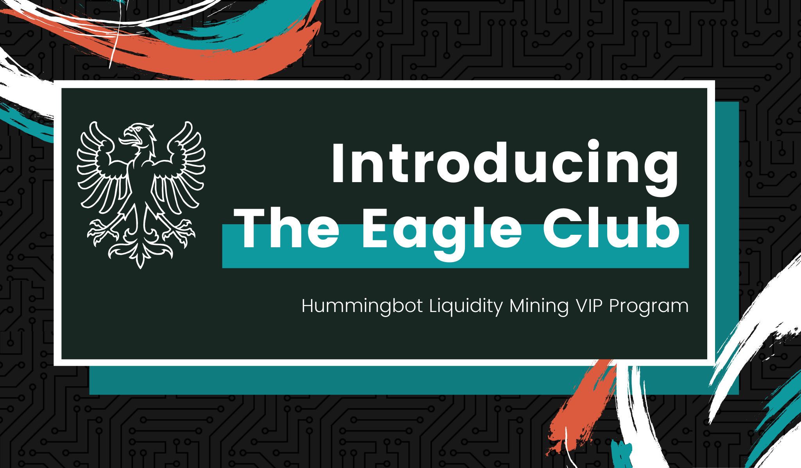
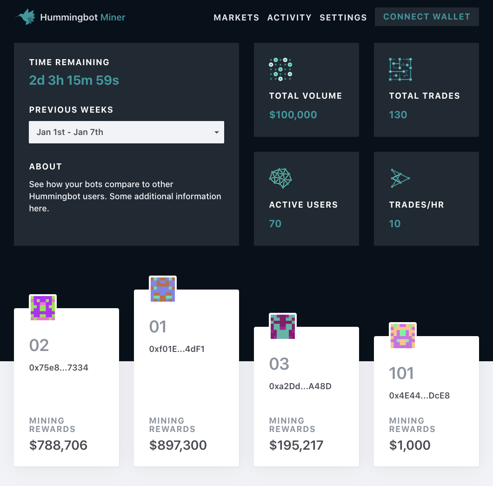

# Introducing the Eagle Club

We are excited to announce that we are launching the Eagle Club, a VIP program for top liquidity miners today. The goal of the Club is to enhance the user experience of top performing miners and to provide dedicated support to help them trade more confidently and perform better. 

Along with the launch of the Eagle Club, we have also rolled out a real-time leaderboard where miners can see how they rank versus other miners.

### Qualification

The Eagle Club is invite-only. It’s not only a VIP program that Team Hummingbot will devote energy and time to, but also a close-knit community for experienced crypto traders to share their thoughts and obtain personalized support. 

At the first month of launch, we will invite top 10 miners of each past week to the Club. Members who are qualified for the Club will be receiving an invitation email. Anyone who gets in will stay in the Club permanently. In the long term, we plan to invite approximately 10% of our total user base to the Club. 

<!-- more -->

### Perks

The Eagle Club members will be eligible to enjoy the following benefits: 

- Launch gift: 50 USDC tokens for the first 10 members admitted in the Club
- Access to a private priority support Discord channel
- Special "Eagle Club" role in our Discord channel and badge on the Leaderboard
- Virtual office hours: members can access a Zoom room for support and catch-up
- Eagle Club request board in Notion
- Weekly reward: Top 1 miner will receive extra reward in the form of virtual goods
- Special wish lucky draw: Each member can raise a wish that’s related to Hummingbot or Liquidity Mining, and Team Hummingbot will do an annual lucky draw and realize one of the wishes
- Offline office hour and private dinner (if in the Bay Area)

### Leaderboard

As mentioned above, we have also launched a real-time leaderboard. We hope the leaderboard can add a fun element to the liquidity mining program, motivate more miners to join this competition and provide transparency to all participants. 

To access the leaderboard, visit [here](https://miner.hummingbot.io/leaderboard). 
 
### Learn More

- [Hummingbot Miner app](https://miner.hummingbot.io)
- [Liquidity mining live training sessions](https://www.eventbrite.com/e/learn-to-use-hummingbot-crypto-market-making-live-training-session-tickets-100968806418)
- [Active campaigns](https://support.hummingbot.io/miner/cminer-campaigns)
- [Hummingbot Help Center](https://support.hummingbot.io)
---

For exchanges and projects who would like to learn more about liquidity mining, please contact us at [partnerships@hummingbot.io](mailto:partnerships@hummingbot.io).