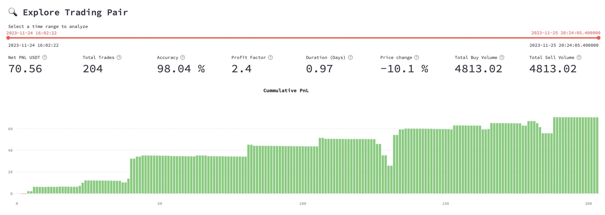
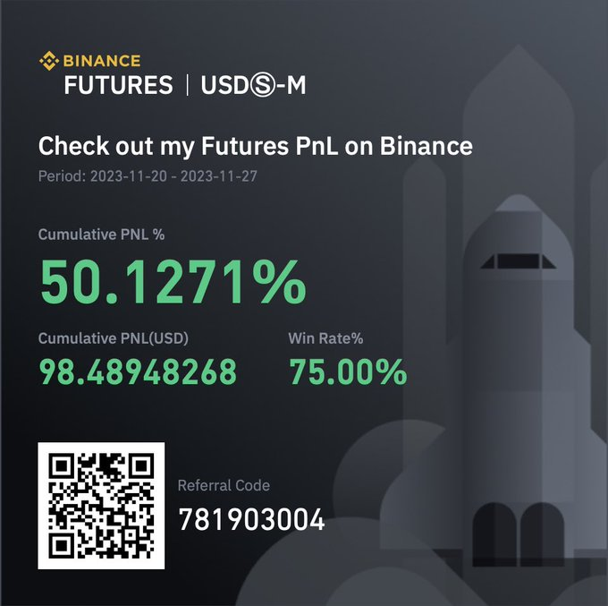
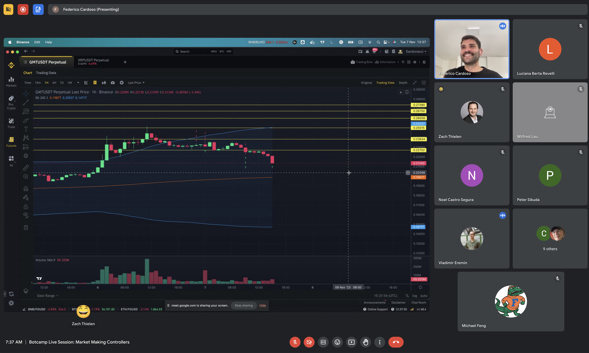

# Introducing V2 Strategies

We are excited to formally introduce the V2 Strategy Framework! After months of testing by us and our community, we are confident that using this new framework to design and deploy strategies will improve your algo trading P&L!

V2 strategies bring unparalleled modularity, real-time adaptability, and backtesting capabilities to your trading arsenal, allowing you to design and deploy powerful, custom strategies with only a few tweaks to the template.

## Revolutionizing Strategy Design with Modularity and Flexibility

[V2 Strategies](/v2-strategies) marks a departure from the more rigid structure of V1 strategies. It's crafted to enable users to create powerful, custom strategies, even those who may not have extensive Python programming experience.

Key Features:

* **Composable**: The core of V2 strategies lies in their modularity, allowing users to create complex and customized trading strategies using simple modifications in the provided templates.
* **Real-Time**: Leveraging real-time market data, V2 strategies dynamically adjust spreads and shift prices. This responsiveness to market changes optimizes profitability and minimizes risk, surpassing the capabilities of the static V1 strategies.
* **Backtestable**: A crucial component of any trading strategy is the ability to test and refine it. V2 strategies excel in this aspect, offering comprehensive backtesting tools that enable detailed simulations with historical market data, accessible through the Dashboard.

<!-- more -->

## Architectural Breakdown: The Building Blocks of V2 Strategies

An ecosystem of interconnected components let users customize their V2 Strategies:

* [V2 Script](/v2-strategies): This serves as the strategy's blueprint, outlining its configuration and interacting seamlessly with other components.
* [Controller](/v2-strategies/controllers): Acting as the strategy's command center, the Controller interprets input from the V2 Script and steers the overall strategy. It manages Executors, which are crucial for order and position management.
* [Candles](/v2-strategies/data/): Providing a structured snapshot of market data, Candles are pivotal in generating analytical indicators for market analysis.
* [Executors](/v2-strategies/executors/): These components autonomously manage orders and positions, ensuring alignment with the strategy's directives.

## Performance of V2 Strategies in Live Trading

The true test of any framework's efficacy is its performance in the live market. We've taken the V2 Strategy Framework for a spin, and the initial results are promising. Our CTO Fede recently deployed the a V2 market making strategy in the recent Bot Battle and generated a 50%+ return over the three-day period, highlighting the potential of these strategies to adapt and thrive.

His strategy traded across 3 markets on Binance Futures and generated a positive P%L in each market. Here was one such market analyzed using the Strategy Performance page in [Dashboard](/dashboard):

These results, backed by data, serve as a testament to the capabilities inherent in the V2 Strategy Framework. It's a clear indication that with the right tools and approach, the strategies you build can dynamically align with market movements to capture opportunities.

## Mastering V2 Strategies: Join Botcamp

To dive deeper into the world of V2 Strategies and stay abreast of the latest developments, we invite you to enroll in [Botcamp](/botcamp). With three live events every month, this program is designed to teach you the intricacies of designing, backtesting, and deploying V2 Strategies, ensuring you are well-equipped to navigate the evolving landscape of algorithmic trading with Hummingbot.

---

*Disclaimer: The outcomes and earnings presented are for educational purposes only and are not indicative of future performance or earnings.*