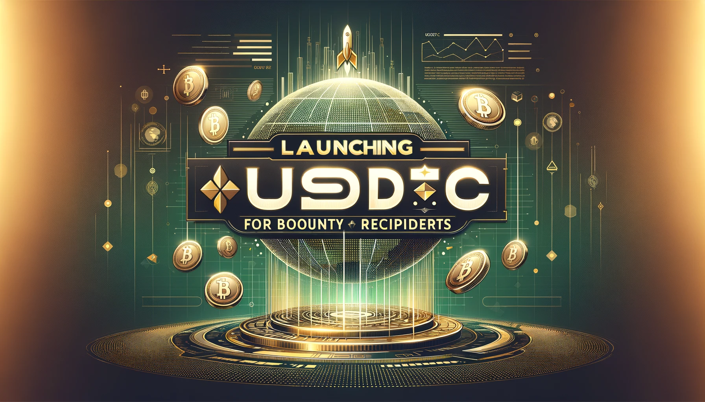

# Launching USDC Payouts for Bounty Recipients

!!! note "Update"
    Starting in August 2024, Hummingbot Foundation bounties will be paid in HBOT by default, unless contributors indicate a preference for USDC in their onboarding form. If users select USDC, a 10% processing fee will be applied.

Since the inception of the Hummingbot Foundation, we have paid out **282 bounties to 92 unique developer wallets**. Bounties have been an unqualified success in leveraging the global developer community to maintain the Hummingbot codebase by fixing bugs and adding key components.

To continue on this path, we are excited to announce a new change to the Bounties process. Now, bounty recipients can choose whether to receive their payments in HBOT, our native governance token, or the USDC equivalent amount.

By allowing recipients to receive bounties in stablecoin if they wish, we aim to lower transaction fees while still enabling long-term supporters to accrue HBOT.

<!-- more -->

## Why USDC?

While distributing HBOT enables us to equip our community developers with the voting power to shape the future of Hummingbot, we understand that the volatility of the crypto market and day-to-day needs may force recipients to sell HBOT, but the low liquidity and high gas fees on the [Uniswap HBOT pools](https://info.uniswap.org/#/pools/0x47541d068e1289297e1ef66277507116a26de860) may incur costs for users.

USDC, on the other hand, is pegged to USD. With USDC and other stablecoins, you can now receive bounties with a known, stable value. This means that developers can plan and budget with more certainty, without having to worry about liquidity or token price fluctuations.

## For Bounty Recipients

As part of this transition, we are making it easy for you to choose how you'd like to receive your bounties. Here's what you need to know:

In the [AML Policy form](https://forms.gle/ZDKtkSLF7VSGYMBo9) that you fill out to earn HBOT bounties, there is now an option to receive your bounties in either HBOT or USDC:

Please ensure you complete this form accurately, as this will determine how your bounty rewards are processed and distributed.

If you decide to switch from one denomination to another in the future, you will need to update your preference on the AML Policy form and let us know on Discord.

We will apply the changes to your bounty denomination preference to future weekly distributions.

## How Payouts Work

On each weekly Friday bounty distribution, we will use the [HBOT/USD price on CoinGecko](https://www.coingecko.com/en/coins/hummingbot) and average each price over the 7 prior calendar days to determine the HBOT Conversion Rate:

For bounty recipients who choose to receive in USDC, we will apply the HBOT Conversion Rate to their total HBOT payout to calculate the USDC equivalent payout amount. For bounty recipients who choose to receive in HBOT or have not updated their bounty denomination preference, we will still continue to make payouts in HBOT.

## Starting Week

We will start this process with the payouts on next **Friday, July 28, 2023**.

Please post your questions and tag Carlito at Discord’s `#support` channel.