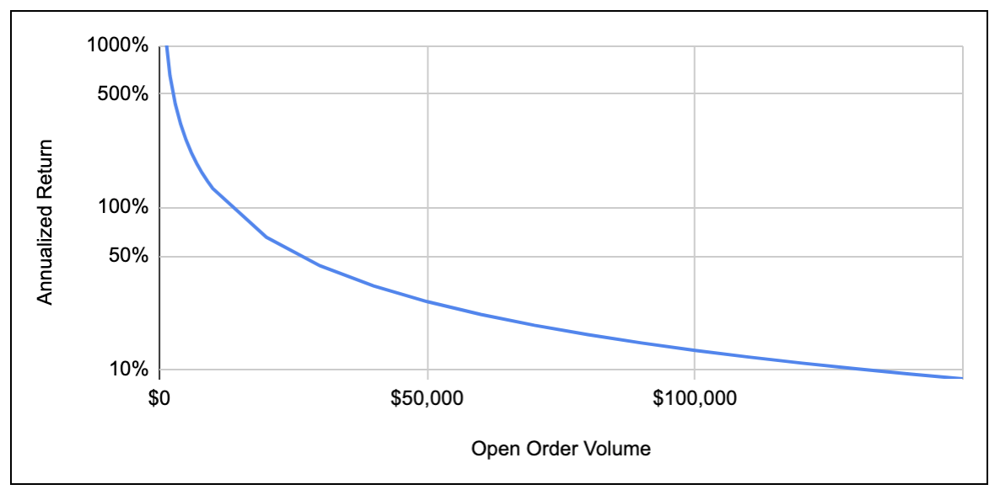
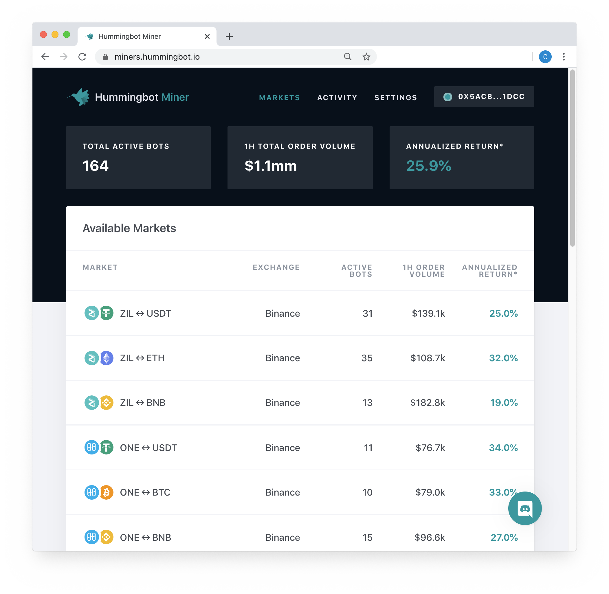

# 🌊⛏ Liquidity Mining Launch!

**Today marks an important milestone for Hummingbot as we launch the first live campaigns for liquidity mining! The inaugural campaigns will last for a period of 12 weeks with a total reward pool of USDC 51,000**.

The first four campaigns go live at 12.00am UTC March 3, 2020 for a subset of our launch partners:

- Harmony
- iExec
- Zcoin
- Zilliqa

These initial campaigns will reward participants for trading in eligible tokens on [Binance.com](https://binance.com).  For up-to-date campaign terms and participation details, please go to the [Hummingbot Miner's app](https://miners.hummingbot.io) or [Documentation Site: Active Campaigns](https://miner.hummingbot.io/markets).

Rewards will be paid out weekly based on weekly periods beginning on Tuesdays 12.00am GMT through the following Tuesday.

<!-- more -->

### What is liquidity mining?

**Decentralized, community-based market making.** Liquidity mining allows anyone (communities, the general market) to participate in market making for a token and contribute to its liquidity and improve the tradability of that token.  By participating, users are not only helping to support the token and the project, but through liquidity mining, they are able to earn token rewards based on their trading activity.

**Fair model for market maker compensation.** Participants are rewarded for contributing to token liquidity by placing orders.  Rewards distribution are designed to be aligned with a miner's risk: the more consistently orders are placed over time, at tighter spreads, and with larger sizes, the more token rewards are earned.

#### Liquidity mining is open to everyone¹

Even novice traders or non-technical users can simply download [Hummingbot](https://hummingbot.io), configure the trading parameters, begin market-making and earning liquidity mining rewards in only a few minutes.  Hummingbot, which is a free, open-source, and easy to use market making trading bot, was created to open up the world of market making and algorithmic trading to the general public.

#### Liquidity mining returns

While ultimately the market and level of participation will determine how much reward each individual participant earns (the more participants, the more the rewards have to be divided), the annualized returns for liquidity mining have the potential to exceed 10-20% and even be multiples of what someone could earn on lending or staking tokens².

> **"Are those returns real?? They look really high..."**  *General feedback from users during testing period*

When we launched our testnet platform and ran an open testing period over the month of February, we received a lot of feedback from early participants that returns on [Hummingbot Miners](https://miners.hummingbot.io) looked way too high and didn't seem to make sense.

During the open testing period, since we were not yet paying out real rewards, participation was lower than what we would expect once we actually launch.  As a result, return figures were very high, in some cases, seemingly absurdly high.

The annualized return is a measure of rewards available to miners, shown as a percentage of eligible open order volume on an annualized basis.  The table below shows an example for the returns for the ZIL-USDT pair based on different indicative levels of participation (or open order volume):

**Table 1: Example of annualized return vs. different levels of participation**

**Chart 1: Annualized return vs. different levels of participation**

You can see above that with lower levels of participation, annualized return figures can skyrocket.  However, we expect a higher level of participation, both in the number of participants as well as inventory deployed, once the platform is live and participants are able to earn real rewards.

Initially, if participation is low, liquidity mining returns have the potential to be really high.  This provides an incentive for early adopters and early participants.  However, we expect that natural market forces (i.e. more people discovering the attractive returns and joining in to participate) will drive returns lower over time as the reward pools will eventually be shared with more participants.

#### Calculation methodology

Returns are shown on [Hummingbot Miners](https://miners.hummingbot.io) real-time, using the average of eligible open order volume over the most recently past one hour.  *Note that this figure is a historical figure since it is based on past data, even though it is as recent and up-to-date as possible.*

The miners app shows the returns on an annualized basis, so that the returns can be compared with returns for other return alternatives such as lending or staking.  The calculation for annualizing the returns is as follows:

To find out more about how annual returns are calculated, please see this [sample calculations spreadsheet](https://bit.ly/liquidityminingcalc):
- **Liquidity Mining Dashboard** tab: sample of how the returns on the [Hummingbot Miner](https://miners.hummingbot.io) are calculated
- **Liquidity Mining Rewards** tab: sample order book and how individual rewards for miners are calculated, showing the impact of order spreads as well as relative order sizes

You can also read more about calculation methodology in the blog [Demystifying Liquidity Mining Rewards](../../../academy-content/posts/demystifying-liquidity-mining-rewards/index.md).

### Quick start for liquidity mining

1. Install [Hummingbot](https://docs.hummingbot.org/) and configure it to trade in Binance.com
2. Create **read-only** API keys for your Binance account
3. Sign up and register on [Hummingbot miners](https://miners.hummingbot.io)
    - Connect your Ethereum wallet (where rewards are to be paid)
    - In the [Settings](https://miners.hummingbot.io/settings) tab, enter you read-only Binance API keys to register and log your trading activity
4. Track your token rewards on the [Activity](https://miners.hummingbot.io/activity)

### Hummingbot Miners App

Welcome to the new [Hummingbot Miners](https://miners.hummingbot.io) app!! The site is live at [https://miners.hummingbot.io](https://miners.hummingbot.io).

This app will be the place to go for:

1. **Real-time campaign metrics**: current participation details and returns for active campaigns
2. **Rewards information**: up-to-date earnings and rewards information for registered users
3. **Registering for Hummingbot miners**: (1) connecting Ethereum wallet (for rewards) and (2) configuring read-only API keys (for your trading/mining data) 

The homepage shows the currently live campaigns and current activity for each campaign.

*Note: figures above are for illustration only and do not represent current campaign terms.*

### Learn more

- [Hummingbot Miner app](https://miners.hummingbot.io)
- [Active campaigns](https://miner.hummingbot.io/markets)
- [Hummingbot Help Center](https://support.hummingbot.io/miner/)

### Important notes and disclaimers

The content of this Site does not constitute investment, financial, legal, or tax advice: none of the information contained on this Site constitutes a recommendation, solicitation, or offer to buy or sell any digital assets, securities, options, or other financial instruments or other assets, or to provide any investment advice or service.

Please review the [Liquidity Mining Policy](https://coinalpha.com/liquidity-mining-policy/) for the full disclaimer, including policies related to the use of Hummingbot.

1. **Eligibility requirements**: participation in liquidity mining is subject to eligibility requirements as specified in the [liquidity mining policy](https://coinalpha.com/liquidity-mining-policy/).
2. **No guarantee of profit**: CoinAlpha does not claim that liquidity mining and participation in liquidity mining campaigns will be profitable, however measured, for the user.

For exchanges and projects who would like to learn more about liquidity mining, please contact us at [partnerships@hummingbot.io](mailto:partnerships@hummingbot.io).

