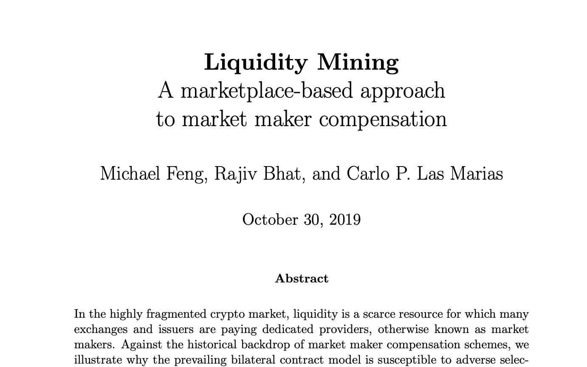

# Liquidity Mining Whitepaper

This summary provides an overview of the [Liquidity Mining whitepaper](/liquidity-mining.pdf), which introduced a novel approach to liquidity provision in digital asset markets. 

The document explores the historical context behind market making, the state of crypto market making in 2019, compensation models, and proposing an innovative liquidity mining model aimed at optimizing the market making process.

<!-- more -->

## Historical Perspective on Market Makers

Market making has long been a cornerstone of financial markets, serving as a catalyst for efficient trading. The whitepaper traces the evolution of market making, from its heavily regulated beginnings in securities to the fragmented, electronic platforms of today. It examines the symbiotic relationship between exchanges and market makers, emphasizing the significant capital requirements and the limitations this places on market makers.

## Compensating Market Makers

The discussion then moves to compensation models for market makers, highlighting the debate over the necessity and methods of compensation. It provides a thorough examination of the benefits and drawbacks of both direct and indirect compensation schemes, drawing on academic research and historical data to underline the importance of adequately incentivizing market makers.

## Liquidity Mining Model

The centerpiece of the whitepaper is the Liquidity Mining model, which proposes a system where market makers are rewarded for providing liquidity through a decentralized platform. The model is described in detail, including its components such as order book snapshots, spread density functions, and budget allocation mechanisms.

## Simulation-Based Analysis

A simulation-based analysis is presented to demonstrate the potential of the Liquidity Mining model. Assumptions for the simulation are outlined, and the results are depicted in charts, illustrating the relationships between annual rates of return, spreads, traded volumes, and slippage.

## Preventing Manipulation

The paper addresses concerns about market manipulation, detailing types of manipulation and presenting strategies for detection and mitigation. It emphasizes the importance of data collection and verification to prevent manipulation and ensure the integrity of market making activities.

## Summary and Future Directions

Concluding the whitepaper, a summary is provided, reflecting on the trends toward openness and fragmentation in financial markets. The Liquidity Mining model is offered as a solution to improve efficiency, transparency, and fairness in digital asset markets, with aspirations to apply this model to other fragmented financial markets in the future.
