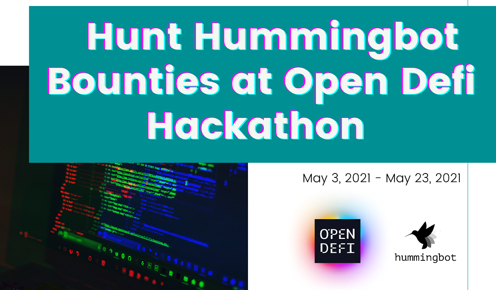

# Open DeFi Hackathon - Join the Hunt for Hummingbot Bounties

Hello Hummingbot Community Developers!

Today we are happy to announce that we will be part of the upcoming [Open Defi Hackathon](https://gitcoin.co/hackathon/open-defi/onboard) in May!

## What is Open Defi?

The [Open Defi Network](https://opendefi.network/) is _“a global initiative to develop the decentralized financial ecosystem and advance the collaboration of DeFi projects across borders and blockchains.”_

As a part of the cryptocurrency space, we strongly believe in the power of **decentralization** and **community-driven** projects. 

<!-- more -->

As an open-source project, our team is always happy to see community contributions to our Github repository, and we are constantly improving our integration of community feedback.

To those ends, we will be sponsoring two bounties for the [Open Defi Hackathon](https://gitcoin.co/hackathon/open-defi/onboard), each of them with a **1500 USDT prize for the winner** and 500 USDT in tips distributed to meaningful submissions.

### Bounty #1

The first bounty will be offered for creating a new strategy.

Developers are free to create any type of strategy, so get creative and surprise our community with an innovative way to use Hummingbot.

To prepare for this bounty, take a look at the [strategy folder of our source code](https://github.com/hummingbot/hummingbot/tree/master/hummingbot/strategy) and the [documentation page related to new strategies](../../../strategies/index.md).

For inspiration, take a look around the [open issues on Hummingbot Repository](https://github.com/hummingbot/hummingbot/issues). There are some interesting ideas there.

The only restriction for this bounty is that this new strategy must not have the same functionality as the strategies released with version 0.38 of Hummingbot.

### Bounty #2

The second bounty will be awarded for improvements to the Automated Market Maker Strategy.

In version 0.33, we added the possibility of detecting arbitrage trades on AMM protocols with the strategy called `amm-arb`.

A few versions later, Hummingbot traders can now look for these opportunities on Uniswap, Balancer, Terra, and Perpetual Finance.

Using a standard arbitrage trading logic,  Hummingbot scans two protocols (or centralized exchanges) to look for profitable trading opportunities.

Blockchains have some particularities, however, concerning how transactions are executed, which makes different approaches to performing an arbitrage operation.

For this bounty, developers will have to create significant improvements to the strategy, ranging from detecting profitable opportunities to reducing transaction costs.

One small note: our team is currently working on improving the Gateway code (needed to execute the strategy), so this bounty is only related to the strategy itself. Gateway pull requests will not be considered for this bounty.

### Conclusion

Our team is excited about this hackathon, and we are expecting some great contributions from our community!

If you haven’t already, join our [Discord](https://discord.hummingbot.io/) to start discussing the bounties on the #dev channels, where our development team will be around to help with any questions for bounty hunters.

Good luck, and good hunt!
