# Hummingbot Dashboard Quickstart Guide

In this tutorial, we'll guide you through installing Hummingbot 2.0, which provides an easy-to-use Dashboard app that helps you connect exchange credentials, create/backtest a strategy configuration, and deploy a fleet of bots!

Watch this video for an overview and walkthrough of the features in Hummingbot 2.0:

<iframe style="width:100%; min-height:400px;" src="https://www.youtube.com/embed/7eHiMPRBQLQ?si=S500sdA9ImhLxHhu" frameborder="0" allow="accelerometer; autoplay; encrypted-media; gyroscope; picture-in-picture" allowfullscreen></iframe>

<!-- more -->

## Prerequisites: Docker

Hummingbot 2.0 uses Docker Compose to install and manage dependencies. We recommend installing [Docker Desktop](https://www.docker.com/products/docker-desktop/) as it includes `Docker Compose`, `Docker Engine`, and `Docker CLI`, all of which are needed for the Dashboard to work.

## Installation

Clone the [Deploy repository](https://github.com/hummingbot/deploy), which contains the Docker Compose configuration file and a bash script that automatically pulls the latest images and starts the necessary services. 

Open a Terminal window and run the following commands:

```bash
git clone https://github.com/hummingbot/deploy
cd deploy
bash setup.sh
```

The setup script will pull the Docker images defined in repo's `docker-compose.yml` file and start them as new containers. It might take a while to pull the images for the first time.

```bash
[+] Running 7/7
 ✔ Network deploy_emqx-bridge   Created
 ✔ Volume "deploy_emqx-data"    Created
 ✔ Volume "deploy_emqx-log"     Created
 ✔ Volume "deploy_emqx-etc"     Created
 ✔ Container dashboard          Started 
 ✔ Container backend-api        Started 
 ✔ Container hummingbot-broker  Started 
```

After all containers have started, access the Dashboard at <http://localhost:8501> in your browser.

!!! note "Cloud Servers"
    If you are using a cloud server or VPS, replace `localhost` with the IP of your server. You may need to edit the firewall rules to allow inbound connections to the necessary ports.  

## Adding Credentials

Credentials are your API keys needed for Hummingbot to trade on an exchange. The Dashboard allows you to create and manage API keys under multiple accounts, which is useful if you use multiple sub-accounts on a single exchange.

Let's say you have three Kucoin accounts and want the ability to switch between them when creating bots. The Credentials page will allow you to do this since you can select which account to use when deploying bots.

On the menu on the left click `Credentials` to get to the Credentials page:

[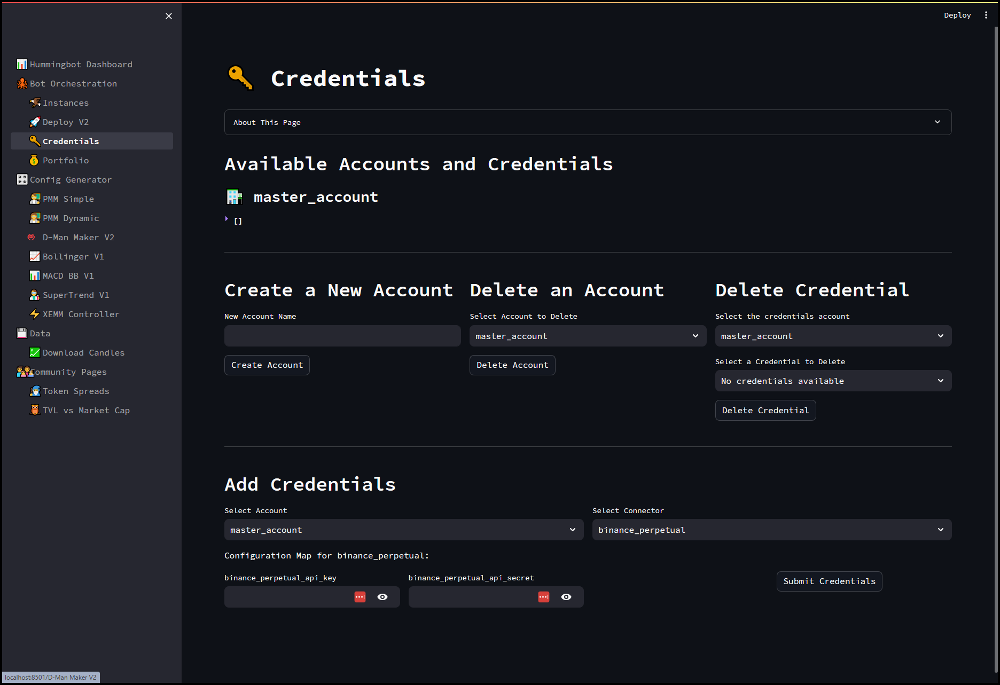](./credentials.png)

Let's go over the different sections below: 

[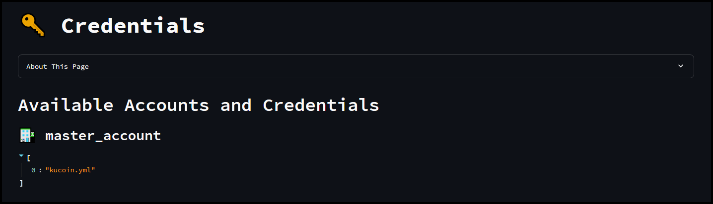](./credentials-1.png)

In this section, we will see the list of `accounts` and any API keys already registered to that account. In the screenshot above, we only have one `master_account` created with one exchange API connected for `Kucoin`. 

[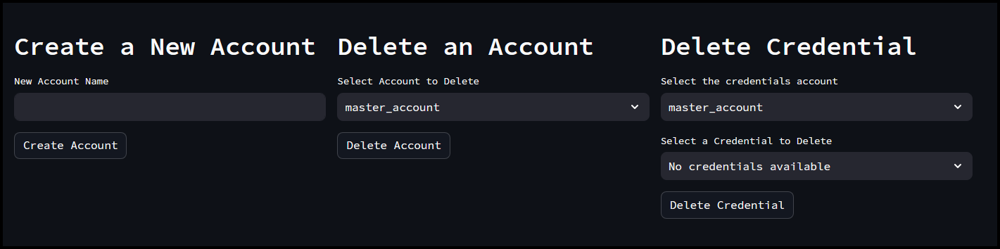](./credentials-2.png)

To **create** a new `account`, just enter the name of the account and then click `Create Account`. 

If you want to `delete an account` (this includes all API keys associated with it), select the account from the drop-down list and then click `Delete Account`. 

If you want to delete a specific API key connected to an existing account, select the account from the list and then select the API credential and then click `Delete Credential`

[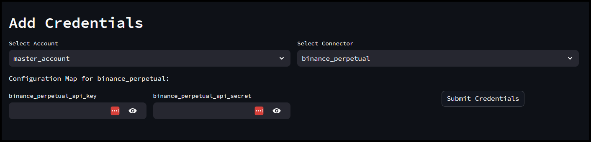](./credentials-3.png)

To add API keys to our account, use this section. Select the account you want the API keys to be associated with, select the `Connector` or `Exchange`, enter the corresponding API keys, and then click `Submit Credentials`.

If the API keys are valid, you should see them appear in the list under the `Available Accounts and Credentials` section at the top. For example, if you added API keys for Binance Perpetual under the master account you should see `binance_perpetual` listed under `master_account`

## Viewing Your Portfolio

Once API keys are added, you can view the tokens available and their allocation under the Portfolio page. You can filter by account, exchange, or token to get more details. 

[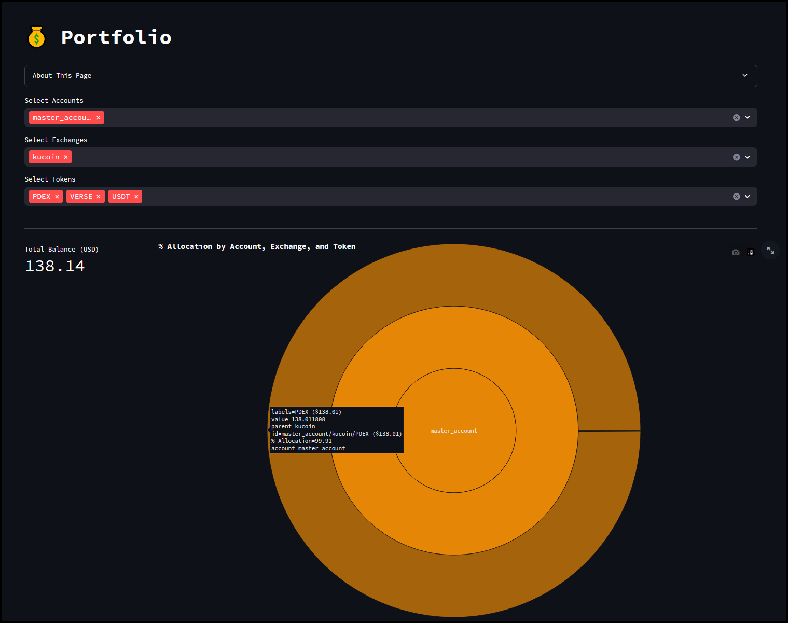](./portfolio.png)

[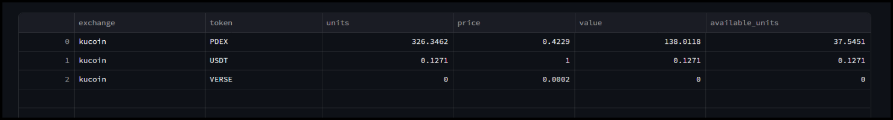](./portfolio-1.png)

The table above shows the list of available tokens for the `Kucoin` exchange. The graphs below will show your `Portfolio Evolution over Time` as well as `Token Value Evolution over time`

[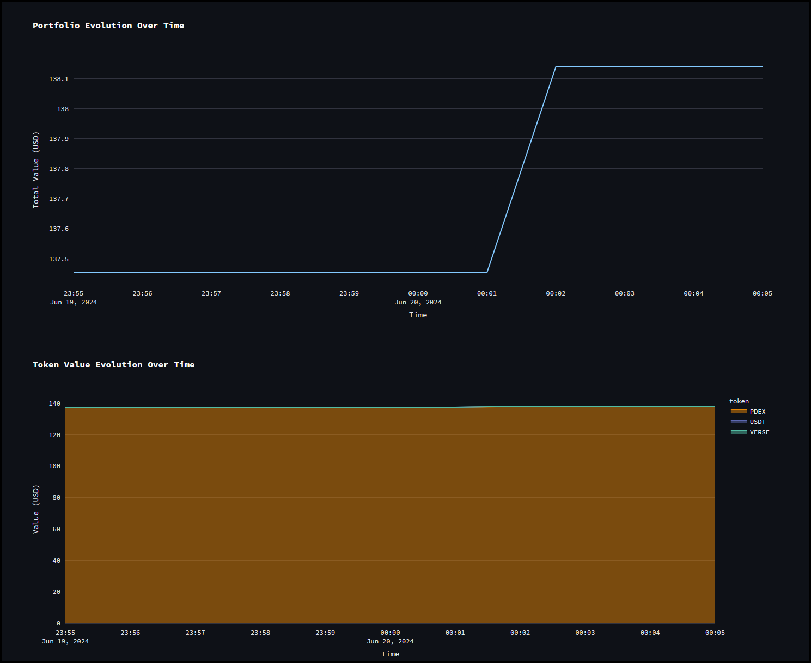](./portfolio-2.png)

## Configuring Strategies

Before we can deploy bots, we'll have to configure a Controller, which defines an algo trading strategy. Under the Config Generator section we have the following available controllers:

- PMM Simple 
- PMM Dynamic
- D-Man Maker V2
- Bollinger V1
- MACD BB V1
- SuperTrend V1
- XEMM Controller

Let's use the `PMM Simple` controller for now and go through the different sections below:

[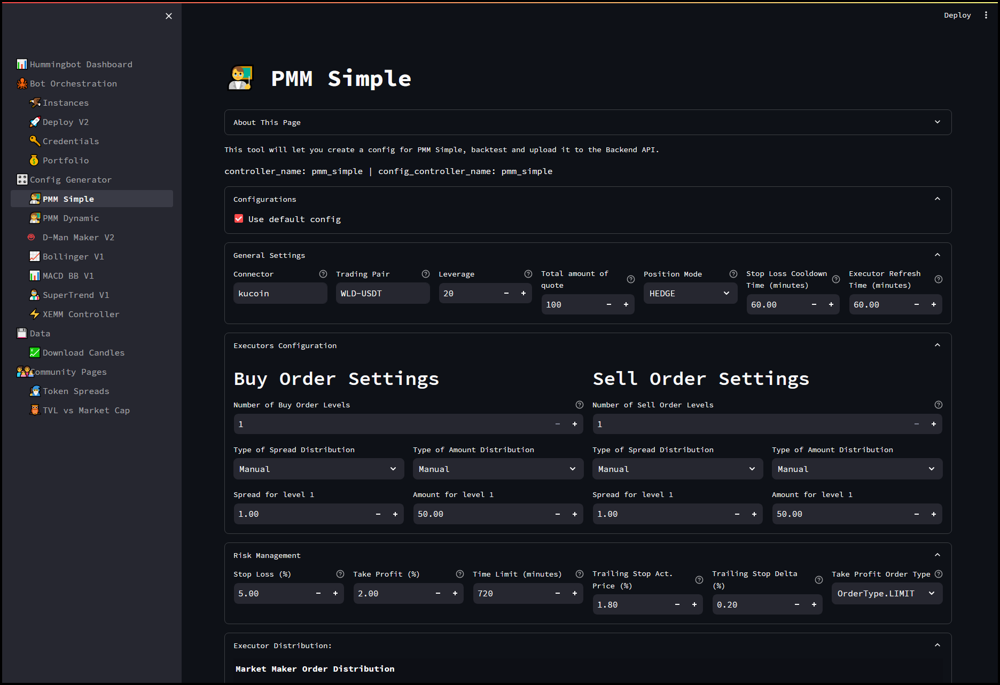](./config.png)

[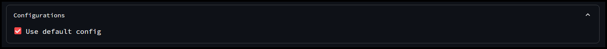](./config-1.png)

Under `Configurations`, if we uncheck the **"Use Default Configs"** box, this will display a drop down list of configs that we've previously configured. Since we don't have any previous configs, there won't be any in the list. 

[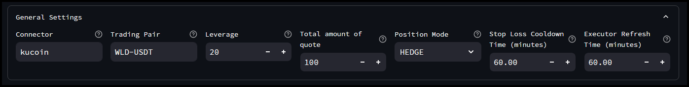](./config-2.png)

For `General Settings`, we can select the `Connector` or exchange we want to trade on, the `Trading Pair` and `Leverage`. For trading on spot markets we recommend setting `Leverage` to `1`. 

We can also set the `Total amount of quote` which is how much we want to trade with (in USDT), `Position Mode` (ONE-WAY / HEDGE), as well as `Stop Loss Cooldown Time` which is the cool down time in minutes after stop loss is triggered and `Executor Refresh Time` which is your order refresh time.  

[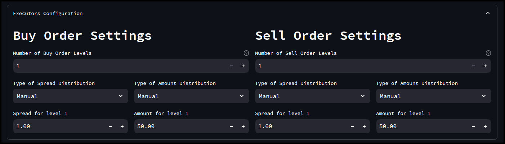](./config-3.png)

Under `Executors Configuration`, we can set the spread and amount for both buy and sell orders manually or we can choose from the following distributions:

- GeoCustom
- Geometric
- Fibonacci
- Logarithmic
- Arithmetic
- Linear

[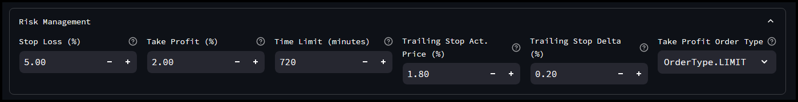](./config-4.png)

For `Risk Management`, you can set your `Stop Loss`, `Take Profit`, `Time Limit`, `Trailing Stop Activation Price`, `Trailing Stop Delta` as well as the `Take Profit Order Type` (LIMIT / MARKET)

[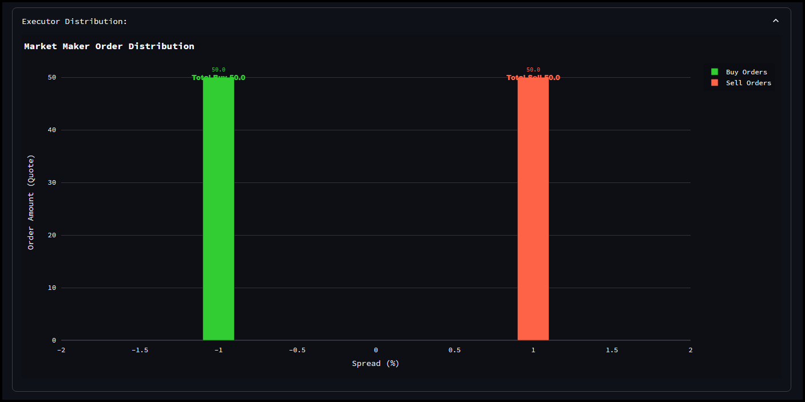](./config-5.png)

In this section, `Executor Distribution` shows a graphical visualization of the order amount vs spread order distribution for both the buy and sell orders configured under the `Executors Configuration` section. 

[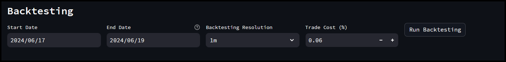](./config-6.png)

## Backtesting Strategies

After making changes to the configuration above you can run a backtest to test your strategy configuration. Just set the `start` and `end` date as well as the `Backtesting Resolution` (candles) and `Trade Cost` (fees) and then click the `Run Backtesting` button to see the results like the one below. 

From here, you can still make changes to the configuration above and continue to run backtesting until you get the results you want. 

[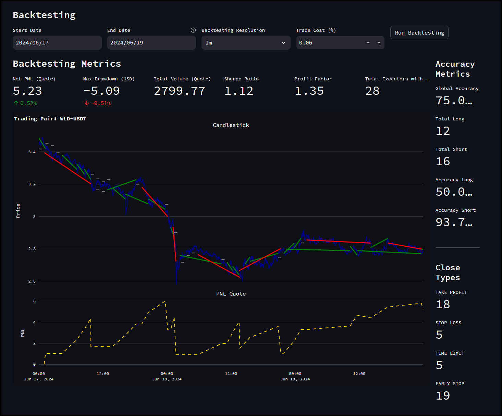](./config-7.png)

Once you are done making the necessary changes to your strategy and are satisfied with the backtesting results you can give the config a name (or just use the defaults) and then click `Upload` to upload your config and make it available in the `Deploy` page. 

If you make changes later, the `Config Tag` will be incremented to a higher version, so any new changes will always be saved to a config with a newer config tag version. However, if you change the `Config Tag` to a previous version, any new changes you made will overwrite the config for that previous version.

[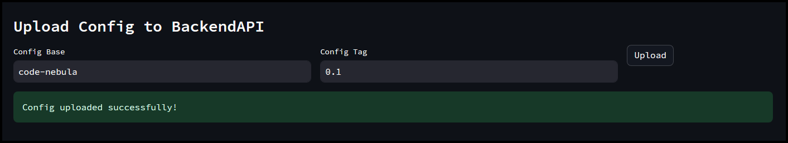](./config-8.png)


## Deploying Instances

After uploading your config, it will become available in the `Deploy V2` page and from here we can deploy bots based on those configs.

[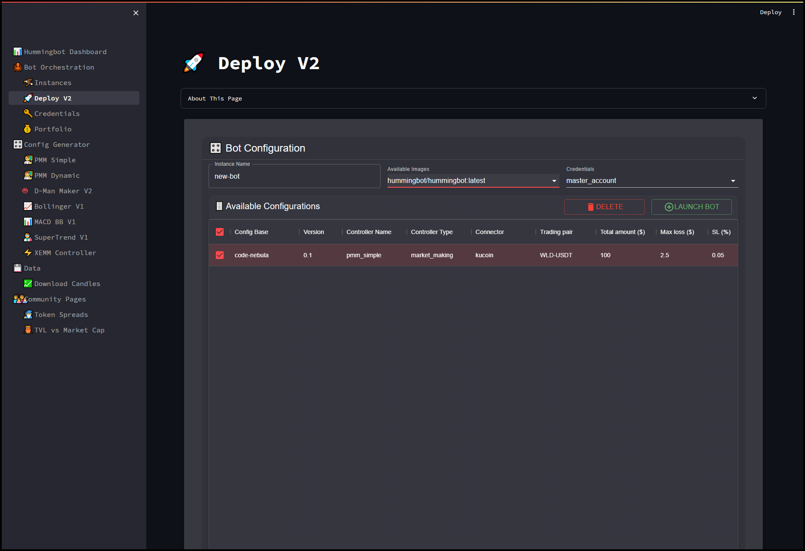](./deploy.png)

Select the config you want to use from the list of `Available Configurations` and then give the instance a name, select the available Docker image from the drop down list (note you can use your own Docker image) and select the account that contains the API keys you want to use. 

Once ready, click the `Launch Bot` button and this will create your instance with the selected config. You can view the running instance under the `Instances` page. 

If you want to delete an existing config, you can do this by selecting the config then click the `Delete` button to remove the config from the list. 

[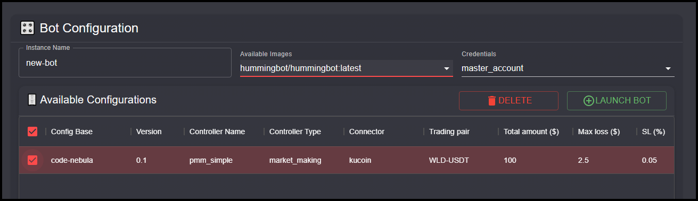](./deploy-1.png)

## Managing Instances

The `Instances` page will show all running instances (active or stopped). This page shows information like `Net PNL`, `Volume Traded`, `Liquidity Placed` etc for each instance. It will also show the current active controllers as well as the current config. 

From here you can also view the `Error Logs` as well as `General Logs` so you can easily monitor the bot status without needing to attach to the instance manually.  

[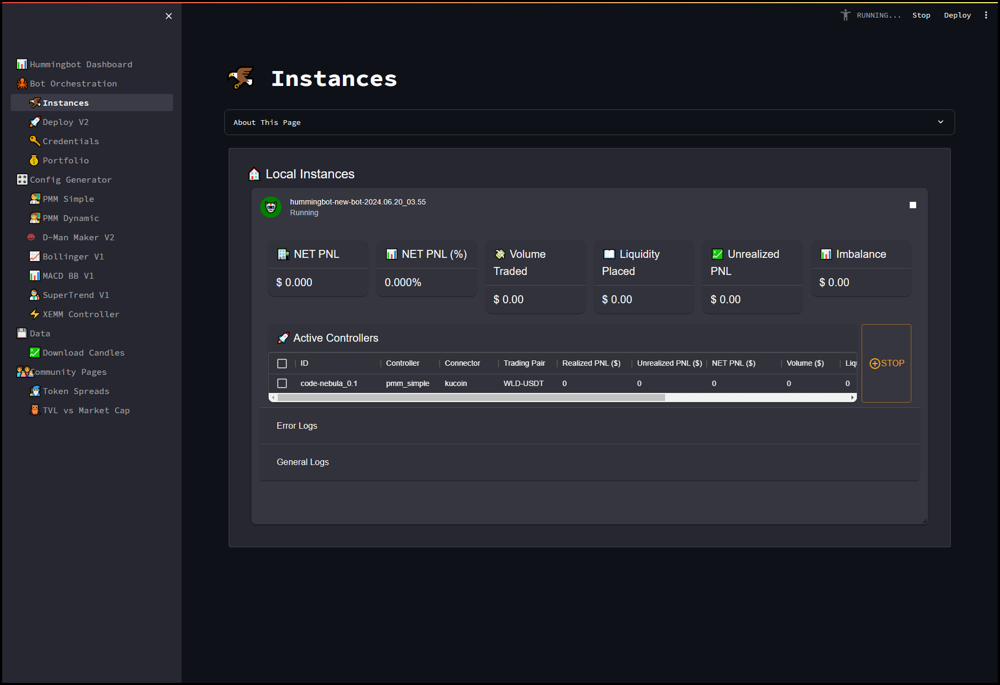](./instances.png)

To stop a running instance, check the box of the active controller and then click the `Stop` button. This is the recommended way to stop the instance as this will create orders to close the active positions if there are any. 

If you click the `stop` icon in the top right hand corner this will send a stop command to the bot which will then cancel all active orders. 

[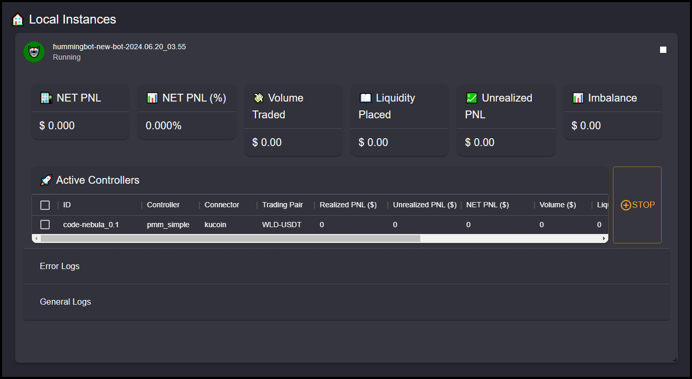](./instances-1.png)

Dashboard appends `hummingbot` + the `current date & time` to the instance name that you specified. You can check the complete name of the bot in the top left hand corner right under `Local Instances`. If you need to manually attach to the Docker container in the terminal this would be the complete name. 

In the above screenshot, the complete instance name is `hummingbot-new-bot-2024.06.20_03.55` so if we need to attach to this container using Docker we would open a terminal and do `docker attach hummingbot-new-bot-2024.06.20_03.55`

Congratulations, you just created your first instance using the Hummingbot Dashboard!

## Authentication

Authentication is disabled by default. To enable Dashboard Authentication please follow the steps below: 

**Set Credentials (Optional):**

The dashboard uses `admin` and `abc` as the default username and password respectively. It's strongly recommended to change these credentials for enhanced security.:

- For Docker, navigate to the `deploy` folder or `dashboard` folder if using Source and open the `credentials.yml` file.
- Add or modify the current username / password and save the changes afterward
  
  ```
  credentials:
    usernames:
      admin:
        email: admin@gmail.com
        name: John Doe
        logged_in: False
        password: abc
  cookie:
    expiry_days: 0
    key: some_signature_key # Must be string
    name: some_cookie_name
  pre-authorized:
    emails:
    - admin@admin.com
  ```  

### Docker

- Ensure the dashboard container is not running.
- Open the `docker-compose.yml` file within the `deploy` folder using a text editor.
- Locate the environment variable `AUTH_SYSTEM_ENABLED` under the dashboard service configuration.
  
  ```
  services:
  dashboard:
    container_name: dashboard
    image: hummingbot/dashboard:latest
    ports:
      - "8501:8501"
    environment:
        - AUTH_SYSTEM_ENABLED=True
        - BACKEND_API_HOST=backend-api
        - BACKEND_API_PORT=8000
  ```
- Change the value of `AUTH_SYSTEM_ENABLED` from `False` to `True`.
- Save the changes to the `docker-compose.yml` file.
- Relaunch Dashboard by running `bash setup.sh`
  
### Source 

- Open the `CONFIG.py` file located in the dashboard root folder
- Locate the line `AUTH_SYSTEM_ENABLED = os.getenv("AUTH_SYSTEM_ENABLED", "False").lower() in ("true", "1", "t")`.
  
  ```
  CERTIFIED_EXCHANGES = ["ascendex", "binance", "bybit", "gate.io", "hitbtc", "huobi", "kucoin", "okx", "gateway"]
  CERTIFIED_STRATEGIES = ["xemm", "cross exchange market making", "pmm", "pure market making"]
  
  AUTH_SYSTEM_ENABLED = os.getenv("AUTH_SYSTEM_ENABLED", "False").lower() in ("true", "1", "t")
  
  BACKEND_API_HOST = os.getenv("BACKEND_API_HOST", "127.0.0.1")
  ```
- Change the value from `False` to `True` to enable dashboard authentication.
- Save the CONFIG.py file.
- Relaunch dashboard by running `make run`

### Known Issues

- Refreshing the browser window may log you out and display the login screen again. This is a known issue that might be addressed in future updates.
