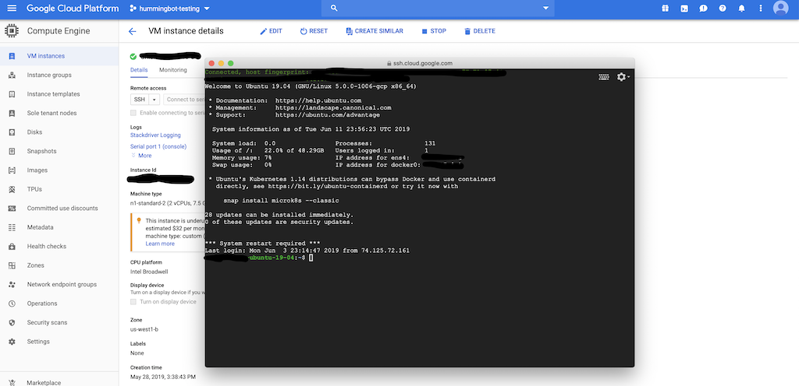

# Running Hummingbot in the Cloud

Users aiming to operate Hummingbot for extended periods or to run multiple bots simultaneously may find local installation limiting. Each bot requires its docker image, consuming significant local computing power, memory, and storage. Additionally, the bots can only function while your computer is active.

Despite these constraints, leveraging cloud-based Hummingbot offers numerous benefits. It ensures a stable connection, critical for continuous order book data fetching and order placement. Virtual machines enhance connection stability and transaction speed, particularly when servers are geographically closer to exchanges. Moreover, the affordability and simplicity of modern cloud computing instances have made it viable for individual users to maintain their own cloud servers.

This post evaluates major cloud computing services, focusing on features pertinent to Hummingbot users. Selecting the right provider and setup is now easier than ever with appropriate guidance and documentation.

<!-- more -->

### Examining the Landscape

Cloud computing has seen immense growth over the past decade, leading to numerous providers with various specializations. For newcomers, navigating these options can be challenging. Many sources have [evaluated and ranked](https://www.zdnet.com/article/top-cloud-providers-2018-how-aws-microsoft-google-ibm-oracle-alibaba-stack-up/) these platforms based on various metrics.

Here, we assess cloud services specifically for Hummingbot use, considering **ease of use**, **free trial flexibility**, **post-trial pricing**, and **overall quality**.

We focus on four major cloud-hosting companies:

- [Google Cloud Platform](#google-cloud-platform)
- [Amazon Web Services](#amazon-web-services)
- [Microsoft Azure](#microsoft-azure)
- [Digital Ocean](#digital-ocean)

For Hummingbot setup guides on these platforms, visit our [installation documentation](../../../installation/index.md). We also offer [helpful tips](../../../installation/index.md#hummingbot-in-the-cloud) for running the client in the cloud.

## Google Cloud Platform

Google Cloud Platform (GCP) launched in 2008 with its App Engine. Now, it offers over 90 services in areas like storage, computation, and security. We focus on the **Compute Engine** for Hummingbot users, which allows on-demand virtual machine deployment.

The setup process is user-friendly and intuitive. Starting at the [GCP Free Tier Getting Started Page](https://cloud.google.com/free/), we activated our trial and launched our first instance in under 10 minutes. The web portal is straightforward, even allowing direct SSH access from the console, a significant benefit for all operating systems.

GCP’s Free Tier includes a 12-month trial and $300 in credits. The only free instance is the f1-micro, with 0.60 GB memory, adequate for a single Hummingbot instance. We recommend upgrading to at least 1 vCPU and 2 GB of RAM for multiple bots. Post-trial, this setup costs approximately $21.50/month.

**Advantages**:
- User-friendly interface
- Reliable service

**Disadvantages**:
- Higher monthly costs
- Restrictive free trial

> While more expensive, GCP compensates with its simplicity and robust service, making it a reliable choice.

## Amazon Web Services

Amazon Web Services (AWS) evolved from a 2002 developer service into a major infrastructure service provider. We focus on the EC2 service for Hummingbot.

AWS features an intuitive setup process. We quickly created an account and launched an instance. The connection process, while more involved than GCP’s, is well-documented and straightforward.

AWS’s free trial offers 12 months of EC2 with a 750-hour monthly cap. The free t2.micro instance provides 1 GiB of memory. For running multiple Hummingbot instances, we suggest upgrading to the t2.small instance with 2 GiB of memory, costing $16.84/month post-trial.

**Advantages**:
- Straightforward setup
- Competitive pricing

**Disadvantages**:
- Limited free trial
- Additional software required for Windows

> AWS EC2 is robust and intuitive. Its low long-term cost makes it ideal for intensive Hummingbot use.

## Microsoft Azure

Microsoft Azure, a comprehensive cloud service, offers Azure Virtual Machines for Hummingbot users.

Setting up an [Azure server](https://azure.microsoft.com/en-us/free/) was more complex, with advanced settings alongside essential options. The setup requires third-party SSH software, like [PuTTY](https://www.chiark.greenend.org.uk/~sgtatham/putty/latest.html), for Windows users.

Azure’s 12-month, $200 trial excels in terms, offering unrestricted virtual machine specifications without needing a card for the first month. For recommended specifications, the B1MS server costs $18.10/month.

**Advantages**:
- Excellent trial terms
- Competitive pricing

**Disadvantages**:
- Complex setup
- Additional software for Windows

> Azure’s flexible trial and affordability, despite setup complexities, make it a strong choice for intensive bot operations.

## Digital Ocean

Digital Ocean, established in 2011, specializes in SSD-based virtual machines and is popular among tech-savvy users. We reviewed its Virtual Engine for Hummingbot operations.

Setting up a [Digital Ocean server](https://m.do.co/c/8e0adb75eb3f) was straightforward, offering Docker and Linux system options. However, its free trial is limited, providing only $10 in credit for a month or $50 with an extended link.

We encountered performance issues with low-specification servers. For stable operations, upgrading to a $20/month plan was necessary.

**Advantages**:
- Simple setup
- Competitive long-term pricing

**Disadvantages**:
- Limited trial
- Performance issues at low specs

> Digital Ocean is user-friendly with the best long-term pricing. However, its limited trial and performance issues at low specifications make it less ideal for Hummingbot.

## Final Takeaways

Here's a summary of our rankings and a comparison of free trial offerings.

### Key Attribute Rankings

| | GCP | AWS | MS Azure | Digital Ocean |
|---|---|---|---|---|
| **Ease of Setting Up Instances** | Quick and user-friendly | A few extra steps | Guide required | Straightforward |
| **Cost of Recommended Instance** | $21.50/month | $16.84/month | $18.10/month | $20.00/month |
| **Free Trial Terms** | Long but limited | Long but limited | Shorter but unrestricted | Shortest but flexible |

### Free Trial Comparison

| | GCP | AWS | MS Azure | Digital Ocean |
|---|---|---|---|---|
| **Duration** | 12 months | 12 months | 12 months | ~3 months |
| **Credits** | $300 | N/A | $200 | $50 |
| **Limitations** | Only 0.6 GB RAM | Only 1 GB RAM, 750 hours/month | All resources accessible | All resources accessible |

Each provider has unique strengths, catering to different user needs. GCP is suitable for less tech-savvy users with minimal bot use, Azure for tech-savvy users with its great trial terms, and AWS for those planning intensive Hummingbot operations due to its cost-effectiveness.

Cloud-based bot operations offer enhanced Hummingbot functionality, providing a viable alternative to local installations for individual algo-trading.

---
