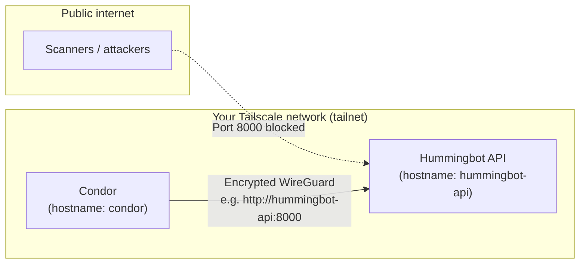
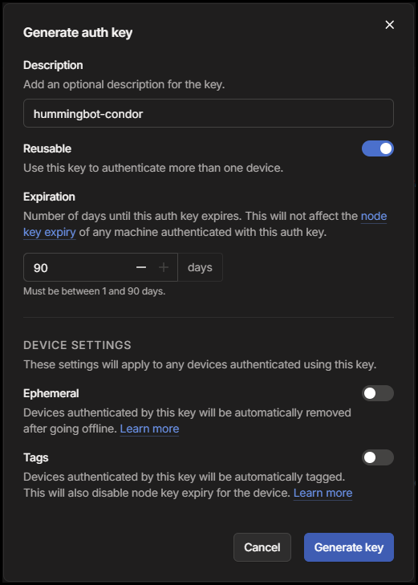
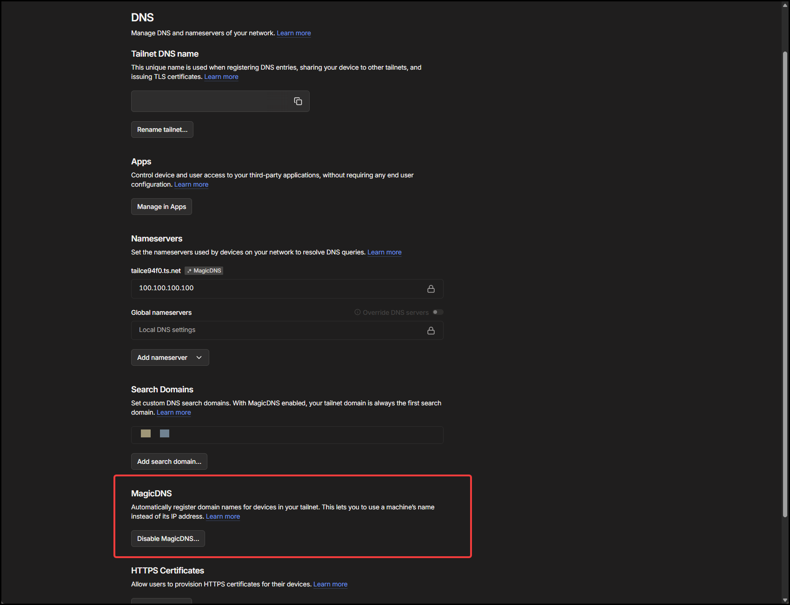
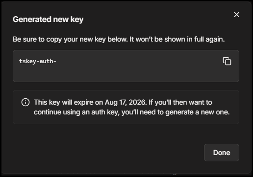
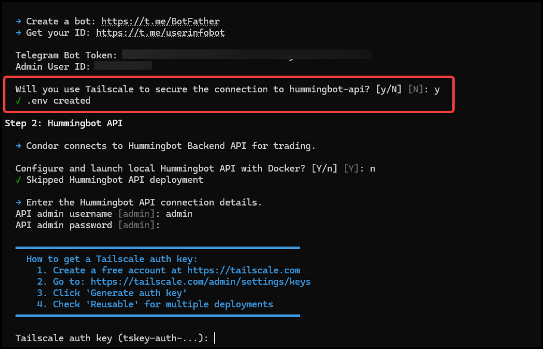
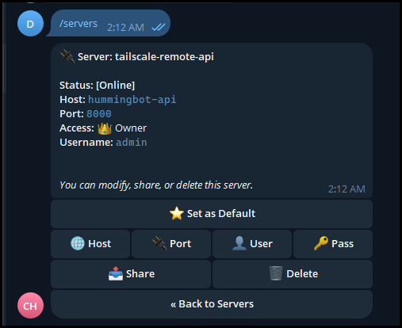

# Securing Condor and Hummingbot API with Tailscale


If you use **[Condor](https://condor.hummingbot.org)** to trade from Telegram or the web dashboard, it talks to **[Hummingbot API](https://hummingbot.org/hummingbot-api/)** on your computer or a cloud server. That API can place orders, read balances, and manage bots—so you should treat it like the front door to your trading stack.

This guide explains **why exposing the API is risky**, **simple steps you can take today**, and **how to use [Tailscale](https://tailscale.com)** so only your own devices can reach the API—without opening port 8000 to the public internet.

<!-- more -->

## Who is this guide for?

You do **not** need to be a networking expert. This article is written for traders and operators who:

- Run Condor on a laptop or home machine
- Run Hummingbot API on a **VPS** or **remote server**
- Want a **private, encrypted** link between the two

If you already run both on the same machine with nothing exposed to the internet, you still benefit from the security checklist below.

---

## What can go wrong if Hummingbot API is exposed?

Hummingbot API is a powerful control plane. When it is reachable from the open internet (for example `http://your-server-ip:8000` with no firewall), attackers may:

| Risk | What it means for you |
|------|------------------------|
| **Unauthorized access** | Someone who guesses or steals your login could view portfolios and place trades |
| **Credential theft** | Exchange API keys stored in the system could be read or misused |
| **Bot manipulation** | Running bots could be stopped, reconfigured, or used in ways you did not intend |
| **Data exposure** | Trade history, balances, and strategy details could leak |

Many incidents are not “Hollywood hacking”—they come from **default passwords** or **port 8000 left open** on a cloud VM.

!!! warning "Real trading capital is at stake"
    Condor and Hummingbot API are built for live trading. Treat API access with the same care you would give to exchange API keys.

---

## Security checklist (do these first)

Before or alongside Tailscale, follow these basics. They take a few minutes and greatly reduce risk.

### 1. Use a strong API username and password

During setup, the installer prompts you to create API credentials. Choose a unique username and a long, random password, and store them in a password manager.

Condor stores these credentials in its server configuration (via `/servers` in Telegram). Anyone who can read that config can call your API—another reason to keep the API off the public internet.

### 2. Use a strong config password

The **`CONFIG_PASSWORD`** in `.env` encrypts exchange API keys and other secrets inside Hummingbot. Use a strong value and do not share it.

### 3. Do not expose unnecessary ports on your VPS

If you host the API on a **VPS**, confirm that **port 8000** (and any other ports you do not intend to publish) are **not** reachable from the public internet. Providers handle this differently: platforms like **AWS** often block inbound traffic by default until you add a security-group rule, while other VPS offerings may ship with a permissive firewall already in place.

Check both:

- Your provider's **firewall**, **security group**, or **network rules** in their control panel
- The **firewall on the VM** itself (for example `ufw` on Ubuntu)

If the API should only be reached over Tailscale, there should be **no** public inbound rule for port 8000.

### 4. Prefer a private network channel (Tailscale)

Even with auth enabled, exposing port **8000** on a public IP invites automated scans and brute-force attempts. **Tailscale** puts your machines on a **private network** (called a **tailnet**) so Condor can reach the API at an address like `http://hummingbot-api:8000` **without** publishing the API to the world.

| Approach | Public port 8000? | Encrypted tunnel? |
|----------|-------------------|-------------------|
| API open on VPS IP | Yes | Only if you add HTTPS yourself |
| VPN / Tailscale | No (recommended) | Yes (WireGuard via Tailscale) |

---

## What is Tailscale? (in plain language)

**Tailscale** is software that connects your computers and servers into a **small private network** over the internet—like a VPN, but much easier to set up.

Think of it this way:

- The **public internet** is a busy street. Anyone can walk past your door if the door is open.
- **Tailscale** is a private hallway only **your** devices can enter. Condor and Hummingbot API shake hands inside that hallway.

Under the hood, Tailscale uses **WireGuard**, a modern encrypted protocol. You get:

- **Encryption** between devices
- **No need to open firewall port 8000** to the world for API access
- **Stable names** for machines (for example `hummingbot-api` and `condor`) via **MagicDNS**

Tailscale offers a **free tier** that is enough for personal Condor + API setups. You sign up at [tailscale.com](https://tailscale.com).

---

## How Tailscale protects Condor and Hummingbot API

A typical setup looks like this:



- **Condor** (Telegram bot + optional web UI) runs on one machine—for example your Mac or a home Linux box.
- **Hummingbot API** often runs on a **VPS** where your bots and database live.
- Both join the **same Tailscale account** (tailnet).
- Condor calls the API using the **MagicDNS hostname** `hummingbot-api`, not your VPS’s public IP.

Traffic is encrypted on the tailnet. The API does not need to listen on a **public** interface for Condor to work.

---

## Before you start

Gather the following:

| Item | Notes |
|------|--------|
| **Tailscale account** | Free at [tailscale.com](https://tailscale.com) |
| **MagicDNS** | Enabled in [Admin console → DNS](https://login.tailscale.com/admin/dns) |
| **Tailscale auth key** | From [Admin console → Settings → Keys](https://login.tailscale.com/admin/settings/keys) |
| **Two machines (optional)** | API server + Condor machine—or one machine for both |
| **Docker** | Required for the standard Hummingbot API Docker install |




### Prepare Tailscale (MagicDNS + auth key)

**Enable MagicDNS (recommended)** so hostnames like `hummingbot-api` resolve on every device on your tailnet:

1. Open the [Tailscale admin console → DNS](https://login.tailscale.com/admin/dns).
2. Turn on **MagicDNS** if it is not already enabled.



**Generate an auth key** for joining machines during setup:

1. Sign in to the [Tailscale admin console](https://login.tailscale.com/admin/settings/keys).
2. Open **Settings → Keys**.
3. Click **Generate auth key**.
4. For home lab setups, enable **Reusable** if you will connect more than one machine with the same key during setup.
5. Copy the key. It starts with **`tskey-auth-`**.




Keep this key secret. Anyone with it can join **your** tailnet until the key is revoked.

---

## Setup overview: two common scenarios

| Scenario | Where Hummingbot API runs | Where Condor runs | What you run |
|----------|---------------------------|-------------------|--------------|
| **A — API on a remote server** | VPS / cloud | Your laptop or home PC | Install script on API server (`--hummingbot-api`), then install script on Condor with “remote API + Tailscale” |
| **B — API and Condor on one machine** | Same machine (Docker) | Same machine | Install script → deploy API locally when prompted → enable Tailscale when asked |

Both scenarios use the same Tailscale ideas; only **which machine runs which installer** changes.

---

## Part 1: Secure Hummingbot API with Tailscale (remote server)

Use this when the API runs on a **VPS** or dedicated server and Condor will connect from elsewhere.

Deploy installer: [github.com/hummingbot/deploy](https://github.com/hummingbot/deploy) (Tailscale support is in the Hummingbot API setup flow).

### Step 1 — Install Hummingbot API on the server

SSH into your server, then run the one-line installer for the API stack only:

```bash
curl -fsSL https://raw.githubusercontent.com/hummingbot/deploy/main/setup.sh | bash -s -- --hummingbot-api
```

The setup wizard asks for passwords and configuration. When you see:

```text
Use Tailscale for secure private networking? [y/N]
```

answer **`y`**.

Paste your **`tskey-auth-...`** key when prompted.

The wizard sets in `.env`:

```bash
TAILSCALE_ENABLED=true
TAILSCALE_AUTH_KEY=tskey-auth-...
TAILSCALE_HOSTNAME=hummingbot-api
```

You will also set a strong **`USERNAME`**, **`PASSWORD`**, and **`CONFIG_PASSWORD`**—do not keep defaults on a production server.

### Step 2 — Deploy with the Tailscale sidecar

If you used the **one-line installer** in Step 1, setup already runs **`make deploy`** at the end—you can skip this step.

If you **cloned** the [hummingbot-api](https://github.com/hummingbot/hummingbot-api) repo manually and ran **`make setup`**, start the stack with:

```bash
make deploy
```

When `TAILSCALE_ENABLED=true`, `make deploy` runs:

```bash
docker compose -f docker-compose.yml -f docker-compose.tailscale.yml up -d
```

A **Tailscale sidecar** container joins your tailnet with hostname **`hummingbot-api`**. The API stays available on the tailnet (for example `http://hummingbot-api:8000`) without requiring you to expose port 8000 on the VPS public IP.

### Step 3 — Confirm the API node is online

On the **API server**, from the `hummingbot-api` directory, check that the Tailscale sidecar joined your tailnet:

```bash
make tailscale-status
```

This runs `tailscale status` inside the sidecar container. You can also use `tailscale status` on the host if Tailscale is installed there.

Look for a line with hostname **`hummingbot-api`** and **no** `offline` in the status column (other devices on your account may appear too—that is normal):

```text
100.64.12.34   hummingbot-api   you@   linux   -
100.64.56.78   my-laptop        you@   linux   -
```

- **`100.64.x.x`** — Tailscale IP for that machine (yours will differ)
- **`hummingbot-api`** — must match `TAILSCALE_HOSTNAME` in `.env` (default)
- **`-`** at the end — peer is connected; `offline` means the sidecar is not on the tailnet yet

If **`hummingbot-api` is missing**, check sidecar logs with `docker compose logs hummingbot-tailscale` and see [Troubleshooting](#troubleshooting) below.

---

## Part 2: Connect Condor over Tailscale

Install Condor on your machine (if you have not already):

```bash
curl -fsSL https://raw.githubusercontent.com/hummingbot/deploy/main/setup.sh | bash
```

### Scenario A — Condor on another machine, API already on Tailscale

During Condor setup:

1. When asked **“Will you use Tailscale to secure the connection to hummingbot-api? [y/N]”** → answer **`y`**.  
   This comes early (before API details). Setup will not ask for a public API URL.
2. **“Configure and launch local Hummingbot API with Docker? [Y/n]”** → answer **`n`** (the API is already on your server).
3. Enter the API **username** and **password** you set on the server. Condor uses **`http://hummingbot-api:8000`** automatically (MagicDNS hostname from Part 1).
4. Paste your **`tskey-auth-...`** key when prompted (same reusable key as the API server is fine).
5. Condor installs Tailscale on **this** machine with hostname **`condor`** and joins the same tailnet.

The web dashboard is reachable on the tailnet at **`http://condor:8088`** (MagicDNS) once Condor is running.

!!! note "Screenshot placeholder"
    **File to add:** `condor-setup-remote-tailscale.png`  
    **What to capture:** Condor setup prompt: “Will you use Tailscale to secure the connection to hummingbot-api?”



### Scenario B — Deploy API locally with Condor and Tailscale

During setup:

1. **“Will you use Tailscale to secure the connection to hummingbot-api? [y/N]”** → answer **`y`**.
2. **“Configure and launch local Hummingbot API with Docker? [Y/n]”** → answer **`y`** (default).
3. Paste your **`tskey-auth-...`** key, then set API **username**, **password**, and **config password**.

Condor installs Tailscale as **`condor`**, clones `hummingbot-api`, enables Tailscale in `.env`, starts the stack with the Tailscale overlay, and connects on the same tailnet at **`http://hummingbot-api:8000`**.

### Configure the server in Telegram (if needed)

In your Condor Telegram chat:

1. Send **`/servers`**
2. Confirm the active server points to **`hummingbot-api`** (host) and port **`8000`**, with your API username and password.




---

## Verify everything works

Run these checks in order.

### 1. Both machines on the tailnet

On **either** machine:

```bash
tailscale status
```

You should see both **`condor`** and **`hummingbot-api`** (names may vary if you customized `TAILSCALE_HOSTNAME`).

### 2. Condor sees the API

In Telegram:

- **`/start`** — startup message and server health
- **`/servers`** — server should show **online** (not connection refused or auth error)

### 3. Optional: ping the API from the Condor machine

```bash
curl -u YOUR_USERNAME:YOUR_PASSWORD http://hummingbot-api:8000/
```

Replace credentials with your API login. A successful response means auth and Tailscale routing work.

---

## Network layout (reference)

```
[Your laptop / home PC]          [VPS / cloud server]
     Condor                           Hummingbot API
  tailnet: condor                tailnet: hummingbot-api
         \                              /
          \    Tailscale (WireGuard)  /
           \                          /
            ===== same tailnet =====
         Condor calls http://hummingbot-api:8000
```

Both machines must use the **same Tailscale account** (same tailnet). Auth keys from that account’s admin console are required.

---

## Troubleshooting

| Symptom | What to try |
|---------|-------------|
| **Auth key rejected** | Key must start with `tskey-auth-`; check expiry in Tailscale admin; generate a new key |
| **`hummingbot-api` does not resolve** | Enable **MagicDNS** in Tailscale admin → DNS |
| **Condor: connection refused** | On API server: `make tailscale-status`; ensure `make deploy` used the Tailscale compose overlay |
| **Auth error in Condor** | Match username/password in `/servers` with API `.env` |
| **Only one peer in `tailscale status`** | Run `sudo tailscale up --authkey=...` on the missing machine; same Tailscale account |
| **API works on server but not from Condor** | Confirm Condor machine’s Tailscale is connected; try `ping hummingbot-api` |

For Docker logs on the API host:

```bash
cd hummingbot-api
docker compose logs hummingbot-api
docker compose logs hummingbot-tailscale
```

---

## Summary

| Step | Action |
|------|--------|
| 1 | Use **strong API and config passwords** |
| 2 | Create a **Tailscale** account, enable **MagicDNS**, and create an **auth key** |
| 3 | On the API server: **install script** (`--hummingbot-api`) → enable Tailscale (deploy runs automatically; use **`make deploy`** only after a manual clone + **`make setup`**) |
| 4 | On the Condor machine: **install script** → connect via Tailscale → verify **`/servers`** |
| 5 | Run **`tailscale status`** on both sides to confirm peers |

Tailscale is not a substitute for strong API credentials—but together they give you **authentication** plus **network privacy**, which is what most non-technical operators need when running Condor against a remote Hummingbot API.

---

## Further reading

- [Condor documentation](https://condor.hummingbot.org)
- [Hummingbot API documentation](https://hummingbot.org/hummingbot-api/)
- [Hummingbot API installation](https://hummingbot.org/hummingbot-api/installation/)
- [Condor README — Secure Connection via Tailscale](https://github.com/hummingbot/condor)
- [Hummingbot API README — Secure Connection via Tailscale](https://github.com/hummingbot/hummingbot-api)
- [Tailscale documentation](https://tailscale.com/kb/)

---

*This guide describes security best practices for self-hosted setups. You are responsible for securing your servers, keys, and trading capital. Start with small amounts and verify connectivity before enabling automated agents.*
