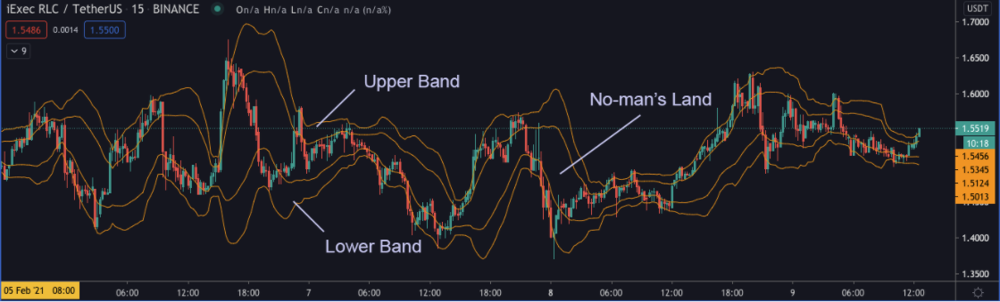

# Sharing is Caring: Identifying Trends

*by Thomas Yit*

Understanding and detecting market trends (or lack thereof) is an important skill for any trader, especially market-makers. As mentioned in the past  two articles, like this one that talks about [inventory risk](/blog/what-isinventory-risk/), a market without a clear directional trend (aka moving sideways) is the market-maker’s best friend.

There are many ways to identify trends, either using fundamental analysis or technical analysis. In the following sections, I will further breakdown Fundamental and Technical Analysis and share some tools that hopefully will assist in building your framework for identifying trends.

Here is what you will find below:

- What are Fundamental Analysis and Technical Analysis?
- What is On-Chain Analysis?
- How are they used on cryptocurrency markets?
- How to use Technical Indicators to find the current market trend

<!-- more -->

## Fundamental Analysis

Traditionally, Fundamental Analysis (FA) is the study of an asset's characteristics to determine its “intrinsic value”.

When analyzing the fundamentals of an asset, the trader/analyst usually looks at internal factors such as profit generated, total asset value, company accounting, etc., and/or  external factors such as industry news, political news, competitors, interest rates,  economic projections, etc. 

Based on these factors, it is possible to establish whether the asset or business is overvalued or undervalued, and determine your trading strategy accordingly,  going either long or short. 

Cryptocurrencies are a bit different from traditional markets which you have mountains of data to study and filter through before determining the “intrinsic value”. Additionally, traditional markets come with time-tested analytical models currently lacking in cryptocurrency market

As a new asset class, we are still discovering what kind of data is useful to determine the value of a crypto project.

The old fashioned method of reading on the crypto project still applies. You might look at the whitepaper to understand what problem the project is trying to solve with its blockchain solution, or the roadmap to see whether the team has managed to hit their milestones based on the releases. You might even research the background of the crypto project team members, their partnerships, token metrics and market capitalization, how active the community is, adoption through new addresses, the movement of whale holders,etc.

An interesting way to look at the intrinsic value of these projects that are being developed is the models that use on-chain data to try and find the intrinsic value of a cryptocurrency.

## On-chain Analysis

To track all these crypto project metrics, there are several on-chain analysis tools and models. 

It is important to note that all these models are relatively new (as are all crypto markets), and they might not have proved themselves yet. 

One free tool is [Flipsidecrypto]( https://app.flipsidecrypto.com). It provides an FCAS score that measures user activity, developer behavior, and market maturity.   

 

FCAS scores provide a quick overview of the crypto project and can be supplemented with other on-chain tools such as Glassnode. Using the free tier, you can see the active addresses and whale hodlers movement.

 

From the Glassnode’s screenshot, the number of active addresses is moving up. Overall, Bitcoin is still the dominant force in the crypto market, and a popular metric to measure Bitcoin “intrinsic value”  is the NVT(Network Value to Transactions Ratio) ratio, also known as the Bitcoin’s P/E ratio. The ratio is calculated as follows: network value(market cap) / daily transaction volume. If the NVT ratio is high, Bitcoin is getting overvalued and may be in a bubble waiting to be popped.

 

The current NVT ratio (Feb 16 2021) is 78.46 and considered normal, the recommended ratio to sell is 120.  For other crypto projects NVT, click [here](https://coinmetrics.io/charts/#assets=eth,btc_roll=14_left=NVTAdj_zoom=1279411200000,1613347200000)

## Intermarket Analysis 

Previously in the [Sharing is Caring article](/blog/sharing-is-caring-3-trading-pairs-i-picked), we brought up the subject of currency risk. In this article, I will expand on the topic a bit further. Again, this is not financial advice. 

In the following chart, the first row consists of treasuries from 2yr, 5yr, 10yr, and TLT ETF, while the second consists of  BTCUSDT, the dollar index, S&P500, and VIX.

 

TThe vertical lines in Yellow are the period is from 24 Feb 2020 to 30 Mar 2020. From 24 Feb 2020, the 2YR and 5YR prices start to increase, the same for the VIX. At the same time, the dollar index and S&P500 started to fall, while BTC/USDT was consolidating. On 10 Mar, the dollar index started to reverse, and two days later, 2YR, 5YR, VIX were climbing higher, and then BTCUSDT tanked. The market was in a risk-off state until 30 March when Trump signed the largest-ever US financial stimulus package of US2.5 trillion,helping to calm the market down. 

When the dollar index starts to decrease, the dollar is devaluing, causing other major currencies to increase, as with stable coins like USDT. Earlier this year, however, on the 6th of Jan 2021 (whenongress confirmed Biden’s election as president), the dollar index started to rise, and BTC/USDT consolidated. A market maker can note when there is a spike in activity occurring in 2YR, 5YR, VIX, and dollar index, which can impact their strategies (since the range-bound market is the optimal situation for market marking) and also the value of their HODL assets. 

## Technical Analysis

Technical Analysis involves studying historical prices to find patterns such as head & shoulders, double top/bottom, triangle, harmonics, etc., or oscillators such as ADX, ATR, MACD to find trends or overbought/oversold conditions. What technical indicators can be used for identifying trends? There are usually three stages in a direction, uptrend, sideways, and downtrend.

There are dozens of TradingView indicators that you can use for trend following. TradingView has a free crypto scanner to check the trend strength based on customized filters, such as AO, ATR, Stoch, etc. 

 

I will cover Bollinger Bands®, Relative Strength Index, and Volume Profile, and on the various suggestions to use the indicators for Hummingbot. 

### Bollinger Bands®

Sideways markets are the optimal environment for market-making, so how can we identify them? A popular indicator is Bollinger Bands® which
is very versatile in identifying different trends, see [here](https://www.investopedia.com/trading/using-bollinger-bands-to-gauge-trends/). In the investopedia article, you can create multiple bands with standard deviation 1 and 2 to have an upper band, no-man land, and a lower band. See the following RLCUSDT chart.

 

From the upper band and the lower band, you can see the trend, and sideways in the no-man’s land. So how to apply this for Hummingbot? In general, three ways:

- Upper and lower band: start/stop only at these two bands to capture price movements during an uptrend (tighten the bid spread) or to accumulate during the downtrend (loosen the bid spread)
- No-man’s land: Normal market-making strategy, same bid/ask spread in a ranging environment.
- Classic mean reversion: 
    - start buying when prices cross below lower band(std dev 2), stop when price revert to mean
    - start selling when prices cross above the upper band(std dev2) and stop when price revert to mean

If you have a price value in mind for the upper or lower band,  you can choose to use the Hummingbot’s price band feature or use the price band script from the Hummingbot repo.

#### Limitations

Bollinger Bands® is a lagging indicator which is reactive to prices instead of predictive. The main reason is that it uses a simple moving average to calculate the bands. Moving averages use the average price of the last several price bars and weigh them equally. In general works well in a trending market but the standard settings of 20 SMA and 2 standard deviations might not work well for all markets, you need to test and adjust accordingly.

### Relative Strength Index

The Relative Strength Index (RSI) is a momentum indicator that measures the strength of price, which you can use to identify trends and ranging markets. See the following RLCUSDT chart.

 

In general, a RSI above 70 is considered as overbought(uptrend) and below 30 is oversold (downtrend), while between 30-70 is ranging(sideways). In the chart above, the two purple rectangles have RSI values between 30-70 (lower pane); thus, a ranging market nice for market making.
Similar to Bollinger Bands®, use market-making strategy in no-man's land, use same bid/ask spread when the market is ranging between 30-70.

#### Limitations
Since RSI is a momentum indicator, it can remain at an overbought level or oversold level for a long time; thus, it becomes a strong trend instead of a ranging environment that fits market making. 

If you prefer to use volume, Volume Profile from TradingView can be a good option, click [here](https://www.tradingview.com/support/solutions/43000502040-volume-profile/) for details.

### Volume Profile

In a nutshell, most of the price action trades within 70-80% (you can define the percentage) of the price range and revert to mean(POC). See the following screenshot:

 

The upper and lower lines indicate the boundaries of the price within 80%(you can set this to whatever amount you like); the yellow line is the POC to which the price will revert to. For more information, click [here](https://www.tradingview.com/scripts/volumeprofile/)

How to use it with Hummingbot?  Set your stop when the price crosses down the lower boundary, and start when the price crosses back up. By setting this, your bot will always trade where prices are bound within 80% of the volume profile. The pros are that 80% of the time, your bot will always be engaged in mining where most of the action takes place, and if prices move out of bounds (saves you from spikes down), the bot will stop till prices revert up.

#### Limitations

TradingView Volume Profile indicator is an intraday indicator meaning that it will reset every day and will lead to misleading signals once it is reset, see the following chart.

 

At 8:00 am (yellow vertical line), everyday, Volume Profile will recalculate and the value areas (white line) will narrow. It will be better to close any trades before the start of the day, and let Volume Profile indicator run for about 2-4 hours before you start to trade.

## Hummingbot Scripts

If you have more or less a framework built up to identify trends and want to code it, Hummingbot has scripts for you to 
tinker with and test out your trend detection strategy and adjust the spreads accordingly. 

The script language is Python and currently there are a few scripts for you to get started. See [Hummingbot repo](https://github.com/hummingbot/hummingbot/) for more info.

## Conclusion 

Do not solely rely on indicators in charts; the indicators/trend lines can be a good source of finding entry and exit, but you need to look at macro levels. Events drive market changes, whether in politics, natural disasters, infectious diseases, economic reports, FED statements, etc. Another new area to explore is on-chain analytics, for example, glassnode, santiment, coinmetrics that helps to give a more fundamental approach in analyzing the coins.

Have a more holistic approach (whether in FA, TA, on-chain analytics, sentiment, WSB) in determining your trading strategies, be it in market-making or other trading types (Volatility, momentum, mean-reversion, etc) before picking the market pairs. After deciding the market pair, determine your risk management strategies to control your position sizing, leverage, etc.  

Last but not least, John Maynard Keynes said, “the markets can remain irrational longer than you can remain solvent.” So be cautious and flexible as market conditions evolve  
