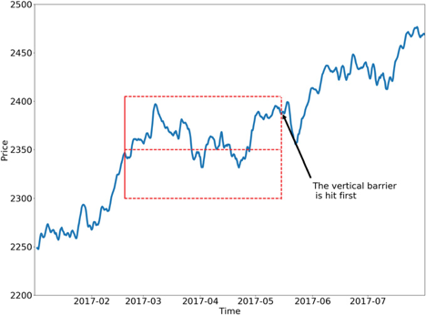

# Strategy Guide: Grid Strike 

**Grid Strike** (`grid_strike`) is a [Controller](/v2-strategies/controllers) in Hummingbot's StrategyV2 framework that automatically places a grid of buy or sell orders within a set price range.

Unlike [basic grid strategies](https://www.binance.com/en/square/post/24240367765730), Grid Strike utilizes [Executors](/v2-strategies/executors/) which dynamically manage each order level with configurable take profit and stop loss settings. This means every position opened by the strategy is automatically monitored and closed according to your risk parameters. It can be configured to move with the market trend —- either up or down -- letting you adapt the strategy to changing market conditions.

This guide explains how the Grid Strike strategy works and helps you decide when to use it. You'll learn how to configure and run the strategyt, as well as the key concepts and how to set it up for trending markets.

**Strategy Code**: <https://github.com/hummingbot/hummingbot/blob/master/controllers/generic/grid_strike.py>


## Strategy Overview


- **Grid-based Order Placement:** The strategy lets you place either a **Long Grid** or a **Short Grid** that places buy/sell orders across a defined price range
- **Automated Risk Management:** Each side utilizes Grid Executors that automatically manages the risk of each position with configurable take profit, stop loss, and time limits
- **Exchange Flexibility:** Works on both spot and perpetual exchange connectors, including support for **one-way position mode** on perp exchanges
- **Highly Configurable** Can be tailored for various market scenarios (trending up, trending down, or consolidating) or trading objectives (volume, liquidity, P&L, etc) by adjusting price range, order spacing, and other parameters

<!-- more -->

## Running the Strategy

!!! tip "Recommendations for New Users"
    If you're new to Grid Strike, it's highly recommended to review [**Strategy Configuration**](#strategy-configuration) section below before running the strategy. These sections explain the essential concepts, parameters, and setup steps that will help you understand how the strategy works and how to configure it safely for your trading goals. Taking time to learn these basics will help you avoid common mistakes and get the most out of the strategy.

### Prerequisites

Before you run Grid Strike, make sure you have Hummingbot installed, either:
 
* [**Hummingbot Client**](/client/): See [Docker Installation](/installation/docker) or [Source Installation](/installation/source) to get started
* [**Hummingbot API + Dashboard**](/hummingbot-api/): See the [Hummingbot Dashboard Quickstart Guide](../../blog/posts/quickstart-dashboard/index.md) for a guide with step-by-step setup instructions

### Create Controller Config 

In the Hummingbot client, run the following command:

```
create --controller-config generic.grid_strike
```


Afterwards, a file `conf_generic.grid_strike_1.yml` in `/conf/controllers` will be saved with the default starting configuration.

See [Strategy Configuration](#strategy-configuration) below for an in-depth guide to adjusting these parameters.

### Create Script Config 

Once you are satisfied with your Grid Strike configuration, add the name of the file to the [Loader Script](/scripts/examples/#v2-controller-loader):

```
create --script-config v2_with_controllers
```


If you have an existing load script configuration file, simply modify it to add the Grid Strike configuration you just made (e.g `conf_generic.grid_strike_1.yml`):

```yaml
markets: {}
candles_config: []
controllers_config:
- conf_generic.grid_strike_1.yml
script_file_name: v2_with_controllers.py
max_global_drawdown_quote: null
max_controller_drawdown_quote: null
```


### Run Loader Script

From the Hummingbot client interface, start the loader script with this config file:

```
start --script v2_with_controllers.py --conf conf_v2_with_controllers_1.yml
```

Alternatively, use this CLI command to skip password entry and automatically start the strategy:

```bash
/bin/hummingbot_quickstart.py -p [PASSWORD] -f v2_with_controllers.py -c conf_v2_with_controllers_1.yml
```

### Monitoring the Strategy

When you start the Grid Strike strategy, it first looks at your configuration to figure out how to set up your trading grid. Once the grid is set up, the strategy begins placing orders based on the set `side` (buy or sell) within your specified price range. It places order and waits for it to fill. Whenever `order_frequency` is reached, it checks if it needs to place a new order.

Run the `status` command (or `status --live` for constant refresh) to get an in-depth overview of the strategy performance:

[](./image-1.png)

When an order gets filled and opens a position, the Triple Barrier system immediately takes over to manage that specific trade. This system acts a personal risk manager for each filled order or position: it will automatically close the position if it reaches the `take_profit` or if it moves from the set `stop_loss` against you. This happens automatically without you having to watch the screen. 

The strategy then continues this cycle: place a sell order, wait for it to fill, let the Triple Barrier manage the position until it closes, then place another sell order. This creates a continuous trading loop that tries to capture small profits repeatedly while keeping your risk controlled.

## Strategy Configuration

After you run `create --controller-config generic.grid_strike`, an initial config file in `/conf/controllers` will be saved with the starting configuration below:

```yaml
id: <controller-id>
controller_name: grid_strike
controller_type: generic
total_amount_quote: '1000'
manual_kill_switch: false
candles_config: []
initial_positions: []
leverage: 20
position_mode: HEDGE
connector_name: binance_perpetual
trading_pair: WLD-USDT
side: 1
start_price: '0.58'
end_price: '0.95'
limit_price: '0.55'
min_spread_between_orders: '0.001'
min_order_amount_quote: '5'
max_open_orders: 2
max_orders_per_batch: 1
order_frequency: 3
activation_bounds: null
keep_position: false
triple_barrier_config:
  open_order_type: 3
  stop_loss: null
  stop_loss_order_type: 1
  take_profit: '0.001'
  take_profit_order_type: 3
  time_limit: null
  time_limit_order_type: 1
  trailing_stop: null

```

### Key Parameters

[](./long-grid-order-executor.png)

Here are some of the most important settings:

| Parameter | Meaning |
| --- | --- |
| **total_amount_quote** | Your budget for the bot (e.g., 1000 USDT) |
| **connector_name** | The exchange to trade on (e.g., `binance_perpetual`) |
| **trading_pair** | Market you want to trade (e.g., `WLD-USDT`) |
| **side** | 1 = Buy (long), 2 = Sell (short) |
| **start_price** | The price at which your bot starts placing orders |
| **end_price** | The price at which your bot stops placing orders |
| **limit_price** | If price falls below this level for Buy grids (or rises above for Sell grids), the bot stops trading and terminates positions (or moves them to `PositionHold` based on `keep_position`) |
| **min_spread_between_orders** | Minimum spacing between orders (e.g., 0.001 = 0.1%) |
| **min_order_amount_quote** | Smallest order size allowed by exchange (e.g. 10 for 10 USDT) |
| **order_frequency** | How often the bot checks for new orders (in seconds) |
| **position_mode** | For perp exchanges: `ONEWAY` or `HEDGE` |
| **keep_position** | If true, terminated executors store the positions in `PositionHold` bucket |
| **activation_bounds** | Controls which grid orders are actually placed based on their proximity to the current price. If set to `null`, all grid orders within your price range are placed, exposing your full capital. If set to a value like `0.005`, only orders within 0.5% of the current price are placed, while others are calculated but not exposed—acting as a risk control. For example, during a sudden price drop, only nearby orders are active, preserving capital for better entry points. |

Make sure to set the most important parameters like:

- Exchange (`connector_name`): Use any Hummingbot CLOB connector, such as `hyperliquid` or `hyperliquid_perpetual`
- Trading Pair (`trading_pair`): Use a valid trading pair supporte by the exchange, e.g. `BTC-USDT`
- Budget (`total_amount_quote`): Total amount allocated to the strategy, expressed in the quote asset
- Direction (`side` = buy or sell): Place either a Long (buy) Grid or Short (sell) order grid
- Grid Dimensions: Start price and end price

### Triple Barrier Parameters



Grid Strike creates Grid Executors that implement the Triple Barrier Method, similar to [Position Executors](/v2-strategies/executors/positionexecutor/). Set these parameters to define how each order is managed if it is filled:

| Setting | Meaning |
| --- | --- |
| **stop_loss** | Automatically close the trade if it moves against you |
| **take_profit** | Close the trade once profit target is reached |
| **time_limit** | Close the trade after a set time, win or lose |
| **order_type** | Choose between 1 - Market, 2 - Limit, or 3 - Limit-Maker orders |

## Tips & Tricks

### Three Building Blocks of Grid Strike

To set up Grid Strike effectively, you need to balance these three foundational considerations:

**1 - Price Range**

This is the zone where your orders will be placed, defined by **start_price** and **end_price**.

- Narrow range: Best for calm markets with little movement.

- Wide range: Better for volatile assets but spreads orders out more thinly.

Example:

```
Price Range = end_price - start_price
Your case: $6.8 - $5.5 = $1.3
Price Range % = ($1.3 / $5.5) × 100 = 23.6%
```
    
**2 - Budget**

How much money you set aside determines how many orders the bot can place, defined by **total_amount_quote**. Note that this is expressed in units of the quote asset, the second symbol in the trading pair. We utilize this convention across V2 strategies to help you manage budgets across multiple bot instances.

- The bot divides your budget by the minimum allowed order size from the exchange.
- Each order level requires money reserved upfront. If you don’t have enough funds for all orders, the bot won’t place them.

Example:

```
# capital support
Max Orders by Budget = total_amount_quote ÷ min_order_amount_quote
Your case: $100 ÷ $7 = 14.28 ≈ 14 orders maximum
```
    
**3 - Spread Levels**

This is how far apart your orders are from each other, controlled by the **min_spread_between_orders** parameter:

- **Small spread (e.g., 0.5%)** = more orders close together → captures small moves but needs more funds.
- **Large spread (e.g., 2%)** = fewer, wider orders → targets bigger moves and uses less capital.

Example:

```python
Max Levels = Price Range % ÷ min_spread_between_orders
Your case: 23.6% ÷ 0.7% = 33.7 levels (theoretical max)
```
    
Your final grid will be a balance of these three factors. The bot will create the maximum number of orders it can, respecting both your capital limit and the minimum spread you've set within your chosen price range.

### Long vs Short Grids

[](./long-vs-short-grids.png)

Think of Grid Strike as a way to “ride the wave” of a trend:

**Short Grid (Betting on Price Going Down)**

If you expect the price to fall, set `side` to 2 and define the expected downward price trajectory using `start_price` and `end_price`. Use `min_order_amount_quote` and `min_spread_between_orders` to space the orders in your grid.

Grid Strike places sell (short) orders at gradually lower prices. As the market moves downward, these orders are triggered one by one, building up your short position and letting you profit from the downtrend.

If you are anticipating for continuing downtrend movement, you can setup the Grid Strike with `start_price` above the `end_price` as shown below.


**Long Grid (Betting on Price Going Up)**

If you think the price will rise, set `side` to 1 and define the expected upward price trajectory using `start_price` and `end_price`. Similarly, use `min_order_amount_quote` and `min_spread_between_orders` to space the orders in your grid.

Grid Strike places buy (long) orders at gradually higher prices. As the price climbs, your orders are triggered, adding to your long position and helping you profit from the uptrend.

Conversely, if you are anticipating for price reversal at support level or continuing uptrend, you can setup the Grid Strike with `start_price` below the `end_price` as shown below.
        


This "averaging into a trend" approach is the key difference. A traditional grid buys low and sells high in a sideways range (fighting the momentum), whereas Grid Strike joins the momentum, adding to a winning long or short position as the trend develops in your favor.
