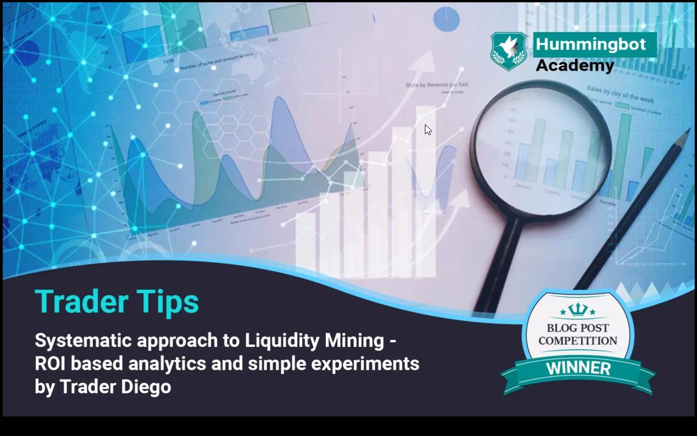

# A Systematic Approach to Liquidity Mining

### ROI-Based Analytics and Simple Experiments

*by Diego C*

The end goal of Liquidity Mining strategies is to outperform traditional staking and farming yields in DEFI/CEFI using your crypto assets.

If you HODL crypto assets in exchanges like Binance, Kucoin, Gate.io, or Ascendex and are not using them for trading, staking, or yield farming on these platforms, you are missing out on potential passive income from these assets.

This is where Liquidity Mining comes into play:

**Advantages:**

- Higher ROI
- No lockup period for your assets

**Disadvantages (or so):**

- Requirement of a trading bot

For this, Hummingbot has already created a ready-to-use trading bot for the special purposes of liquidity mining, pure market making, arbitrage, etc.

<!-- more -->

Alternatively, you can run liquidity mining using any other trading bot.

The Hummingbot Miner platform provides extensive data to help you understand better where to invest your money. However, understanding the implications of each particular set of data on your final Return On Investment (ROI) is not as straightforward as it seems.

When deciding which pair to use for liquidity mining, go to "Markets" [https://miner.hummingbot.io/markets](https://miner.hummingbot.io/markets?ref=blog.hummingbot.org), filter out the exchange where you have your assets, and then filter by higher yield.

While this is a good approach when starting liquidity mining, there are risks involved in this decision. For example, higher yields usually correlate with:

- Lower liquidity pairs
- New pairs on the exchange
- Bigger spreads on the trading platform

All of which translate into higher risks.

Also, understand that the "yield" mentioned in the Hummingbot Miner platform is not necessarily your final ROI. These yield metrics only include reward payments versus order volumes; they are not your ROI.

To calculate your personal ROI, you must compute the mining rewards, the PnL for the occasional trades incurred during liquidity mining, the exchange fees, and the money you invested in the liquidity mining trade.

Your personal Return On Investment (ROI) is calculated as:

ROI = (Liquidity Mining Rewards +/- Trading PnL - Exchange Fees + Rebate Fees) / (Money Invested)

Our goal here is to achieve an ROI of 10% monthly or 120% Annual Return (AR).

Now let's see how to approach this task.

### **DATA COLLECTION**

**Stage 1 - Working Out the Spread**

#### **Day 1**

Run a Liquidity Mining bot on as many pairs as possible, with the same invested amount in USD value (for example $100), the same spread @ 0.5%, the same order refresh time, etc.

- Collect data on:
  - Revenue generated per pair.
  - Rewards generated.
  - Amount invested per pair.
  - ROI.
  - Operating Cost.
  - Number of filled orders.
  - Amount in USD value filled per pair.
  - Fees paid.
  - PnL generated from filled orders (positive or negative).

#### **Day 2**

- Run exactly the same method but now at a spread of 0.75% and compute all the same data again.

#### **Day 3**

- Run exactly the same method but now at a spread of 1% and compute all the same data again.

**Stage 2 - Working Out the Invested Amount**

#### **Day 4**

- Run exactly the same method but now double the invested amount to $200, at a spread of 0.5%, and compute all the same data again.

#### **Day 5**

- Run exactly the same method but now double the invested amount to $200, at a spread of 0.75%, and compute all the same data again.

#### **Day 6**

- Run exactly the same method but now double the invested amount to $200, at a spread of 1%, and compute all the same data again.

#### **Day 7**

- Sit back and enjoy your success.

### **DATA ANALYTICS**

#### **Compare Performance**

In theory, tighter spreads will lead to bigger rewards but more filled orders and trading fees, which affect your final PnL and ROI.

On the other hand, bigger spreads will lead to smaller rewards, but fewer filled orders and lower trading fees.

However, you need to put theory aside and input all this collected data into an Excel sheet to compute the results and compare.

Create a spreadsheet with the data for each day and then reorder it by ROI.

The method that achieves the highest ROI should be your final selection to move to the last step, which is to scale up the process to larger investment amounts.

**Note 1:** The reason to test different invested amounts is outlined in the "Spread Density Function" described in the liquidity mining whitepaper [https://coinalpha.com/liquidity-mining.pdf](https://coinalpha.com/liquidity-mining.pdf), which exponentially favors miners with tighter spreads.

**Note 2:** The reason to test different spreads is not as obvious. But, as detailed in the reward allocation mechanism, the invested amount from the miner affects the rewards calculation as it is considered proportional to the total liquidity amount provided by ALL other miners [https://hummingbot.io/en/blog/2019-12-liquidity-mining-rewards](../demystifying-liquidity-mining-rewards/index.md).

Miner reward allocation % = miner order weight / Total snapshot order weight.

#### **Optimization Process**

- Select better spreads per coin based on ROI and/or PnL.

#### **Scale Up**

- Then, scale up the investment.

### **TRADING STRATEGIES**

Here are some popular trading strategies:

**1- D-CALM (Dollar Cost Averaging Liquidity Mining):** Only place BUY orders (bid side) at a spread of 0.5%. If the order is filled, wait 1 hour and check the current price. If the price is above the last filled price, then place a SELL order (ask side) to lock in profits and restart the liquidity mining bot.

If after 1 hour the price decreases by more than 1%, reduce the spread to 0% to ensure the limit order is taken again, starting the DCA process.

Now you have 2 filled orders, e.g., first at a price of 1.25 and the second at 1.15, meaning your average BUY price is 1.20. To lock in profits from a DCA session, the price needs to return to 1.20, instead of the original 1.25. This increases your chances of locking in a profit or at least breaking even from your filled orders.

While managing filled orders, your Hummingbot continues generating liquidity mining rewards.

**Note 1:** Working on Python code for this one :)

**2- Pure Market Making Bot**

**3- Liquidity Mining**

**4- Hedge Mode**

**Note 2:** Strategies 2, 3, and 4 are currently available in Hummingbot.

**BONUS - Crypto Loans:**

If you are a HODLER of BTC, ETH, BNB, or any major cryptos, don't sell them to run liquidity mining. Instead, get a Crypto Loan, like those available in Binance for 0.04% per day (I am not offering referral incentives). If you can get even better rates on any other platform, go for it.

The point is to retain your main crypto assets but run liquidity mining rewards using loans on stablecoins like USDC, USDT, BUSD, etc. This way, you can still benefit from the appreciation of your long-held assets as well as from liquidity mining. The only consideration is to ensure that your daily ROI is higher than your loan interest. And usually, it is!
