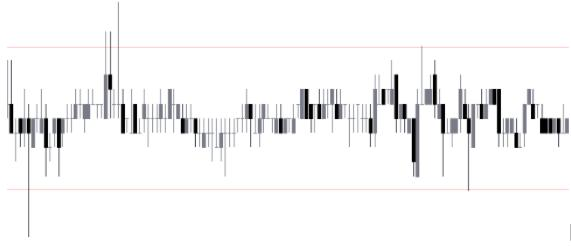
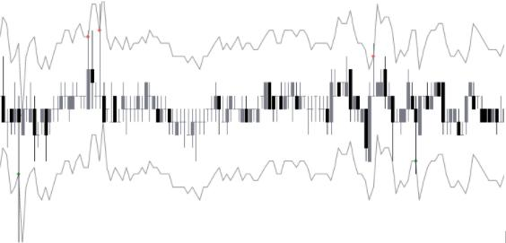
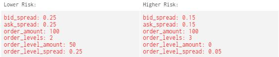
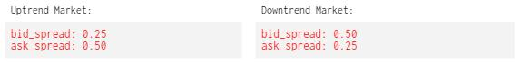
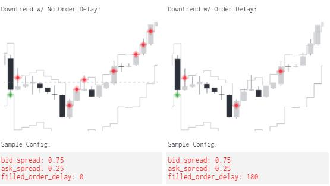

# Tips for Handling Different Market Conditions

*by Owen Hobbs*

In numerous ways, markets can resemble the waves of the ocean. Both have peaks, bottoms, and ultimately return to a midpoint or sea level. The approach one takes to navigate the waves is largely dependent on the weather or market conditions affecting them. In this article, we are going to discuss a few of the ways someone using Hummingbot could navigate the various market conditions such as ranging, uptrend, and downtrend.

<!-- more -->

## **Range Bound Markets**

A rangebound, or often referred to as a 'sideways' market, is when the price moves back and forth between a higher and lower price. This constant movement between the lower and higher prices creates a prime opportunity for market makers to come in and capture the spread between the two. A range bound market increases the probability that a market maker�s bid and ask orders are filled, and done so repeatedly. The more often a market maker completes a buy and sell �cycle� (buy low, sell high), the more spread and profits a market maker is able to capture.

## **Calculating Spread**

As an example of how someone may generate their bid and ask spreads in a rangebound market, one may simply measure the difference from the bottom range to the top range that they are trying to capture. By default, hummingbot places its orders as an offset of the mid_price on each side, therefore we will need to divide this number in half to get an average bid\_spread and ask\_spread.

For example, let's imagine that we determined the market was ranging between 0.995 and 1.005; thus creating a 1% gap that we would like to capture. By dividing the gap percentage in half we get 0.5%; which is a general value we can apply to bid and ask spreads. Since by default spreads are placed as an offset to the mid_price, the second image below illustrates what these orders may look like on the books.

## **Order Levels**

By incorporating more advanced features such as [order_levels](../../../strategy-configs/order-levels.md) and [order_level_spread](../../../strategy-configs/order-levels.md), one could place additional orders at wider spreads in an attempt to capture more volatile moments that exceed the first order level. The [order_level_amount](../../../strategy-configs/order-levels.md) parameter can either increase or decrease the subsequent order size after the first level. This can be used according to one's risk appetite. For example, one may be willing to purchase 100 assets at a tighter spread, but is willing to purchase an additional 150 assets at a wider spread as this is less risky.

On the other hand, by reducing the original spreads and setting 2 additional order_levels, one could accomplish capturing spread, volatility, and possibly increase their traded volume. Unfortunately, these tighter spreads come with increased risk appetite. See the sample configs

## **Trending Markets**

Similar to range bound markets, trending markets typically fluctuate between highs and lows. The outlier in trending markets is that the price action is either making higher highs or lower lows over a period of time. This places them in one of two categories of either an uptrend or downtrend market.

## **Offsetting Spreads**

Since trending markets are no longer testing the same highs and lows, establishing hummingbot spreads tends to be more complex. For example, if we took the same strategy of evenly spaced spreads in a trending market, one side would likely be filled more often than the other. The result of this could limit the effectiveness of capturing spread, offset inventory risk, and overall cost money.

To further explain, markets that are in an uptrend tend to have more pressure on the ask side than the bid side. If there is more pressure on the ask side, then market makers are more likely to keep selling assets rather than replenishing supply. Meanwhile, markets that are in a downtrend tend to have more pressure on the bid side, likely increasing supply with limited ask orders being filled.

Therefore, if someone is attempting to capture spread in a trending market, one could simply adjust the spreads based on the amount of buy or sell pressure on that side. As an example, if a market is in an uptrend, one could set their ask orders at a higher spread than the bids. Since ask orders are more likely to be filled in an up trending market, setting a higher price for selling could help offset and mitigate this imbalance. The opposite of this could then be applied in downtrend conditions.

## **Order Delay**

By default, after an order is filled, Hummingbot immediately replaces the orders on the book. This can be useful in certain situations, however, in times of volatility, this could quickly lead to inventory shifting too far to one side or the other.

Increasing the [filled_order_delay](../../../strategy-configs/filled-order-delay.md) parameter places a delay between a filled order and when the next order is placed. By increasing the filled_order_delay parameter, it reduces the risk of filling too many orders on one side or the other.

For example, the market is currently in a downtrend; Let us assume we are applying more sell pressure with tighter spreads. If the market suddenly starts to correct to the upside, it quickly fills our ask orders.

If filled_order_delay was enabled, this would place a timed delay between each order, limiting the number of orders and amount of added inventory. Please see the sample configs & images below representing this scenario:

Unfortunately, there is no win-all strategy for market makers to just plug in. Markets are continuously changing direction, volatility, order depth, etc. Therefore, future and current market makers will need to continue altering their configurations depending on the market conditions present. The goal is though, with enough experience, one will gain the knowledge to quickly adapt to ever changing markets.

