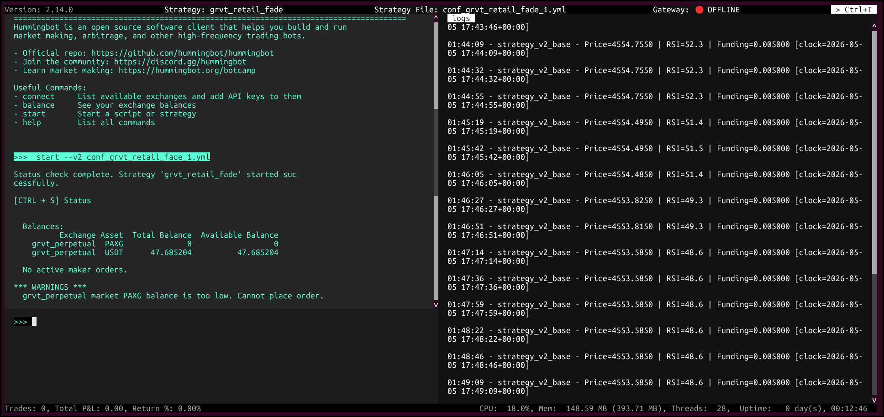

# Trading on GRVT with Hummingbot: A Complete Bot Development Guide


Welcome to the GRVT connector guide for Hummingbot. [GRVT](https://grvt.io/) is a hybrid derivatives exchange offering self-custodial perpetual futures with central limit order book (CLOB) matching. The `grvt_perpetual` connector lets you run automated strategies—market making, directional frameworks, and custom V2 controllers—against GRVT’s perpetual markets while managing orders through Hummingbot’s standard derivative connector interface.

<!-- more -->

## What is GRVT?

GRVT (pronounced "gravity") is a **hybrid perpetuals exchange** that combines the performance of a centralized orderbook with the self-custody of a decentralized exchange. It is built on ZKsync's validium stack, meaning trades are matched off-chain at CEX speed but settlement is secured by Ethereum.

**Key properties relevant to bot traders:**

| Property | Detail |
| -------- | ------ |
| Order type | Central Limit Order Book (CLOB) |
| Settlement | ZKsync validium (non-custodial) |
| Latency | CEX-grade (~sub-10ms matching) |
| Funding rate | 8-hour perpetual funding |
| API auth | API Key + secp256k1 private key signing |
| Hummingbot connector ID | `grvt_perpetual` |

GRVT launched its mainnet in 2024 and currently lists major crypto perpetual pairs including BTC, ETH, SOL, and commodity proxies like PAXG (tokenised gold).

## Prerequisites

Before you start, make sure you have the following ready.

### Software

- Docker Desktop (recommended) OR Python 3.12+
- Git
- A code editor (VS Code recommended)

### Accounts and funds

- A GRVT account at [app.grvt.io](https://app.grvt.io/) with a connected wallet (MetaMask or WalletConnect)
- USDT deposited into your GRVT sub-account (minimum ~$50 recommended for testing, $200+ for live)
- Your three GRVT credentials (covered in [Connecting Hummingbot to GRVT](#connecting-hummingbot-to-grvt)):

  - **API Key**
  - **Secret Private Key**
  - **Trading ID** (also called `sub_account_id`)

### Knowledge baseline

- Basic terminal/command line usage
- Familiarity with JSON config files
- Python fundamentals if you want to customise the script strategy

## Install and Start Hummingbot

### Docker (Recommended)

Use Docker for the fastest and most consistent setup.

1. Clone the [Hummingbot repository](https://github.com/hummingbot/hummingbot):

    ```bash
    git clone https://github.com/hummingbot/hummingbot.git
    cd hummingbot
    ```

2. Start the container:

    ```bash
    docker compose up -d
    ```

3. Attach to the client:

    ```bash
    docker attach hummingbot
    ```

!!! note
    In `docker-compose.yml`, you can set the `image` line under the `hummingbot` service to `hummingbot/hummingbot:latest` (stable) or `hummingbot/hummingbot:development` (latest development build).

Complete the password prompt on first launch (stored locally for encrypting API keys).

### Source Install

From the cloned repository:

```bash
make install
make run
```

See the [installation docs](../../../installation/index.md) for OS-specific details and updates.

## Connecting Hummingbot to GRVT

### Step 1: Generate API credentials on GRVT

Log into [app.grvt.io](https://app.grvt.io/) and open the **API Keys** page from your account menu or follow the instructions on the [GRVT exchange documentation](../../../exchanges/grvt/index.md).

1. Click **Create** and select the sub-account (trading account) you want to automate.
2. In the creation modal, choose **Generate** — GRVT will create the wallet-key pair for you.
3. Enable the **Trade** permission on this key.
4. Confirm the action in your connected wallet (MetaMask will pop up).
5. Once created, **immediately copy and store:**
   - `API Key` — a short alphanumeric string
   - `Secret Private Key` — a 0x-prefixed hex string (shown **only once**)
6. Close the modal and then copy the **Trading ID** displayed under the same sub-account row.

!!! warning
    The **Secret Private Key** is shown only once. If you lose it, create a new API key. Store it in a password manager or encrypted secrets file — never commit it to Git.

Your three credentials will look like this:

```text
API Key:            3BAXW9pabYw1SjIsWQ7ELxPllYz
Secret Private Key: 0x62e2af3b07a3b05571bab9355f534023174303cc6f2ef37ed080fb66006db5c3
Trading ID:         2243231355541970
```

### Step 2: Connect inside Hummingbot

Inside the Hummingbot CLI, run:

```text
>>> connect grvt_perpetual
```

You will be prompted for each credential:

```text
Enter your GRVT API key >>>  [paste API key]
Enter your GRVT secret private key >>>  [paste 0x... key]
Enter your GRVT trading account ID >>>  [paste Trading ID]
```

On success you'll see:

```text
You are now connected to grvt_perpetual.
```

To verify the connection at any time:

```text
>>> balance
```

This should return your USDT balance in the connected GRVT sub-account.

## Understanding GRVT perpetual markets

### Instrument naming

GRVT instruments follow the pattern `{BASE}_{QUOTE}_Perp`. Examples:

| Instrument | Description |
| ---------- | ----------- |
| `BTC_USDT_Perp` | Bitcoin perpetual, margined in USDT |
| `ETH_USDT_Perp` | Ethereum perpetual |
| `PAXG_USDT_Perp` | PAX Gold perpetual (tracks gold price) |
| `SOL_USDT_Perp` | Solana perpetual |

### Funding rate mechanics

GRVT uses an **8-hour funding cycle**. The funding rate represents the cost of holding a position:

- **Positive funding rate** → Longs pay shorts. The market is skewed long (retail is net long).
- **Negative funding rate** → Shorts pay longs. The market is skewed short.

Funding is exchanged between long and short holders according to exchange funding rules.

**Strategic relevance:** Persistent high positive funding means retail is crowded long. Persistent negative funding means retail is crowded short. Both are exploitable signals (see [The Retail Momentum Fade strategy](#the-retail-momentum-fade-strategy)).

### Order book and tick size

GRVT operates a pure CLOB. Key parameters you'll need for your bot:

- `tick_size` — minimum price increment (for example `0.01` USDT for PAXG)
- `order_size` — minimum order lot size (for example `0.01` PAXG)
- `leverage` — position leverage for perpetual trading
- `position_mode` — one-way or hedge mode
- `order_refresh_time` — how often the bot refreshes maker quotes

### Fee structure

GRVT uses a maker-taker model. Check [help.grvt.io](https://help.grvt.io/en/articles/9614699-how-does-grvt-s-fee-model-work) for current rates. As a rough guide:

- **Maker:** ~0.02% or lower (you get a rebate for providing liquidity)
- **Taker:** ~0.05%

This matters for strategy selection — maker-only strategies (limit orders) are cheaper to run.

## Quick start: Perpetual Market Making on GRVT

Before diving into the custom script, run Hummingbot's built-in **`perpetual_market_making`** strategy to validate your GRVT connector setup on a perpetual venue.

### What `perpetual_market_making` does

`perpetual_market_making` places long/short maker orders around mid price, similar to spot PMM, but it manages **perpetual positions** after fills. Position exits are controlled by strategy parameters such as:

- `long_profit_taking_spread`
- `short_profit_taking_spread`
- `stop_loss_spread`

### Setting up `perpetual_market_making`

Inside Hummingbot:

```text
>>> create
```

When prompted for strategy, type:

```text
perpetual_market_making
```

In the wizard, use `grvt_perpetual` as the derivative connector and configure key prompts such as:

```text
Enter your maker derivative connector >>> grvt_perpetual
Enter the trading pair you would like to provide liquidity on [grvt_perpetual] >>> PAXG-USDT
How much leverage do you want to use? >>>
Which position mode do you want to use? (One-way/Hedge) >>> One-way
How far away from the mid price do you want to place the first bid order? >>>
How far away from the mid price do you want to place the first ask order? >>>
How often do you want to cancel and replace bids and asks (in seconds)? >>>
What is the amount of PAXG per order? >>>
At what spread from the entry price do you want to place a short order to reduce position? >>>
At what spread from the position entry price do you want to place a long order to reduce position? >>>
At what spread from position entry price do you want to place stop_loss order? >>>
```

Then start the strategy:

```text
>>> start
```

Use `status` to monitor open orders and position behavior while the strategy is running.

- **Perpetual MM is useful for:** validating your derivative connector, testing quote refresh behavior, and practicing perp-specific position management.
- **Perpetual MM risks:** liquidation/leverage risk, funding costs, and stop-loss execution risk during volatile moves.

## The Retail Momentum Fade strategy

### The core idea

Retail traders, as a population, exhibit well-documented behavioural patterns:

1. **Momentum chasing** — buying after a breakout, selling after a breakdown
2. **Funding blindness** — staying long when funding is expensive, unaware of the cost
3. **Clustered liquidations** — when leveraged longs get liquidated, it creates short-term overshoots that revert

This strategy is a **contrarian momentum fade** — it identifies when retail is crowded into one direction and takes the opposite position, targeting a reversion to fair value.

### Signal logic

The bot uses two indicators:

#### Signal 1 — RSI (retail sentiment proxy)

RSI > 68 tells you price has moved up sharply in a short window. Retail FOMO buyers tend to pile in here. The signal is: price is likely to mean-revert.

RSI < 32 tells you panic selling is in progress. Retail capitulates here. Price tends to rebound.

#### Signal 2 — Funding rate (crowding proxy)

Funding rate from GRVT's perpetual market shows you in real time whether longs or shorts are paying. When retail is extremely crowded long, they are literally paying to hold the position. This creates selling pressure over time.

### Entry and exit rules

```text
LONG SIGNAL (fade the shorts):
  RSI(14) < 32
  AND funding rate < -0.01%  (shorts are crowded, paying longs)
  → Market buy entry
  → Take profit at +0.6% from entry
  → Stop loss at -0.4% from entry

SHORT SIGNAL (fade the longs):
  RSI(14) > 68
  AND funding rate > +0.01%  (longs are crowded, paying shorts)
  → Market sell entry
  → Take profit at +0.6% from entry
  → Stop loss at -0.4% from entry

HOLD / NO TRADE:
  RSI is between 32 and 68
  OR funding rate is near zero
```

Position exits are handled by the Position Executor's triple-barrier settings (`take_profit_pct` and `stop_loss_pct`) configured in the script config.

### Why these thresholds?

- RSI 68/32 (not the classic 70/30) gives slightly earlier entries before the crowd reverses, reducing slippage.
- 0.01% funding threshold filters out neutral-market noise — you only fade when the crowd is truly committed.
- 0.6% TP and 0.4% SL gives a 1.5:1 reward-to-risk ratio. At 50% win rate, this is breakeven; you need ~40%+ wins to be profitable after fees.

### Position sizing

The strategy uses a fixed fraction of account equity (`trade_size_pct`) so that no single trade risks more than a preset percentage of capital. `max_position_notional` adds an absolute cap per entry, and order size is normalized with connector quantization before execution.

## Script code and walkthrough

Save the following as `~/hummingbot/scripts/grvt_retail_fade.py`.

```python
"""
grvt_retail_fade.py — Retail Momentum Fade Strategy for GRVT Perpetuals
Compatible with Hummingbot Script Strategies (v2 scripts API)

Strategy: Fade retail momentum using RSI + funding rate signals.
          Goes long when retail is crowded short (RSI < 32, negative funding).
          Goes short when retail is crowded long (RSI > 68, positive funding).
"""

import logging
import os
from decimal import Decimal
from typing import Dict, List, Optional

import pandas as pd
from pydantic import Field

from hummingbot.connector.connector_base import ConnectorBase
from hummingbot.core.data_type.common import MarketDict, OrderType, TradeType
from hummingbot.core.event.events import OrderFilledEvent
from hummingbot.data_feed.candles_feed.data_types import CandlesConfig
from hummingbot.strategy.strategy_v2_base import StrategyV2Base, StrategyV2ConfigBase
from hummingbot.strategy_v2.executors.position_executor.data_types import (
    PositionExecutorConfig,
    TripleBarrierConfig,
)
from hummingbot.strategy_v2.models.executor_actions import CreateExecutorAction


class GRVTRetailFadeConfig(StrategyV2ConfigBase):
    script_file_name: str = os.path.basename(__file__)
    controllers_config: List[str] = []

    exchange: str = Field("grvt_perpetual")
    trading_pair: str = Field("PAXG-USDT")

    # RSI settings
    rsi_period: int = Field(14)
    rsi_candle_interval: str = Field("3m")
    rsi_overbought: float = Field(68.0)
    rsi_oversold: float = Field(32.0)
    candle_lookback: int = Field(50)

    # Funding rate thresholds (decimal fraction per 8h period)
    funding_long_threshold: float = Field(0.0001)    # +0.01% → longs crowded
    funding_short_threshold: float = Field(-0.0001)  # -0.01% → shorts crowded

    # Position sizing
    trade_size_pct: Decimal = Field(Decimal("0.50"))
    max_position_notional: Decimal = Field(Decimal("1000.0"))

    # Risk parameters
    take_profit_pct: Decimal = Field(Decimal("0.006"))  # 0.6%
    stop_loss_pct: Decimal = Field(Decimal("0.004"))    # 0.4%

    # Seconds between strategy cycles
    cycle_sleep_sec: int = Field(24)

    def update_markets(self, markets: MarketDict) -> MarketDict:
        markets[self.exchange] = markets.get(self.exchange, set()) | {self.trading_pair}
        return markets


class GRVTRetailFade(StrategyV2Base):
    """
    Retail Momentum Fade on GRVT perpetuals.

    Uses a PositionExecutor with TripleBarrierConfig for take-profit and stop-loss
    so the executor manages the position lifecycle automatically.
    """

    def __init__(self, connectors: Dict[str, ConnectorBase], config: GRVTRetailFadeConfig):
        super().__init__(connectors, config)
        self.config = config
        self._tick_count: int = 0

        # Register the candles feed so market_data_provider can serve RSI data.
        self.market_data_provider.initialize_candles_feed(
            CandlesConfig(
                connector=self.config.exchange,
                trading_pair=self.config.trading_pair,
                interval=self.config.rsi_candle_interval,
                max_records=self.config.candle_lookback,
            )
        )

    # ── MAIN LOOP ──────────────────────────────────────────────────────────────

    def on_tick(self):
        self._tick_count += 1
        if self._tick_count % self.config.cycle_sleep_sec != 0:
            return

        # Refresh executor state (needed for controllerless scripts)
        self.update_executors_info()

        # Archive completed executors to keep the buffer tidy
        for action in self.store_actions_proposal():
            self.executor_orchestrator.execute_action(action)

        # Only open a new position when none is active
        active = self.filter_executors(self.get_all_executors(), lambda e: e.is_active)
        if active:
            return

        # ── Signals ────────────────────────────────────────────────────────────
        connector: ConnectorBase = self.connectors[self.config.exchange]
        mid_price = connector.get_mid_price(self.config.trading_pair)
        if mid_price is None:
            self.logger().warning("No mid price — skipping cycle.")
            return

        rsi = self._get_rsi()
        if rsi is None:
            self.logger().info("RSI not ready — waiting for more candles.")
            return

        funding_rate = self._get_funding_rate(connector)
        if funding_rate is None:
            self.logger().info("Funding rate unavailable — skipping.")
            return

        self.log_with_clock(
            logging.INFO,
            f"Price={float(mid_price):.4f} | RSI={rsi:.1f} | Funding={funding_rate:.6f}",
        )

        if rsi < self.config.rsi_oversold and funding_rate < self.config.funding_short_threshold:
            self.log_with_clock(logging.INFO, "LONG signal: RSI oversold + shorts crowded.")
            self._open_position(connector, mid_price, TradeType.BUY)
        elif rsi > self.config.rsi_overbought and funding_rate > self.config.funding_long_threshold:
            self.log_with_clock(logging.INFO, "SHORT signal: RSI overbought + longs crowded.")
            self._open_position(connector, mid_price, TradeType.SELL)

    # ── ORDER HELPERS ──────────────────────────────────────────────────────────

    def _open_position(self, connector: ConnectorBase, price: Decimal, side: TradeType):
        balance = connector.get_available_balance("USDT")
        notional = min(balance * self.config.trade_size_pct, self.config.max_position_notional)
        raw_amount = notional / price
        amount = connector.quantize_order_amount(self.config.trading_pair, raw_amount)
        if amount <= Decimal("0"):
            self.logger().warning("Computed order size is zero — skipping.")
            return

        config = PositionExecutorConfig(
            timestamp=self.current_timestamp,
            trading_pair=self.config.trading_pair,
            connector_name=self.config.exchange,
            side=side,
            amount=amount,
            triple_barrier_config=TripleBarrierConfig(
                take_profit=self.config.take_profit_pct,
                stop_loss=self.config.stop_loss_pct,
                open_order_type=OrderType.MARKET,
            ),
        )
        self.executor_orchestrator.execute_action(
            CreateExecutorAction(controller_id="main", executor_config=config)
        )
        self.log_with_clock(
            logging.INFO,
            f"Opened {side.name} | Size={float(amount):.4f} | "
            f"Entry≈{float(price):.4f} | Notional≈${float(notional):.2f}",
        )

    # ── INDICATORS ────────────────────────────────────────────────────────────

    def _get_rsi(self) -> Optional[float]:
        try:
            candles_df = self.get_candles_df(
                connector_name=self.config.exchange,
                trading_pair=self.config.trading_pair,
                interval=self.config.rsi_candle_interval,
            )
            if candles_df is None or len(candles_df) < self.config.rsi_period + 1:
                return None
            closes = candles_df["close"].astype(float)
            return self._rsi(closes, self.config.rsi_period)
        except Exception as e:
            self.logger().error(f"RSI computation error: {e}")
            return None

    @staticmethod
    def _rsi(closes: pd.Series, period: int) -> float:
        delta = closes.diff()
        alpha = 1 / period
        gain = delta.clip(lower=0).ewm(alpha=alpha, adjust=False).mean()
        loss = (-delta.clip(upper=0)).ewm(alpha=alpha, adjust=False).mean()
        rs = gain / loss
        return float((100 - (100 / (1 + rs))).iloc[-1])

    def _get_funding_rate(self, connector: ConnectorBase) -> Optional[float]:
        try:
            funding_info = connector.get_funding_info(self.config.trading_pair)
            if funding_info is None:
                return None
            return float(funding_info.rate)
        except Exception as e:
            self.logger().warning(f"Could not fetch funding rate: {e}")
            return None

    # ── EVENT HOOKS ───────────────────────────────────────────────────────────

    def did_fill_order(self, event: OrderFilledEvent):
        msg = (
            f"{event.trade_type.name} {round(event.amount, 4)} {event.trading_pair} "
            f"@ {round(event.price, 4)}"
        )
        self.log_with_clock(logging.INFO, msg)
        self.notify_hb_app_with_timestamp(msg)
```

### Running the script

After copying the code:

1. Save it as `grvt_retail_fade.py` under the `hummingbot/scripts` folder.
2. Launch Hummingbot and create the script config:

    ```text
    create --v2-config grvt_retail_fade
    ```

3. This creates a YAML config file under `hummingbot/conf/scripts` (for example `conf_grvt_retail_fade_1.yml`) that looks like the config example shown in [Configuration reference](#configuration-reference).
4. Start the script with:

    ```text
    start --v2 conf_grvt_retail_fade_1.yml
    ```

5. Check bot status:

    ```text
    status
    ```

    

!!! note
    If you see a warning about low PAXG balance, you can ignore it for this setup. This guide trades perpetuals, so the required quote balance is USDT.

### Code walkthrough

#### `on_tick` and executor lifecycle

The strategy runs on `StrategyV2Base`, so `on_tick` does more than signal checks: it throttles by `cycle_sleep_sec`, refreshes executor state with `update_executors_info()`, archives finished executors through `store_actions_proposal()`, and only evaluates new entries when there is no active executor.

#### Position management via `PositionExecutor`

The script no longer manages TP/SL manually in the loop. Instead, `_open_position()` creates a `PositionExecutorConfig` with a `TripleBarrierConfig` (`take_profit_pct`, `stop_loss_pct`, and market order type). Once created, the executor orchestrator manages the open position lifecycle.

#### RSI calculation

RSI now uses the Strategy V2 market data provider path:

- A candles feed is initialized in `__init__` via `initialize_candles_feed(CandlesConfig(...))`.
- `_get_rsi()` reads from `get_candles_df(...)` and computes RSI with an EMA-based method (`ewm`) instead of a simple rolling average.

#### Funding rate confirmation

Funding is still fetched with `connector.get_funding_info(trading_pair)`. The strategy only opens:

- **Long** when RSI is below `rsi_oversold` and funding is below `funding_short_threshold`
- **Short** when RSI is above `rsi_overbought` and funding is above `funding_long_threshold`

#### Position sizing and quantization

Notional is calculated as `min(available_balance * trade_size_pct, max_position_notional)`. Order amount is then normalized with `connector.quantize_order_amount(...)` before creating the executor, which keeps submitted size aligned with exchange precision rules.

## Configuration reference

Below is a configuration example for the current script version (`GRVTRetailFadeConfig`). Since this is a script config map, YAML-style key/value entries are expected.

```yaml
script_file_name: grvt_retail_fade.py
controllers_config: []
exchange: grvt_perpetual
trading_pair: PAXG-USDT
rsi_period: 14
rsi_candle_interval: 3m
rsi_overbought: 68.0
rsi_oversold: 32.0
candle_lookback: 50
funding_long_threshold: 0.0001
funding_short_threshold: -0.0001
trade_size_pct: '0.50'
max_position_notional: '1000.0'
take_profit_pct: '0.006'
stop_loss_pct: '0.004'
cycle_sleep_sec: 24 
```

Field notes for this script version:

- **Signal controls:** `rsi_period`, `rsi_candle_interval`, `rsi_overbought`, `rsi_oversold`, `funding_long_threshold`, and `funding_short_threshold` define entry logic.
- **Risk controls:** `take_profit_pct` and `stop_loss_pct` are enforced by the Position Executor's triple-barrier settings.
- **Sizing controls:** `trade_size_pct` scales by available USDT balance, while `max_position_notional` caps per-trade notional.
- **Cycle controls:** `cycle_sleep_sec` controls how often the strategy evaluates signals.

### Parameter tuning guide

| Parameter | Conservative | Moderate | Aggressive |
| --------- | ------------ | -------- | ---------- |
| `trade_size_pct` | 0.20 | 0.50 | 0.80 |
| `stop_loss_pct` | 0.002 | 0.004 | 0.008 |
| `take_profit_pct` | 0.004 | 0.006 | 0.010 |
| `max_position_notional` | $200 | $1,000 | $5,000 |
| `cycle_sleep_sec` | 45 | 24 | 10 |
| `funding threshold` | 0.0002 | 0.0001 | 0.00005 |

Start with smaller sizing and lower `max_position_notional`, then increase gradually after verifying logs, fills, and executor behavior in live conditions.

## Risk management checklist

Go through this before starting your bot with real funds.

### Pre-launch

- [ ] Script config values are reviewed (`trade_size_pct`, `max_position_notional`, `take_profit_pct`, `stop_loss_pct`, thresholds)
- [ ] API key has **Trade** permission only — no withdrawal permissions
- [ ] `max_position_notional` is set to an amount you are comfortable losing in full
- [ ] Secret Private Key is stored in a password manager, not in a plain text file
- [ ] Use a dedicated low-risk trading sub-account or wallet context for API keys when possible
- [ ] Logs are being written to your Hummingbot logs directory (for example `./logs` in your Hummingbot project or a mapped Docker logs volume)

### While running

- [ ] Check the bot at least once per day
- [ ] Watch for repeated stop-loss exits — this indicates the strategy is in a bad regime
- [ ] If funding rate swings wildly, consider pausing the bot manually with `stop` in the CLI
- [ ] Monitor your sub-account margin ratio in the GRVT UI — ensure you're not approaching liquidation

### Strategy risk factors

**RSI alone is not reliable in trending markets.** If PAXG is in a strong multi-day uptrend, RSI will stay above 70 for days and fade signals will lose repeatedly. Consider adding a trend filter (e.g., only take fade signals if price is within 2% of its 20-period moving average).

**Funding rate changes lag price moves.** Funding is calculated and paid every 8 hours, so intraday the signal can be stale. Use it as confirmation, not a primary signal.

**GRVT is a DEX — network/RPC outages can affect execution quality.** Keep `max_position_notional` conservative and validate how the triple-barrier exits behave under real volatility before scaling up.

## Monitoring and troubleshooting

### Useful Hummingbot commands

```text
>>> status          # Current strategy state, open orders, P&L
>>> balance         # GRVT sub-account balances
>>> history         # Completed trades this session
>>> trades          # Detailed trade log
>>> stop            # Gracefully stop the strategy (cancels open orders)
>>> connect grvt_perpetual  # Re-run if connection drops
```

### Common issues

**"You are not connected to grvt_perpetual"**  
Run `connect grvt_perpetual` again and verify the saved credentials. This can happen after restarting a container/session without reconnecting the exchange.

**No new entries after a filled trade**  
Check whether an executor is still active. This script intentionally opens only one position at a time and waits until the previous executor is archived before re-entering.

**RSI is always None**  
The candles feed needs time to warm up. If it never resolves, verify `initialize_candles_feed(...)` parameters (`connector`, `trading_pair`, `interval`) and ensure candles are available for your pair.

**Bot opens and immediately closes positions**  
Your triple-barrier settings may be too tight relative to spread and volatility. Increase `stop_loss_pct`, reduce `trade_size_pct`, or tune entry thresholds to avoid low-quality signals.

### Log location

```text
~/hummingbot/logs/hummingbot_logs_YYYY-MM-DD.log
```

Tail logs in real time:

```bash
tail -f ~/hummingbot/logs/$(ls -t ~/hummingbot/logs | head -1)
```

## Appendix: Quick reference card

```text
Exchange ID:       grvt_perpetual
Perp instrument:   {BASE}_{QUOTE}_Perp   (e.g. PAXG_USDT_Perp)
Auth required:     API Key + Secret Private Key + Trading ID
Candles feed:      ✅ Available
Spot connector:    ❌ Not available
Funding cycle:     Every 8 hours
Strategy script:   ~/hummingbot/scripts/grvt_retail_fade.py

Key GRVT links:
  App:     https://app.grvt.io
  API:     https://api-docs.grvt.io/auth/
  Fees:    https://help.grvt.io/en/articles/9614699
  Discord: https://discord.gg/grvt
```

---

**Disclaimer:** This guide is for educational purposes only. Algorithmic trading involves substantial risk of loss. Past performance of any strategy does not guarantee future results. Always start with small amounts before trading real funds. The author takes no responsibility for financial losses incurred from using any code or strategies described here.
