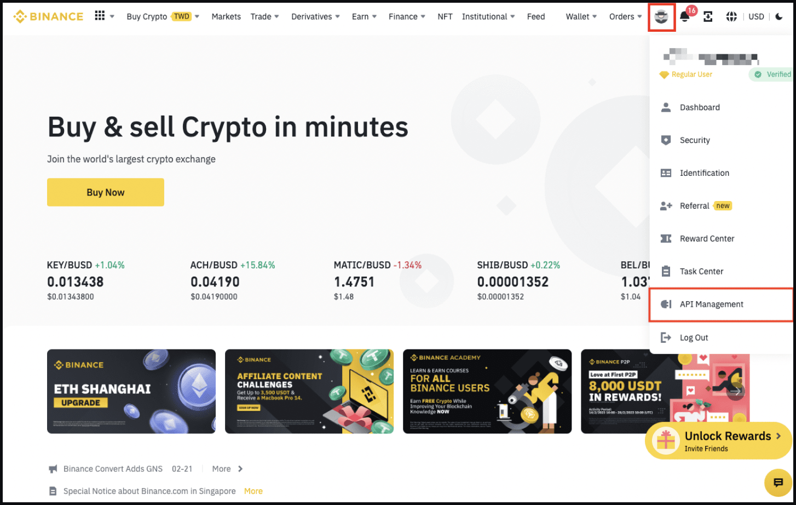
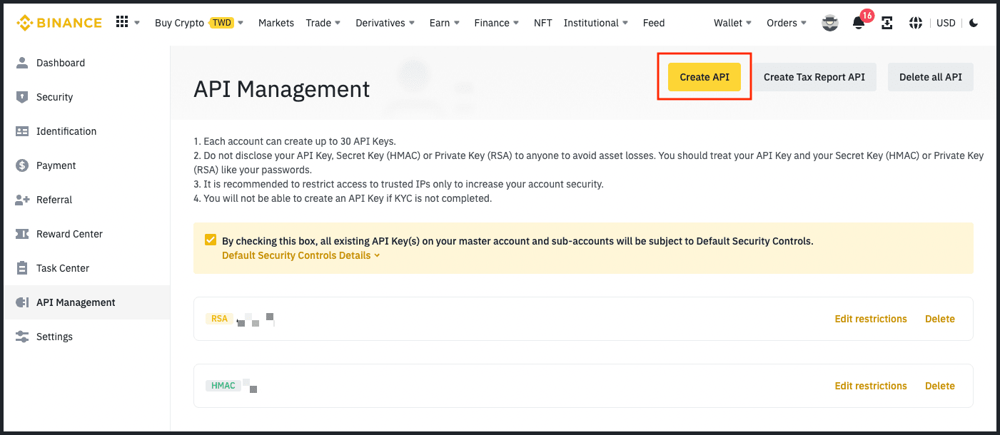
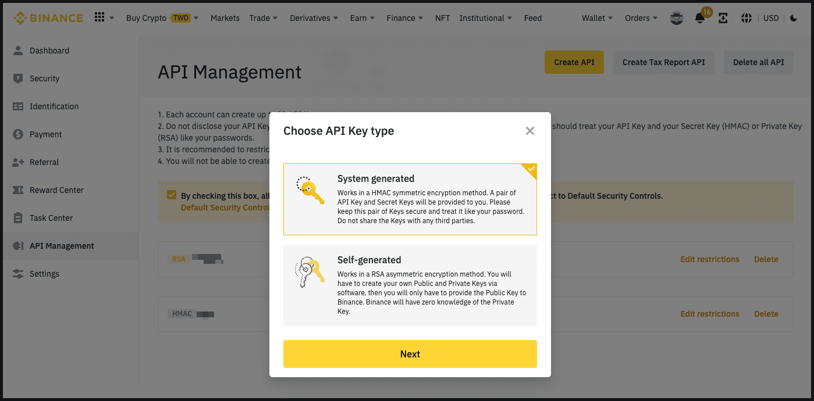
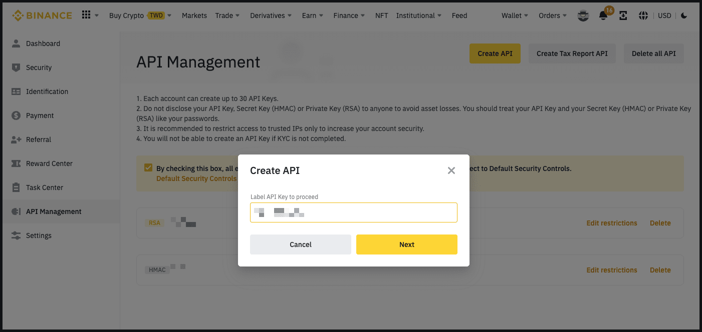
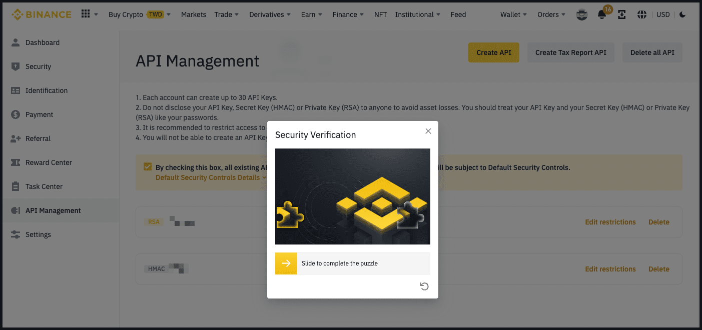
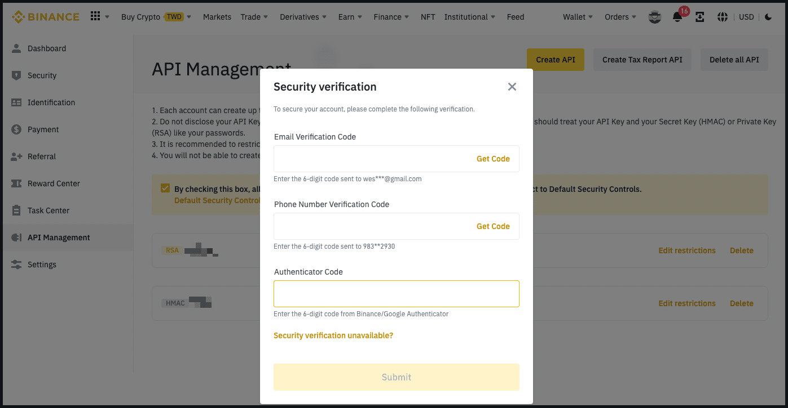

# Using Binance with Hummingbot


## Introduction

[Binance](https://binance.com) is the world’s largest crypto exchange by trading volume, with $76 billion daily trading volume on Binance exchange as of August 2022, and 90 million customers worldwide.

This section provides a step-by-step guide that helps you use Hummingbot with Binance, starting with generating exchange API keys and adding them to Hummingbot. All information is sourced from the exchange website and other content.

<!-- more -->

## Generate API Keys

Before you start, please make sure you complete your Binance account verification. Binance allows API key creation only for accounts that have completed their Basic and Intermediate Verification. If you haven't completed both of your account's Basic and Intermediate verification procedures, kindly go back to Binance and complete it. Once your account is verified, you will be able to complete the steps.


**Step 1**

Log in to your Binance account. Click on your **Profile** icon, and then on the right-hand sidebar, click [API Management](https://www.binance.com/en/my/settings/api-management)

   [](binance-api1.png)

**Step 2**

Click **Create API**. Please note that before creating an API Key, you need to:

   - Enable [two-factor authentication (2FA)](https://www.binance.com/en/support/faq/account-functions?c=1&navId=1#11) on your account.
   - Make a deposit of any amount to activate your account.

   
   [](binance-api2.png)

**Step 3**

- Select **System generated** as your preferred API Key type. 

   [](binance-api3.png)

**Step 4**

- Enter a label / name for your API Key.

   
   [](binance-api4.png)

**Step 5**

Verify your request with 2FA devices.

   - In the example below the account has a passkey setup. Follow the prompts on the screen to complete verification

   [](binance-api5.png)

   - If you don't have a passkey setup you can verify with your currently set 2FA devices. 

   [](binance-api7.png)

**Step 6**

Your API Key has now been created. **Save your API Key and Secret Key securely**. If you lose your Secret Key, you'll need to delete this API Key and create a new one.

Under **API restrictions**, ensure you select:

   - **Enable Spot & Margin Trading** if trading on Spot markets.

   - **Enable Futures** if trading Perpetuals.


Under **IP access restrictions**, you have two options:

   - **Unrestricted** - not recommended

   - **Restrict access to trusted IPs only** (Recommended) - enter the public IP address of the machine Hummingbot is running on

   [](binance-api6.png)

## Add Keys to Hummingbot

From inside the Hummingbot client, run `connect binance`:

```
>>> connect binance

Enter your binance API key >>>
Enter your binance secret key >>>
```

If connection is successful:

```
You are now connected to binance
```
