# Running a Trading Bot with Hummingbot on Derive


Welcome to the new Derive Hummingbot Connector Guide, your comprehensive resource for integrating and trading on Derive’s decentralized derivatives platform using Hummingbot. Powered by the innovative Derive Chain and built on the OP Stack for high throughput and low-cost settlements, Derive redefines onchain trading with seamless onboarding, robust self-custody, and advanced risk management for options, perpetuals, and structured products. 

In this guide, we'll walk you through connecting your Derive account to Hummingbot and setting up an automated trading bot to harness these cutting-edge features. Let's dive in!

<!-- more -->

## Add Funds and Get Derive API Keys

Before you can start trading on Derive using Hummingbot, you'll need to set up your wallet, connect it to the Derive platform, deposit funds, and configure your API access. This section walks you through these essential first steps to prepare your account for automated trading.

These steps match the [Derive exchange connector docs](../../../exchanges/derive/index.md#how-to-connect). Derive supports wallets such as **MetaMask**, Rabby, Coinbase Wallet, and Ledger. This guide uses **MetaMask** as the example.

### Install MetaMask

If you haven’t already, download and install the [MetaMask](https://metamask.io/) browser extension or mobile app. Create a new wallet or import an existing one.

### Connect Wallet to Derive

Open [https://www.derive.xyz](https://www.derive.xyz) (or [https://app.derive.xyz/](https://app.derive.xyz/)). Click **Connect** at the upper right side of the page.

   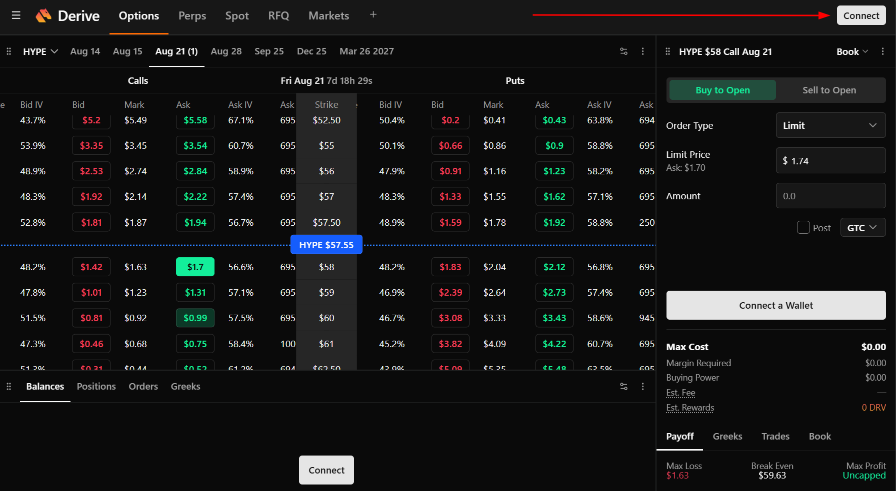

- In the wallet picker, select the wallet you want to use (for example, **MetaMask**)

   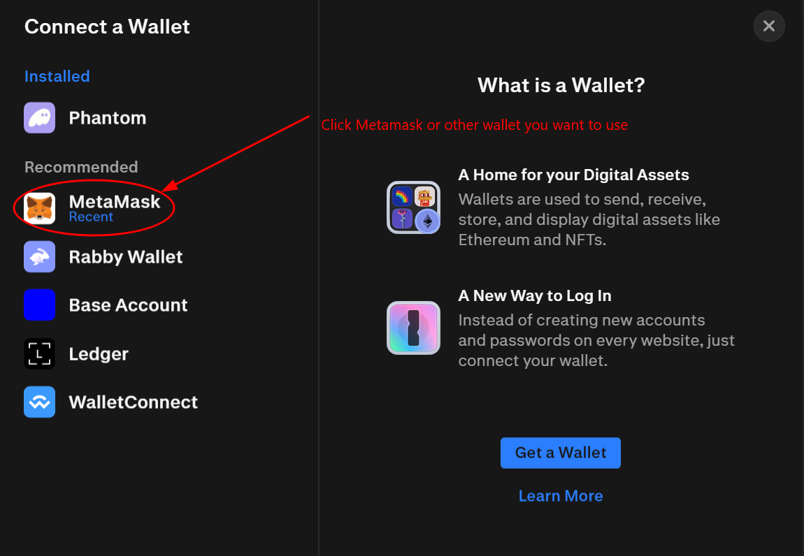

- Approve the connection in your wallet. Your wallet extension or app will open a pop-up asking you to connect this site — click **Connect** or **Approve**

   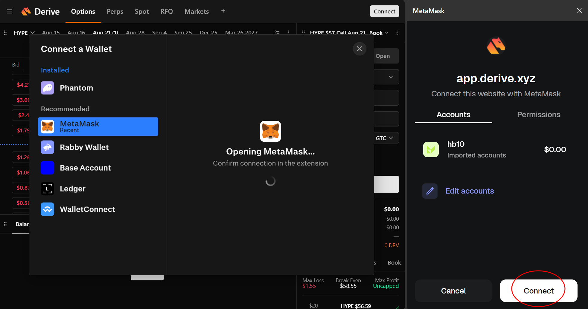

- Sign the message Derive sends to verify you own the wallet

   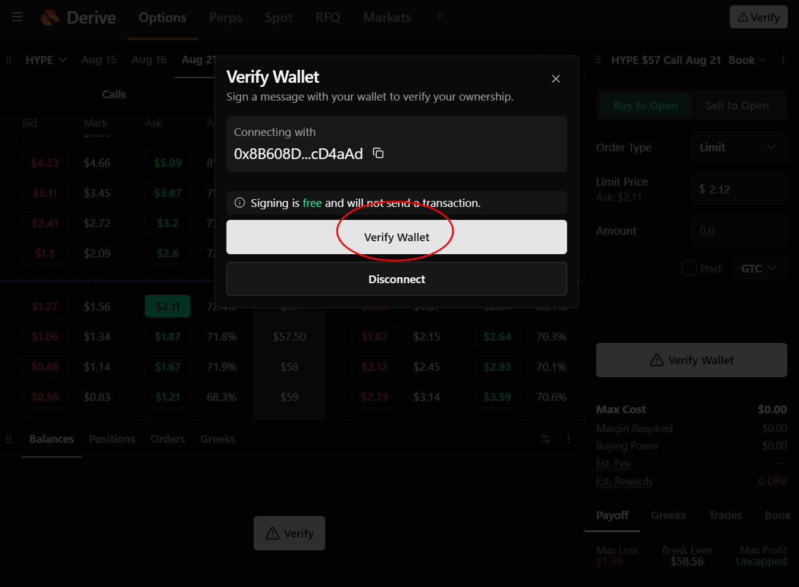
   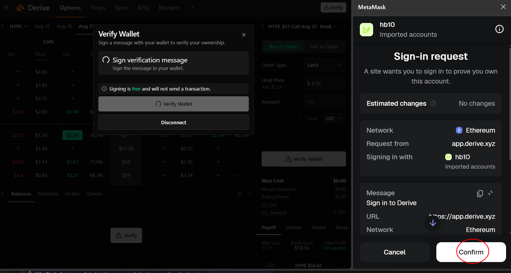

- If prompted, review the terms, check the agreement boxes, and click **Agree and Continue**

   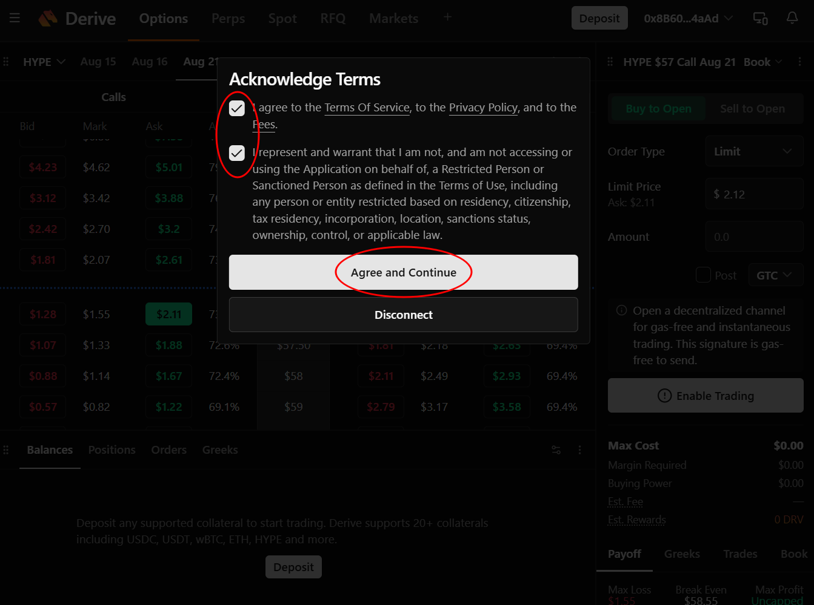

Your wallet address should now appear in the top-right corner.

### Deposit Funds

Once your wallet is connected, deposit tokens into your Derive account. Deposit USDC, ETH, BTC, and other tokens to start trading options and perps. Make sure you have enough balance to cover at least the minimum trading amount plus fees.

   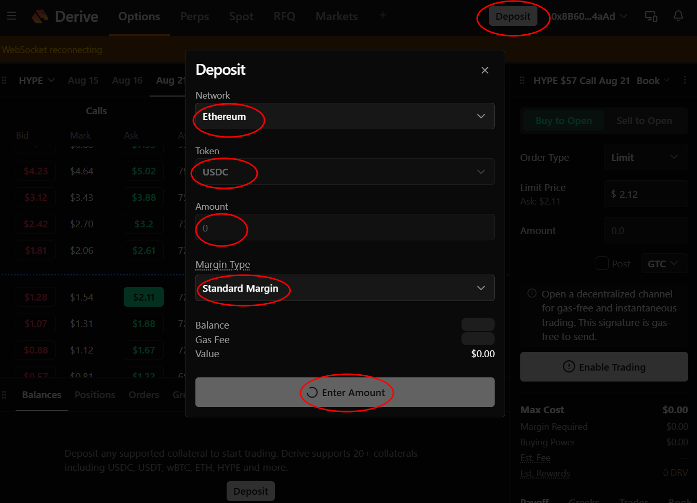

### Register Session Key

- At the top left, click the **Hamburger** icon to open the side bar, click **Developers**, then click **Register Session Key**

   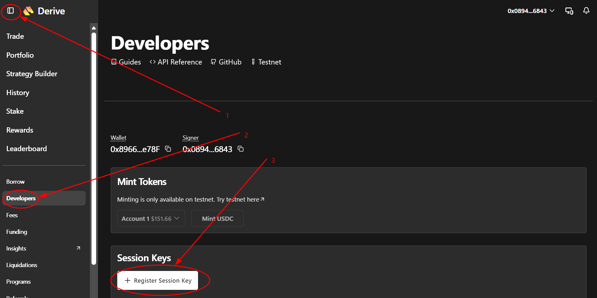

- Enter **Name**, click **Generate**, click the **Copy** icon of the private key, select **Admin** for Scope, then click **Register**

   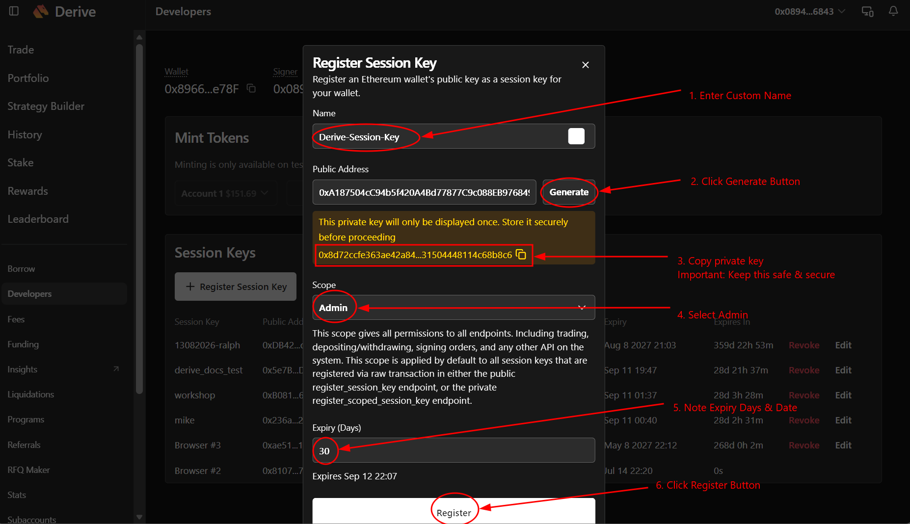

!!! note "Important"
    Keep the private key safe and secure. Create a new session key if it is lost or compromised.

- Approve the registration in your wallet. Your wallet (for example, MetaMask) will show a signature request — click **Confirm** or **Sign** to finish registering the session key

### Create New Subaccount

!!! tip "Recommended"
    Create a **new subaccount** so balances are fetched and displayed correctly for both spot and perpetual.

- In the side bar, click **Subaccounts**, then click **Create Subaccount**
- In the Create Subaccount form, enter a **Name**, select **Standard Margin**, then click **Enable Trading**

   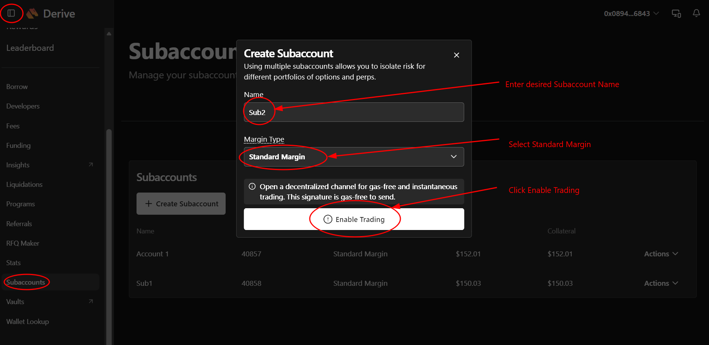

- Copy the **ID** of the newly created subaccount. You will paste this into Condor or the Hummingbot client.

You need four values from Derive: **Wallet address**, **Session Key** (private key), **Subaccount ID**, and **Account Type**.

**Where to copy each value on Derive**

- **Wallet address:** open the **Hamburger** menu → **Developers** → click the **Copy** icon next to **Wallet** (not **Signer**)

   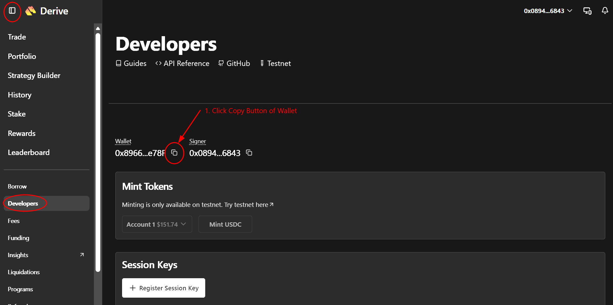

- **Session Key:** the private key you copied when registering the session key. It is shown only once.

   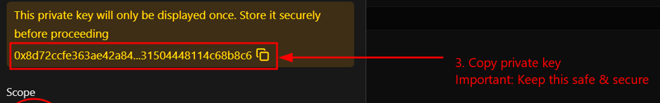

- **Subaccount ID:** open the **Hamburger** menu → **Subaccounts** → copy the **ID** of the account you want to trade with

   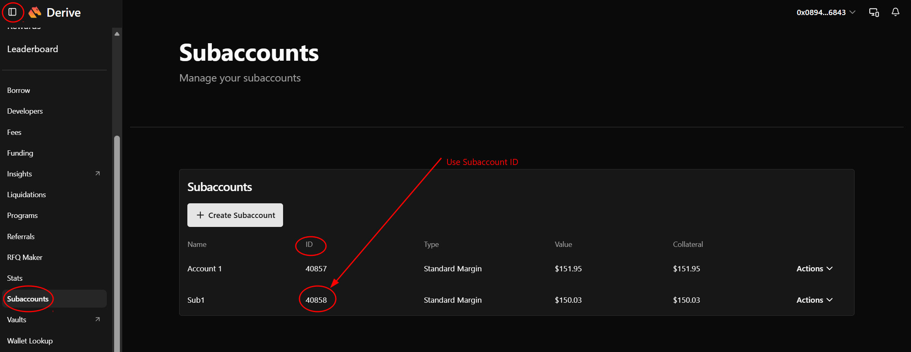

!!! note "Account Type"
    Use one of the following values:

    | Value | Meaning | Typical use |
    | --- | --- | --- |
    | **SM** | Standard Margin | Spot and perpetual trading |
    | **PM2** | Portfolio Margin | Multiple options and perps |

## Using Derive with Condor

You need four values from Derive: **Wallet address**, **Session Key** (private key), **Subaccount ID**, and **Account Type**.

- Install Condor using [Condor Quickstart](https://hummingbot.org/installation/condor/)

- In the Telegram Condor bot, open the credentials dashboard:
    - Tap the **menu** button (bottom left), then tap **`/keys`**, **or**
    - Type `/keys` in the message field and press **Enter**
    - Click **Open Dashboard**

   

- In the dashboard, open the **API Keys** tab and click **+ Add API Key**

   

- Click **Perpetual** (use **Spot** instead if you are connecting the `derive` spot connector)

   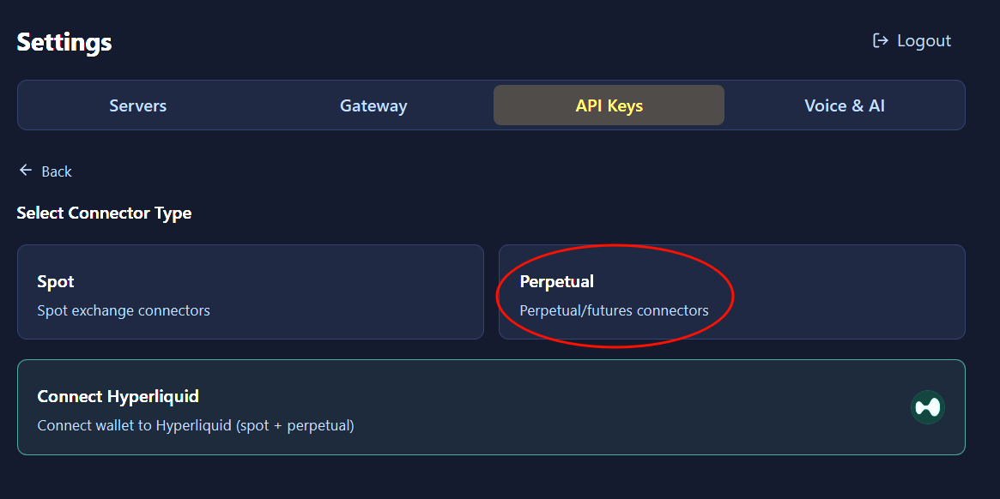

- Click **derive_perpetual**

   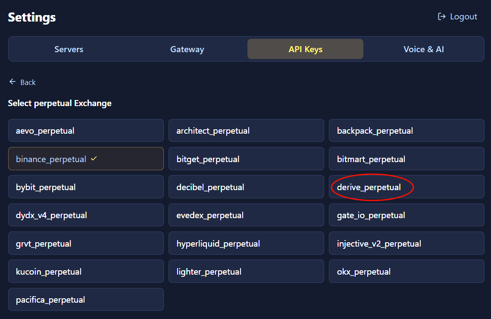

- Fill in the form. The dashboard field names do not match Derive's labels — use this mapping:

    | Dashboard field | Enter this |
    | --- | --- |
    | **derive_perpetual_api_key** | Derive **Wallet** address |
    | **derive_perpetual_api_secret** | **Session Key** private key (copied when you registered the key) |
    | **sub_id** | **Subaccount ID** |
    | **account_type** | **SM** or **PM2** |

    Click **Add Credential**

   

!!! note "Account Type"
    Use one of the following values:

    | Value | Meaning | Typical use |
    | --- | --- | --- |
    | **SM** | Standard Margin | Spot and perpetual trading |
    | **PM2** | Portfolio Margin | Multiple options and perps |

## Using Derive with Hummingbot Client

The following instructions guide you through adding your Derive credentials to the standalone Hummingbot command-line client.

### Docker Setup

 **Clone the Hummingbot Repository**

   ```bash
   git clone https://github.com/hummingbot/hummingbot
   ```

 **Edit `docker-compose.yml`**

   Navigate to the `hummingbot` project directory and open the `docker-compose.yml` file using an IDE like VSCode or a text editor.

 **Update the Image Line**

   Find the line that starts with `image:` under the `hummingbot` service. Modify it based on whether you want the latest stable or development version:

   For the latest stable version:

   ```bash
   image: hummingbot/hummingbot:latest
   ```

   For the development version:

   ```bash
   image: hummingbot/hummingbot:development
   ```

 **Launch the Docker Container**

   After updating the image line, clone the repository and launch the Hummingbot Docker container:

   ```bash
   cd hummingbot
   docker compose up -d
   ```

 **Attach to the Hummingbot Container**

   Hummingbot should now be running in the background. Use the following command to attach to the running instance:

   ```bash
   docker attach hummingbot
   ```

 **Proceed to Add API Keys**

   Once Hummingbot is running, follow the steps in the "Add Keys to Hummingbot" section below to connect your Derive account.

### Source Setup

 **Clone the Repository**

   ```bash
   git clone https://github.com/hummingbot/hummingbot.git
   ```

 **Run Install**

   After cloning the repo, install the Hummingbot dependencies by running the `install` command:

   ```bash
   cd hummingbot
   ./install
   ```

 **Activate the Conda Environment and Compile**

   Activate the conda environment and compile Hummingbot:

   ```bash
   conda activate hummingbot
   ./compile
   ```

 **Start Hummingbot**

   Run the following command to launch Hummingbot:

   ```bash
   ./start
   ```

### Add Keys to Hummingbot

To connect Hummingbot to Derive, you'll need the same four values:

- **Derive Wallet address** — copy **Wallet** on the Developers page, not **Signer**
- **Session Key** private key — the key shown once when you registered it, not your MetaMask / owner key
- **Subaccount ID** — prefer a funded subaccount
- **Account Type**: `SM` or `PM2`

From inside the Hummingbot client, run `connect derive_perpetual` for perpetual markets, or `connect derive` for spot:

   ```
   >>> connect derive_perpetual

   Enter Your DerivePerpetual Wallet address >>>
   Enter your session private key >>>
   Enter your Subaccount ID >>>
   Enter your Derive Account Type (SM/PM2) >>>
   ```

!!! note "Account Type"
    Use one of the following values:

    | Value | Meaning | Typical use |
    | --- | --- | --- |
    | **SM** | Standard Margin | Spot and perpetual trading |
    | **PM2** | Portfolio Margin | Multiple options and perps |

If the credentials are correct, you'll see:

   ```
   You are now connected to derive_perpetual
   ```

To verify the connection, run **balance** and check that it matches your Derive account:

   ```
   balance
   ```

   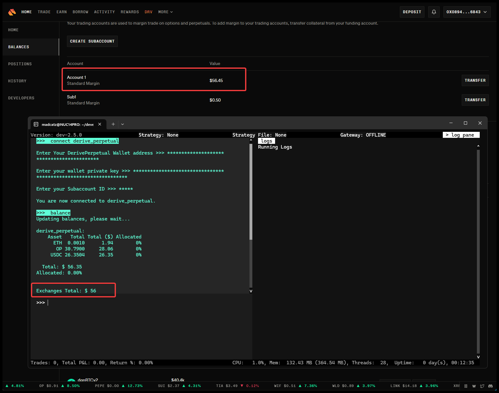

### Run a Strategy

For this example, we'll use the [**bollinger_v1**](https://github.com/hummingbot/hummingbot/blob/development/controllers/directional_trading/bollinger_v1.py) directional trading controller.

 **Create a controller config**

   Run the `create` command from within the Hummingbot client to configure the controller:

   ```bash
   create --controller-config directional_trading.bollinger_v1
   ```

 **Create the configuration:**

   You will be prompted to provide various configuration parameters. Feel free to adjust the settings based on your preferences: 

   - Select **derive_perpetual** as the name of the exchange you want to trade on.

   ```
   Enter the total amount in quote asset to use for trading >>>
   Enter the name of the exchange to trade on >>> derive_perpetual
   Enter the trading pair to trade on >>>
   Enter the maximum number of executors per side >>>
   Set the leverage to use for trading >>>
   Enter the stop loss >>>
   Enter the take profit >>>
   Enter the time limit in seconds >>>
   Enter the order type for taking profit >>>
   Enter the trailing stop as activation_price, trailing delta >>> 
   ```
   
   - When prompted for the connector with the candles data, make sure to select a different connector other than **derive** since it doesn't currently support candles feed.

   ```
   Enter the connector for the candles data, leave empty to use the same exchange as the connector:
   Enter the trading pair for the candles data, leave empty to use the same trading pair as the connector:
   
   ```
   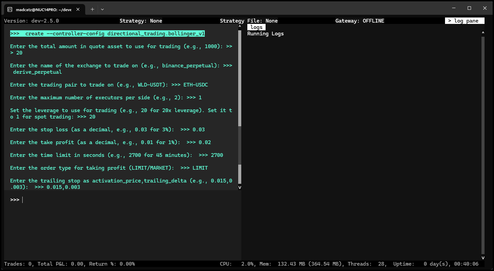


  - Once the configuration is done, give the controller config a name or use the default one:

   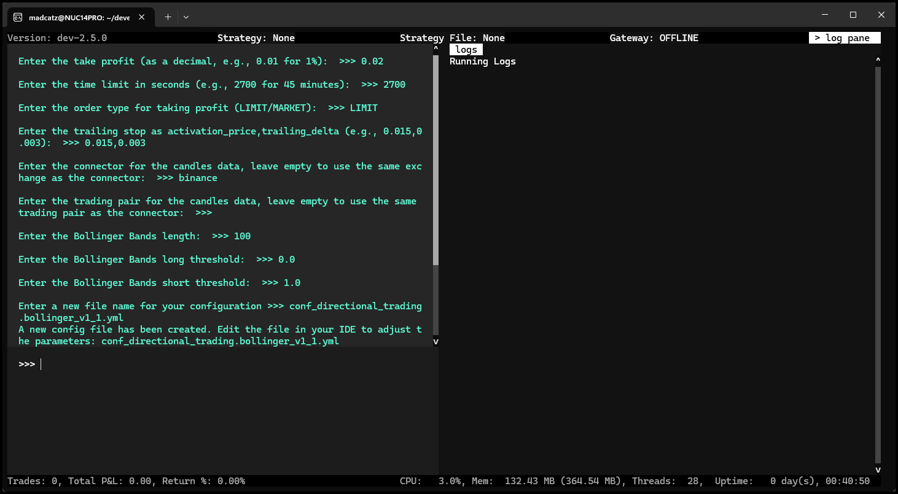

 **Create a script config**

   - Next we have to create the script config for the **v2_with_controllers** generic script to run our controller config.

   - To create the script config, use the following command:

   ```bash
   create --script-config v2_with_controllers
   ```

   - Make sure to enter the file name of the controller config we created earlier 

   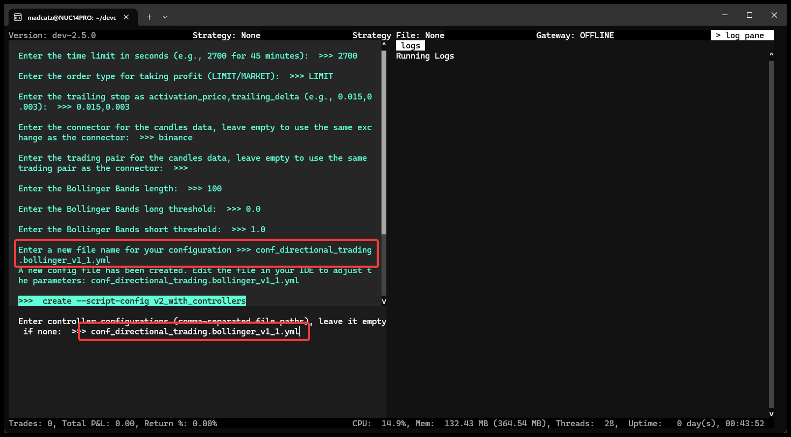


   - Lastly, give the script config a name

   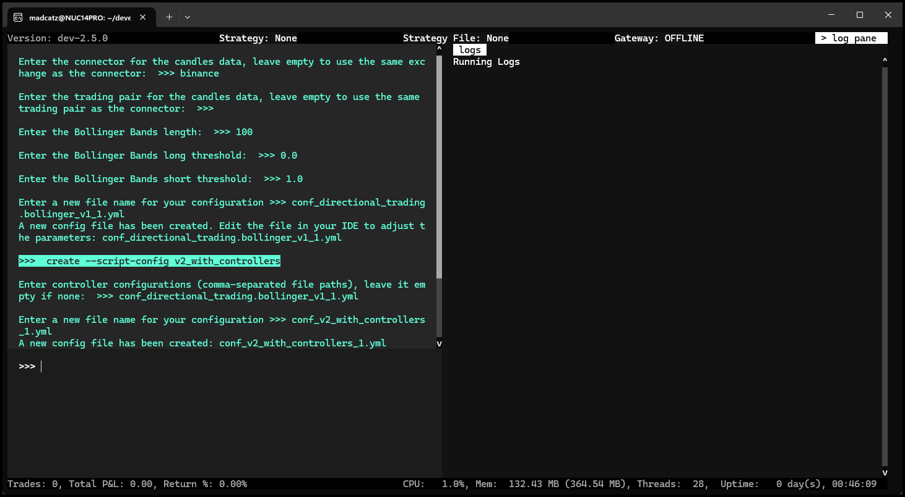


 **Start the strategy**
 
 To start the strategy, use the following command. Note - if your config file has a different file name then replace the config name below

   ```bash
   start --script v2_with_controllers.py --conf conf_v2_with_controllers_1.yml
   ```

   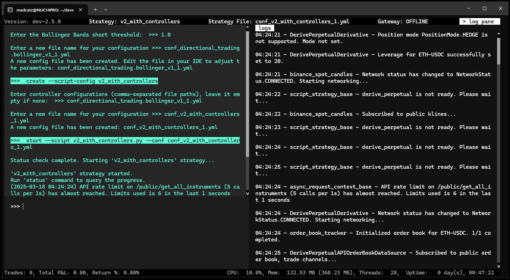 
 
**Monitor the Strategy**  

You can monitor your bot by checking the logs for any errors and running the **status** command to view the current order status. If needed, you can close the log pane to get a clearer view of the status.  

This strategy is designed to **place a buy order when the price approaches the lower Bollinger Band** (indicating an oversold condition) and **a sell order when the price reaches the upper Bollinger Band** (indicating an overbought condition). Since the bot waits for favorable conditions before executing trades, you may need to allow some time before it places its first order.

   ```bash
   status
   ```

   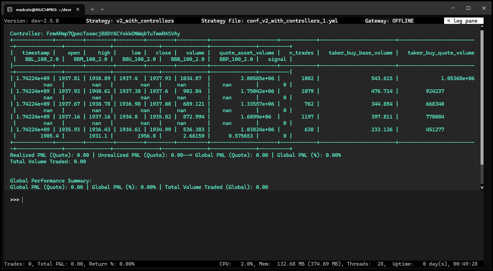

 **Stop the Bot**

   To stop the bot, use the **stop** command. Please note that the bot will need some time to create orders to close out the positions. 

   ```bash
   stop
   ```

   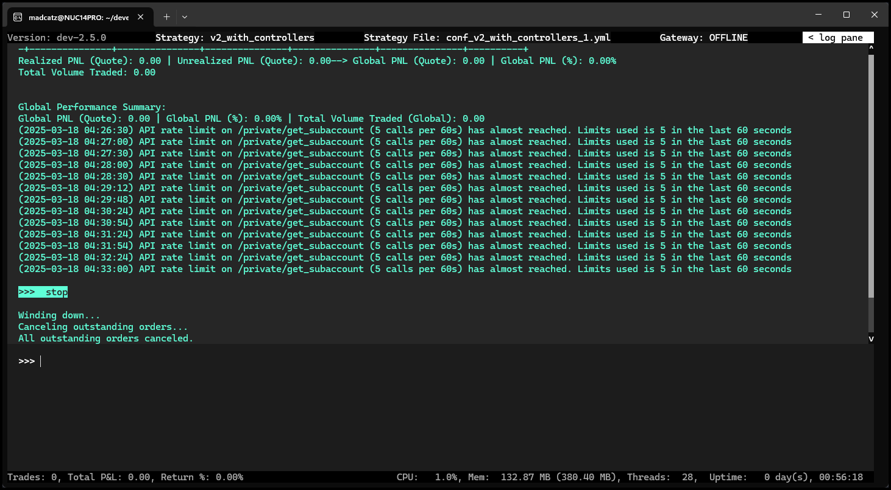

For more details on V2 Strategies or other available controllers, check out the Controllers section of [V2 Strategies](../../../strategies/v2-strategies/controllers/index.md) documentation. Please note that since Derive only supports **one-way mode** some V2 Strategies that use Hedge mode may not work correctly with the controller.    


## Known Issues

- [Derive Rate Limit](https://docs.derive.xyz/reference/rate-limits) - The system enforces rate limits using a fixed window algorithm, replenishing the request allowance every 5 seconds to maintain system stability. Market makers can access higher rate limits upon request by contacting the support team. 

## Additional Information: Leverage

When using perpetual futures exchanges, **leverage** refers to the size of your position relative to the collateral you have provided. Specifically, it's calculated as:

\[
\text{Leverage} = \frac{\text{abs(Notional Value)}}{\text{Collateral (net of options)}}
\]

For detailed information on how leverage is computed on Derive, see their [official documentation on Leverage](https://docs.derive.xyz/reference/private-get_positions#:~:text=leverage).