# Using Dexalot with Hummingbot

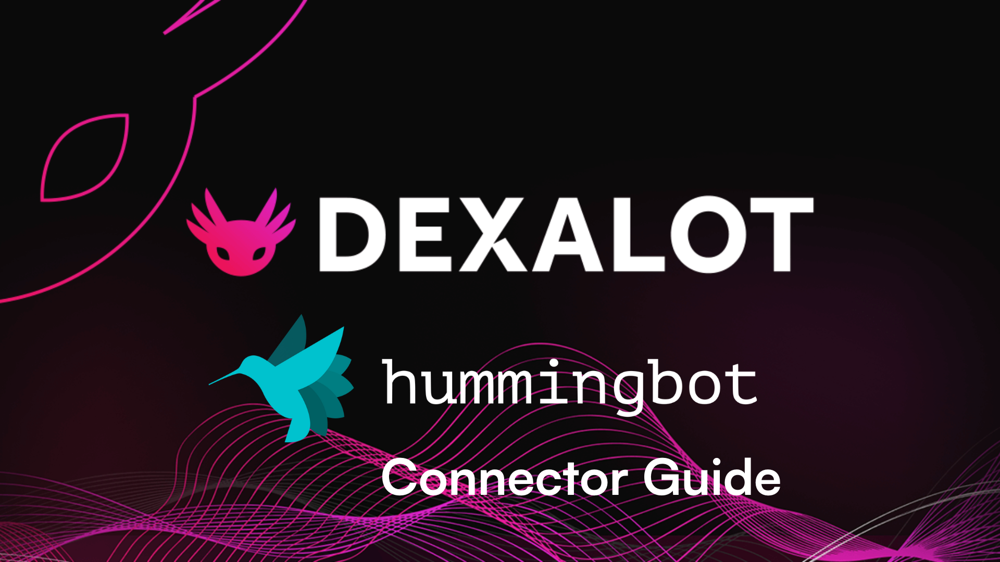 

## Introduction

Welcome to our user guide which will embark you on a decentralized trading journey that combines Dexalot's cutting-edge technology built on Avalanche blockchain and Hummingbot's advanced trading capabilities.

<!-- more -->

**Dexalot** offers a familiar centralized exchange experience within a secure, transparent, and efficient on-chain environment. Linking **Dexalot** with **Hummingbot** unlocks automated trading possibilities. Whether a seasoned trader or a newcomer, this tutorial equips you to navigate the exciting intersection of decentralized finance and automated trading seamlessly.


For a comprehensive understanding and step-by-step visual instructions, we recommend starting with our video guide below. It covers everything you need to know to get Hummingbot up and running on Dexalot, from setup to execution.

<iframe style="width:100%; min-height:400px;" src="https://www.youtube.com/embed/PC3BPRwjgRI?si=3k6djtq0pkwng1vt" frameborder="0" allow="accelerometer; autoplay; encrypted-media; gyroscope; picture-in-picture" allowfullscreen></iframe>


After watching the video, you can follow along with our detailed written guide below. It complements the video and provides the commands needed to run which you can copy - paste into the terminal. 

## Setting Up a Wallet on Dexalot

Visit the Dexalot App: <https://app.dexalot.com/trade/>
At upper right, click **Connect Wallet**. Then, click on the **Checkboxes** and **Accept** button.
 
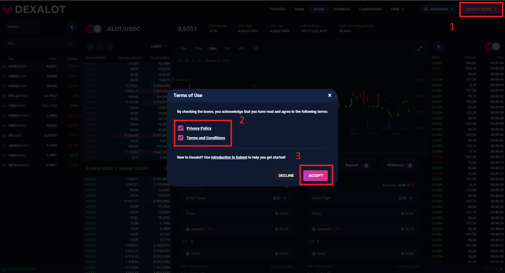

Select your preferred wallet. In this guide, we will use Metamask.

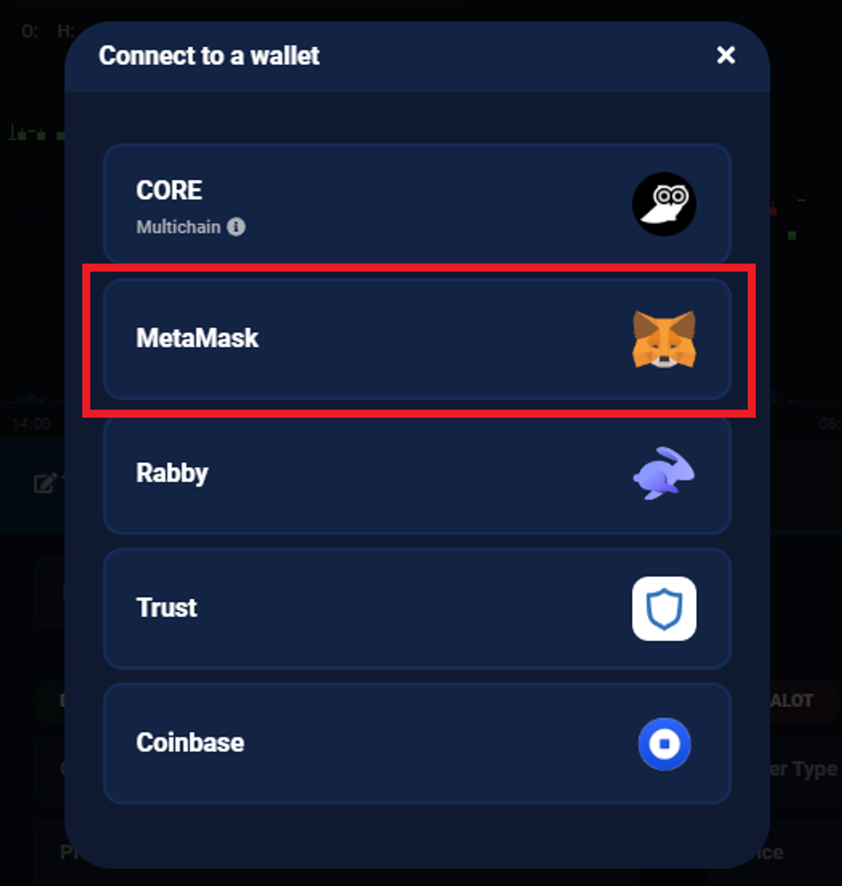

Let’s proceed to deposit funds into Dexalot Subnet Portfolio.

   1. Click on `Balances` tab

   2. On your Metamask wallet, ensure to have available funds in Avalanche network, ideally, $2-$5 AVAX for gas fee during deposit transaction. 

   3. Click on `3 vertical dots` at right side of token you wish to deposit, then select `Deposit into Dexalot`


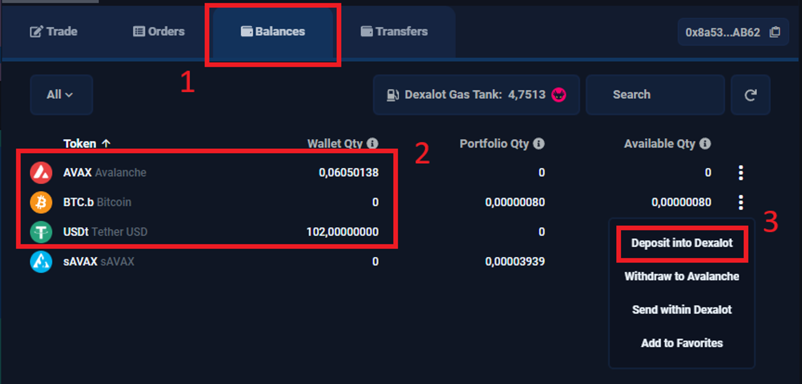    

Approve the deposit with your Metamask wallet. Normal gas fees are less than 1 USDT & deposit will normally take less than 1 minute. But will be relatively higher & longer during busy period. 

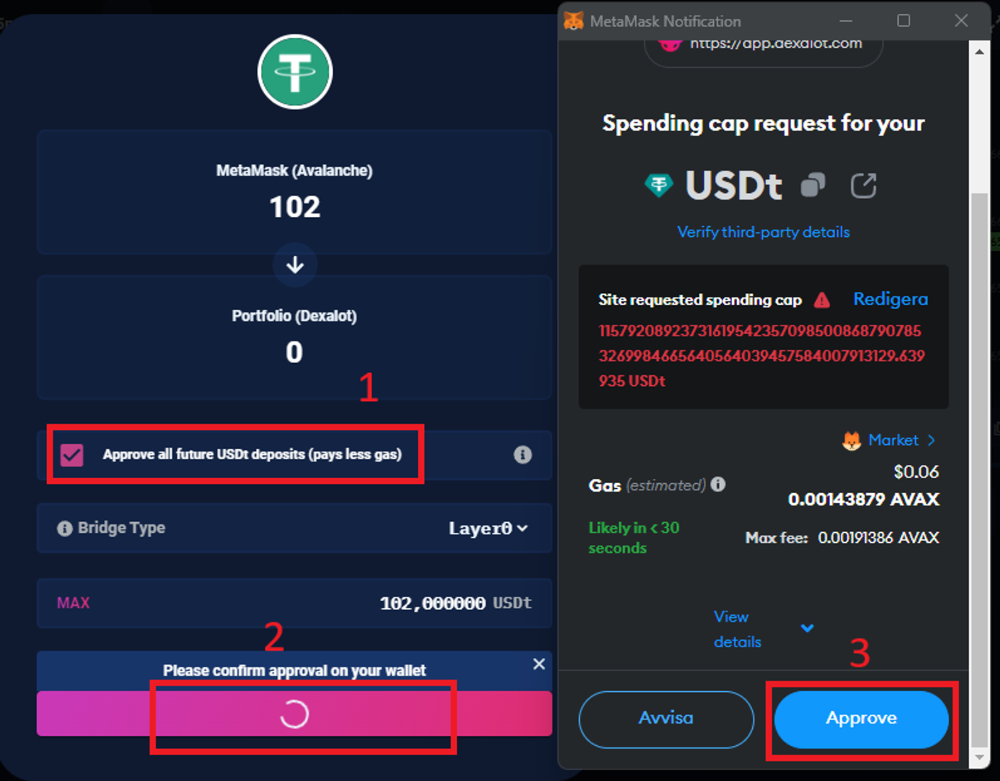    


## Installing Hummingbot and Gateway

### Using Windows 11 Machine 

Search for **Powershell**, right-click and click **Run as administrator**


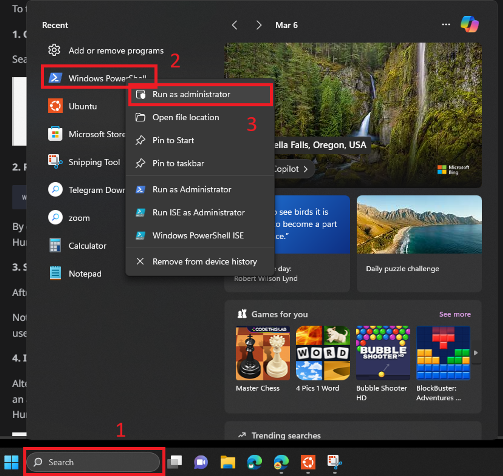    

In Powershell terminal, type the below command:

```
wsl --install

``` 

Remember to restart PC or laptop after installing.

In Microsoft Store, search “Ubuntu”, and click `Get` button to download and install the app.

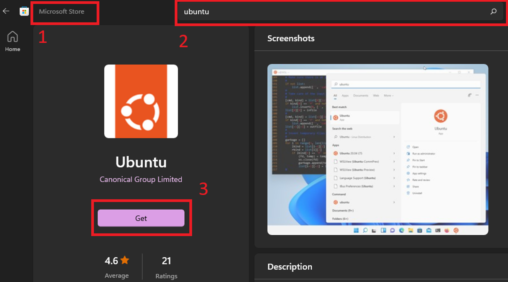    


Launch Ubuntu app. Provide preferred username and password.

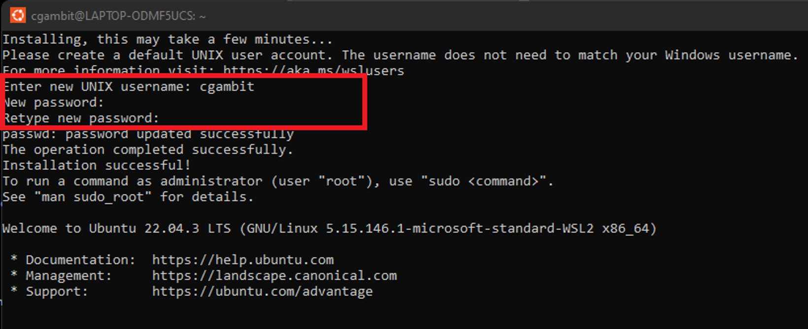 

Continue to type these commands one by one in Ubuntu terminal:

```shell
curl -fsSL https://get.docker.com -o get-docker.sh
```
```
sudo sh get-docker.sh
```
```
sudo usermod -aG docker $USER
```
```
sudo apt-get update
```
```
sudo apt-get install docker-compose-plugin
```
```
docker compose version
```
```
git clone https://github.com/hummingbot/hummingbot.git
```
```
cd hummingbot
```
```
docker compose up -d

```


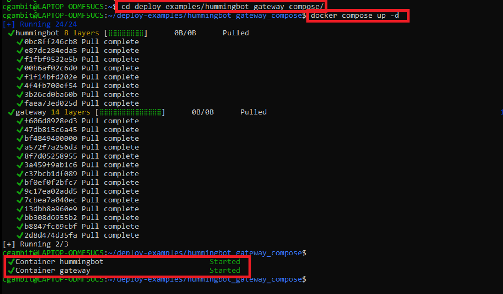    

```
sudo chmod -R a+rw ./hummingbot_files ./gateway_files
```

```
docker cp hummingbot:/home/hummingbot/scripts-copy/. ./hummingbot_files/scripts/
```

```
docker attach hummingbot`
    
```

Once you get to the Hummingbot screen, type your preferred `password` for Hummingbot client

### **Connecting to Dexalot via Gateway**

In Hummingbot client, type in the following command
   
   ```
   gateway generate-certs
   ```
   
   Type your preferred `password` for Gateway

   
   Type `exit` and press <kbd>Enter</kbd> key    

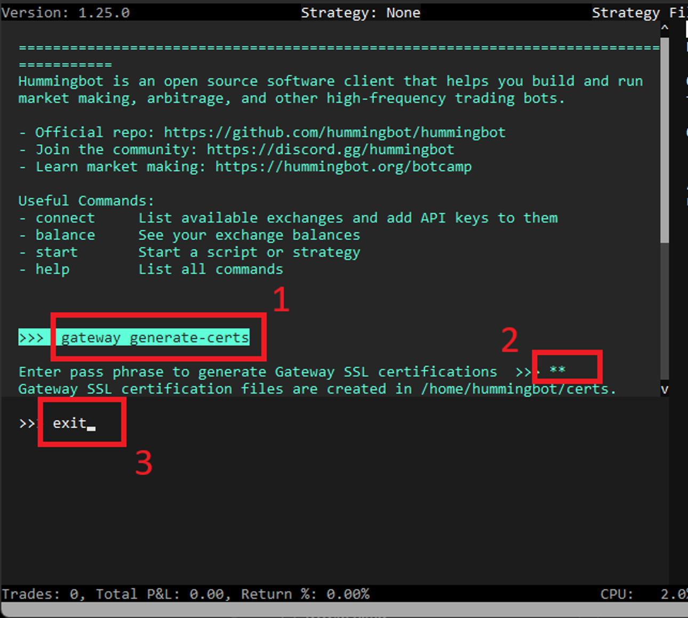     


In Ubuntu terminal, type the following command:

```
docker compose down
```


Open the `docker-compose.yaml` file using your favorite code editor. We are using Visual Studio Code.


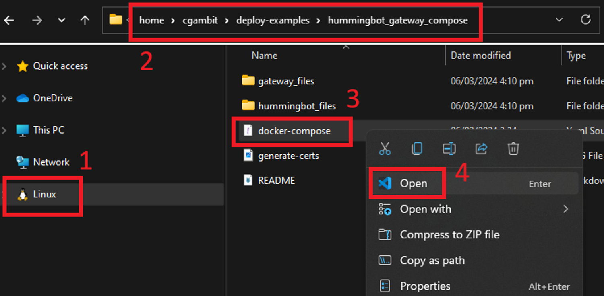 


Uncomment the lines with environment and CONFIG_PASSWORD and type the passwords you have set above. Remember to save the file.

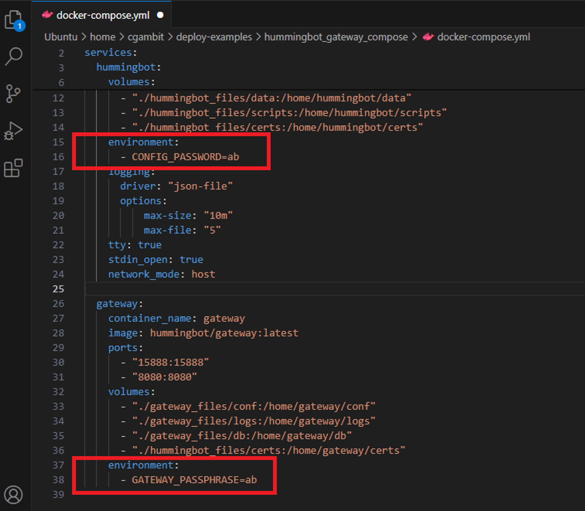 


In the Ubuntu terminal, type these commands:
   ```
   docker compose up -d
   ```
   ```
   docker attach hummingbot
   ```

In Hummingbot client, check that `Gateway: ONLINE`. If so, you have successfully setup Gateway.


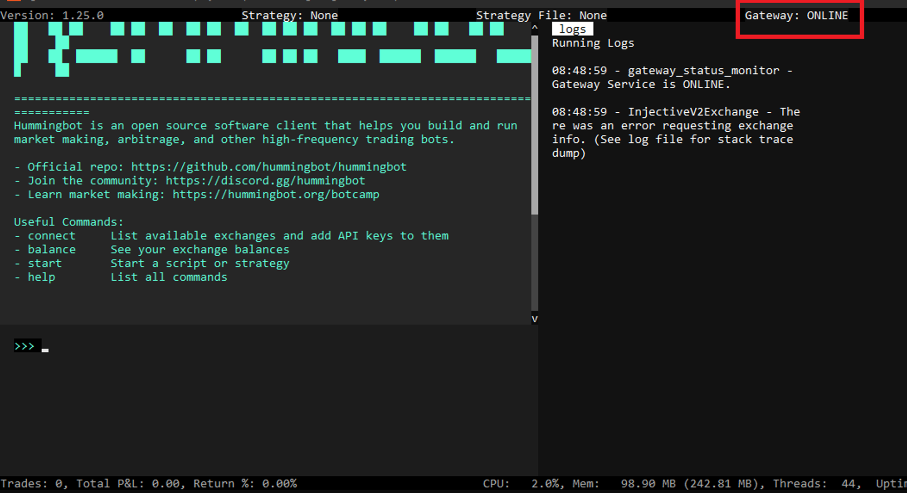 


Continue to connect Metamask wallet to Dexalot, type:
```
gateway connect dexalot
```

Enter in the following details:

  - avalanche

  -  dexalot

  -  `Yes`

  -  Enter **Private key** of Metamask wallet

  -  Press <kbd>Enter</kbd> key>


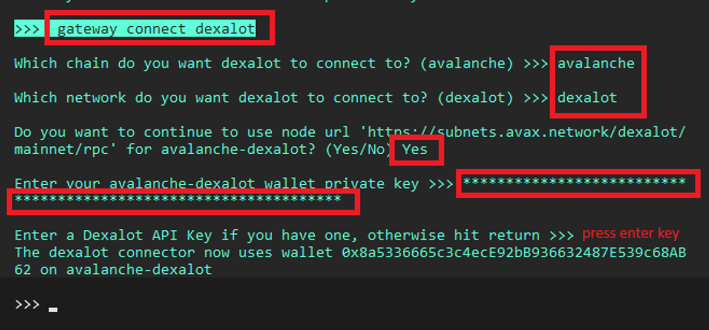         


### **Setting Up a Simple Market Making Bot**

In Hummingbot client, enter the create command to start configuration:
   ```
   create
   ```
Enter the following:   

  - pure_market_making

  - dexalot_avalanche_dexalot

  - ALOT-USDC

  - .1

  - .1

  - 1800

  - 100

  - No

  - dexalot_alotusdc.yml
   

!!! Note
      Feel free to change and customize the parameters above, according to your capital and risks tolerance.


Before proceeding to start the bot, ensure to have switch the network from **Avalanche** to **Dexalot** in the Dexalot App. You can switch the network at the upper right of screen.


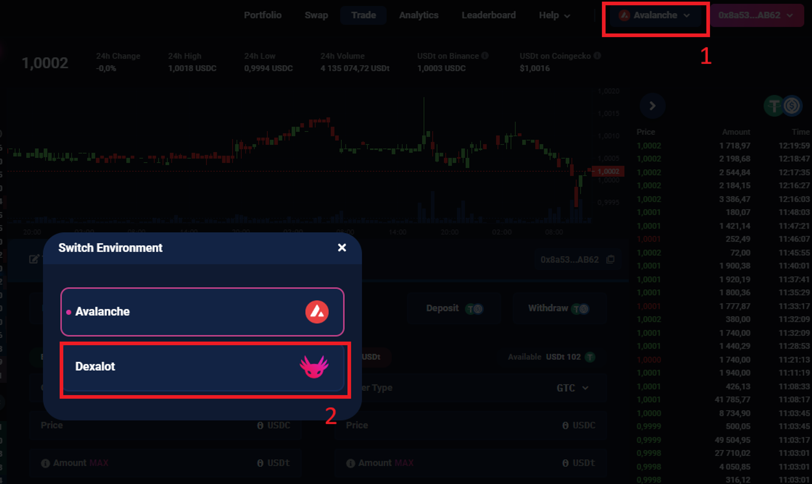 


In addition, ensure also that you have appropriate balances of tokens that you wish to trade with. In this guide, we will be trading ALOT-USDC pair. So, we have manually traded to get ALOT and USDC.


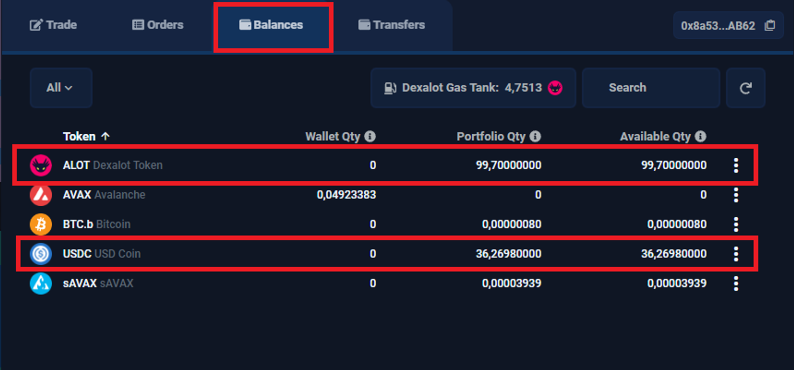

Finally, we need to add ALOT in the gas tank. ALOT will be used for gas fees for every activity that the bot will perform. Click on 3 vertical dots at right side of ALOT, and select Add Gas. For amount, we usually set 5-10 ALOT which will last for few weeks or a month.

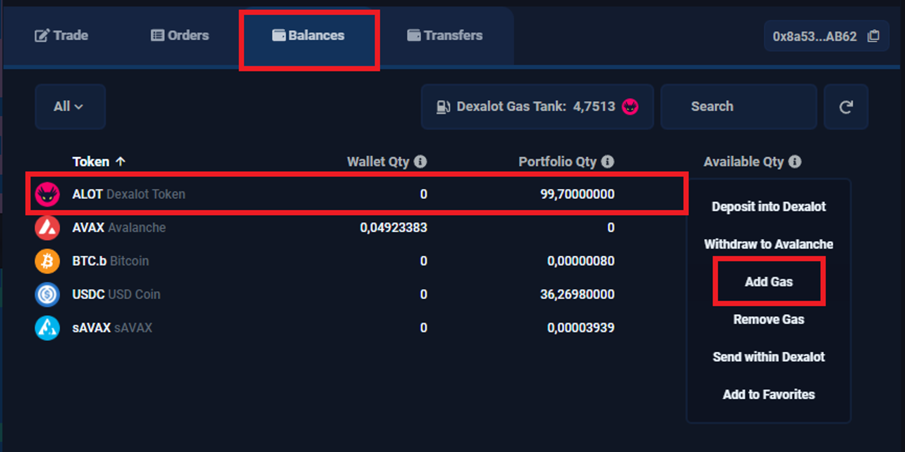

We are now ready to start the bot, in Hummingbot client, type:

```
start
```    
Enter **Yes** when prompted then enter the status command below

```
status
```


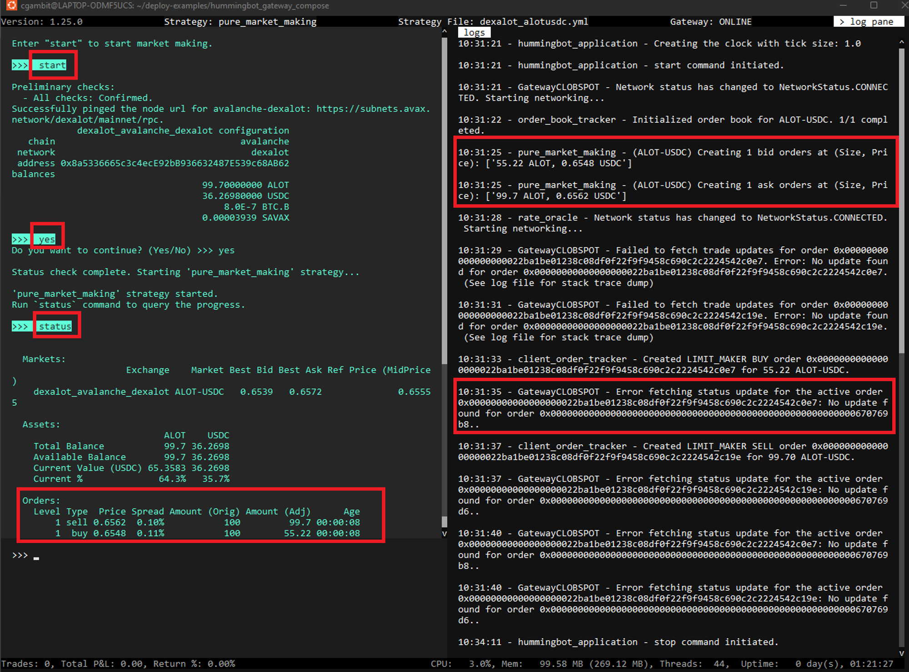    

You can check the bot’s open orders at Dexalot App, inside the Orders tab, as well as at the Order Book column with yellow dot indicators.

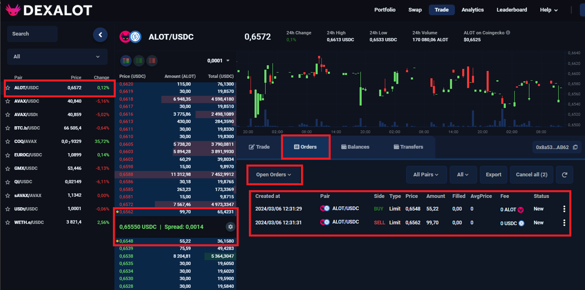    

### **Utilizing DIP and Multiverse Programs**

The Dexalot Incentive Program (DIP) 
   
   1. Giving away up to 4.8 Million $ALOT

   2. A 2-year program which started on Q1 2023, & ending on Q1 2025

   3. Total Monthly rewards of 200,000 ALOT Tokens 

   4. Rewards are updated daily at Leaderboard, and distributed the next month after you started trading the eligible pairs. Specifically, rewards are released on 7th, 
   14th, 21st, & 28th day, depending on your total reward amount.
   
   5. Refer to this blog post for details on how [DIP rewards are calculated](https://medium.com/dexalot/the-dexalot-incentive-program-1d55c869a6c0).

The Multiverse Program
   
   1. Up to $3 Million in AVAX tokens by Avalanche Foundation
   
   2. A 1-year program which started on Sep 2023, & ending on Sep 2024
   
   3. Total monthly rewards are unknown as teams have internal metrics that determines quantity to be unlocked based on user growth, adoption, & trading volume at exalot 
   platform.
   
   4. Rewards are calculated only at end of the month.
   
   5. Refer to this blog post for details on the [Multiverse Program](https://medium.com/dexalot/dexalot-multiverse-c4887aedf301)

Experience Sharing
   
   1. Note that if you are using a Virtual Private Network (VPN) while accessing the Dexalot App, you may encounter functionality issues. To ensure seamless operation, we recommend disabling your VPN or reconfiguring its settings to allow proper access to the Dexalot App. 
   
   2. Pay close attention to your ALOT balance, as ALOT is the token used for paying gas fees on the Dexalot subnet. Although the gas fees are relatively low, the frequent refreshing of orders, especially when you have multiple order levels, can quickly deplete your ALOT balance and incur substantial costs. To keep your expenses under control, we recommend setting the order refresh interval to 30-60 minutes or longer, and limiting your orders to a single or few levels. 
   
   3. Aside from saving on gas fees by setting a longer order refresh interval, keeping your limit orders in the order book for an extended period before they are filled or executed can also earn you additional rewards. This incentivizes traders to place orders with patience and let them stay in the order book, rather than frequently canceling and replacing orders, which can incur higher gas fees.
   
   4. Ensure that the limit orders are inside the blue bands (i.e within 2 standard deviations of mid-price) in order to be eligible for rewards


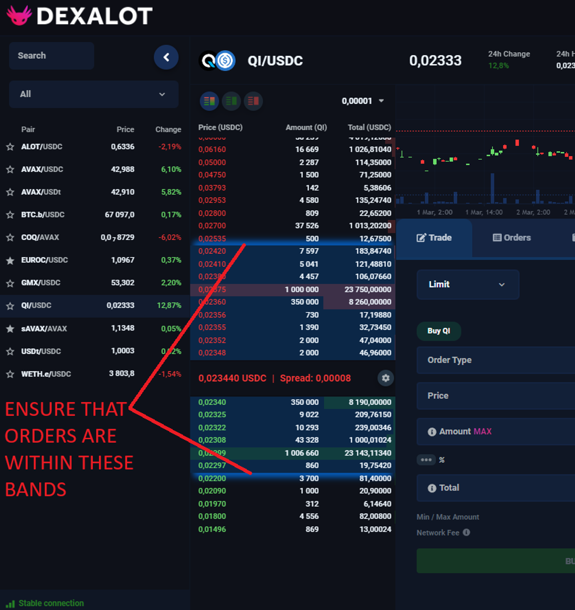    


The rewards you earn are primarily determined by your filled orders and overall trading volume. However, the amount of rewards can fluctuate daily, depending on the volatility of the specific market pair you are trading. 

Generally, weekends tend to have lower trading activity, as many automated trading bots seem to be less active during those periods. Consequently, the rewards you can potentially earn may be lower on weekends due to the reduced trading volume.

After observing the platform's performance over the past 9 months, it appears that under typical market conditions, without any extreme market crashes or volatility, traders can expect to generate a net monthly profit ranging from 5% to 20% of their deployed capital on Dexalot. 

These figures represent the potential earnings during periods of relatively stable and normal market movements. Note though that profits are NOT guaranteed.

Let's take a look at the rewards earned in February 2024 as an example. With a capital deployment of 6,300 USDT, the total rewards accumulated for the month were approximately $1,345. This amount translates to around 21% of the initial capital deployed. 

Due to the recent upward trend in the market over the past few weeks, trading activities have also been profitable, contributing to the overall positive returns.


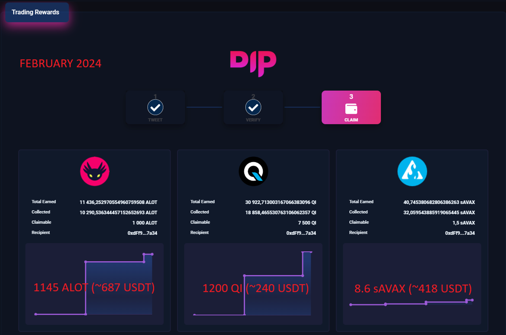    

!!! Warning
      Some issues have been identified with Hummingbot (ex: “[failed to fetch updates](https://github.com/hummingbot/gateway/issues/209)”). We further encourage users to report other issues at Github. We are optimistic that community developers will seize the open bounty opportunity to address these issues, enabling more users to run bots on Dexalot and capitalize on the rewarding opportunities available.

Thanks for taking the time to read this detailed guide. We encourage you to join us on Dexalot and start earning rewards over the next few months. If you have any questions or encounter any issues, feel free to reach out on Hummingbot Discord.
