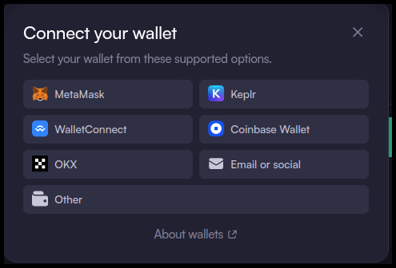
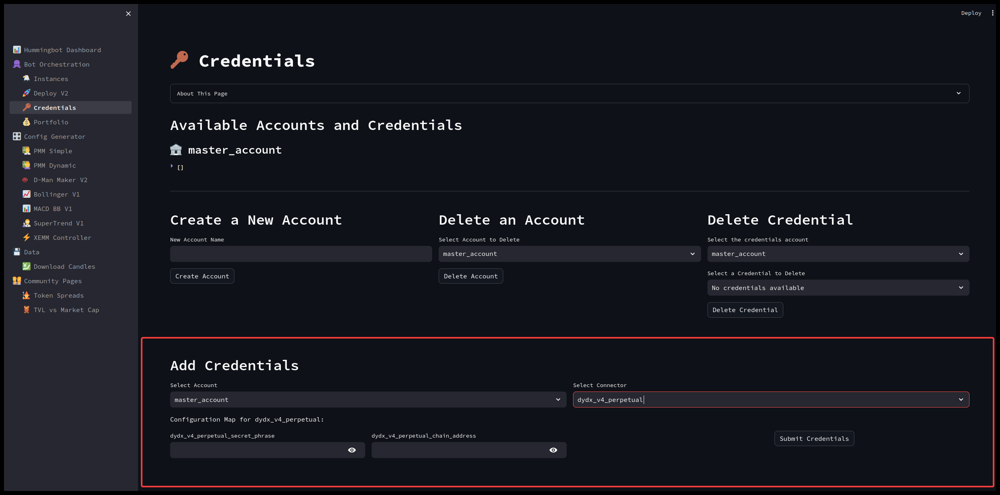

# Running a Trading Bot with Hummingbot Dashboard on dYdX V4


Welcome to the new dYdX v4 Hummingbot Connector Guide, your comprehensive resource for integrating and trading on dYdX's perpetual contracts using Hummingbot. Using the latest version of dYdX Chain based on the Cosmos SDK and Tendermint Proof-of-stake consensus protocol, dYdX v4 improves the trading experience with more seamless onboarding, enhanced security, and improved speed and performance!

In this guide, we'll walk you through the process of integrating your dYdX account into Hummingbot and running a directional algorithmic trading bot. Let's dive in!

<!-- more -->

## Connecting Your MetaMask Wallet to dYdX

*Note: dYdX supports multiple wallets, but for this guide, we'll use **MetaMask**, one of the most popular Ethereum wallets. MetaMask allows users to interact with dYdX via its browser extension or mobile app.*

### Install MetaMask

Ensure MetaMask is Installed and Set Up

If you haven’t already, download and install the [MetaMask](https://metamask.io/) browser extension or mobile app. Create a new wallet or import an existing one.

### Connect Your Wallet to dYdX

Open your web browser and go to [https://dydx.exchange/](https://dydx.exchange/). On the dYdX homepage, click the **"Connect Wallet"** button, typically located in the top-right corner of the page.

   [](1.png)

From the list of available options, select **"MetaMask"**.

   [](2.png)

MetaMask will open a pop-up asking you to confirm the connection.

   [](3.png)  
   [](4.png)

After the wallet is connected, dYdX will prompt you to sign a message to generate the dYdX Chain Wallet.

   [](5.png)  
   [](6.png)

### Deposit Funds

Once your wallet is connected, you will need to deposit USDC into your dYdX account. USDC is the required trading currency on dYdX.

   [](8.png)

### Get dYdX Chain Address

After connecting, locate your **dYdX Chain Address** in the wallet connection settings. Copy this address and store it securely for future reference.

   [](9.png)

### Get dYdX Secret Phrase

To export your secret passphrase, go to the wallet connection settings dropdown and click **"Export Secret Phrase"**.

   [](10.png)

A window will appear. Check the box to confirm that you understand the risks. There may be a short delay before the export button becomes available.

   [](11.png)

Once available, copy the secret phrase and store it safely in a secure location. You will need this phrase later to connect to Hummingbot.


## Using dYdX with Hummingbot Client

!!! note "Special dYdX Build"
    Currently, there are dependency conflicts between the dYdX v4 connector and the other Hummingbot exchange connectors. For this reason, we maintain a dedicated build of Hummingbot that is optimized for use with dYdX v4. Below are simplified instructions to get you set up quickly, whether you're using Docker or Source.

Below, we show you how to add your dYdX credentials to the command-line Hummingbot client. If you prefer to use dYdX v4 with the new Hummingbot Dashboard, go to [Using dYdX with Dashboard](#using-dydx-with-dashboard).

### Docker Setup

 **Clone the Hummingbot Repository**

   ```bash
   git clone https://github.com/hummingbot/hummingbot
   ```

 **Edit `docker-compose.yml`**

   Navigate to the `hummingbot` project directory and open the `docker-compose.yml` file using an IDE like VSCode or a text editor.

 **Update the Image Line**

   Find the line that starts with `image:` under the `hummingbot` service. Modify it based on whether you want the latest stable or development version:

   For the latest stable version:

   ```bash
   image: hummingbot/hummingbot:latest_dydx
   ```

   For the development version:

   ```bash
   image: hummingbot/hummingbot:development_dydx
   ```

 **Launch the Docker Container**

   After updating the image line, clone the repository and launch the Hummingbot Docker container:

   ```bash
   cd hummingbot
   docker compose up -d
   ```

 **Attach to the Hummingbot Container**

   Hummingbot should now be running in the background. Use the following command to attach to the running instance:

   ```bash
   docker attach hummingbot
   ```

 **Proceed to Add API Keys**

   Once Hummingbot is running, follow the steps in the "Add Keys to Hummingbot" section below to connect your dYdX account.

### Source Setup

 **Clone the Repository**

   ```bash
   git clone https://github.com/hummingbot/hummingbot.git
   ```

 **Install with dYdX Support**

   After cloning the repo, install Hummingbot with dYdX support by running the `install` command with the `--dydx` flag:

   ```bash
   cd hummingbot
   ./install --dydx
   ```

 **Activate the Conda Environment and Compile**

   Activate the conda environment and compile Hummingbot:

   ```bash
   conda activate hummingbot
   ./compile
   ```

 **Start Hummingbot**

   Run the following command to launch Hummingbot:

   ```bash
   ./start
   ```

### Add Keys to Hummingbot

To connect Hummingbot to dYdX's v4 perpetual market, you'll need the dYdX v4 secret phrase and chain address from above.

 From within the Hummingbot client, run the following command to start the connection process:

   ```bash
   connect dydx_v4_perpetual
   ```

 You will be prompted to enter your credentials:

   ```
   Enter your dYdX v4 secret passphrase (24 words) >>>
   Enter your dYdX v4 chain address (starts with dydx) >>>
   ```

 If the credentials are correct, you'll see the following confirmation message:

   ```bash
   You are now connected to dydx_v4_perpetual
   ```

 To verify the connection, run the **balance** command to check if the displayed balance matches your dYdX account:

   ```bash
   balance
   ```

   [](balance.png)

### Run a Strategy

For this example, we'll use the [**bollinger_v1**](https://github.com/hummingbot/hummingbot/blob/development/controllers/directional_trading/bollinger_v1.py) directional trading controller.

 **Create a controller config**

   Run the `create` command from within the Hummingbot client to configure the controller:

   ```bash
   create --controller-config directional_trading.bollinger_v1
   ```

 **Create the configuration:**

   You will be prompted to provide various configuration parameters. Feel free to adjust the settings based on your preferences: 

   - Select **dydx_v4_perpetual** as the name of the exchange you want to trade on.

   ```
   Enter the total amount in quote asset to use for trading >>>
   Enter the name of the exchange to trade on >>> dydx_v4_perpetual
   Enter the trading pair to trade on >>>
   Enter the maximum number of executors per side >>>
   Set the leverage to use for trading >>>
   Enter the stop loss >>>
   Enter the take profit >>>
   Enter the time limit in seconds >>>
   Enter the order type for taking profit >>>
   Enter the trailing stop as activation_price, trailing delta >>> 
   ```
   
   - When prompted for the connector with the candles data, make sure to select a different connector other than **dYdX** since it doesn't currently support candles feed.

   ```
   Enter the connector for the candles data, leave empty to use the same exchange as the connector:
   Enter the trading pair for the candles data, leave empty to use the same trading pair as the connector:
   
   ```
   [](12.png)


  - Once the configuration is done, give the controller config a name or use the default one:

   [](21.png)

 **Create a script config**

   - Next we have to create the script config for the **v2_with_controllers** generic script to run our controller config.

   - To create the script config, use the following command:

   ```bash
   create --script-config v2_with_controllers
   ```

   [](script.png)

   - Make sure to enter the file name of the controller config we created earlier 

   [](script2.png)

   - Lastly, give the script config a name

   [](script3.png)


 **Start the strategy**

   - To start the strategy, use the following command. Note - if your config file has a different file name then replace the config name below

   ```bash
   start --script v2_with_controllers.py --conf conf_v2_with_controllers_1.yml
   ```

   [](22.png) 
 
 **Monitor the Strategy**

   You can monitor your bot by checking the logs for any errors and running the **status** command to view the current order status:

   ```bash
   status
   ```

   [](23.png)

 **Stop the Bot**

   To stop the bot, use the **stop** command. Please note that the bot will need some time to create orders to close out the positions. 

   ```bash
   stop
   ```

   [](24.png)

For more details on V2 Strategies or other available controllers, check out the Controllers section of [V2 Strategies](../../../v2-strategies/controllers/index.md) documentation. Please note that since dYdX only supports **one-way mode** some V2 Strategies that use Hedge mode may not work correctly with the controller.    


## Using dYdX with Hummingbot Dashboard

Hummingbot Dashboard is a web-based interface for Hummingbot introduced recently in Hummingbot 2.0 that allows you to perform backtesting, visualize your portfolio, and deploy/manage multiple bots. Since each bot is a Docker instance of the standard Hummingbot client, you can use the same credentials and API keys as the CLI method above.

### Installation

 **Clone the Hummingbot Deployment Repository**

   First, clone the Hummingbot deployment repository to your local machine:

   ```bash
   git clone https://github.com/hummingbot/deploy
   ```

 **Navigate to the Deployment Directory**

   Change your working directory to the newly cloned `deploy` folder:

   ```bash
   cd deploy
   ```

 **Run the Setup Script**

   Run the `setup_dydx` bash script to configure your environment for dYdX:

   ```bash
   bash setup_dydx.sh
   ```

   This script will pull the required Docker images specified in the `docker-compose-dydx.yml` file and launch them as containers. The initial image download may take some time.

   You should see output like this once the setup is complete:

   ```bash
   [+] Running 7/7
   ✔ Network deploy_emqx-bridge   Created
   ✔ Volume "deploy_emqx-data"    Created
   ✔ Volume "deploy_emqx-log"     Created
   ✔ Volume "deploy_emqx-etc"     Created
   ✔ Container dashboard          Started 
   ✔ Container backend-api        Started 
   ✔ Container hummingbot-broker  Started 
   ```

 **Access the Dashboard**

   After the containers have started, you can access the Dashboard by navigating to either:

   - <http://localhost:8501>
   - <http://127.0.0.1:8501>

   in your web browser.


!!! note "Cloud Servers"
    If you are using a cloud server or VPS, replace `localhost` with the IP of your server. You may need to edit the firewall rules to allow inbound connections to the necessary ports.  


### Adding Credentials

To trade on dYdX, you need to add your API credentials via the Dashboard. You can manage multiple accounts and API keys easily, making it convenient to switch between sub-accounts when creating bots.

- Click on **Credentials** from the left-hand menu to open the Credentials page.

- In the **Add Credentials** section:
   - Choose the account (e.g., `master_account`) where you'd like to add the API keys.
   - From the "Select Connector" dropdown, select **dydx_v4_perpetual**.

   [](13.png)

- Enter your dYdX secret phrase and chain address, then click **Submit Credentials**.

- If the credentials are valid, they will appear under the **Available Accounts and Credentials** section, with `dydx_v4_perpetual` listed under the respective account.

   [](14.png)

### Portfolio Page

Once your API keys are added, you can view the tokens and balances in your account under the **Portfolio** page. You can filter by account, exchange, or token to see more details.

For example, in this screenshot, there is a balance of $77.47 USD in the account:

[](15.png)

### Generate Configs

Before running a bot, you need to generate a configuration. Head over to the **Config Generator** section and select **PMM Simple** (Pure Market Making strategy).

- You can either use default configuration settings or customize them to suit your needs.
- Since dYdX only supports **ONEWAY** mode (not HEDGE mode), make sure to set **Position Mode** to **ONEWAY**.

   [](16.png)

After setting your config:

1. Scroll down and click **Upload** to save your configuration to the BackendAPI.
2. Note: Since dYdX doesn't provide a candles feed, backtesting for this strategy isn't supported. If you're using a strategy that requires candle data, you'll need to configure a different exchange for your candles feed.

Once uploaded, navigate to the **Deploy V2** page to launch your bot.

[](17.png)

### Launching Instances

On the **Deploy V2** page, you should see the configuration you just saved.

1. Give the instance a name.
2. Select the Hummingbot image (make sure to choose **hummingbot/hummingbot:latest_dydx** or **hummingbot/hummingbot:development_dydx**).
3. For credentials, choose `master_account` or the specific account with your dYdX API keys.

[](18.png)

Click **Launch Bot** to start the instance. The bot will then appear under the **Instances** page.

### Managing Instances

On the **Instances** page, you can monitor all running bots (both active and stopped). This page displays key metrics such as:

- Net PNL
- Volume Traded
- Liquidity Placed

It also shows active controllers and the current configuration for each bot. You can easily access error logs and general logs to monitor the bot's status.

[](19.png)

### Stopping Instances

To stop a bot:

- Check the box next to the active controller, then click **Stop**. This will close any open positions and stop the bot safely.
- Alternatively, you can click the stop icon in the top-right corner, which will cancel all active orders immediately.

Note: The instance name will include **hummingbot** + the current date and time. This name appears in the top-left corner under **Local Instances**. If you need to manually attach to the Docker container, use this complete name to identify the bot instance.


## Known Issues

- **Connector Only Supports One-Way Mode**  
  Currently, the dYdX connector is limited to one-way mode, meaning it does not support hedge or multi-directional trading at the same time.

- **Account Sequence Mismatch**  
  This issue arises when placing multiple orders in quick succession, particularly with a low refresh interval (e.g., 5 seconds). Due to inherent delays in decentralized exchange (DEX) transactions, the dYdX API may report an "account sequence mismatch" error, even when sequence numbers appear to increment correctly. This is a known limitation, as the platform struggles to accurately track sequences under high-order volumes. If dYdX introduces bulk order functionality in the future, this could alleviate the problem. For now, the system attempts to auto-correct the sequence number and retries the order up to three times, though this can result in orders not immediately reflecting on the web interface.

- **No Backtesting Available**  
  The dYdX connector currently doesn't support backtesting. For strategy backtesting, it's recommended to use a perpetual exchange like Binance Futures as the source of historical data (candles).

- **Wallet Geo-Restriction Warning**  
  Be aware that dYdX enforces geo-restrictions on wallets based in certain regions. Ensure compliance with local regulations before trading on the platform.
