# Funding Rate Arbitrage and Creating Vaults on Hyperliquid

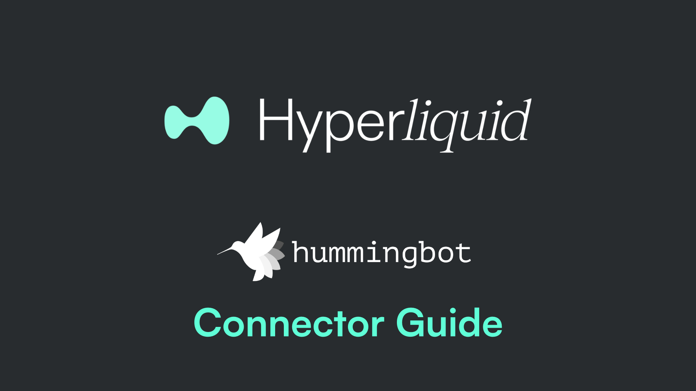

<iframe style="width:100%; min-height:400px;" src="https://www.youtube.com/embed/Ly8R5g3juxw" frameborder="0" allow="accelerometer; autoplay; encrypted-media; gyroscope; picture-in-picture" allowfullscreen></iframe>


## What Are Vaults?

**Hyperliquid Vaults** serve as an exchange wallet where funds are used by an individual trader or automated market maker (`Vault Leader`). Anyone can deposit (`Vault Depositors`) in the vault and earn a share of the profits.

The Hyperliquidity Provider (HLP) vault, operated by Hyperliquid, runs market-making strategies on each trading pair. Anyone can provide liquidity for HLP and share in the P&L of the vault. HLP doesn’t collect any fees directly, and its P&L is shared proportionally based on each depositor’s share of the vault. HLP is community-owned.

<!-- more -->


The minimum deposit to create a vault is 100 USDC.

## How Vaults Work

- Earn a share of the profits, or losses, of the vault.
- In the event of profit and decided to withdraw, 10% of the total earned goes to the Leader.
- Vault are optional. You can trade on Hyperliquid with Hummingbot directly without using a Vault.

**Let's learn how to create a vault and use it with Hummingbot!**

---

## For Vault Leaders

**Enable Trading**

Log in to [https://app.hyperliquid.xyz/](https://app.hyperliquid.xyz/) using your preferred wallet (Metamask). You may have to switch to the **Arbitrum** network.

[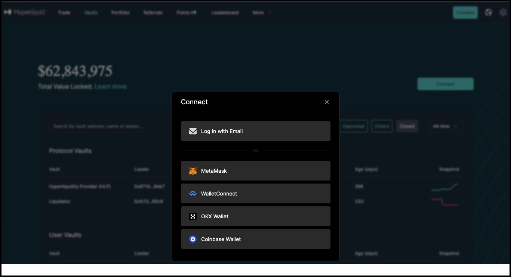](image1.png)

Go to Vaults and then click the **Enable Trading** button.

Deposit some amount of USDC to start trading. The minimum trading deposit is 0.01 USDC, but note that you will need a minimum of 100 USDC to create a vault.

**Create a Vault**

[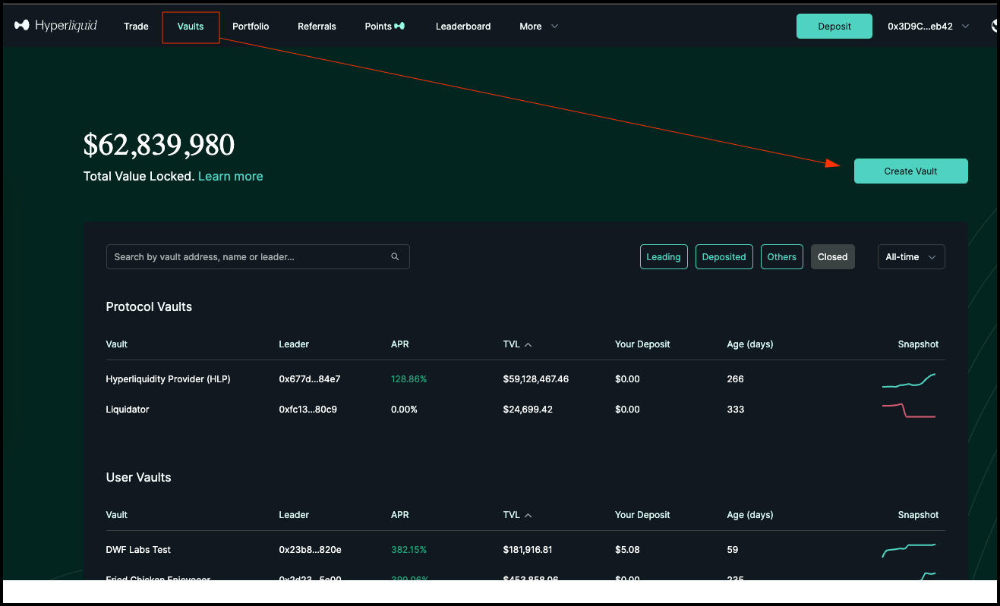](image2.png)

Enter the name for the vault and a short description.

[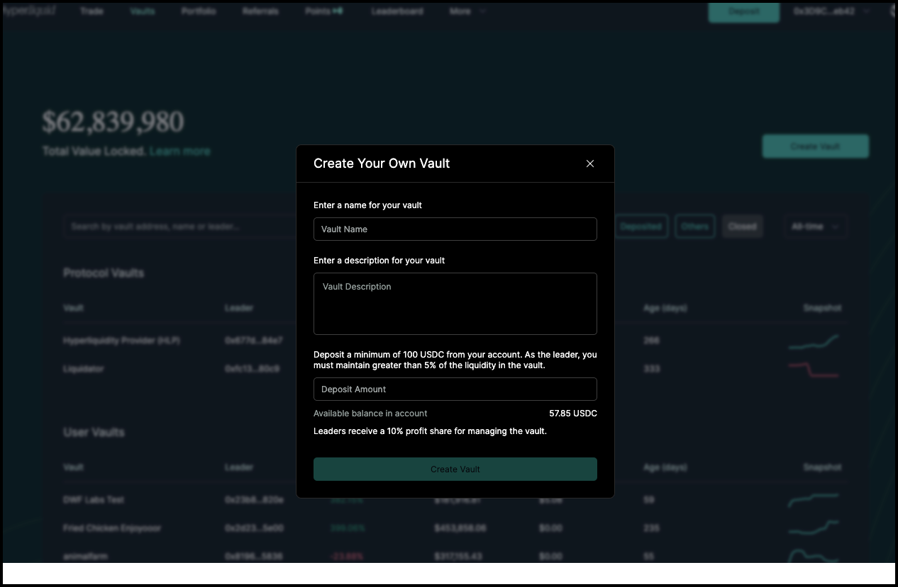](image3.png)

**Important Tips**

- Make sure to check the vault name and description as they cannot be changed later.
- Creation of a vault requires a minimum of 100 USDC.
- Leaders need to always keep at least 5% of the total value of that vault. This rule is in place to ensure that you, as the vault leader, have an investment in the vault's success.
- Leaders are not allowed to withdraw money from the vault if it would reduce their ownership to less than 5%. This requirement is designed to align their interests with the vault's performance and encourage responsible management.
- Vault leaders receive a 10% profit share for managing the vault.

### Install Hummingbot

There are two main methods to install Hummingbot:

**Docker**

For most new users, we recommend installing Hummingbot using Docker.

- [Docker Quickstart Guide](../../../installation/docker.md)

**Source**

We recommend installing Hummingbot from source if you meet any of the following criteria:

- You want to customize or extend the Hummingbot codebase.
- You want to build new components like connectors or strategies.
- You want to learn how Hummingbot works at a deeper technical level.

Guides for various environments:

  - [Linux](../../../installation/linux.md)
  - [Windows](../../../installation/windows.md)
  - [macOS](../../../installation/mac.md)

### Trading with Hummingbot

Go to the Trade page.

[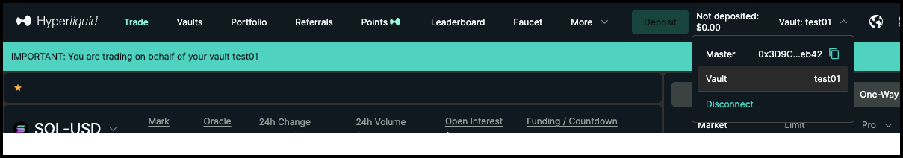](image4.png)

On the upper right corner, there is a dropdown to select which account to use. Select `Vault` here.

Launch Hummingbot and in the terminal run the `connect` command to connect Hummingbot to your Hyperliquid account:

```
connect hyperliquid_perpetual
```

[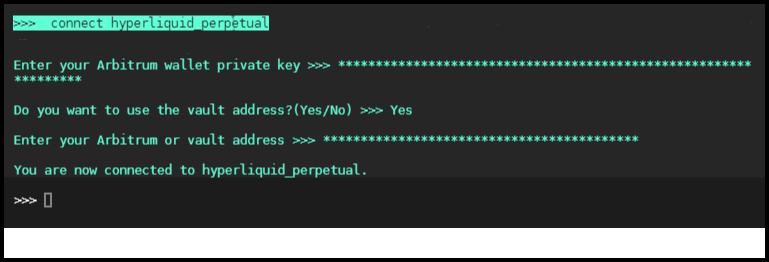](image7.png)

You should get a prompt to use the Vault address - enter Yes here.

!!! note "Vaults are optional"
    If you just want to run Hummingbot on Hyperliquid without using a Vault, answer No to this question.

Next, you'll be prompted to enter your `Vault address`. If you don't know what the Vault address is, go to your Vault page, and the address would be at the top left under the Vault name. You can click the copy icon to copy the address to the clipboard and paste it in Hummingbot.

[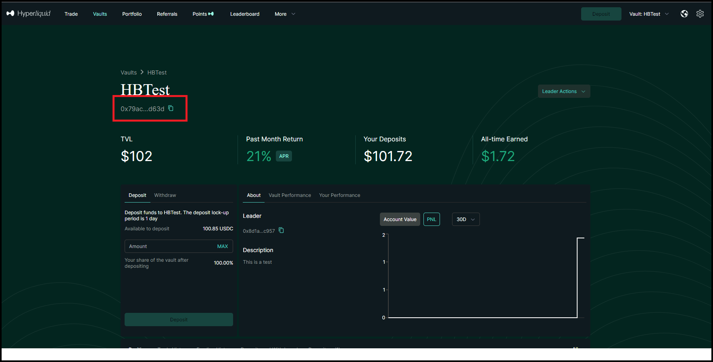](image8.png)

Next, start a trading strategy in Hummingbot, and your bot trades should match the trades shown under the Vault.

[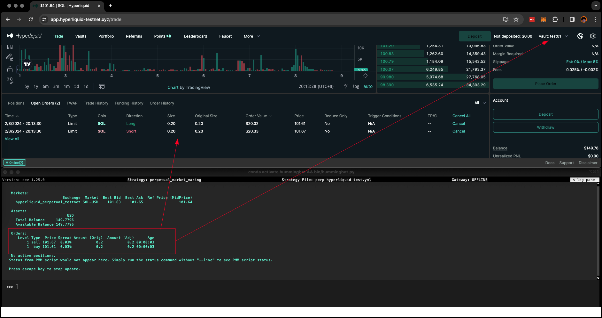](image11.png)

**Closing the Vault**

On your vault’s dedicated page, click the Leader Actions dropdown and select “Close Vault”. A modal will appear to confirm that you want to close your vault.

[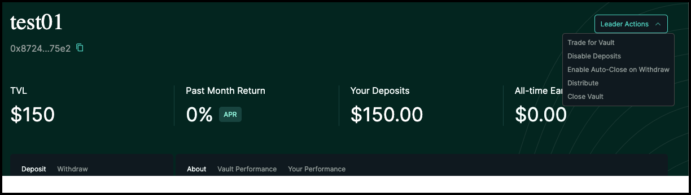](image5.png)

- All positions must be closed before the vault can close. All depositors will receive their share of the vault when it is closed.
- What happens to open positions in a vault when someone withdraws?
    - If there is enough initial margin to keep the open positions, withdrawal does not affect the open position.
    - If there is not enough initial margin for the open position, a proportional amount of the withdrawal is closed for all open positions. For example, if a user comprised 10% of the vault’s total deposits, 10% of all open positions would be closed when they withdraw.

---

## For Vault Depositors

**Choose a Vault**

[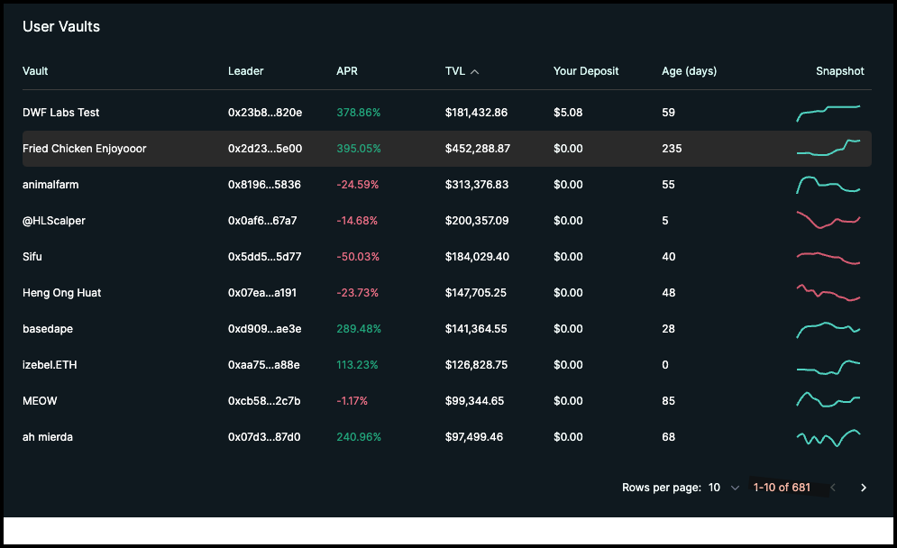](image6.png)

Users just need to go to the [Vault](https://app.hyperliquid.xyz/vaults) page and select Vaults they want to deposit into.

[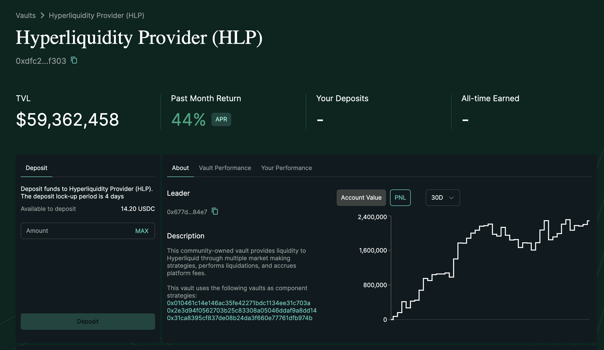](hlp.png)

Click "Deposit" and specify an amount. Afterwards, funds will be deducted from your trading account and transferred into the vault. There is a 24-hour lockup period for  deposits on user vaults and 4 days for HLP vaults.

Afterwards, you will share in the performance of the vault. Check the **Vault Performance** and **Your Performance** tabs for details.
