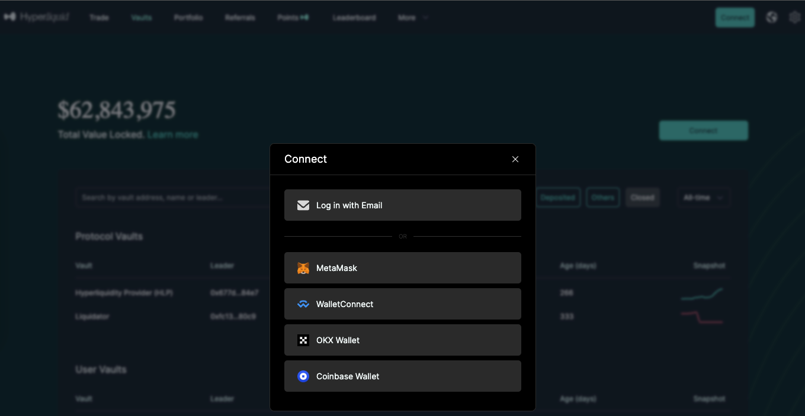
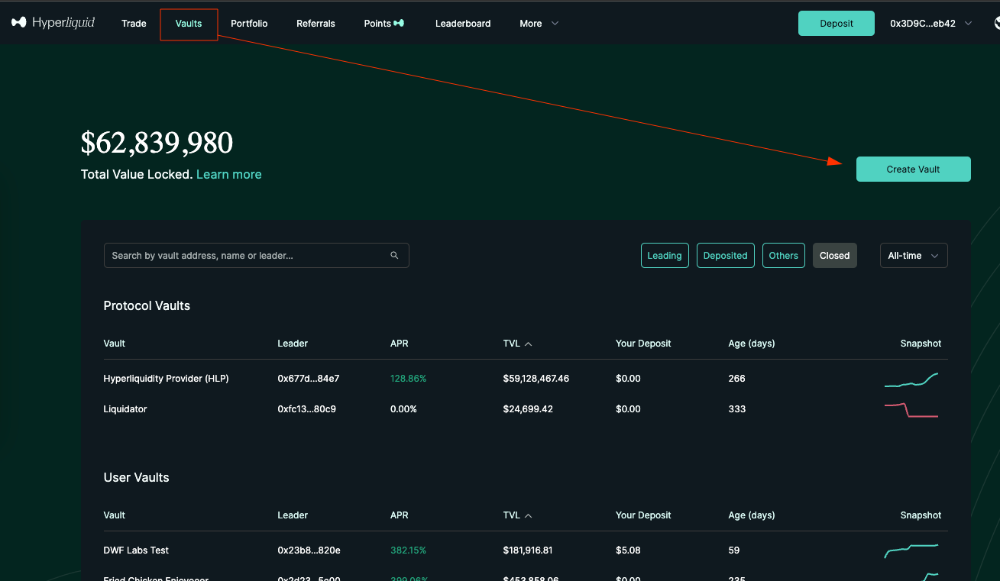
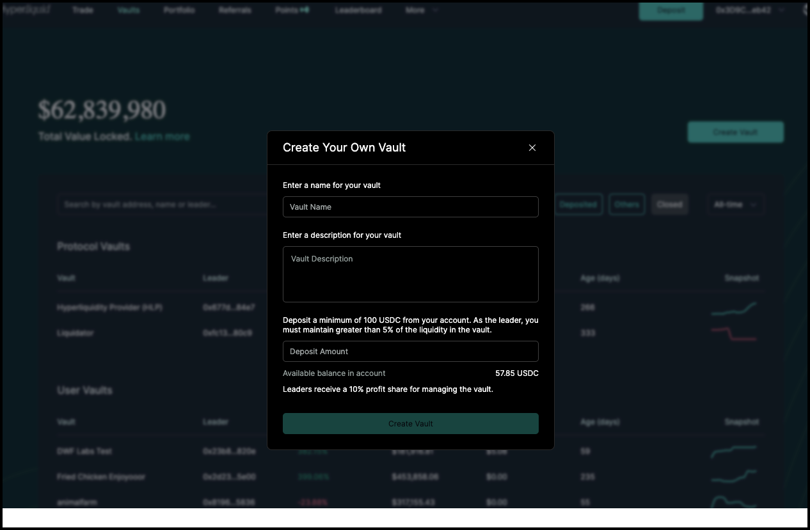
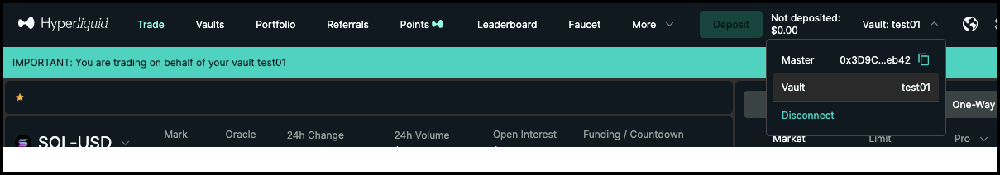
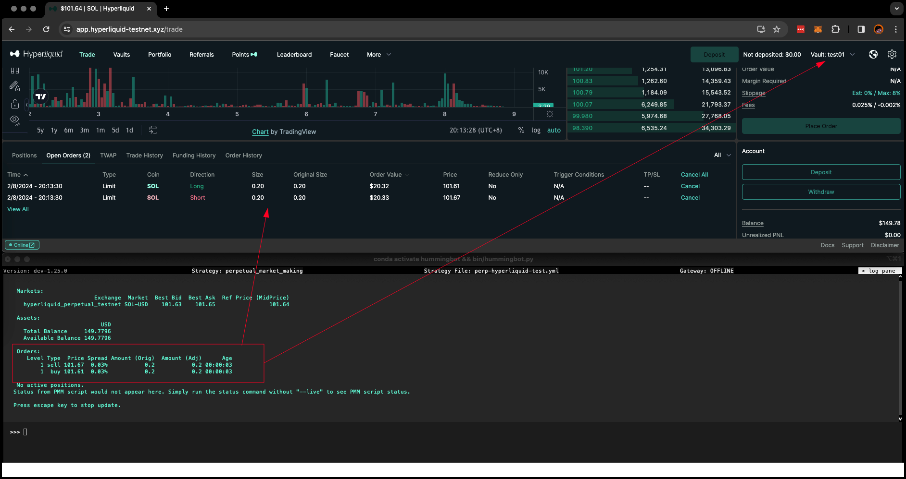
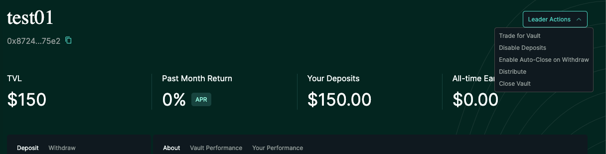

# User Guide: Hyperliquid Vaults


## Introduction

**Hyperliquid** is a cutting-edge trading exchange that has revolutionized the way individuals and automated market makers (AMMs) engage with digital assets. This exchange is renowned for its introduction of Hyperliquid Vaults, a novel concept that allows both individual traders and AMMs to optimize their trading strategies and earn profits from their investments. 

This guide is designed to walk users through the process of utilizing **Hummingbot**, an automated trading bot, to trade on Hyperliquid Vaults, thereby automating their trading activities. By integrating Hummingbot into your trading routine, you can take advantage of its sophisticated algorithms to automate trade execution, manage risk, and potentially increase your profitability without the constant need for manual oversight. Whether you're aiming to optimize your trading strategy or simply wish to diversify your investment approach, this guide will provide you with the necessary steps and insights to effectively use Hummingbot on the Hyperliquid platform.

<!-- more -->

## What are Vaults

**Hyperliquid Vaults** serves as an exchange wallet where the funds are used by a individual trader or automated market maker (`Vault Leader`). Anyone can deposit (`Vault Depositors`) in the vault and earn a share of profits.

The Hyperliquidity Provider (HLP) vault runs market making strategies on Hyperliquid. Anyone can provide liquidity for HLP and share in the PnL. HLP doesn’t collect any fees, and PnL is shared proportionally based on each depositor’s share of the vault. HLP is community owned.

Minimum deposit is 0.01 USDC with a locked period of 4 days

## Vault Benefits

- Earn a share of the profits, or losses, of the vault.

- In the event of profit and decided to withdraw, 10% of the total earned goes to the Leader

- Minimum deposit is 0.01 USDC with a locked period of 1 day


**Let's get started!**

---

## For Vault Leaders

**Create a Vault**

Login to [https://app.hyperliquid.xyz/](https://app.hyperliquid.xyz/) using your preferred wallet (Metamask)

[](image1.png)

Go to Vaults then Create Vault

[](image2.png)

Enter the name for the vault and short description

[](image3.png)


**Important!**

- Make sure to check the name and description as it cannot be changed later

- Creation of vault requires minimum of 100 USDC

- Leaders need to always keep at least 5% of the total value of that vault. This rule is in place to make sure that you, as the vault leader have a investment in the vault's success.

- Leaders are not allowed if withdrawing money from the vault would make the ownership less than 5%. This requirement is designed to align the interests with the vault's performance and encourage responsible management.

- Vault leaders receive a 10% profit share for managing the vault.


### Install Hummingbot

There are two main methods to install Hummingbot:

**Docker**

For most new users, we recommend installing Hummingbot using Docker.

- [Docker Quickstart Guide](https://hummingbot.org/academy-content/docker-installation-guide/)

**Source**

We recommend installing Hummingbot from source if you meet any of the following criteria:

- You want to customize or extend the Hummingbot codebase.
- You want to build new components like connectors or strategies.
- You want to learn how Hummingbot works at a deeper, technical level.

Guides for various environments:

  - [Linux](../../../installation/linux.md)
  - [Windows](../../../installation/windows.md)
  - [MacOS](../../../installation/mac.md)

### Trading with Hummingbot

Go to the Trade page 

[](image4.png)

On the upper right corner, there is a dropdown to select which account to use. Select `Vault` here

Launch Hummingbot and in the terminal run the `connect` command to connect Hummingbot to your Hyperliquid account

```
connect hyperliquid_perpetual
```

You should get a prompt to enable Vault (default is no) and once enabled you can select your strategy and start trading 

Your bot trades should match the trades shown under the Vault

[](image11.png)

**Closing the vault**

On your vault’s dedicated page, click the Leader Actions dropdown and select “Close Vault”. A modal will appear to confirm that you want to close your vault.

[](image5.png)

- All positions must be closed before the vault can close. All depositors will receive their share of the vault when it is closed.

- What happens to open positions in a vault when someone withdraws?
    - If there is enough initial margin to keep the open positions, withdrawal does not affect the open position
    - If there is not enough initial margin for the open position, a proportional amount of the withdrawal is closed for all open positions. For example, if a user comprised 10% of the vault’s total deposits, 10% of all open positions would be closed when they withdraw.


---

## For Vault Depositors

**Choose a Vault**

- Users just need to go to the [Vault](https://app.hyperliquid.xyz/vaults) page and select Vaults they want to invest in the list

[](image6.png)


