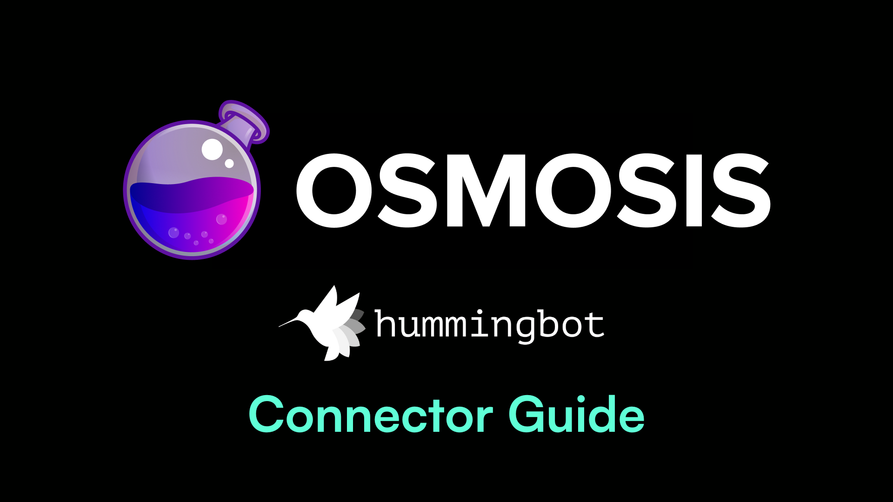
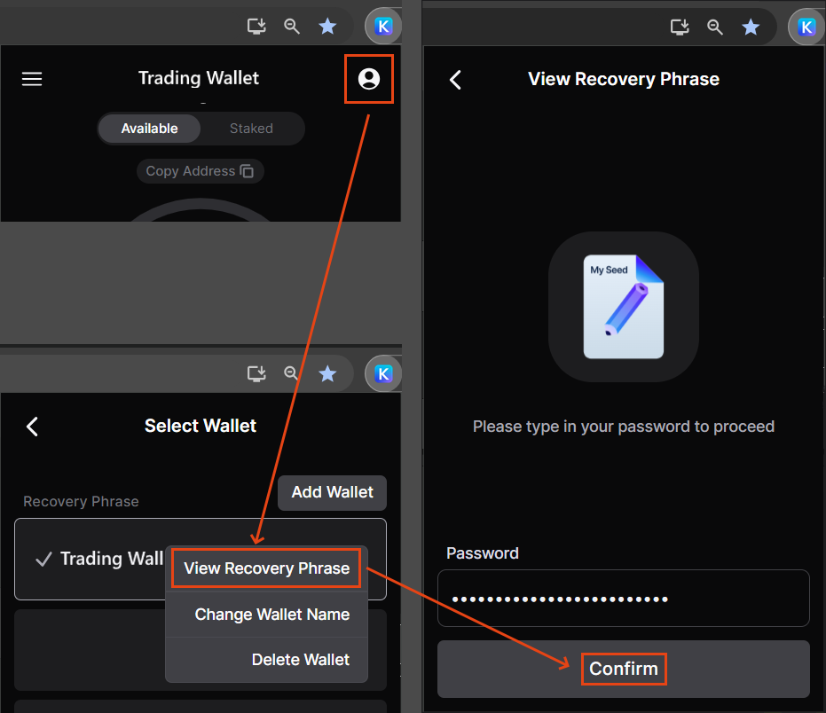
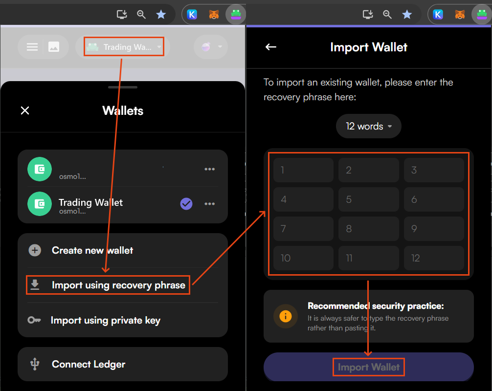
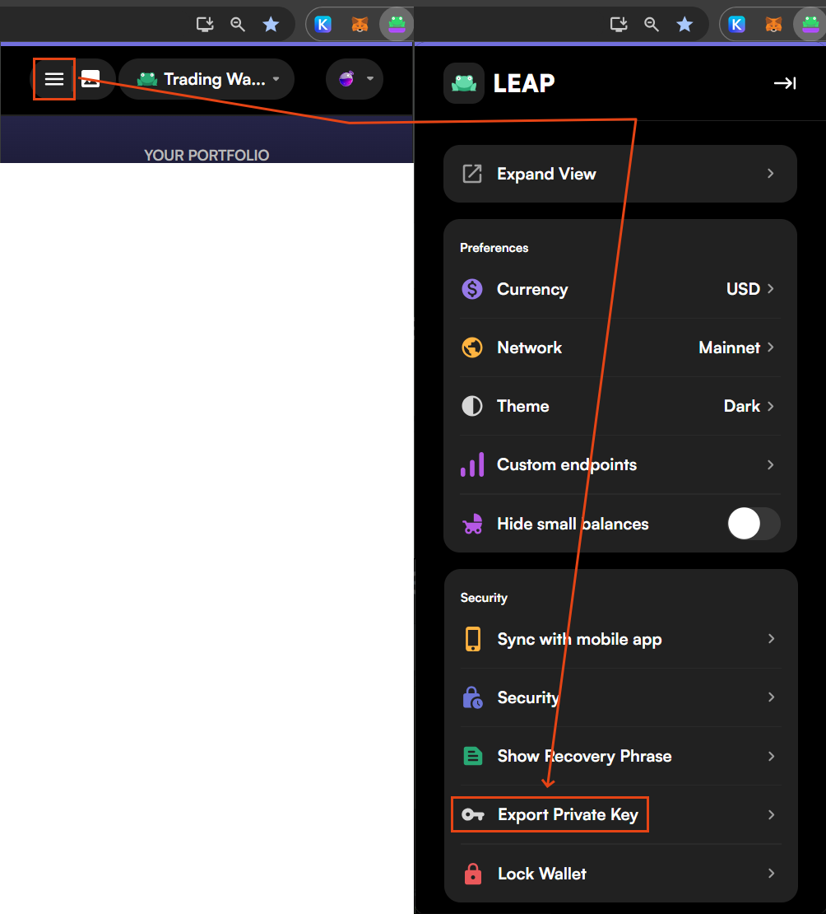
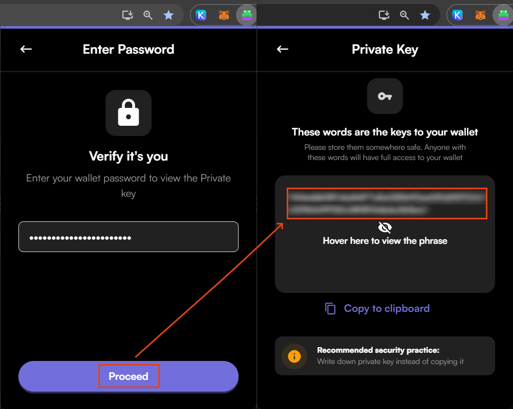
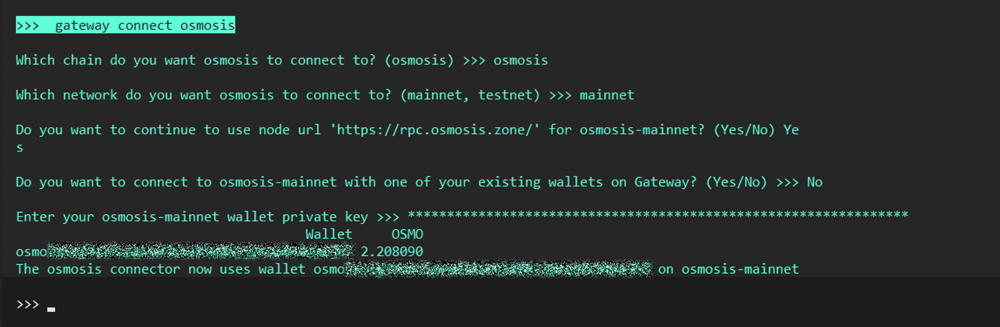
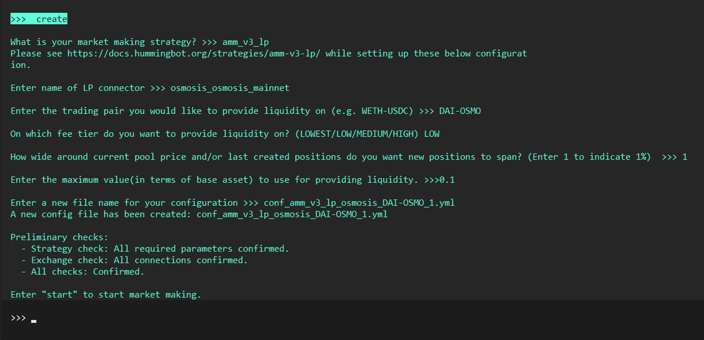
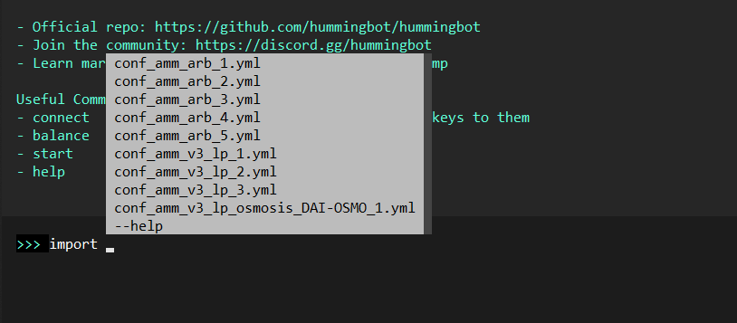
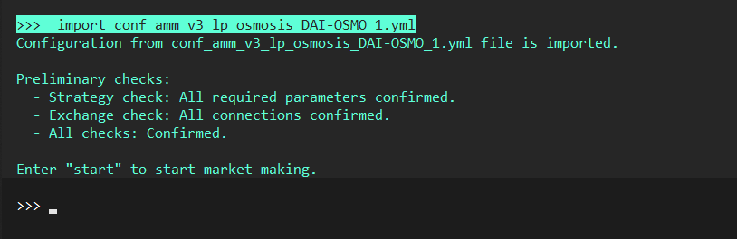
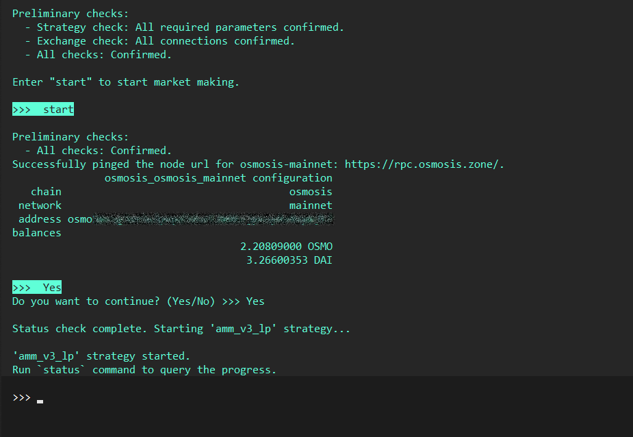

# Using Osmosis with Hummingbot



## Introduction

These instructions help users navigate the installation, configuration, and operation of (OSS) Hummingbot high-frequency trading bot running Automated Market Making Arbitrage or Range Automated Market Making strategies on **Osmosis DEX** over the Hummingbot Gateway.

<!-- more -->

## Prerequisites

### Create an Osmosis (Cosmos) Wallet

The Cosmos ecosystem is powered by the Inter-Blockchain Communication protocol ([IBC](https://cosmos.network/ibc/)) which functions like an internet of blockchains. Most Cosmos wallets support all IBC chains natively, including Osmosis - though _specific networks may need to be manually added_.

Stay up to date with Osmosis-specific wallet information on the Osmosis website and/or Docs:

- [Osmosis Website - Supported Wallets](https://osmosis.zone/)
- [Osmosis Docs](https://docs.osmosis.zone/)

#### Leap Wallet (recommended)

To ensure the ability to easily export the wallet private key, use [Leap](https://linktr.ee/leap_wallet). Remember that the private key exported from Leap will include a ‘0x’ prefix which must be removed.

### Fund the Wallet

There are multiple bridges to Cosmos available, but the easiest way is to directly deposit to Osmosis using the Osmosis DEX front end.

- [Connecting to Osmosis](https://docs.osmosis.zone/overview/educate/getting-started/#set-up-a-wallet)
- [How to Deposit Funds](https://docs.osmosis.zone/overview/educate/getting-started#deposit-funds)
- [Osmosis Interface](https://app.osmosis.zone/assets)

!!! Note
      Please ensure your wallet has sufficient balance, including OSMO for gas fees

<br>

## Install Hummingbot

There are two main methods to install Hummingbot:

### Docker

The **recommended** method for installing Hummingbot is using Docker.

- [Docker Quickstart Guide](./../../../installation/docker.md)

### Source

For advanced users who are comfortable using command line interface, installing from source allows for customization and private changes.

Guides for various environments:

- [Linux](../../../installation/linux.md)
- [Windows](../../../installation/windows.md)
- [MacOS](../../../installation/mac.md)

<br>

<!-- Configure Osmosis Wallet for Hummingbot Gateway -->

## Add Osmosis Wallet to Hummingbot

You will need to export the private key for your designated trading wallet. It is highly advised to have a dedicated account for this purpose.

!!! Warning An Osmosis Private Key has 64 characters
    Be aware an exported private key may have an 0x at the start, which may need to be removed to fit the private key format check.

    → Before: 0x1234567890...
    
    → After: 1234567890...

### Export Private Key from Keplr

Keplr is the most popular Cosmos-based wallet. However, when creating a Keplr wallet, **only users who link a Google Account are able to export their private key** directly from Keplr.

!!! Note
    For a linked Keplr-Google wallet, find instructions to export the private key [here](https://help.keplr.app/articles/how-to-view-your-private-key).

To get around this, export the seed instead and then restore with a different Osmosis wallet which allows exporting private key.

To get a Keplr private key without a linked Google Account:

1. Export Keplr seed phrase.
   

2. Restore the wallet using the seed phrase, in a different Cosmos-based wallet (such as Leap wallet) which allows exporting the private key.
   

3. Export the private key from the newly restored wallet.

!!! Warning
    Your wallet seed phrase is extremely sensitive. Keep it confidential and never share it online or with anyone you don't trust. Always ensure you're in a secure and private environment when handling your seed phrase.

<br>

### Export Private Key from Leap

To export a private key from Leap wallet:

1. Open Leap wallet and then open the wallet menu.

2. Scroll down to the ‘Security’ section and select ‘Export Private Key’.
   

3. Enter the wallet password and proceed to view the private key by hovering the cursor over the blurred area.

4. Copy down the private key and _be sure to discard_ the ‘0x’ at the beginning of the displayed key.
   

!!! Note
    Images made with Leap version 0.10.7 and Keplr version 0.12.70; in Chrome.

### Add Private Key to Hummingbot

Run `gateway connect osmosis` and follow the prompts to add a trading wallet to the Osmosis DEX connector.

!!! Note
    Hummingbot stores both API keys and private keys on the local machine in encrypted form, with the Hummingbot client password as the key.



#### Gateway Connect

- To connect to **Osmosis mainnet** run the command below

```
>>> gateway connect osmosis
```

- To connect to the **Osmosis testnet**, select _'testnet'_ instead of 'mainnet' when prompted.

- You will be prompted to enter your **Osmosis private key**. If valid, you should get a message saying **The connector osmosis_osmosis_mainnet is now using wallet osmo<public_key>**

- To confirm the connection, you can run the balance command below to see if Hummingbot is able to pull the available balance from the exchange

```
>>> gateway balance
```

<!-- Creating a Strategy and Executing -->

## Run a Strategy

To begin trading, a strategy must be configured. The two strategies supported natively by the Osmosis connector are [**amm_arb**](/strategies/amm-arbitrage/) and **amm_v3_lp**.

### Prepare

1. If you haven’t already, connect a wallet to Osmosis Mainnet with `gateway connect osmosis`. Afterwards, you should be able to see your `osmosis_osmosis_mainnet` wallet when you run `gateway balance`.

2. To display the balance of specific tokens in the trading wallet balance, run `gateway approve-tokens osmosis_osmosis_mainnet <TOKEN_SYMBOL_HERE>`. The token balance will be displayed the next time `gateway balance` is run.

3. Ensure the added trading wallet has at least **1 OSMO** to cover trading gas costs.

### Create New Strategy

Use the `create` command to set up an **amm_arb** or **amm_v3_lp** strategy. Answer the question prompts presented so that you to generate your own version of the following example configurations.

```
>>> create
```

#### Example AMM_ARB Config

```
strategy: amm_arb
connector_1: osmosis_osmosis_mainnet
market_1: OSMO-USDC
connector_2: uniswap_polygon_mainnet
market_2: USDC-WOSMO
min_profitability: 1.0
market_1_slippage_buffer: 1.0
market_2_slippage_buffer: 1.0
concurrent_orders_submission: false
debug_price_shim: false
gateway_transaction_cancel_interval: 600
```

#### Example AMM_V3_LP Config

```
strategy: range_amm
connector: osmosis_osmosis_mainnet
market: OSMO-USDC
fee_tier: MEDIUM
price_spread: 1.0
amount: 1.0
min_profitability: 1.0
```



### Import a Strategy

Run `import` to get a list of locally stored files, use the arrow keys or tab to scroll and select one. Or, you can also skip the prompt by running `import <file_name.yml>` directly.

```
>>> import
```



If successful, you will see:



### Start a Strategy

To run a trading strategy:

1. Ensure a strategy is loaded and Preliminary checks are confirmed.

2. Run `start`.

!!! Note
    The `amm_arb` strategy will first request confirmation of selected wallets.



### Use a Script

Scripts can be created similar to strategies, by using the `create --script` command.

```
>>> create --script
```

### Modify Strategy or Script Config

Modifications can be made to strategies and scripts by manually editing the file:

1. Locate the `hummingbot/scripts` folder and open the relevant file using any text editor or an IDE like [Visual Studio Code](https://code.visualstudio.com/).

2. Make the desired changes and save.

3. Restart Hummingbot and run the command below to start the bot again:

```
>>> start <strategy_name.yml>
```

Or, if using scripts:

```
start --script <script_name.py>
```

<br>

## Useful Commands

You can run the `status` command shown below or press <kbd>CTRL</kbd> + <kbd>S</kbd> to check the bot status:

```
status
```

!!! Note
    The `status` command currently has a [issue](https://github.com/hummingbot/gateway/issues/294) with amm_v3_lp strategy.

## Known Issues

- V1 Strategy compatibility for amm_arb and amm_v3_lp are in development.
- The fee tier ‘LOWEST’ is not supported and will result in an error.
- In some cases, the token pair must be in alphabetical order.
- PoolPrice RPC may time out intermittently which results in an error 500.

## Potential Improvements

If you are interested in contributing or funding a bounty for development of additional features or improvements for this connector or related strategies, please feel free to contact [Pecunia.Finance](mailto:pecuniafinancedao@protonmail.com).

- V1 strategy bugs
- V2 strategy development
- Data Feed
- Custom CLMM range input (strategy development - amm_lp_v3 or new)
- Future Osmosis Development - <https://forum.osmosis.zone/c/site-feedback/2>

---

**[Placeholder for additional Osmosis info]**

---

## Additional Resources

- [Osmosis Mainnet](https://app.osmosis.zone/)

- [Osmosis Testnet](https://testnet.osmosis.zone/)

- [Osmosis Testnet Faucet](https://faucet.testnet.osmosis.zone/)

- [Osmosis Labs GitHub](https://github.com/osmosis-labs)
