# Using Polkadex with Hummingbot

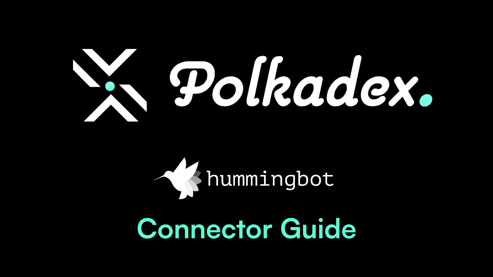

## Introduction

**Polkadex** is a state-of-the-art decentralized exchange on the Polkadot network, offering a seamless blend of the high-speed trading typically found on centralized platforms with the security and autonomy of a DEX. This guide walks through setting up a Polkadex wallet and initiating trading with Hummingbot. 

By leveraging Polkadex and Hummingbot, traders can enjoy a high-performance, secure, and automated trading experience without the custodial risks, making it an ideal platform for both novice and seasoned traders in the cryptocurrency ecosystem.

<!-- more -->


## Install the Polkadex Extension

First things first, let's set up your Polkadex extension by visiting [polkadot.js.org/extension](https://polkadot.js.org/extension/)

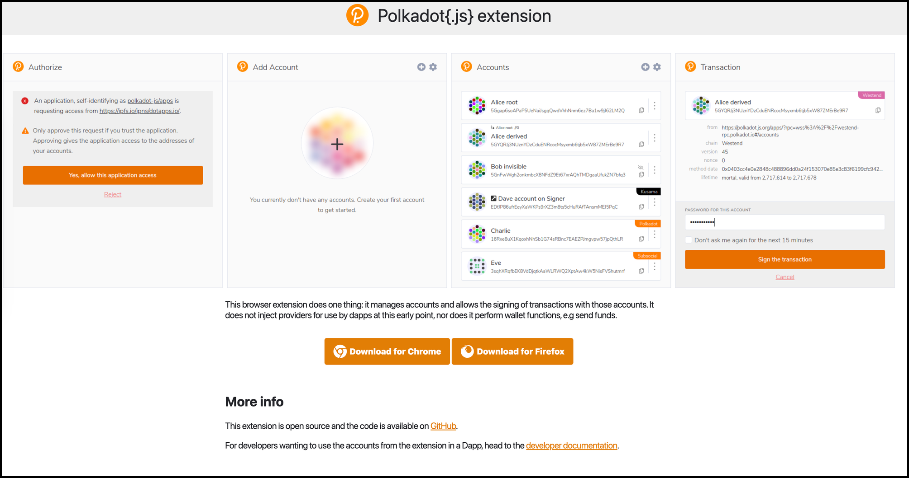

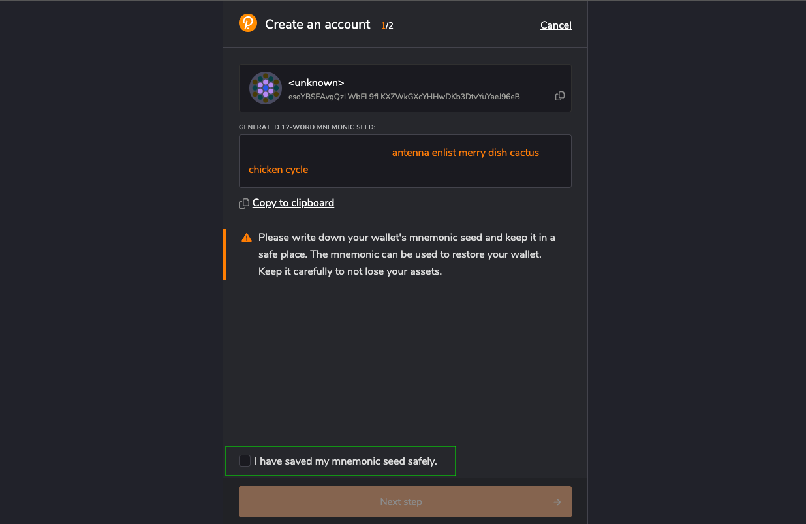

Ensure the security of your wallet by keeping a copy of the mnemonic seed in a safe location.

## Register Your Account on Polkadex

Now, let's get you registered on Polkadex:

- Visit [https://orderbook.polkadex.trade](https://orderbook.polkadex.trade/)
- Create an account by connecting to your Polkadex JS wallet

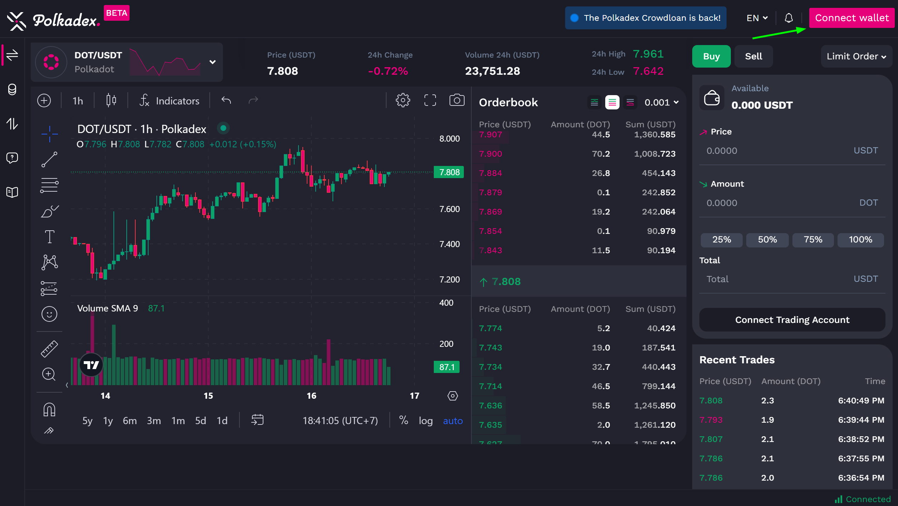

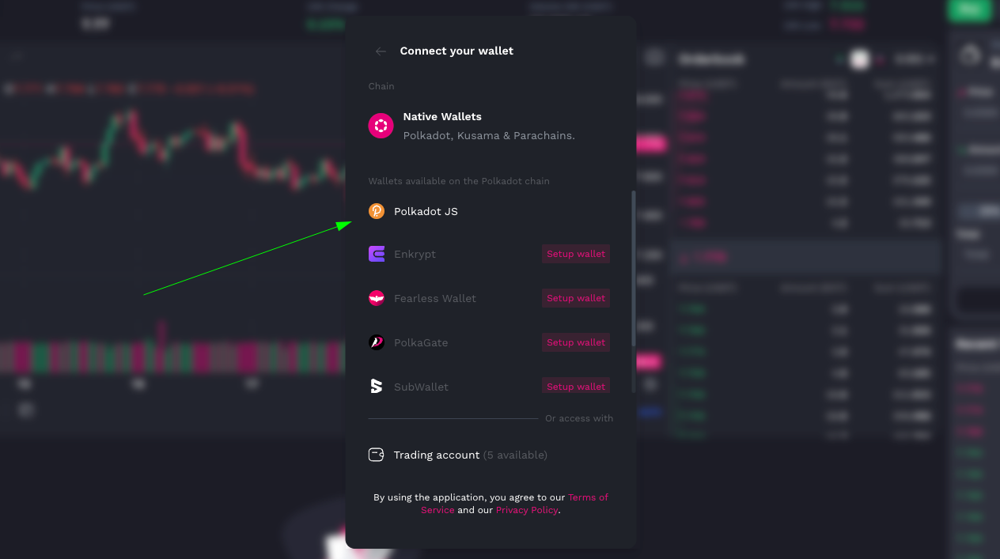


## Register Your Funding Account

Your Polkadex extension accounts will serve as your funding accounts. To start you have to deposit a minimum of 2 PDEX, here's how to set it up:

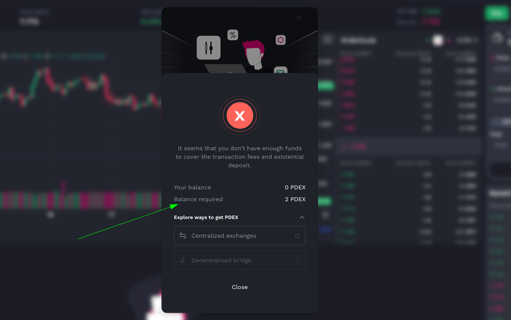

- The exchange will provide you a link to [Kucoin](https://www.kucoin.com/trade/PDEX-USDT) where you can transfer PDEX to your Polkadex wallet address

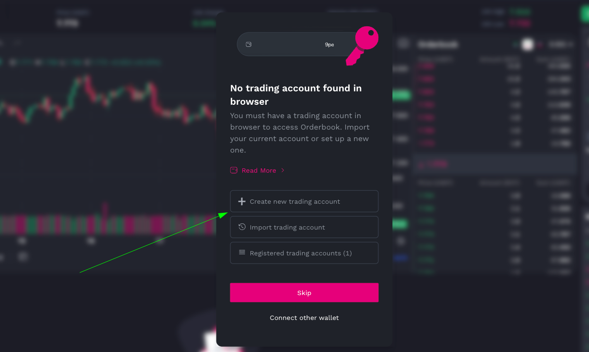

- After successfully transferred PDEX to your funding account, you would need to create a trading account for the exchange
- There are two recommended by Polkadex, on this guide we will be using the browser
- When creating trading account, you will be prompted to enter the funding account password

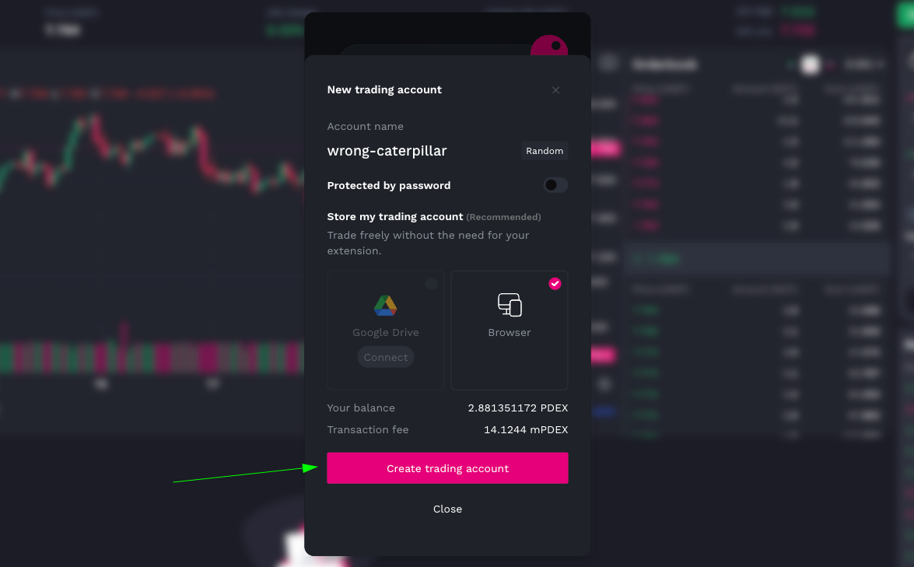

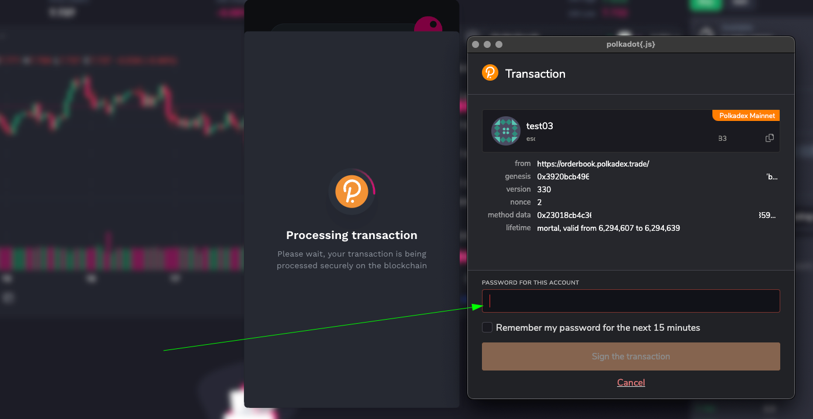

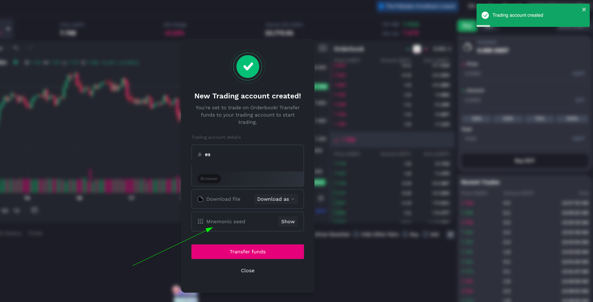

You have to make sure you have copied the mnemonic password since it will be needed later when importing trading account or connecting to hummingbot client

## Import Your Trading Account

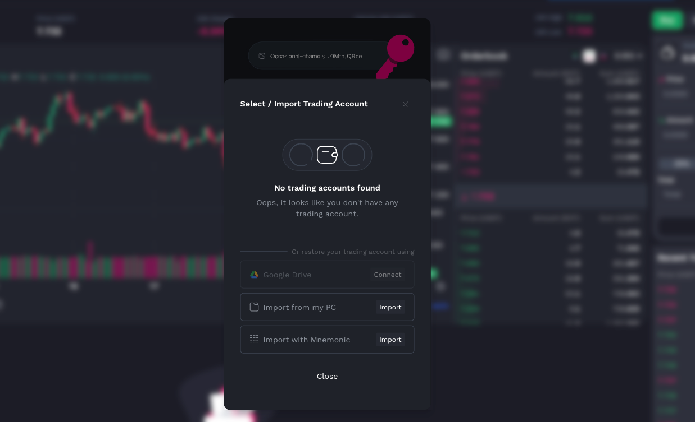

Another way to add your trading account is by importing to the funding account. To do this you have to select from:

- Google Drive
- Import from my PC, then using a exported json file 
- Import with Mnemonic passphrase

## Add Balances and Start Trading

You're almost there! Now, let's add some balances:

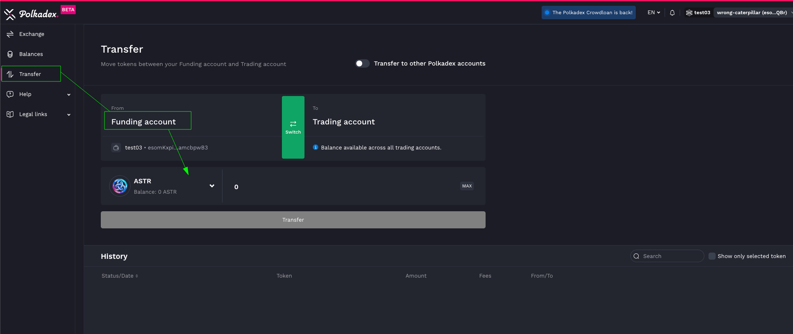

- Navigate to the "Balances" tab on [orderbook.polkadex.trade](https://orderbook.polkadex.trade/)
- Go to "Transfer" and select a token from your funding account to trading account

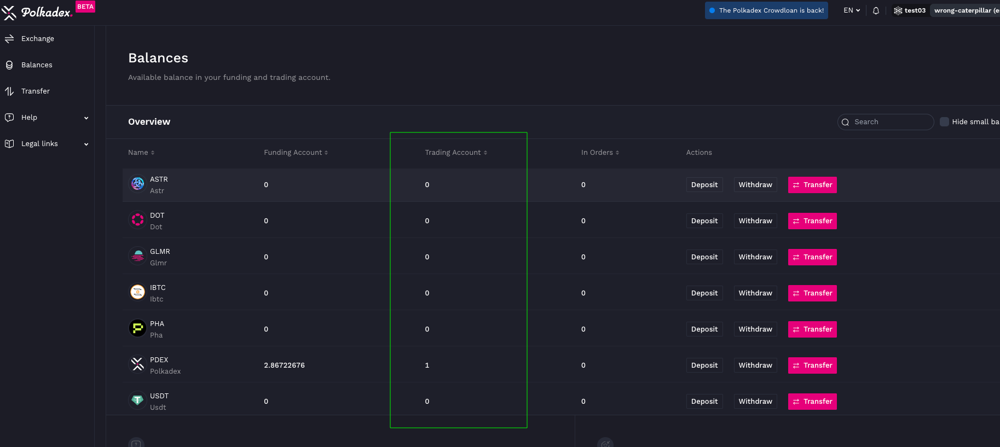

- Once successfully transferred, go back to "Balance" tab to confirm


## Install Hummingbot


There are two main methods to install Hummingbot:

### Docker

For most new users, we recommend installing Hummingbot using Docker.

- [Docker Quickstart Guide](/academy-content/docker-installation-guide/)

### Source

We recommend installing Hummingbot from source if you meet any of the following criteria:

- You want to customize or extend the Hummingbot codebase.
- You want to build new components like connectors or strategies.
- You want to learn how Hummingbot works at a deeper, technical level.

Guides for various environments:

  - [Linux](../../../installation/linux.md)
  - [Windows](../../../installation/windows.md)
  - [MacOS](../../../installation/mac.md)


## Connect your Polkadex Wallet to Hummingbot

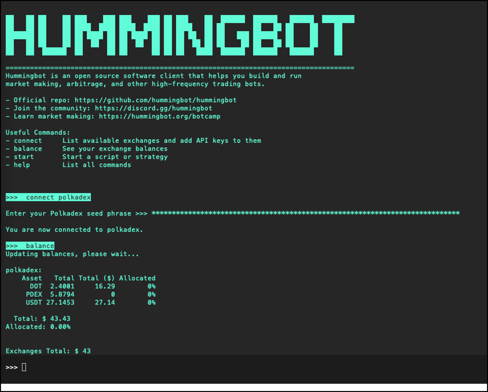

- Execute the following command to connect Hummingbot and add your Polkadex trading seed phrase

```
connect polkadex

```

- Execute "balance" command to check your assets 
- Launch your preferred trading strategy!


For more detailed information, check out [docs.polkadex.trade](https://docs.polkadex.trade/polkadexOrderbookFAQHowToTransferDeposits/)


Happy trading on Polkadex! 🚀