# Using Vega Protocol with Hummingbot

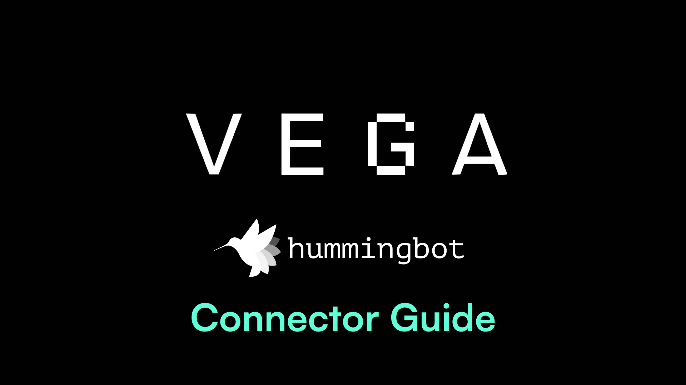


## Introduction

In this guide, we'll walk you through the detailed steps required to seamlessly set up a Vega Wallet, link it with Hummingbot, and start running powerful algo trading strategies on the Vega decentralized exchange. 

Watch the guide on Youtube and let's get started!

<iframe style="width:100%; min-height:400px;" src="https://www.youtube.com/embed/kZM8YeRAb8M" frameborder="0" allow="accelerometer; autoplay; encrypted-media; gyroscope; picture-in-picture" allowfullscreen></iframe>

<!-- more -->

## Create Vega Wallet

A **Vega Wallet** is essential for interacting with Vega, whether it's for staking or trading. The Vega Wallet apps allow you to manage wallets and key pairs, deposit and withdraw assets, stake, and sign transactions. 

### Connect MetaMask Snap

To get started, visit [Vega Console](https://console.vega.xyz/) and click **Connect to Vega**. Afterwards, you will be presented with several options for creating a Vega wallet:

[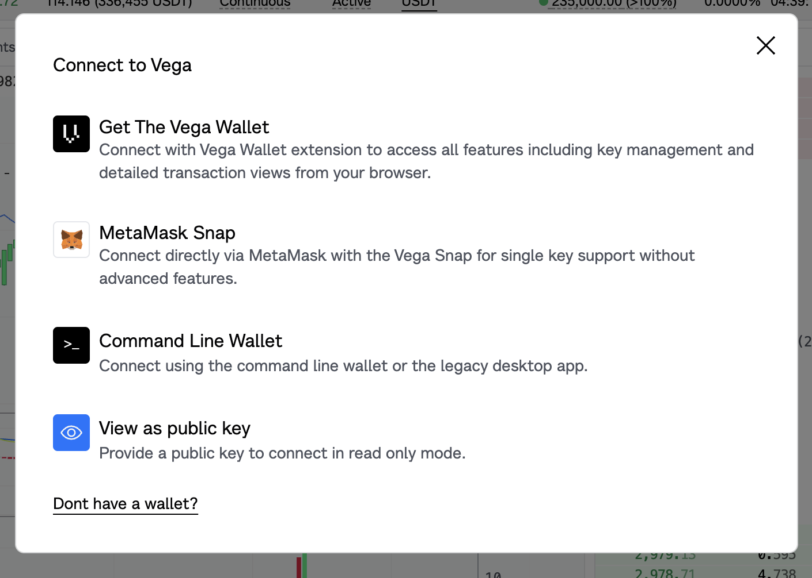](vega-console.png)

Below, we show you how to use **MetaMask Snap**, our recommended approach for Hummingbot users.

Select **MetaMask Snap** in the menu above and connect with your preferred Ethereum address in [Metamask](https://metamask.io/).

You should get a pop-up informing you of the permissions needed - click **Install**. 

[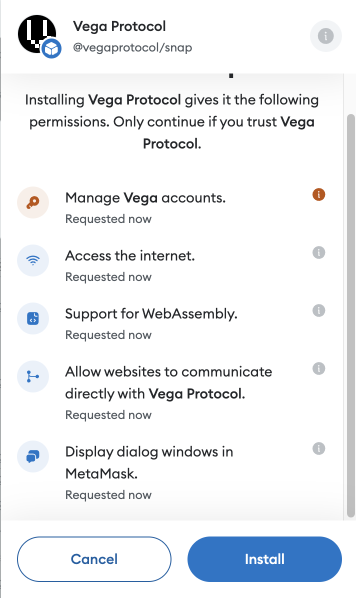](vega-install-snap.png)

Afterwards, agree to the remaining pop-ups and you should eventually see a notice saying that you are **Successfully Connected**. You're now ready to deposit assets and use your new Vega wallet.

### Deposit Funds

After creating a the Vega wallet, go to [Vega Console](https://console.vega.xyz/), where you will be redirected to the MAINNET exchange, by default.

[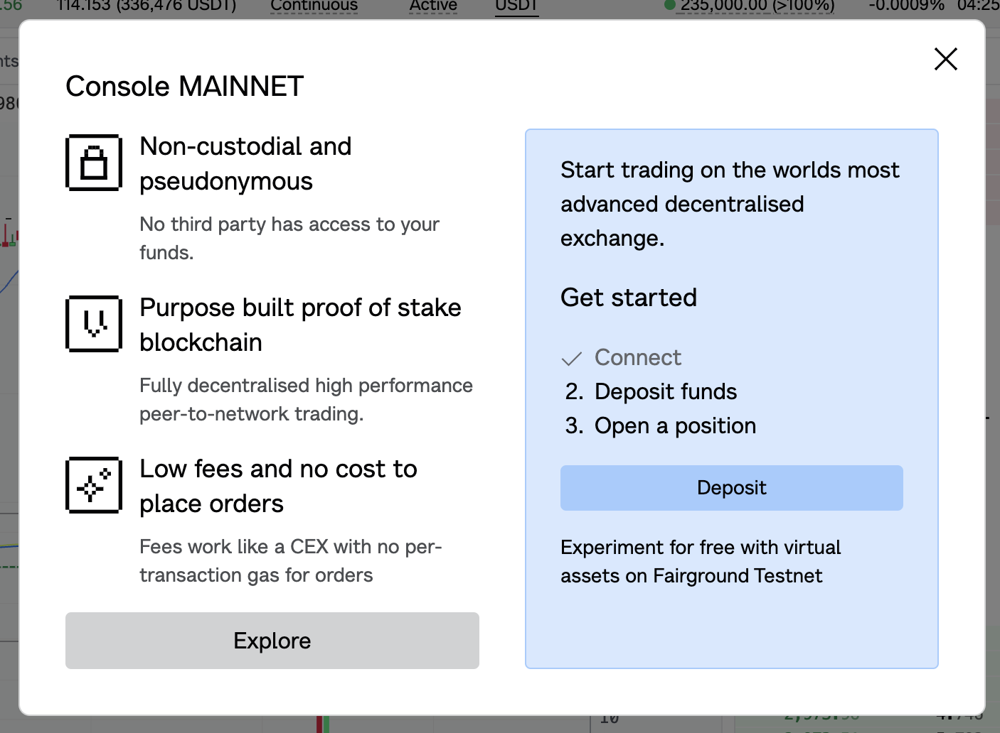](vega-deposit.png)

If you want to change to Fairground TESTNET, exit out of the pop-up and click the upper-left hand corner of the Vega exchange website to change the network. 

[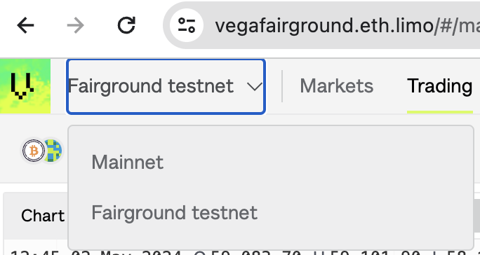](vega-network.png)

Once you have selected your network, click the **Deposit** button in the pop-up above and connect your Ethereum wallet to approve and deposit eligible tokens to your new Vega wallet.

[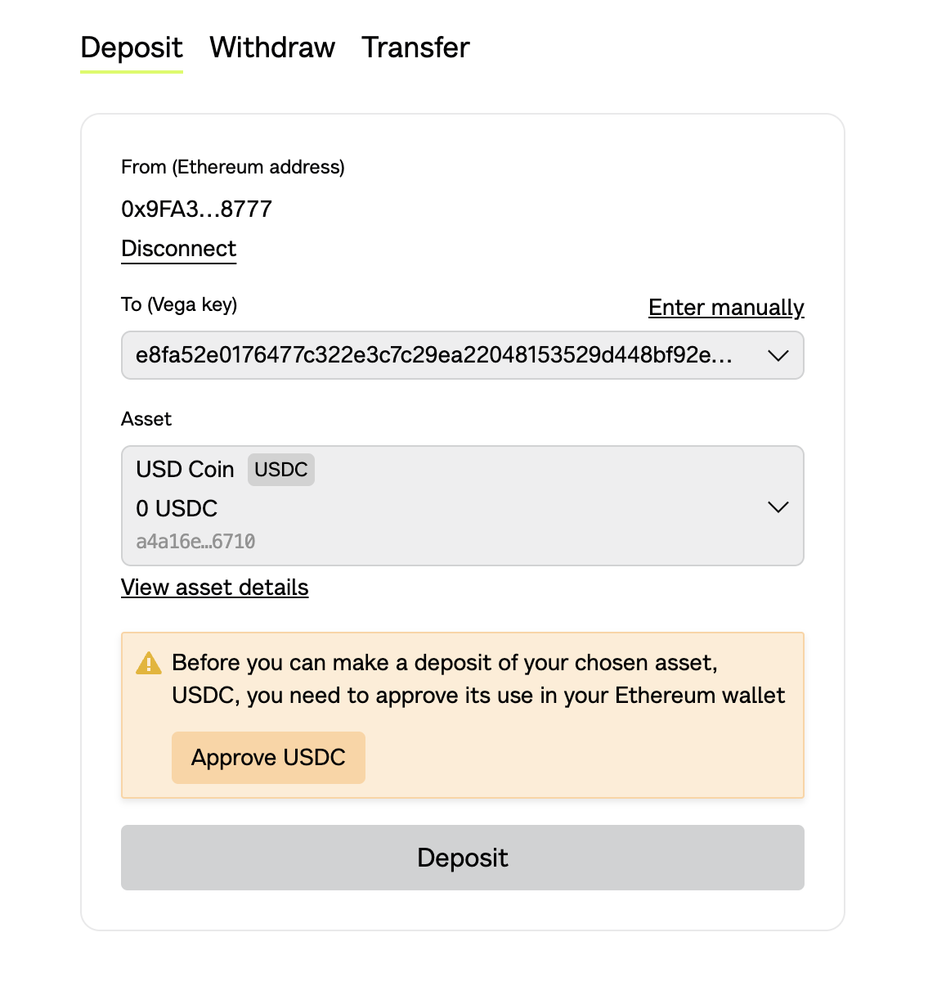](vega-deposit-3.png)

## Connect Hummingbot to Vega

After you have funded your Vega wallet, you can now connect Hummingbot and start running algo trading strategies. Since we used MetaMask Snap to connect Vega, we'll need two pieces of information: 

1. **Snap Key**: Vega public key or party id
2. **Seed Phrase**

Let's go through how you can find these items:

### Get Snap Key

After connecting your Vega Wallet, look for your **Snap Key** in the top right corner of the screen.

[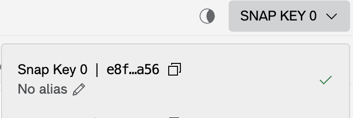](snap_key.png)

The Snap Key 0 address should be the **Vega key** address where you deposited assets from your Ethereum wallet earlier. Click it to copy it to your clipboard which you can then paste when prompted for the **Vega public key (party id)** in Hummingbot.

[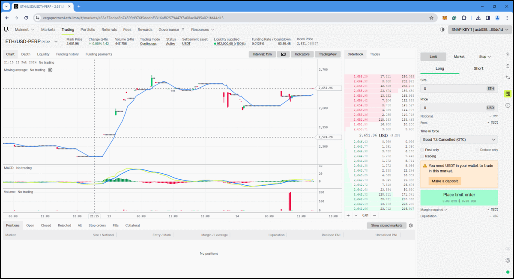](metamask_snap_02.gif)

### Get Wallet Seed Phrase

Since we used Metamask Snap to connect to Vega, your private key will be the **seed phrase** of the Ethereum wallet used to establish the connection. When connecting your Vega Wallet to Hummingbot, you will be prompted to enter this seed phrase as part of the authentication and setup process. 

See this Metamask article to find the seed phrase: [How to reveal your Secret Recovery Phrase](https://support.metamask.io/privacy-and-security/how-to-reveal-your-secret-recovery-phrase/). Follow the steps in the article to fetch the seed phrase of you Etherum wallet.

!!! warning
    Your wallet seed phrase is extremely sensitive. Keep it confidential and never share it online or with anyone you don't trust. Always ensure you're in a secure and private environment when handling your seed phrase.

### Install Hummingbot

After you have both your Snap Key and Seed Phrase, you are ready to connect Hummingbot to Vega! Make sure to bookmark the [Vega connector](/exchanges/vega/) documentation page, which provides a handy reference.

Now, install Hummingbot by following the [installation process](/installation/docker). The easiest way to get started is to clone the Github repo and launch the Docker image:

```
git clone https://github.com/hummingbot/hummingbot
cd hummingbot
docker compose up -d
docker attach hummingbot
```

### Run Connect Command

In the Hummingbot client, connect to **Vega mainnet** by running `connect vega_perpetual`. To connect to the **Vega Fairground testnet**, run `connect vega_perpetual_testnet`.

[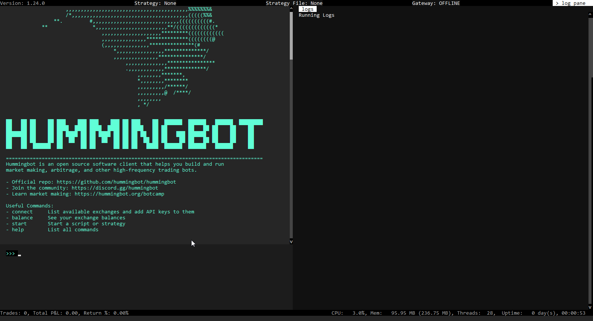](connect_vega.gif)

First, you will be prompted to enter your Vega public key - enter your Snap Key here. Then, enter your Wallet Seed Phrase.

If both credentials are valid, you should should see this message:
```
You are now connected to vega_perpetual.
```

To confirm the connection, run the `balance` command. Your asset balances should match the amount that you deposited into Vega.

[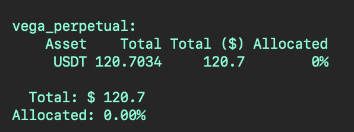](balance.png)

## Run Directional Strategy

Now, let's configure and run a sample algorithmic trading strategy on Vega - [v2_directional_rsi.py](https://github.com/hummingbot/hummingbot/blob/development/scripts/v2_directional_rsi.py).

This is a simple directional strategy that enters into long positions when the market is oversold (as measured by [RSI](https://en.wikipedia.org/wiki/Relative_strength_index)). Alternatively, if the market is overbought, the bot will enter into a short position. After a position is created, the strategy uses a [PositionExecutor](/v2-strategies/executors/positionexecutor/) to manage it.

### Configure Script

First, let's create a Vega-specific configuration for this strategy. Run:
```
create --script v2_directional_rsi
```

[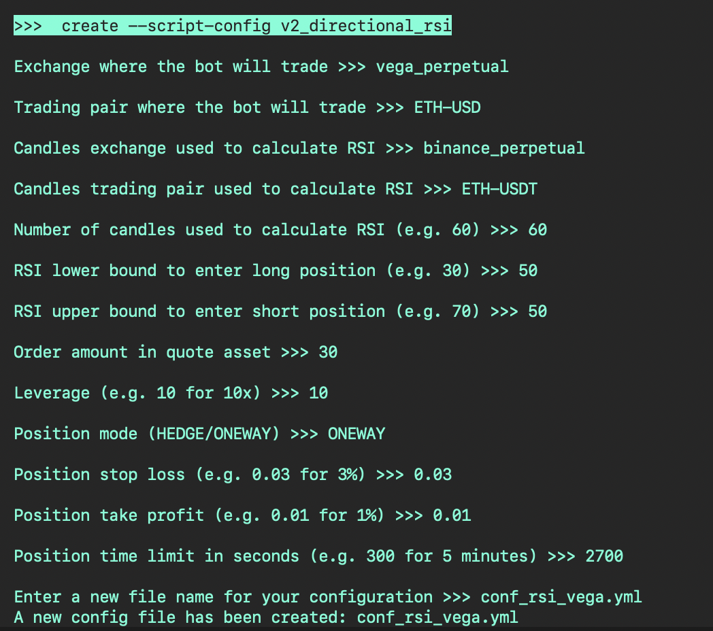](config.png)

Follow the prompts and enter in your desired values, and save the file. This file is located under the **/conf/scripts** folder, and you can use any text editor or IDE like VSCode to open the YAML file and make changes to it.

Note that:

* You'll need to use a different exchange (like Binance Futures) other than Vega for `candles_exchange`, since Vega does not currently support [Candles](/v2-strategies/candles/) yet.
* Trading pair symbols need to be defined correctly for each exchange. For Vega, we will use `ETHUSDT-USDT`, while we'll use the `ETH-USDT` trading pair on Binance Futures.
* This configuration sets 50 as both the RSI upper bound and lower bound to enter into a position as soon as the strategy starts. You may want to use different values.

For reference, here's the Vega-specific config for this strategy:

```yaml
markets: {}
candles_config: []
controllers_config: []
config_update_interval: 60
script_file_name: v2_directional_rsi.py
exchange: vega_perpetual
trading_pair: ETHUSDT-USDT
candles_exchange: binance_perpetual
candles_pair: ETH-USDT
candles_interval: 1m
candles_length: 60
rsi_low: 50.0
rsi_high: 50.0
order_amount_quote: 30
leverage: 10
position_mode: ONEWAY
stop_loss: 0.03
take_profit: 0.01
time_limit: 2700
```

### Start Script

Now, we can run the script using the `start` command:

```
start --script v2_directional_rsi.py --conf conf_rsi_vega.yml
```

[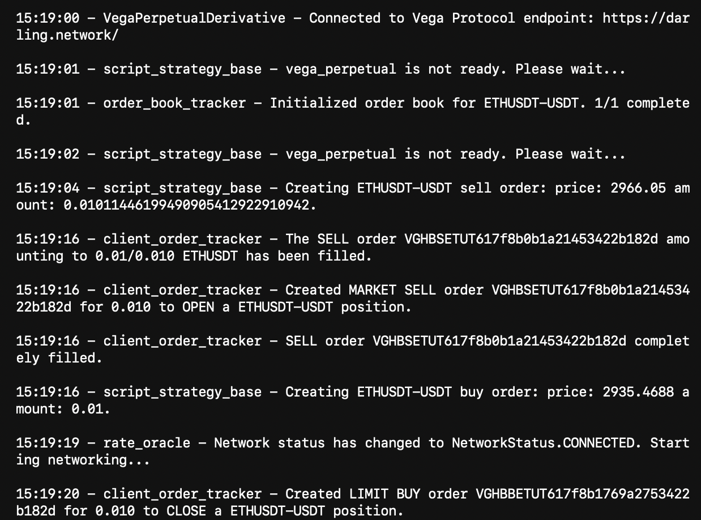](logs.png)

The bot has entered into a short position. Afterwards, it placed a buy limit stop loss order.

You can run `status` or press <kbd>CTRL</kbd> + <kbd>S</kbd> to check the real-time status of the bot:

[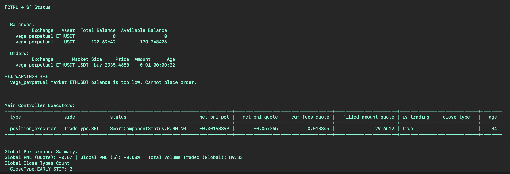](status.png)


## Vega Data Nodes

In the logs above, note that the bot connects to the Vega Protocol endpoint <https://darling.network>. This is the Vega [Data Node](https://docs.vega.xyz/testnet/concepts/vega-chain/data-nodes) that streams market data to Hummingbot.

[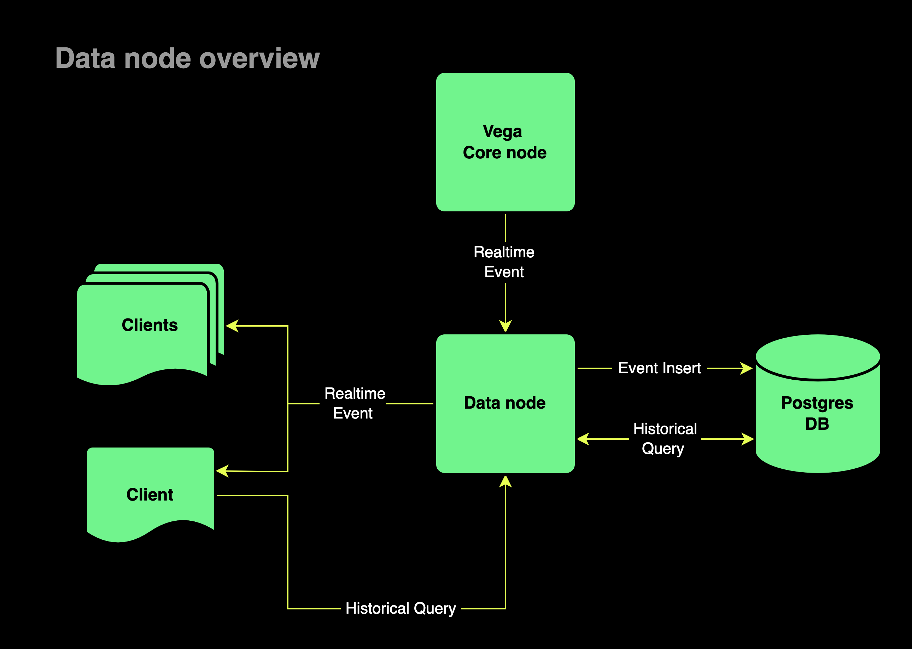](data-node.png)


### List of Data Nodes

The Vega connector in Hummingbot maintains a list of the data nodes it uses in [vega_perpetual_constants.py](https://github.com/hummingbot/hummingbot/blob/master/hummingbot/connector/derivative/vega_perpetual/vega_perpetual_constants.py). By default, the Vega connector attempts to use the lowest-latency endpoint.

To use your own data node, replace the URLs in the following sections of this file with your own data node URL:

```python
PERPETUAL_API_ENDPOINTS = [
    "https://darling.network/",
    "https://graphqlvega.gpvalidator.com/",
    "https://vega-data.bharvest.io/",
    "https://vega-data.nodes.guru:3008/",
    "https://vega-mainnet-data.commodum.io/",
    "https://vega-mainnet.anyvalid.com/",
    "https://vega.aurora-edge.com/",
    "https://vega.mainnet.stakingcabin.com:3008/",
]

PERPETUAL_GRPC_ENDPOINTS = [
    "darling.network:3007",
    "vega-data.bharvest.io:3007",
    "vega-data.nodes.guru:3007",
    "vega-mainnet.anyvalid.com:3007",
    "vega.mainnet.stakingcabin.com:3007",
]
```

### Running a Data Node

Using your own data node instead of one of the public nodes can offer significant latency benefits, but cost may be an issue. To help users decide whether to run their own data node, please see [Running a Vega Data Node](https://www.notion.so/hummingbot-foundation/Running-a-Vega-Data-Node-604e3d63e66d43ad8d9a3cfef1422092?pvs=4) for performance comparison and cost analysis of running a Vega data node with Hummingbot.

## Vega Trading Pairs

Here are various pairs on the Mainet and Vega networks and how to enter them into Hummingbot:
   
| Mainnet Trading Pairs | Hummingbot          | | Fairground Trading Pairs | Hummingbot                     |
|---------------------- |---------------------|-|--------------------------|--------------------------------|
| ETH/USDT-PERP         | ETHUSDT-USDT        | | BTC/USDT-PERP            | BTCUSDT-USDT                   |
| LDO/USDT-PERP         | LDOUSDT-USDT        | | BTCUSD.PYTH.PERP         | BTCUSDTPYTHPERPNOI-USDNOI      |
| BTC/USDT-PERP         | BTCUSDT-USDT        | | ETH/USDT-PERP            | ETHUSDT-USDT                   |
| INJ/USDT-PERP         | INJUSDT-USDT        | | JUPUSDT.PYTH.PERP        | JUPUSDTPYTHPERPNOI-USDNOI      |
| SNX/USDT-PERP         | SNXUSDT-USDT        | | INJ/USDT-PERP            | INJUSDT-USDT                   |
| SOL/USDT-PERP         | SOLUSDT-USDT        | | LDO/USDT-PERP            | LDOUSDT-USDT                   |
|                       |                     | | SNX/USDT-PERP            | SNXUSDT-USDT                   |

## Common Issues

??? info "vega_perpetual not ready"
    ```
    2024-02-14 09:59:38,522 - 1423 - hummingbot.client.hummingbot_application - INFO - Creating the clock with tick size: 1.0
    2024-02-14 09:59:38,525 - 1423 - hummingbot.client.hummingbot_application - INFO - start command initiated.
    2024-02-14 09:59:39,001 - 1423 - hummingbot.strategy.script_strategy_base - WARNING - vega_perpetual is not ready. Please wait...
    2024-02-14 09:59:40,001 - 1423 - hummingbot.strategy.script_strategy_base - WARNING - vega_perpetual is not ready. Please wait...
    2024-02-14 09:59:41,001 - 1423 - hummingbot.strategy.script_strategy_base - WARNING - vega_perpetual is not ready. Please wait...
    2024-02-14 09:59:42,000 - 1423 - hummingbot.strategy.script_strategy_base - WARNING - vega_perpetual is not ready. Please wait...
    2024-02-14 09:59:42,954 - 1423 - hummingbot.connector.derivative.vega_perpetual.vega_perpetual_derivative.VegaPerpetualDerivative - INFO - Network status has changed to NetworkStatus.CONNECTED. Starting networking...
    2024-02-14 09:59:43,001 - 1423 - hummingbot.strategy.script_strategy_base - WARNING - vega_perpetual is not ready. Please wait...
    2024-02-14 09:59:44,000 - 1423 - hummingbot.strategy.script_strategy_base - WARNING - vega_perpetual is not ready. Please wait...
    2024-02-14 09:59:45,001 - 1423 - hummingbot.strategy.script_strategy_base - WARNING - vega_perpetual is not ready. Please wait...
    2024-02-14 09:59:46,000 - 1423 - hummingbot.strategy.script_strategy_base - WARNING - vega_perpetual is not ready. Please wait...
    2024-02-14 09:59:47,000 - 1423 - hummingbot.strategy.script_strategy_base - WARNING - vega_perpetual is not ready. Please wait...
    2024-02-14 09:59:47,671 - 1423 - hummingbot.client.hummingbot_application - INFO - stop command initiated.
    2024-02-14 09:59:49,273 - 1423 - hummingbot.core.rate_oracle.rate_oracle - INFO - Network status has changed to NetworkStatus.CONNECTED. Starting networking...
    2024-02-14 09:59:53,933 - 1423 - hummingbot.client.hummingbot_application - ERROR - MQTT is already stopped!
    2024-02-14 23:45:21,966 - 684 - hummingbot.client.hummingbot_application - INFO - Creating the clock with tick size: 1.0
    2024-02-14 23:45:21,969 - 684 - hummingbot.client.hummingbot_application - INFO - start command initiated.
    2024-02-14 23:45:22,000 - 684 - hummingbot.strategy.script_strategy_base - WARNING - vega_perpetual is not ready. Please wait...
    2024-02-14 23:45:23,001 - 684 - hummingbot.strategy.script_strategy_base - WARNING - vega_perpetual is not ready. Please wait...
    2024-02-14 23:45:24,001 - 684 - hummingbot.strategy.script_strategy_base - WARNING - vega_perpetual is not ready. Please wait...
    2024-02-14 23:45:24,159 - 684 - hummingbot.connector.derivative.vega_perpetual.vega_perpetual_derivative.VegaPerpetualDerivative - INFO - Network status has changed to NetworkStatus.CONNECTED. Starting networking...
    2024-02-14 23:45:25,000 - 684 - hummingbot.strategy.script_strategy_base - WARNING - vega_perpetual is not ready. Please wait...
    2024-02-14 23:45:26,000 - 684 - hummingbot.strategy.script_strategy_base - WARNING - vega_perpetual is not ready. Please wait...
    2024-02-14 23:45:27,001 - 684 - hummingbot.strategy.script_strategy_base - WARNING - vega_perpetual is not ready. Please wait...
    2024-02-14 23:45:28,000 - 684 - hummingbot.strategy.script_strategy_base - WARNING - vega_perpetual is not ready. Please wait...
    2024-02-14 23:45:29,001 - 684 - hummingbot.strategy.script_strategy_base - WARNING - vega_perpetual is not ready. Please wait...
    2024-02-14 23:45:30,000 - 684 - hummingbot.strategy.script_strategy_base - WARNING - vega_perpetual is not ready. Please wait...
    2024-02-14 23:45:31,001 - 684 - hummingbot.strategy.script_strategy_base - WARNING - vega_perpetual is not ready. Please wait...
    2024-02-14 23:45:32,001 - 684 - hummingbot.strategy.script_strategy_base - WARNING - vega_perpetual is not ready. Please wait...
    2024-02-14 23:45:33,001 - 684 - hummingbot.strategy.script_strategy_base - WARNING - vega_perpetual is not ready. Please wait...
    2024-02-14 23:45:34,001 - 684 - hummingbot.strategy.script_strategy_base - WARNING - vega_perpetual is not ready. Please wait...
    2024-02-14 23:45:34,460 - 684 - hummingbot.connector.derivative.vega_perpetual.vega_perpetual_derivative.VegaPerpetualDerivative - INFO - Connected to Vega Protocol endpoint: https://darling.network/
    ```

- The first time you start the script the log pane might spam the message shown above, this is normal as the bot is trying to connect to the node. Just give the bot a minute or so as it tries to connect. 


??? info "Failed to submit buy order"
    ```   
    Traceback (most recent call last):
      File "/home/hummingbot/hummingbot/connector/exchange_py_base.py", line 452, in _create_order
        await self._place_order_and_process_update(order=order, **kwargs,)
      File "/home/hummingbot/hummingbot/connector/derivative/vega_perpetual/vega_perpetual_derivative.py", line 456, in _place_order_and_process_update
        exchange_order_id, update_timestamp = await self._place_order(
      File "/home/hummingbot/hummingbot/connector/derivative/vega_perpetual/vega_perpetual_derivative.py", line 543, in _place_order
        transaction = await self._auth.sign_payload(order_payload, "order_submission")
      File "/home/hummingbot/hummingbot/connector/derivative/vega_perpetual/vega_perpetual_auth.py", line 78, in sign_payload
        self._client: Client = Client(
      File "/opt/conda/envs/hummingbot/lib/python3.10/site-packages/vega/client.py", line 54, in __init__
        self._starting_block_height = self._core_data_client.LastBlockHeight(
      File "/opt/conda/envs/hummingbot/lib/python3.10/site-packages/grpc/_channel.py", line 1160, in __call__
        return _end_unary_response_blocking(state, call, False, None)
      File "/opt/conda/envs/hummingbot/lib/python3.10/site-packages/grpc/_channel.py", line 1003, in _end_unary_response_blocking
        raise _InactiveRpcError(state)  # pytype: disable=not-instantiable
    grpc._channel._InactiveRpcError: <_InactiveRpcError of RPC that terminated with:
    	status = StatusCode.UNAVAILABLE
    	details = "connection error: desc = "transport: Error while dialing: dial tcp 127.0.0.1:3002: connect: connection refused""
    	debug_error_string = "UNKNOWN:Error received from peer ipv4:54.180.211.130:3007 {created_time:"2024-02-06T12:25:12.356527762+00:00", grpc_status:14, grpc_message:"connection error: desc = \"transport: Error while dialing: dial tcp 127.0.0.1:3002: connect: connection refused\""}"
    >
    2024-02-06 12:25:12,360 - 15 - hummingbot.connector.derivative.vega_perpetual.vega_perpetual_derivative.VegaPerpetualDerivative - WARNING - Failed to submit BUY order to Vega_perpetual. Check API key and network connection. 
    ```
    Github Issue Link - [https://github.com/hummingbot/hummingbot/issues/6835](https://github.com/hummingbot/hummingbot/issues/6835)


- When using a public node, there may be instances where the bot attempts to create orders but fails. This failure could be attributed to losing connection with the node. The bot is designed to automatically attempt reconnection. However, if reconnection efforts fail, consider stopping the bot and restarting it.

??? info "Buy order amount is less than the minimum order size"
    ```
    2024-02-14 23:46:21,686 - 684 - hummingbot.connector.derivative.vega_perpetual.vega_perpetual_derivative.VegaPerpetualDerivative - WARNING - Buy order amount 0 is lower than the minimum order size 0.001. The order will not be created, increase the amount to be higher than the minimum order size.
    2024-02-14 23:46:21,690 - 684 - hummingbot.core.event.event_reporter - EVENT_LOG - {"timestamp": 1707925581.0, "order_id": "VGHBBEPUT611596998f17a44a669251c", "order_type": "OrderType.MARKET", "event_name": "MarketOrderFailureEvent", "event_source": "vega_perpetual"}
    2024-02-14 23:46:21,690 - 684 - hummingbot.strategy.script_strategy_base - INFO - Creating ETHUSDPERP-USDT buy order: price: NaN amount: 0.
    2024-02-14 23:46:21,690 - 684 - hummingbot.smart_components.executors.position_executor.position_executor - INFO - Placing close order --> Filled amount: 0 | TP Partial execution: 0
    2024-02-14 23:46:21,692 - 684 - hummingbot.connector.client_order_tracker - INFO - Order VGHBBEPUT611596998f17a44a669251c has failed. Order Update: OrderUpdate(trading_pair='ETHUSDPERP-USDT', update_timestamp=1707925581.0, new_state=<OrderState.FAILED: 6>, client_order_id='VGHBBEPUT611596998f17a44a669251c', exchange_order_id=None, misc_updates=None)
    2024-02-14 23:46:21,692 - 684 - hummingbot.connector.derivative.vega_perpetual.vega_perpetual_derivative.VegaPerpetualDerivative - WARNING - Buy order amount 0 is lower than the minimum order size 0.001. The order will not be created, increase the amount to be higher than the minimum order size.
    2024-02-14 23:46:21,763 - 684 - hummingbot.core.event.event_reporter - EVENT_LOG - {"timestamp": 1707925581.0, "order_id": "VGHBBEPUT61159699976cc44a669251c", "order_type": "OrderType.MARKET", "event_name": "MarketOrderFailureEvent", "event_source": "vega_perpetual"}
    2024-02-14 23:46:21,764 - 684 - hummingbot.strategy.script_strategy_base - INFO - Creating ETHUSDPERP-USDT buy order: price: NaN amount: 0.
    2024-02-14 23:46:21,764 - 684 - hummingbot.smart_components.executors.position_executor.position_executor - INFO - Placing close order --> Filled amount: 0 | TP Partial execution: 0
    2024-02-14 23:46:21,766 - 684 - hummingbot.connector.client_order_tracker - INFO - Order VGHBBEPUT61159699976cc44a669251c has failed. Order Update: OrderUpdate(trading_pair='ETHUSDPERP-USDT', update_timestamp=1707925581.0, new_state=<OrderState.FAILED: 6>, client_order_id='VGHBBEPUT61159699976cc44a669251c', exchange_order_id=None, misc_updates=None)
    2024-02-14 23:46:21,766 - 684 - hummingbot.connector.derivative.vega_perpetual.vega_perpetual_derivative.VegaPerpetualDerivative - WARNING - Buy order amount 0 is lower than the minimum order size 0.001. The order will not be created, increase the amount to be higher than the minimum order size.
    2024-02-14 23:46:21,771 - 684 - hummingbot.core.event.event_reporter - EVENT_LOG - {"timestamp": 1707925581.0, "order_id": "VGHBBEPUT61159699a97aa44a669251c", "order_type": "OrderType.MARKET", "event_name": "MarketOrderFailureEvent", "event_source": "vega_perpetual"}
    2024-02-14 23:46:21,771 - 684 - hummingbot.strategy.script_strategy_base - INFO - Creating ETHUSDPERP-USDT buy order: price: NaN amount: 0.
    2024-02-14 23:46:21,772 - 684 - hummingbot.smart_components.executors.position_executor.position_executor - INFO - Placing close order --> Filled amount: 0 | TP Partial execution: 0
    2024-02-14 23:46:21,773 - 684 - hummingbot.connector.client_order_tracker - INFO - Order VGHBBEPUT61159699a97aa44a669251c has failed. Order Update: OrderUpdate(trading_pair='ETHUSDPERP-USDT', update_timestamp=1707925581.0, new_state=<OrderState.FAILED: 6>, client_order_id='VGHBBEPUT61159699a97aa44a669251c', exchange_order_id=None, misc_updates=None)
    2024-02-14 23:46:21,806 - 684 - hummingbot.connector.derivative.vega_perpetual.vega_perpetual_derivative.VegaPerpetualDerivative - WARNING - Buy order amount 0 is lower than the minimum order size 0.001. The order will not be created, increase the amount to be higher than the minimum order size.
    2024-02-14 23:46:21,813 - 684 - hummingbot.core.event.event_reporter - EVENT_LOG - {"timestamp": 1707925581.0, "order_id": "VGHBBEPUT61159699ab4c344a669251c", "order_type": "OrderType.MARKET", "event_name": "MarketOrderFailureEvent", "event_source": "vega_perpetual"}
    2024-02-14 23:46:21,814 - 684 - hummingbot.strategy.script_strategy_base - INFO - Creating ETHUSDPERP-USDT buy order: price: NaN amount: 0.
    2024-02-14 23:46:21,814 - 684 - hummingbot.smart_components.executors.position_executor.position_executor - INFO - Placing close order --> Filled amount: 0 | TP Partial execution: 0
    2024-02-14 23:46:21,816 - 684 - hummingbot.connector.client_order_tracker - INFO - Order VGHBBEPUT61159699ab4c344a669251c has failed. Order Update: OrderUpdate(trading_pair='ETHUSDPERP-USDT', update_timestamp=1707925581.0, new_state=<OrderState.FAILED: 6>, client_order_id='VGHBBEPUT61159699ab4c344a669251c', exchange_order_id=None, misc_updates=None)
    2024-02-14 23:46:21,817 - 684 - hummingbot.connector.derivative.vega_perpetual.vega_perpetual_derivative.VegaPerpetualDerivative - WARNING - Buy order amount 0 is lower than the minimum order size 0.001. The order will not be created, increase the amount to be higher than the minimum order size.
    2024-02-14 23:46:21,862 - 684 - hummingbot.core.event.event_reporter - EVENT_LOG - {"timestamp": 1707925581.0, "order_id": "VGHBBEPUT61159699b5bdf44a669251c", "order_type": "OrderType.MARKET", "event_name": "MarketOrderFailureEvent", "event_source": "vega_perpetual"}
    2024-02-14 23:46:21,862 - 684 - hummingbot.strategy.script_strategy_base - INFO - Creating ETHUSDPERP-USDT buy order: price: NaN amount: 0.
    2024-02-14 23:46:21,863 - 684 - hummingbot.smart_components.executors.position_executor.position_executor - INFO - Placing close order --> Filled amount: 0 | TP Partial execution: 0
    ```

- This is a known issue where the bot tries to close the position but is unable to capture the order amount - there should be a fix implemented soon. 

## Vega Links

- [Vega Mainnet](https://vegaprotocol.eth.limo/#/markets)
- [Vega Testnet](https://vegafairground.eth.limo/)
- [Vega Faucet](https://www.infura.io/faucet/sepolia)
- [Vega Metamask Snaps integration](https://github.com/vegaprotocol/vega-snap)
- [Vega Wallet Docs](https://docs.vega.xyz/mainnet/tools/vega-wallet)
