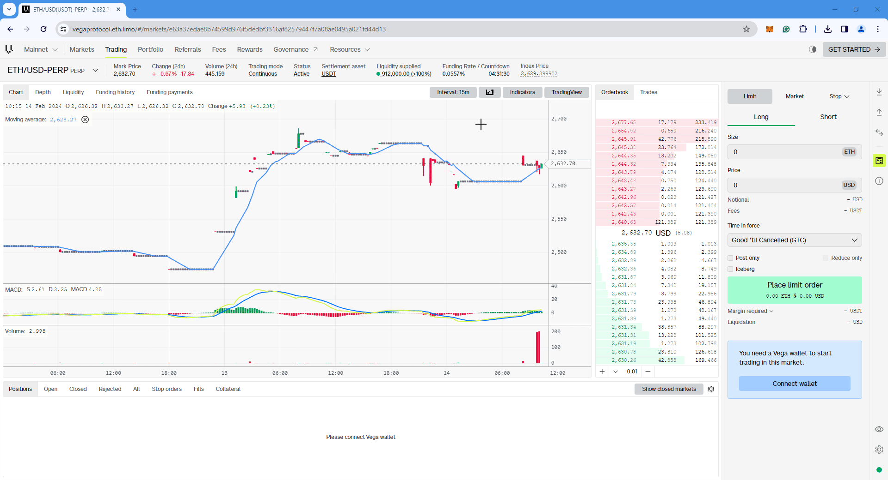
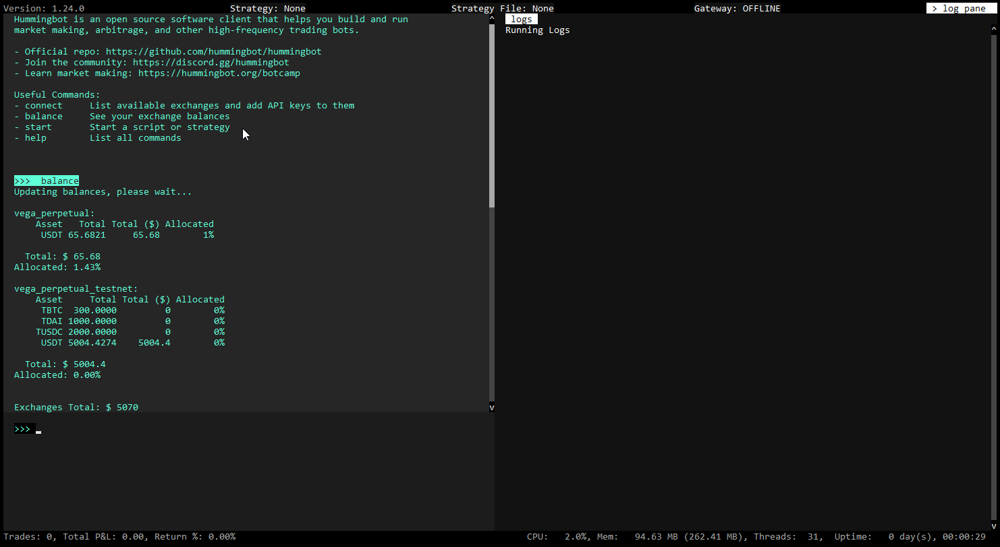

# User Guide: Using Vega Protocol with Hummingbot


## Introduction

Welcome to our user tutorial on integrating the power of **Vega Protocol** with **Hummingbot** for your trading journey. In this guide, we'll walk you through the detailed steps required to seamlessly set up a Vega Wallet, link it with Hummingbot, and embark on your trading adventures. 

Whether you're new to automated trading or looking to leverage Vega Protocol's decentralized trading capabilities, this guide is designed to provide you with all the information you need to get started. Let's dive into the world of blockchain-based trading with **Vega Protocol** and **Hummingbot**, and unlock new possibilities in your trading strategy.

<!-- more -->

## Prerequisites

### Create a Vega Wallet

A **Vega Wallet** is essential for interacting with Vega, whether it's for staking or trading. The Vega Wallet apps allow you to manage wallets and key pairs, deposit and withdraw assets, stake, and sign transactions. There are several options for creating a Vega Wallet, including **Chrome/Firefox** browser extensions, or a **desktop/CLI** app. 

If you have an existing Metamask account, you can set up a Vega Key through **Metamask Snaps**, which we recommend below.

<br>

**Metamask Snap** (recommended)

For those using the MetaMask extension on **Chrome** or **Firefox**, there's no need to set up a separate Vega Wallet to generate and utilize a Vega key. Simply launch Chrome or Firefox and visit the [Vega Console](https://console.vega.xyz/).

**Let's Begin!**

[](metamask_snap_01.gif)


**Steps:**

- Click on **Getting Started** in the top right corner or **Connect Wallet** at the bottom right corner.

- You should get a popup on the screen, select the second option **Install Vega Metamask Snap**

- Metamask will open a series of requests pop-ups, review them and Approve

- Once this is done, go back to the previous popup and click on **Connect via Metamask Snap** 

- You should get a popup saying **Successfully Connected** and you're now ready to deposit or transfer assets and use your new Vega keypair.

<br>

**Alternate Vega Wallet Setup Methods**

**Browser Extension**

- [Chrome extension:](https://chrome.google.com/webstore/detail/vega-wallet-mainnet/codfcglpplgmmlokgilfkpcjnmkbfiel)

- [Firefox extension:](https://addons.mozilla.org/en-GB/firefox/addon/vega-wallet-mainnet/)


**Desktop Wallet**

- [Download the app:](https://github.com/vegaprotocol/vegawallet-desktop/releases) On GitHub, download the desktop app for your operating system.

- [Get started:](https://docs.vega.xyz/mainnet/tools/vega-wallet/desktop-app/getting-started) Read a guide on using the desktop app to connect an existing Vega wallet, create or restore a wallet and start interacting with your keys.


<br>

### Deposit Funds

Follow these steps to deposit and fund your wallet for trading on Vega:

!!! Note
    Please ensure your wallet has sufficient balance, including ETH for gas fees 

[](metamask_deposit.gif)

**Steps:**

- Navigate to the **Deposit** button located on the right-hand side of the screen to begin the deposit process.

- If it's your first time depositing a particular token, you'll need to approve it. Click **Approve** and then confirm this action in MetaMask.

- Choose the token you wish to deposit from the dropdown menu, enter the amount, and then click **Deposit** to proceed.

- Wait for the blockchain to confirm the transaction. Once confirmed, your deposited balance will be visible in the **Order** section, ready for trading.

<br>

## Install Hummingbot

There are two main methods to install Hummingbot:

### Docker

For most new users, we recommend installing Hummingbot using Docker.

- [Docker Quickstart Guide](https://hummingbot.org/academy-content/docker-installation-guide/)

### Source

We recommend installing Hummingbot from source if you meet any of the following criteria:

- You want to customize or extend the Hummingbot codebase.
- You want to build new components like connectors or strategies.
- You want to learn how Hummingbot works at a deeper, technical level.

Guides for various environments:

  - [Linux](../../../installation/linux.md)
  - [Windows](../../../installation/windows.md)
  - [MacOS](../../../installation/mac.md)

<br>

## Connect your Vega Wallet to Hummingbot

To connect your Vega Wallet to Hummingbot and unlock full trading capabilities, you need two important pieces of information: your **Snap Key** (also known as Vega Party ID) and your **wallet seed phrase**. Here's how you can find and use them:

### Snap Key (Vega Party ID)

After connecting your Vega Wallet, look for your **Snap Key** in the top right corner of the screen. The Snap Key is crucial as it acts as your **Vega Party ID**, which will be required when setting up the wallet connection in Hummingbot.

[](snap_key.png)

The Snap Key section, when clicked, automatically copies the address to your clipboard which you can then paste when prompted for the **Vega Party ID** in Hummingbot.

[](metamask_snap_02.gif)

### Metamask Wallet Seed Phrase (Secret Recovery Phrase)

Your **wallet seed phrase** is a separate piece of information, typically a series of words provided when you initially set up your wallet. This phrase acts as a backup to access your wallet and should be kept secure and private. 

When connecting your Vega Wallet to Hummingbot, you will be prompted to enter this seed phrase as part of the authentication and setup process.

Here's how to get your **wallet seed phrase** from Metamask

{: style="height:497px;width:296px"} &nbsp;&nbsp;&nbsp;&nbsp; {: style="height:497px;width:296px"}

**Retrieving your wallet seed phrase from Metamask:**

- Navigate to the three-dot menu at the top right and select **Settings** > **Security & Privacy**.
- Choose **Reveal Secret Recovery Phrase**.
- Confirm your identity by answering two security questions, then enter your Metamask password and click **Next**.
- Press the **Hold to Reveal SRP** button to view your wallet seed phrase.


**Security Notice:** Your wallet seed phrase is extremely sensitive. Keep it confidential and never share it online or with anyone you don't trust. Always ensure you're in a secure and private environment when handling your seed phrase.

<br>

## Launch Hummingbot

To get started, run the Hummingbot client and then enter the **connect** command in the Hummingbot terminal to connect to the Vega Wallet

```
connect vega_perpetual

```

or if you are connecting to the Vega testnet

```
connect vega_perpetual_testnet

```

[](image4.png)

Once connected, you can verify the connection by checking if your Vega Wallet's balance is visible in Hummingbot by running the **balance** command. This confirms the integration is successful and your wallet is ready for use.

```
balance
```


[](image12.png)

## Starting Your first script

```
start --script v2_dman_v3_multiple_exchanges.py
```

## Modifying the Script

Locate the **/scripts** folder and open the **v2_dman_v3_multiple_exchanges.py** file using a text editor or and IDE like [Visual Studio Code](https://code.visualstudio.com/)

When entering trading pairs into Hummingbot, you'll just need to remove the "/" from the trading pair names. See screenshot or refer to the table below which shows the available trading pairs on Vega and how they should be entered in Hummingbot. 


| Vega Trading Pairs | Hummingbot      |
|--------------------|-----------------|
| ETH/USD-PERP       | ETHUSD-PERP     |
| LDO/USD-PERP       | LDOUSD-PERP     |
| BTC/USD-PERP       | BTCUSD-PERP     |
| INJ/USDT-PERP      | INJUSDT-PERP    |
| SNX/USDT-PERP      | SNXUSDT-PERP    |


## Known Issues

When using a public node, there may be instances where the bot attempts to create orders but fails. This failure could be attributed to losing connection with the node. The bot is designed to automatically attempt reconnection. However, if reconnection efforts fail, consider stopping the bot and restarting it.

Below is an example of an error message you might receive if the bot loses connection to the node:

??? info "Sample Error Message"
    ```   
    Traceback (most recent call last):
      File "/home/hummingbot/hummingbot/connector/exchange_py_base.py", line 452, in _create_order
        await self._place_order_and_process_update(order=order, **kwargs,)
      File "/home/hummingbot/hummingbot/connector/derivative/vega_perpetual/vega_perpetual_derivative.py", line 456, in _place_order_and_process_update
        exchange_order_id, update_timestamp = await self._place_order(
      File "/home/hummingbot/hummingbot/connector/derivative/vega_perpetual/vega_perpetual_derivative.py", line 543, in _place_order
        transaction = await self._auth.sign_payload(order_payload, "order_submission")
      File "/home/hummingbot/hummingbot/connector/derivative/vega_perpetual/vega_perpetual_auth.py", line 78, in sign_payload
        self._client: Client = Client(
      File "/opt/conda/envs/hummingbot/lib/python3.10/site-packages/vega/client.py", line 54, in __init__
        self._starting_block_height = self._core_data_client.LastBlockHeight(
      File "/opt/conda/envs/hummingbot/lib/python3.10/site-packages/grpc/_channel.py", line 1160, in __call__
        return _end_unary_response_blocking(state, call, False, None)
      File "/opt/conda/envs/hummingbot/lib/python3.10/site-packages/grpc/_channel.py", line 1003, in _end_unary_response_blocking
        raise _InactiveRpcError(state)  # pytype: disable=not-instantiable
    grpc._channel._InactiveRpcError: <_InactiveRpcError of RPC that terminated with:
    	status = StatusCode.UNAVAILABLE
    	details = "connection error: desc = "transport: Error while dialing: dial tcp 127.0.0.1:3002: connect: connection refused""
    	debug_error_string = "UNKNOWN:Error received from peer ipv4:54.180.211.130:3007 {created_time:"2024-02-06T12:25:12.356527762+00:00", grpc_status:14, grpc_message:"connection error: desc = \"transport: Error while dialing: dial tcp 127.0.0.1:3002: connect: connection refused\""}"
    >
    2024-02-06 12:25:12,360 - 15 - hummingbot.connector.derivative.vega_perpetual.vega_perpetual_derivative.VegaPerpetualDerivative - WARNING - Failed to submit BUY order to Vega_perpetual. Check API key and network connection. 
    ```
    Github Issue Link - [https://github.com/hummingbot/hummingbot/issues/6835](https://github.com/hummingbot/hummingbot/issues/6835)


<br>

**[Placeholder for additional Vega info]**

<br>

## Additional Resources

- Vega Mainnet: [Explore Markets](https://vegaprotocol.eth.limo/#/markets)

- Vega Testnet: [Join the Testnet](https://vegafairground.eth.limo/)

- Testnet Faucet: [Get Testnet Tokens](https://www.infura.io/faucet/sepolia)


For a comprehensive list of Vega Wallet alternatives and more about Vega Snaps, visit the [Vega Wallet intro page](https://docs.vega.xyz/mainnet/tools/vega-wallet).


**Snaps Resources:**

- [Github](https://github.com/vegaprotocol/vega-snap) link to the source code for the Vega snap integration

- [Metamask Snaps](https://metamask.io/snaps/) - link to documentation


