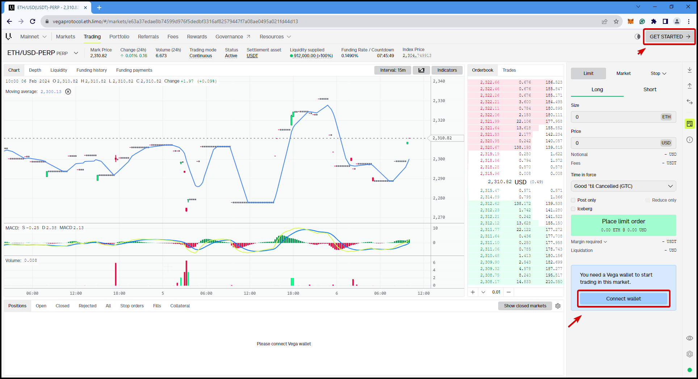
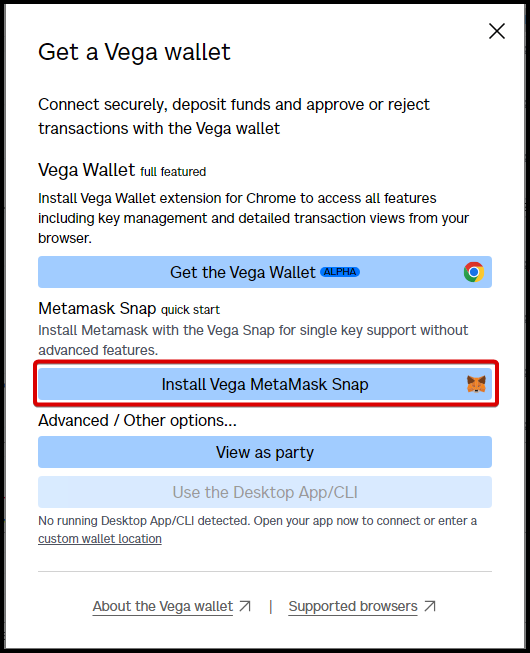
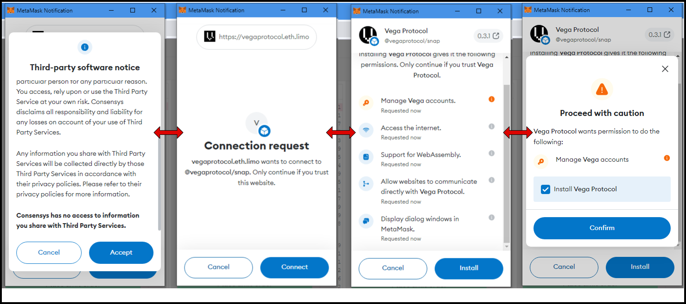
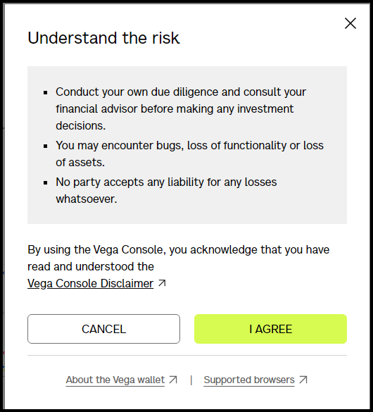
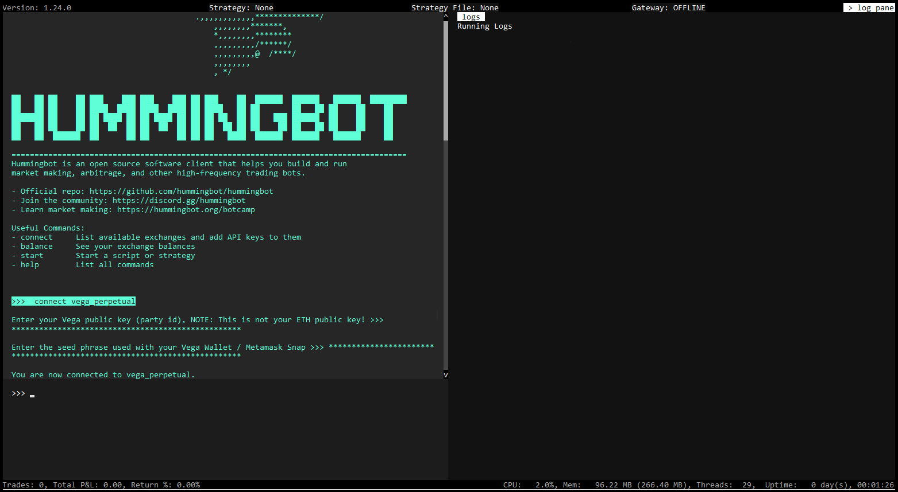

# User Guide: Using Vega Protocol with Hummingbot


## Introduction

Welcome to our comprehensive tutorial on integrating the power of Vega Protocol with Hummingbot for your trading journey. In this guide, we'll walk you through the detailed steps required to seamlessly set up a Vega Wallet, link it with Hummingbot, and embark on your trading adventures. 

Whether you're new to automated trading or looking to leverage Vega Protocol's decentralized trading capabilities, this guide is designed to provide you with all the information you need to get started. Let's dive into the world of blockchain-based trading with Vega Protocol and Hummingbot, and unlock new possibilities in your trading strategy.

<!-- more -->

## Prerequisites

### **Creating a Vega Wallet**

**Metamask Snap (easiest method)**

If you're already a MetaMask user, you won't need to create a Vega Wallet to create and use a Vega key.

Once you have Metamask installed, open either Chrome or Firefox and go to [Vega Console](https://console.vega.xyz/)

Click on either "Getting Started" at the top right or "Connect Wallet" at the bottom right

[](image0.png)

You should get a popup on the screen, select the second option "Install Vega Metamask Snap"

[](image2.png)

Metamask will open a series of requests pop-ups, review them and then click "Connect", "Install", "Confirm"

[](image1.png)

Once this is done, click on "Get Started" or if you still have the popup open then select "Connect via Metamask Snap" one more time. You should get a prompt on the screen and click "I Agree" to continue

[](image3.png)


Once installed and connected to the site, you will see your `SNAP KEY` in the top right with the option, when clicked, to copy the address, this is your `Vega Party ID` which will be used within the system when configuring Hummingbot.

You're now ready to deposit or transfer assets and use your new Vega keypair.

## Deposit 


## **Installing Hummingbot**

### Download and install Docker

Follow the instructions specific to your operating system by clicking through the tabs below.

<Tabs groupId="operating-systems">
<TabItem value="windows" label="Windows">

You'll need Windows 10 64-bit: Pro, Enterprise, or Education (Build 15063 or later) to install Docker Desktop.

**For Windows devices**:

- Download Docker Desktop for Windows.

**Installation requirements**:

- The WSL 2 feature must be enabled on your machine.
- Virtualization must be enabled in BIOS.

**Post-installation steps**:

After installation, Docker will ask you to log out and log back in so that your newly acquired Docker group permissions are applied.

You'll then need to go to the Microsoft Store and download Ubuntu (versions 20.04 - 23.04 should work).

Once Ubuntu is setup and installed you may follow the next steps using the Ubuntu terminal

</TabItem>
<TabItem value="mac" label="MacOS">

You'll need macOS Sierra 10.12 or newer to install Docker Desktop on your Mac.

**For MacOS devices**:

- Download Docker Desktop for Mac.

**Installation requirements**:

- Mac hardware must be a 2010 or a newer model, with Intel’s hardware support for memory management unit (MMU) virtualization, including Extended Page Tables (EPT) and Unrestricted Mode.
- You must have at least 4GB of RAM.

**Post-installation steps**:

Docker Desktop does not start automatically after installation. To start Docker Desktop, search for Docker, and select Docker Desktop in the search results.

For detailed installation instructions, see the [Docker Mac installation guide](https://docs.docker.com/docker-for-mac/install/).

</TabItem>

<TabItem value="linux" label="Linux">

Docker can be installed on various Linux distributions. The most commonly used distribution is Ubuntu

**For Linux devices**:

- Use the following command to install the latest updates and run the Docker install script:

```bash

sudo apt update && sudo apt upgrade -y
curl -fsSL https://get.docker.com -o get-docker.sh
sudo sh get-docker.sh

```

**Post-installation steps**:

To run Docker without sudo, you need to add your user to the "docker" group:

```bash
sudo usermod -aG docker your-user
```

Remember to log out and back in for this to take effect!

For detailed installation instructions, refer to the [Docker Linux installation guide](https://docs.docker.com/engine/install/).

</TabItem>
</Tabs>


### Using Docker Compose to launch Hummingbot

The [deploy-examples](https://github.com/hummingbot/deploy-examples) Github repository provides various examples of how to deploy Hummingbot using Docker Compose, a tool for defining and running multi-container Docker applications.

Clone the repo to the machine where you want to deploy Hummingbot:

```
git clone https://github.com/hummingbot/deploy-examples.git
cd deploy-examples/simple_hummingbot_compose
```

Run the following command to pull the image and start the instance:

```
docker compose up -d
```

After the images have been downloaded, you should see the following output:

```
[+] Running 1/1
 ⠿ Container hummingbot  Started 
```

Run this command from your root folder to grant read/write permission to the hummingbot_files sub-folder:

```
sudo chmod -R a+rw ./hummingbot_files

```

Run this command to copy the sample scripts into the scripts folder. Any new scripts you add here will also be available to your hummingbot instance.

```
docker cp hummingbot:/home/hummingbot/scripts-copy/. ./hummingbot_files/scripts/

```

Attach to the Hummingbot instance: 

```
docker attach hummingbot
```


## Setting Up Your Trading Environment

**Connecting Vega Wallet to Hummingbot**
In order to connect your Vega Wallet to Hummingbot you'll need your `SNAP KEY` also known as `Vega Party ID` and your wallet seed phrase. 

To connect your Vega Wallet, launch Hummingbot and then run the command below in the Hummingbot terminal

`connect vega_perpetual`

or if you are connecting to the testnet

`connect vega_perpetual_testnet`


You'll be prompted to enter in your Vega public key (party ID) - this can be found in the top right of the screen where it says "SNAP KEY". This is your Vega Party ID

Next, enter in the wallet seed phrase and if the credentials are valid you should get the message 
"You are now connected to Vega Perpetual"

[](image4.png)

## Starting Your First Trade

- Step-by-step guide to starting your first trade.
- Monitoring trades and understanding Hummingbot logs.
- Analyzing market conditions and choosing a trading pair.

2. **Executing Trades with Hummingbot**

## Advanced Tips and Best Practices

- Strategies for successful trading on Vega Protocol.
- Security best practices for managing your Vega Wallet and Hummingbot.
- Optimizing Hummingbot performance for Vega trading.

## Troubleshooting and Support

**FAQ**

**I can't see assets I've previously deposited**

- If this is your first time using Snap with Vega, but you have previously deposited assets on a different Vega key, you'll need to deposit new assets, or transfer assets to the new keys created by your snap. You can copy your Vega snap public key from within Vega Console.

**Can I create more than one key pair with Vega snap?**

- You can only create one keypair derived from your MetaMask seed, though this may change in the future.

**How do I recover my Vega keys?**

- The Vega keypairs created with snap are derived from the MetaMask seed. Use your MetaMask recovery phrase to recover those Vega keys, and any assets added to them.

**Other ways to set up Vega keys**

- For a full list of alternatives, please check out the [Vega Wallet](https://docs.vega.xyz/mainnet/tools/vega-wallet) intro page

**Limitations**

The Vega Protocol (Metamask) snap cannot:

- Connect to an existing Vega Wallet or keypair, you'll need to start with a new keypair
- Cannot show your Vega assets or their balances in MetaMask
- To see your balances, rewards, or deposit, withdraw or transfer assets between keys, you'll need to interact with Console or the governance dApp
- Rename, import, or export keys
- Show a list of previous transactions


**Snaps Resources:**
- [Github](https://github.com/vegaprotocol/vega-snap) link to the source code for the Vega snap integration

- [Metamask Snaps](https://metamask.io/snaps/) - link to documentation
