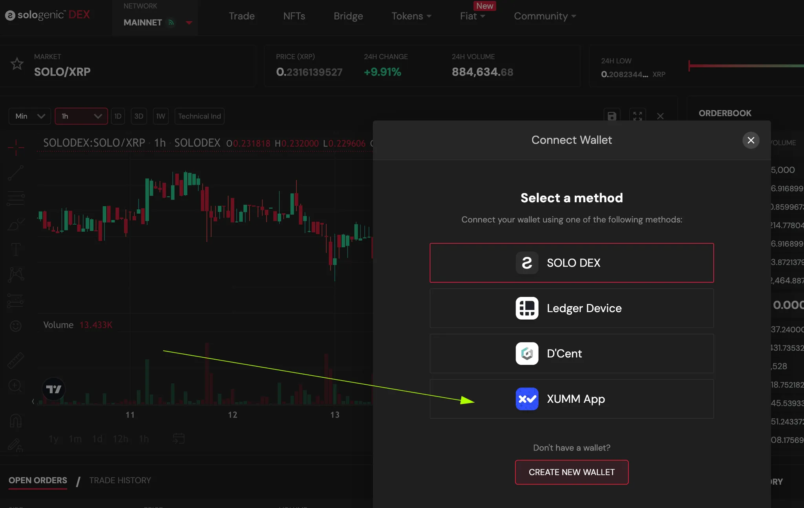
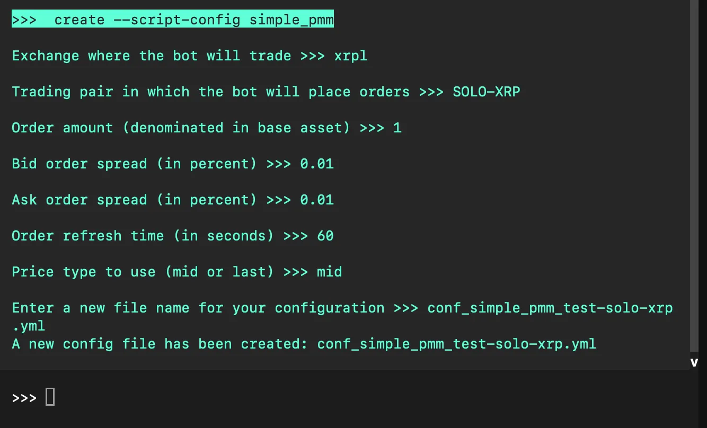
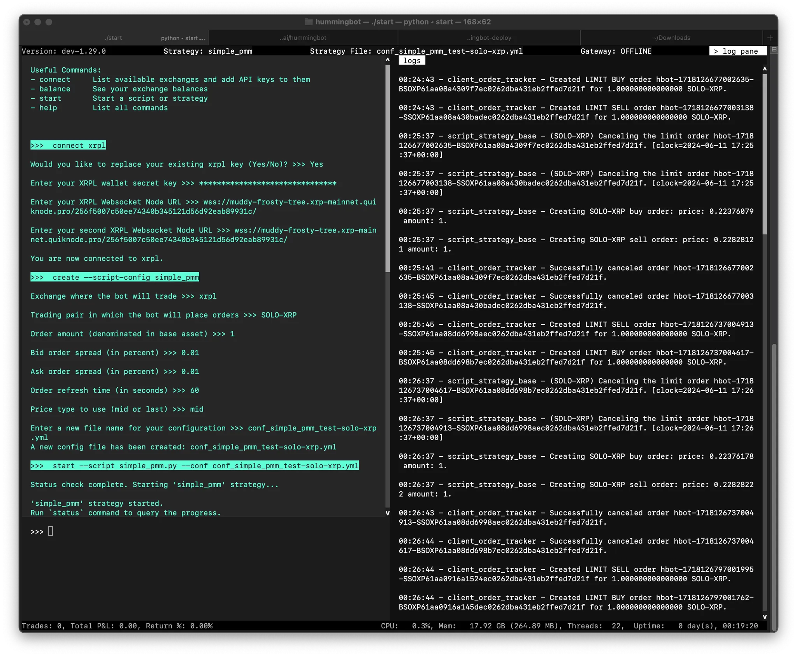

# 🪙 Using XRP Ledger with Hummingbot


## 📘 What you’ll learn

This step-by-step guide shows you how to:

1. Create an XRPL wallet (two methods: beginner and developer).

2. Import that wallet into Xaman (formerly XUMM).

3. Connect Xaman to Sologenic for easy trading.

4. Link your XRPL wallet to Hummingbot, then check your balance.

5. Tweak the XRPL connector file (add private nodes or custom markets).

6. Run a simple PMM strategy on the XRPL DEX.


<!-- more -->

No previous coding experience is required—the commands are copy-and-paste.

## 🧾 Create an XRPL Wallet

There are two ways to generate your XRP wallet credentials:

* ✅ **Beginner-Friendly**: Use the [XRPL Testnet Faucet](https://xrpl.org/xrp-testnet-faucet.html)
* 🛠️ **Developer-Friendly**: Run an automated wallet script via your terminal


### **Generate Wallet Using Faucet Site** 

Visit the official XRPL Testnet Faucet:
   [https://xrpl.org/xrp-testnet-faucet.html](https://xrpl.org/xrp-testnet-faucet.html)

Select `Testnet` from the dropdown and click **Generate Testnet Credentials**.

   [](faucet.webp)

Copy the **Wallet Address** and **Secret Key** somewhere safe.

> ⚠️ **Keep these two values private.** Anyone who has them can control your funds.


<br>


### **Generate Wallet via Script** 

Open your terminal (Linux, macOS, or WSL on Windows).

Run the following command:

   ```bash
   curl -s https://gist.githubusercontent.com/david-hummingbot/a040f9af46b5d627f9437f04a04fc4ec/raw/1aab1f428b834eafcdc06a1c88d6dbd47afbf551/create_xrp_wallet.sh | bash
   ```

After the script completes, you’ll see output similar to:

   [](script.png)

Copy all four lines to a safe place (password manager, encrypted notes, etc.).

!!! note "Having trouble?"
The script tries to install its own dependencies (Node.js, npm).
If that fails or you’re unsure, use the faucet instead.

<br>


## Install Xaman (mobile wallet)

Download and install the Xaman app (formerly XUMM) from the below links:

- [Download from the App Store](https://apps.apple.com/us/app/xumm/id1492302343)

- [Download from Google Play](https://play.google.com/store/apps/details?id=com.xrpllabs.xumm)

If you need additional info on how to install follow this guide [here:](https://help.xaman.app/app/getting-started-with-xaman/installing-xumm)

## Import your XRPL account into Xaman 

From the main screen of Xaman, press the **Settings** button, choose **Accounts**, then press `Add account`

   [](xaman1.png)

Press the Import an existing account button

   [](xaman2.png)

You can import an XRP Ledger account in either of these two modes:

- Full access - Choose this option if you would like to be able to interact with your XRPL account. ie. if you would like to create a Trust Line or send XRP to another account.

- Read only access - Choose this option if you would like to simply follow the activity of an XRPL account. This option does not allow you to sign transactions on your account.    

For now, choose **Full access** and press the Next button.

 [](xaman3.png)

Choose **Family Seed** then press Next

A Family seed is a string of numbers and letters that is 29 characters long that starts with the letter `s`

For example: `s4rj7hy5vdth65f4fy89hg4ffh77hg`

[](xaman4.png)

Enter your Family seed then press Next. 


[](xaman5.png)

Please ensure that r-address that is displayed is the one that you intend to import. If it is not correct, please press the **back** button, then double check and re-enter your Family seed. When the correct r-address is displayed, press the **Confirm** button.

[](xaman6.png)


Once you decide on the security level, select it and press Next then enter the account label and press Next to complete the import process

## Connect Xaman to Sologenic

To add wallet to [Sologenic DEX](sologenic.org) mainnet we'll use the Xaman app to connect 

Click **Connect Wallet** and choose **Xaman/XUMM**.

[](sologenic.webp)

A QR code appears—scan it with Xaman to link the wallet.

You’re ready to trade on the Sologenic DEX!

## Add your wallet to Hummingbot

- Launch Hummingbot.
- Run `connect xrpl`.

Provide:

   * **Wallet secret key** (the seed that starts with `s`).

   * **XRPL node URL(s)**—use the defaults or your own private nodes.


[](connect.webp)


Afterwards, run the `balance` command. If your keys are correct and the node is online, you should see your XRPL balances:

```
Symbol Balance
    USD  23.4359
    XRP 138.2416

```

## Modify the XRPL configuration file

Open the newly created `/conf/connectors/xrpl.yml` file with any IDE or text editor

[](conf.webp)

This file contains your encrypted XRPL credentials, as well as other configuration settings for the XRPL connector:

```
connector: xrpl

xrpl_secret_key: 7b2263727970746f223a207b226363125532223a20226165732d3132382d637472222876434586572706172616d73223a207b226976223a20226231613939313361626139353237393664623637373864653735346339653734234265547368657274657874223a20223766646530343233616361303036306430653437653461643539336563393337336434326534313334376239656534663637383733316261363130323332222c20226b6466223a202270626b646632222c20226b68534565478172616d73223a207b2263223a20313030303030302c2022646b6c656e223a2033322c2022707266223a2022686d61632d736861323536222c202273616c74223a20223866373731303365383935363765303937666663653330646134313063346436227d2c20226d6163223a2022666331373163653132363435646665353939616565306265646161343238626162625464564332326466303936623930626663663231613634646538346339316437227d2c202276657273696f6e223a20332c2112616c696173223a2022227d

custom_markets:
  SOLO-XRP:
    base: SOLO
    quote: XRP
    base_issuer: rsoLo2S1kiGeCcn6hCUXVrCpGMWLrRrLZz
    quote_issuer: ''

wss_node_url: wss://s1.ripple.com/

wss_second_node_url: wss://s1.ripple.com/
```


### Set your XRPL node

The default XRPL node used by Humingbot is `wss://s1.ripple.com/`

- This is a public node that may get rate limited pretty easily, so we recommend getting a private shared node, which some node providers offer for free

For a free private shared node, try - [https://www.quicknode.com/](https://www.quicknode.com)

For a list of public nodes, please check them at - [https://xrpl.org/public-servers.html](https://xrpl.org/public-servers.html)

### Add or override trading pairs

- Please check if your trading pairs can be found in this list (most of them are from [https://gatehub.net/markets](https://gatehub.net/markets)):


<details>
<summary>View full list of default markets with issuer addresses (click to expand)</summary>

```ts
MARKETS = {
    "XRP-USD": {
        "base": "XRP",
        "quote": "USD",
        "base_issuer": "",
        "quote_issuer": "rhub8VRN55s94qWKDv6jmDy1pUykJzF3wq",
    },
    "XRP-EUR": {
        "base": "XRP",
        "quote": "EUR",
        "base_issuer": "",
        "quote_issuer": "rhub8VRN55s94qWKDv6jmDy1pUykJzF3wq",
    },
    "XRP-GBP": {
        "base": "XRP",
        "quote": "GBP",
        "base_issuer": "",
        "quote_issuer": "r4GN9eEoz9K4BhMQXe4H1eYNtvtkwGdt8g",
    },
    "XRP-BTC": {
        "base": "XRP",
        "quote": "BTC",
        "base_issuer": "",
        "quote_issuer": "rchGBxcD1A1C2tdxF6papQYZ8kjRKMYcL",
    },
    "XRP-ETH": {
        "base": "XRP",
        "quote": "ETH",
        "base_issuer": "",
        "quote_issuer": "rcA8X3TVMST1n3CJeAdGk1RdRCHii7N2h",
    },
    "XRP-LTC": {
        "base": "XRP",
        "quote": "LTC",
        "base_issuer": "",
        "quote_issuer": "rcRzGWq6Ng3jeYhqnmM4zcWcUh69hrQ8V",
    },
    "XRP-CNY": {
        "base": "XRP",
        "quote": "CNY",
        "base_issuer": "",
        "quote_issuer": "rKiCet8SdvWxPXnAgYarFUXMh1zCPz432Y",
    },
    "XRP-BCH": {
        "base": "XRP",
        "quote": "BCH",
        "base_issuer": "",
        "quote_issuer": "rcyS4CeCZVYvTiKcxj6Sx32ibKwcDHLds",
    },
    "XRP-ETC": {
        "base": "XRP",
        "quote": "ETC",
        "base_issuer": "",
        "quote_issuer": "rDAN8tzydyNfnNf2bfUQY6iR96UbpvNsze",
    },
    "XRP-DSH": {
        "base": "XRP",
        "quote": "DSH",
        "base_issuer": "",
        "quote_issuer": "rcXY84C4g14iFp6taFXjjQGVeHqSCh9RX",
    },
    "XRP-XAU": {
        "base": "XRP",
        "quote": "XAU",
        "base_issuer": "",
        "quote_issuer": "rcoef87SYMJ58NAFx7fNM5frVknmvHsvJ",
    },
    "XRP-SGB": {
        "base": "XRP",
        "quote": "SGB",
        "base_issuer": "",
        "quote_issuer": "rctArjqVvTHihekzDeecKo6mkTYTUSBNc",
    },
    "XRP-USDT": {
        "base": "XRP",
        "quote": "USDT",
        "base_issuer": "",
        "quote_issuer": "rcvxE9PS9YBwxtGg1qNeewV6ZB3wGubZq",
    },
    "XRP-USDC": {
        "base": "XRP",
        "quote": "USDC",
        "base_issuer": "",
        "quote_issuer": "rcEGREd8NmkKRE8GE424sksyt1tJVFZwu",
    },
    "XRP-WXRP": {
        "base": "XRP",
        "quote": "WXRP",
        "base_issuer": "",
        "quote_issuer": "rEa5QY8tdbjgitLyfKF1E5Qx3VGgvbUhB3",
    },
    "XRP-GALA": {
        "base": "XRP",
        "quote": "GALA",
        "base_issuer": "",
        "quote_issuer": "rf5YPb9y9P3fTjhxNaZqmrwaj5ar8PG1gM",
    },
    "XRP-FLR": {
        "base": "XRP",
        "quote": "FLR",
        "base_issuer": "",
        "quote_issuer": "rcxJwVnftZzXqyH9YheB8TgeiZUhNo1Eu",
    },
    "XRP-XAH": {
        "base": "XRP",
        "quote": "XAH",
        "base_issuer": "",
        "quote_issuer": "rswh1fvyLqHizBS2awu1vs6QcmwTBd9qiv",
    },
    "USD-XRP": {
        "base": "USD",
        "quote": "XRP",
        "base_issuer": "rhub8VRN55s94qWKDv6jmDy1pUykJzF3wq",
        "quote_issuer": "",
    },
    "USD-EUR": {
        "base": "USD",
        "quote": "EUR",
        "base_issuer": "rhub8VRN55s94qWKDv6jmDy1pUykJzF3wq",
        "quote_issuer": "rhub8VRN55s94qWKDv6jmDy1pUykJzF3wq",
    },
    "USD-GBP": {
        "base": "USD",
        "quote": "GBP",
        "base_issuer": "rhub8VRN55s94qWKDv6jmDy1pUykJzF3wq",
        "quote_issuer": "r4GN9eEoz9K4BhMQXe4H1eYNtvtkwGdt8g",
    },
    "USD-BTC": {
        "base": "USD",
        "quote": "BTC",
        "base_issuer": "rhub8VRN55s94qWKDv6jmDy1pUykJzF3wq",
        "quote_issuer": "rchGBxcD1A1C2tdxF6papQYZ8kjRKMYcL",
    },
    "USD-BCH": {
        "base": "USD",
        "quote": "BCH",
        "base_issuer": "rhub8VRN55s94qWKDv6jmDy1pUykJzF3wq",
        "quote_issuer": "rcyS4CeCZVYvTiKcxj6Sx32ibKwcDHLds",
    },
    "USD-LTC": {
        "base": "USD",
        "quote": "LTC",
        "base_issuer": "rhub8VRN55s94qWKDv6jmDy1pUykJzF3wq",
        "quote_issuer": "rcRzGWq6Ng3jeYhqnmM4zcWcUh69hrQ8V",
    },
    "USD.b-XRP": {
        "base": "USD",
        "quote": "XRP",
        "base_issuer": "rvYAfWj5gh67oV6fW32ZzP3Aw4Eubs59B",
        "quote_issuer": "",
    },
    "USD-USDT": {
        "base": "USD",
        "quote": "USDT",
        "base_issuer": "rhub8VRN55s94qWKDv6jmDy1pUykJzF3wq",
        "quote_issuer": "rcvxE9PS9YBwxtGg1qNeewV6ZB3wGubZq",
    },
    "USD-USDC": {
        "base": "USD",
        "quote": "USDC",
        "base_issuer": "rhub8VRN55s94qWKDv6jmDy1pUykJzF3wq",
        "quote_issuer": "rcEGREd8NmkKRE8GE424sksyt1tJVFZwu",
    },
    "USD-WXRP": {
        "base": "USD",
        "quote": "WXRP",
        "base_issuer": "rhub8VRN55s94qWKDv6jmDy1pUykJzF3wq",
        "quote_issuer": "rEa5QY8tdbjgitLyfKF1E5Qx3VGgvbUhB3",
    },
    "USD-GALA": {
        "base": "USD",
        "quote": "GALA",
        "base_issuer": "rhub8VRN55s94qWKDv6jmDy1pUykJzF3wq",
        "quote_issuer": "rf5YPb9y9P3fTjhxNaZqmrwaj5ar8PG1gM",
    },
    "USD-FLR": {
        "base": "USD",
        "quote": "FLR",
        "base_issuer": "rhub8VRN55s94qWKDv6jmDy1pUykJzF3wq",
        "quote_issuer": "rcxJwVnftZzXqyH9YheB8TgeiZUhNo1Eu",
    },
    "EUR-XRP": {
        "base": "EUR",
        "quote": "XRP",
        "base_issuer": "rhub8VRN55s94qWKDv6jmDy1pUykJzF3wq",
        "quote_issuer": "",
    },
    "EUR-USD": {
        "base": "EUR",
        "quote": "USD",
        "base_issuer": "rhub8VRN55s94qWKDv6jmDy1pUykJzF3wq",
        "quote_issuer": "rhub8VRN55s94qWKDv6jmDy1pUykJzF3wq",
    },
    "EUR-GBP": {
        "base": "EUR",
        "quote": "GBP",
        "base_issuer": "rhub8VRN55s94qWKDv6jmDy1pUykJzF3wq",
        "quote_issuer": "r4GN9eEoz9K4BhMQXe4H1eYNtvtkwGdt8g",
    },
    "EUR-USD.b": {
        "base": "EUR",
        "quote": "USD",
        "base_issuer": "rhub8VRN55s94qWKDv6jmDy1pUykJzF3wq",
        "quote_issuer": "rvYAfWj5gh67oV6fW32ZzP3Aw4Eubs59B",
    },
    "EUR-BTC": {
        "base": "EUR",
        "quote": "BTC",
        "base_issuer": "rhub8VRN55s94qWKDv6jmDy1pUykJzF3wq",
        "quote_issuer": "rchGBxcD1A1C2tdxF6papQYZ8kjRKMYcL",
    },
    "EUR-BCH": {
        "base": "EUR",
        "quote": "BCH",
        "base_issuer": "rhub8VRN55s94qWKDv6jmDy1pUykJzF3wq",
        "quote_issuer": "rcyS4CeCZVYvTiKcxj6Sx32ibKwcDHLds",
    },
    "EUR-LTC": {
        "base": "EUR",
        "quote": "LTC",
        "base_issuer": "rhub8VRN55s94qWKDv6jmDy1pUykJzF3wq",
        "quote_issuer": "rcRzGWq6Ng3jeYhqnmM4zcWcUh69hrQ8V",
    },
    "EUR-USDT": {
        "base": "EUR",
        "quote": "USDT",
        "base_issuer": "rhub8VRN55s94qWKDv6jmDy1pUykJzF3wq",
        "quote_issuer": "rcvxE9PS9YBwxtGg1qNeewV6ZB3wGubZq",
    },
    "EUR-USDC": {
        "base": "EUR",
        "quote": "USDC",
        "base_issuer": "rhub8VRN55s94qWKDv6jmDy1pUykJzF3wq",
        "quote_issuer": "rcEGREd8NmkKRE8GE424sksyt1tJVFZwu",
    },
    "EUR-WXRP": {
        "base": "EUR",
        "quote": "WXRP",
        "base_issuer": "rhub8VRN55s94qWKDv6jmDy1pUykJzF3wq",
        "quote_issuer": "rEa5QY8tdbjgitLyfKF1E5Qx3VGgvbUhB3",
    },
    "EUR-GALA": {
        "base": "EUR",
        "quote": "GALA",
        "base_issuer": "rhub8VRN55s94qWKDv6jmDy1pUykJzF3wq",
        "quote_issuer": "rf5YPb9y9P3fTjhxNaZqmrwaj5ar8PG1gM",
    },
    "EUR-FLR": {
        "base": "EUR",
        "quote": "FLR",
        "base_issuer": "rhub8VRN55s94qWKDv6jmDy1pUykJzF3wq",
        "quote_issuer": "rcxJwVnftZzXqyH9YheB8TgeiZUhNo1Eu",
    },
    "SGB-XRP": {
        "base": "SGB",
        "quote": "XRP",
        "base_issuer": "rctArjqVvTHihekzDeecKo6mkTYTUSBNc",
        "quote_issuer": "",
    },
    "ELS-XRP": {
        "base": "ELS",
        "quote": "XRP",
        "base_issuer": "rHXuEaRYnnJHbDeuBH5w8yPh5uwNVh5zAg",
        "quote_issuer": "",
    },
    "USDT-XRP": {
        "base": "USDT",
        "quote": "XRP",
        "base_issuer": "rcvxE9PS9YBwxtGg1qNeewV6ZB3wGubZq",
        "quote_issuer": "",
    },
    "USDC-XRP": {
        "base": "USDC",
        "quote": "XRP",
        "base_issuer": "rcEGREd8NmkKRE8GE424sksyt1tJVFZwu",
        "quote_issuer": "",
    },
    "SOLO-XRP": {
        "base": "SOLO",
        "quote": "XRP",
        "base_issuer": "rsoLo2S1kiGeCcn6hCUXVrCpGMWLrRrLZz",
        "quote_issuer": "",
    },
    "WXRP-XRP": {
        "base": "WXRP",
        "quote": "XRP",
        "base_issuer": "rEa5QY8tdbjgitLyfKF1E5Qx3VGgvbUhB3",
        "quote_issuer": "",
    },
    "GALA-XRP": {
        "base": "GALA",
        "quote": "XRP",
        "base_issuer": "rf5YPb9y9P3fTjhxNaZqmrwaj5ar8PG1gM",
        "quote_issuer": "",
    },
    "FLR-XRP": {
        "base": "FLR",
        "quote": "XRP",
        "base_issuer": "rcxJwVnftZzXqyH9YheB8TgeiZUhNo1Eu",
        "quote_issuer": "",
    },
    "SOLO-USD": {
        "base": "SOLO",
        "quote": "USD",
        "base_issuer": "rsoLo2S1kiGeCcn6hCUXVrCpGMWLrRrLZz",
        "quote_issuer": "rhub8VRN55s94qWKDv6jmDy1pUykJzF3wq",
    },
    "SOLO-USD.b": {
        "base": "SOLO",
        "quote": "USD",
        "base_issuer": "rsoLo2S1kiGeCcn6hCUXVrCpGMWLrRrLZz",
        "quote_issuer": "rvYAfWj5gh67oV6fW32ZzP3Aw4Eubs59B",
    },
    "ICOIN-XRP": {
        "base": "icoin",
        "quote": "XRP",
        "base_issuer": "rJSTh1VLk52tFC3VRXkNWu7Q4nYmfZv7BZ",
        "quote_issuer": "",
    },
    "CORE-XRP": {
        "base": "CORE",
        "quote": "XRP",
        "base_issuer": "rcoreNywaoz2ZCQ8Lg2EbSLnGuRBmun6D",
        "quote_issuer": "",
    },
    "XMEME-XRP": {
        "base": "XMEME",
        "quote": "XRP",
        "base_issuer": "r4UPddYeGeZgDhSGPkooURsQtmGda4oYQW",
        "quote_issuer": "",
    },
    "CSC-XRP": {
        "base": "CSC",
        "quote": "XRP",
        "base_issuer": "rCSCManTZ8ME9EoLrSHHYKW8PPwWMgkwr",
        "quote_issuer": "",
    },
    "FURY-XRP": {
        "base": "FURY",
        "quote": "XRP",
        "base_issuer": "rnoKi9s9b6WYaNGWQy4qVdnKo6Lj2eHE1D",
        "quote_issuer": "",
    },
    "XSPECTAR-XRP": {
        "base": "xSPECTAR",
        "quote": "XRP",
        "base_issuer": "rh5jzTCdMRCVjQ7LT6zucjezC47KATkuvv",
        "quote_issuer": "",
    },
    "RPR-XRP": {
        "base": "RPR",
        "quote": "XRP",
        "base_issuer": "r3qWgpz2ry3BhcRJ8JE6rxM8esrfhuKp4R",
        "quote_issuer": "",
    },
    "XRDOGE-XRP": {
        "base": "XRdoge",
        "quote": "XRP",
        "base_issuer": "rLqUC2eCPohYvJCEBJ77eCCqVL2uEiczjA",
        "quote_issuer": "",
    },
    "EQUILIBRIUM-XRP": {
        "base": "Equilibrium",
        "quote": "XRP",
        "base_issuer": "rpakCr61Q92abPXJnVboKENmpKssWyHpwu",
        "quote_issuer": "",
    },
}
```

</details>

If your pair is missing, add it under `custom_markets:`—this section overrides defaults.

Example —adding CORE-XRP:

```
custom_markets:
  SOLO-XRP:
    base: SOLO
    quote: XRP
    base_issuer: rsoLo2S1kiGeCcn6hCUXVrCpGMWLrRrLZz
    quote_issuer: ''
  CORE-XRP:
    base: CORE
    quote: XRP
    base_issuer: rcoreNywaoz2ZCQ8Lg2EbSLnGuRBmun6D
    quote_issuer: ''

```

Find token issuers at [https://xrpl.services/tokens](https://xrpl.services/tokens) or on GateHub markets.


## Run the Simple PMM strategy

Requirements:

 - Your XRPL connector is connected and funded.

 - You created a Simple PMM config file.


### Create a config

Steps: 

   Launch Hummingbot and use the `create --script-config simple_pmm` command to create the config for your Simple PMM script

Set:

| Prompt                     | Example           |
| -------------------------- | ----------------- |
| Exchange                   | `xrpl`            |
| Trading pair               | `SOLO-XRP`        |
| Order amount (base)        | e.g. `100`        |
| **Bid** and **ask** spread | e.g. `0.5%`       |
| Order refresh time         | e.g. `60` seconds |
| Price type                 | `mid_price`       |


[](controller.webp)


## Start the bot
   
```bash
start --script simple_pmm.py --conf conf_simple_pmm_test-solo-xrp.yml
```

Watch the **log pane** to confirm orders are being placed or if there are any error messages

[](status.webp)


**Happy trading! If you run into issues, the Hummingbot Discord community is a great place to ask questions.**