# 🪙 Using XRP Ledger with Hummingbot


## 📘 What you’ll learn

This step-by-step guide shows you how to:

1. Create an XRPL wallet (two methods: beginner and developer).

2. Import that wallet into Xaman (formerly XUMM).

3. Link your XRPL wallet to Hummingbot, then check your balance.

4. Tweak the XRPL connector file (add private nodes or custom markets).

5. Run a simple PMM strategy on the XRPL DEX.

<!-- more -->

No previous coding experience is required—the commands are copy-and-paste.

## 🧾 Create an XRPL Wallet

There are two ways to generate your XRP wallet credentials:

* ✅ **Beginner-Friendly**: Use the [XRPL Testnet Faucet](https://xrpl.org/xrp-testnet-faucet.html)
* 🛠️ **Developer-Friendly**: Run an automated wallet script via your terminal

### **Generate Wallet Using Faucet Site**

Visit the official XRPL Testnet Faucet:
[https://xrpl.org/xrp-testnet-faucet.html](https://xrpl.org/xrp-testnet-faucet.html)

Select `Testnet` from the dropdown and click **Generate Testnet Credentials**.

[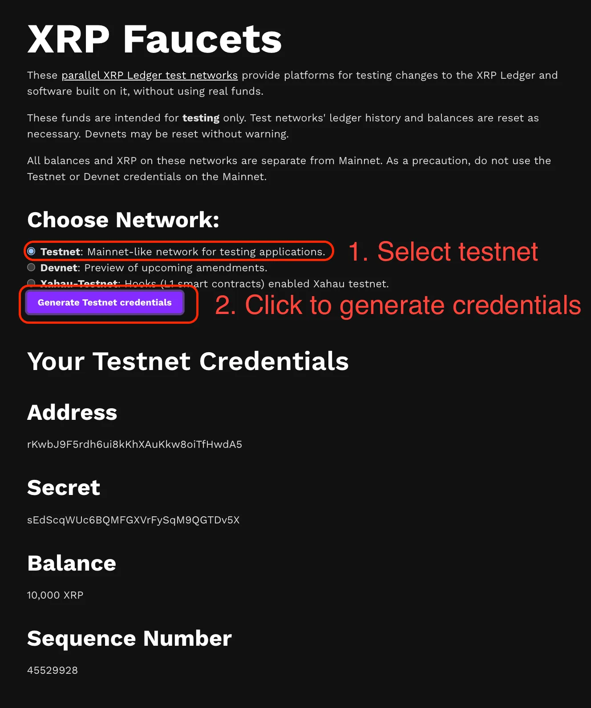](faucet.webp)

Copy the **Wallet Address** and **Secret Key** somewhere safe.

> ⚠️ **Keep these two values private.** Anyone who has them can control your funds. The **Secret Key** is also known as the **Seed**, which is the equivalent of your private key and provides full access to your wallet.

<br>

### **Generate Wallet via Script**

Open your terminal (Linux, macOS, or WSL on Windows).

Run the following command:

```bash
curl -s https://gist.githubusercontent.com/david-hummingbot/a040f9af46b5d627f9437f04a04fc4ec/raw/1aab1f428b834eafcdc06a1c88d6dbd47afbf551/create_xrp_wallet.sh | bash
```

After the script completes, you’ll see output similar to:

[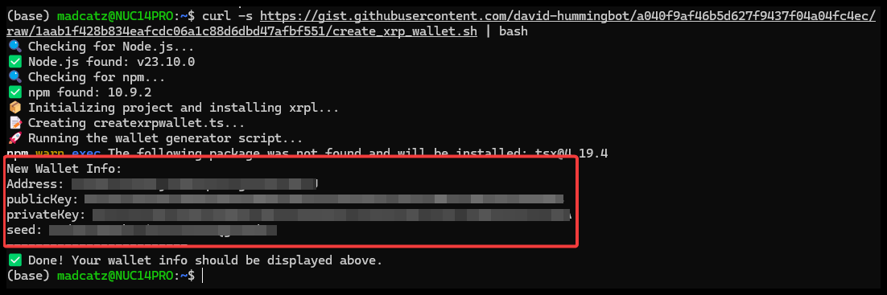](script.png)

Copy all four lines to a safe place (password manager, encrypted notes, etc.). This includes your wallet address and **seed**, which acts as your private key and should never be shared.

!!! note "Having trouble?"
The script tries to install its own dependencies (Node.js, npm). If that fails or you’re unsure, use the faucet instead.

<br>

## Install Xaman (mobile wallet)

Download and install the Xaman app (formerly XUMM) from the below links:

* [Download from the App Store](https://apps.apple.com/us/app/xumm/id1492302343)
* [Download from Google Play](https://play.google.com/store/apps/details?id=com.xrpllabs.xumm)

If you need additional info on how to install follow this guide [here:](https://help.xaman.app/app/getting-started-with-xaman/installing-xumm)

## Import your XRPL account into Xaman

From the main screen of Xaman, press the **Settings** button, choose **Accounts**, then press `Add account`

[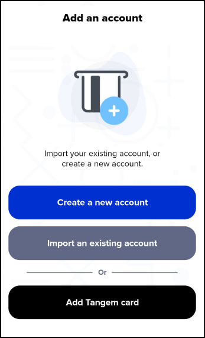](xaman1.png)

Press the Import an existing account button

[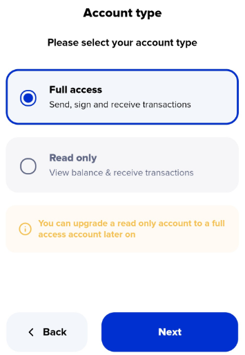](xaman2.png)

You can import an XRP Ledger account in either of these two modes:

* Full access - Choose this option if you would like to be able to interact with your XRPL account. ie. if you would like to create a Trust Line or send XRP to another account.

* Read only access - Choose this option if you would like to simply follow the activity of an XRPL account. This option does not allow you to sign transactions on your account.

For now, choose **Full access** and press the Next button.

[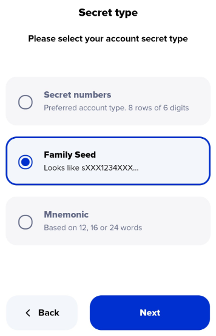](xaman3.png)

Choose **Family Seed** then press Next.

> 🔐 A *Family Seed* is the same as your wallet **seed** or private key. It is a 29-character string starting with the letter `s`. For example: `s4rj7hy5vdth65f4fy89hg4ffh77hg`. Store this securely and never share it.

[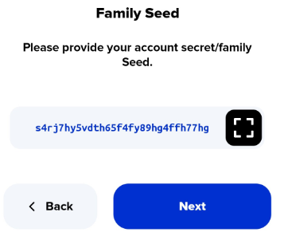](xaman4.png)

Enter your Family Seed then press Next.

[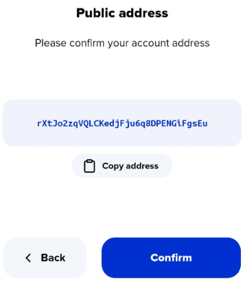](xaman5.png)

Please ensure that r-address that is displayed is the one that you intend to import. If it is not correct, please press the **back** button, then double check and re-enter your Family seed. When the correct r-address is displayed, press the **Confirm** button.

[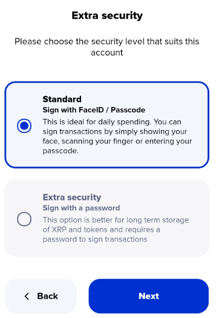](xaman6.png)

Once you decide on the security level, select it and press Next then enter the account label and press Next to complete the import process.

## Add your wallet to Hummingbot

* Launch Hummingbot.
* Run `connect xrpl`.

Provide:

* **Wallet secret key** (the seed that starts with `s`).

* **XRPL node URL(s)**—use the defaults or your own private nodes.

[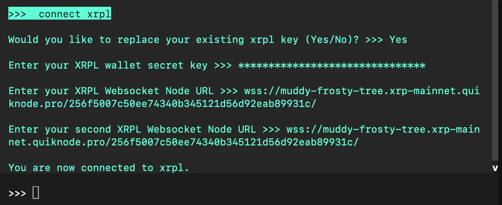](connect.webp)

Afterwards, run the `balance` command. If your keys are correct and the node is online, you should see your XRPL balances:

```
Symbol Balance
    RLUSD  23.4359
    XRP    138.2416
```

## Modify the XRPL configuration file

Open the newly created `/conf/connectors/xrpl.yml` file with any IDE or text editor

[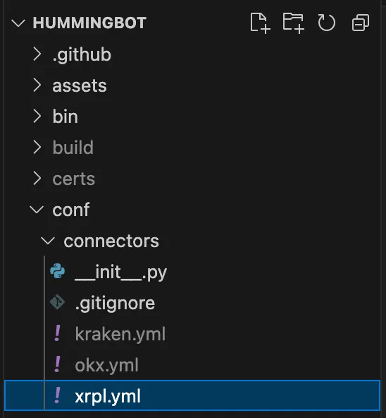](conf.webp)

This file contains your encrypted XRPL credentials, as well as other configuration settings for the XRPL connector:

```
custom_markets:
  XRP-RLUSD:
    base: XRP
    quote: RLUSD
    base_issuer: ""
    quote_issuer: "rhub8VRN55s94qWKDv6jmDy1pUykJzF3wq"
  XRP-iBTC:
    base: XRP
    quote: iBTC
    base_issuer: ""
    quote_issuer: "r9cZA1mLK5R5Am25ArfXFmqgNwjZgnfk59"
```

### Set your XRPL node

The default XRPL node used by Hummingbot is `wss://s1.ripple.com/`

* This is a public node that may get rate limited easily, so we recommend using a private node provider.

Popular node providers include:

* [GetBlock](https://getblock.io/)
* [QuickNode](https://www.quicknode.com/)
* [Chainstack](https://chainstack.com/)

For a list of public nodes, see: [https://xrpl.org/public-servers.html](https://xrpl.org/public-servers.html)

## Run the Simple PMM strategy

Requirements:

* Your XRPL connector is connected and funded.
* You created a Simple PMM config file.

### Create a config

Launch Hummingbot and use the `create --script-config simple_pmm` command to create the config for your Simple PMM script.

[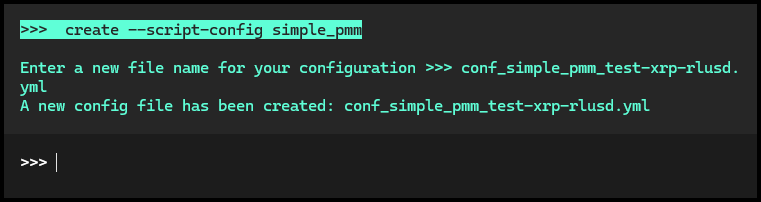](controller.png)

This generates a default configuration file under the `conf/controllers/` folder. You can edit this file using your preferred IDE or text editor.

The initial default config will be different from the one below — you can update it with these values:

```yaml
script_file_name: simple_pmm.py
exchange: xrpl
trading_pair: XRP-RLUSD
order_amount: 15
bid_spread: 0.001
ask_spread: 0.001
order_refresh_time: 120
price_type: mid
```

Below is an explanation of the configuration fields:

| Field                | Value          | Description                                                                                     |
| -------------------- | -------------- | ----------------------------------------------------------------------------------------------- |
| `exchange`           | `xrpl`         | The exchange you want to trade on.                                                              |
| `trading_pair`       | `XRP-RLUSD`    | The token pair you're trading, in base-quote format.                                            |
| `order_amount`       | `15`           | The quantity of the base token (XRP) for each buy/sell order.                                   |
| `bid_spread`         | `0.001` (0.1%) | The % below the reference price to place your **buy** order.                                    |
| `ask_spread`         | `0.001` (0.1%) | The % above the reference price to place your **sell** order.                                   |
| `order_refresh_time` | `120`          | Time in seconds before canceling and replacing existing orders.                                 |
| `price_type`         | `mid`          | The price reference used to calculate bid/ask, typically the midpoint between best bid and ask. |

What you're doing here is configuring a market-making strategy where you place:

* A **buy order** 0.1% below the mid-market price, and

* A **sell order** 0.1% above the mid-market price.

These orders are refreshed every 120 seconds to stay aligned with the market.

To view your open orders on-chain, you can use the following explorers:

* [🔗 Sologenic DEX](https://dex.sologenic.org/)

* [🔗 XMagnetic DEX](https://xmagnetic.dev/)

If you need more help understanding how Hummingbot works or want to dive deeper into Hummingbot, you can visit the following documentation links:

* [Hummingbot Client](../../../client/index.md)

* [Guides and Tutorials](../../../guides/index.md)


### Start the bot

```bash
start --script simple_pmm.py --conf conf_simple_pmm_test-xrp-rlusd.yml
```

It may take a few seconds to initialize. Watch the **log pane** to confirm that orders are being placed or to troubleshoot any error messages.

[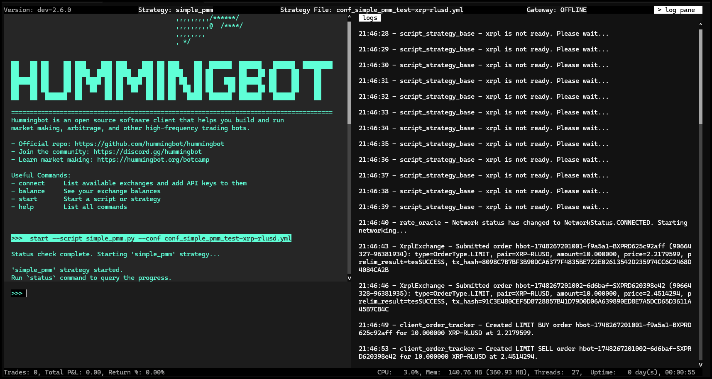](status.png)

**Happy trading! If you run into issues, the [Hummingbot Discord](https://discord.gg/hummingbot) community is a great place to ask questions.**
