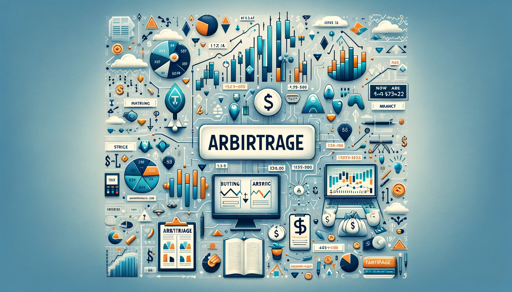
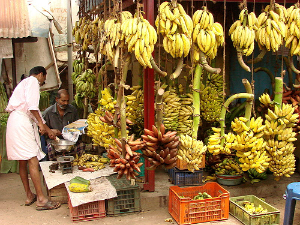
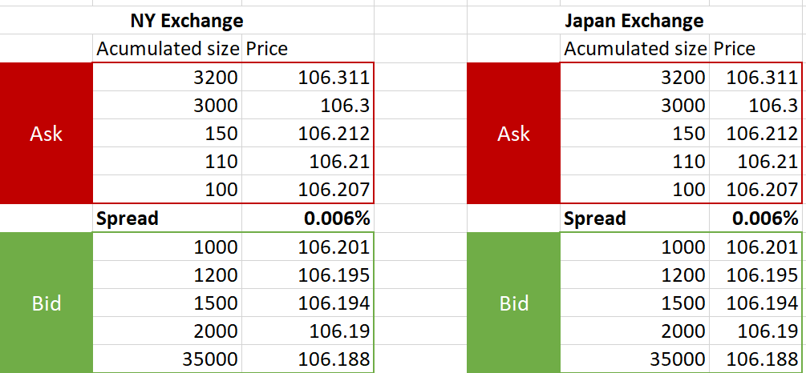
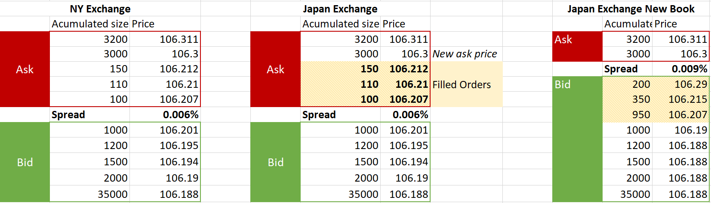

# What is Arbitrage?

## Welcome to Hummingbot Academy!

Last week we published the [first article](../what-is-market-making/index.md) of the **Hummingbot Academy**, covering an introduction to **what is** **Market Making**, and today we discuss Arbitrage in order to answer the following questions:

- **What is arbitrage?**
- **What do arbitrageurs do?**
- **How to run arbitrage operations?**
- **How do I create my arbitrage robot?**

<!-- more -->

Here at **Hummingbot Academy** our goal is to help you learn more about **market making** and **arbitrage**, and how to use our [free open-source robot](https://docs.hummingbot.org) to implement your own strategy.

### But what is arbitrage?

The concept of **arbitrage** is pretty simple:

> Arbitrage is the purchase and sale of an asset in order to profit from a difference in the asset's price between markets.

To better explain exactly how an **arbitrage** operation happens, let's talk about bananas. Yes, bananas.

 

Picture a small town, where a big part of its economy is based on bananas production, with a lot of farms selling their crop on the local market.

This result in a lot of bananas being sold locally, and naturally due to the high offer, they are pretty cheap to buy, let's say for $0.50/kg.

A few kilometers away lies a big city, but most of its economy is based on industry, therefore there aren't many banana farms surrounding it.

But citizens of that big city still want to eat fruit to have good health, which creates a big demand for bananas, and they are willing to pay $0.65/kg.

It's pretty clear to see there is an opportunity here, and a merchant could buy bananas from the small town, sell on the big city, and profit $0.15 (without accounting the transportation costs) for each transported kilogram. 

The merchant (arbitrageur) in this case is doing an arbitrage operation: buying and transporting bananas (the asset) from one market and selling it on another market for a profit, while reducing his risk by locking his profits if both sides of the deal are closed at the same time.

### Isn't it the same as a market making operation?

Although the basic concept of both operations is pretty similar (buy low and sell high with a small profit margin), the key difference is the 'where' the market maker and the arbitrageur look for deals.

> 💡 The market maker [like a pawnshop owner](../what-is-market-making/index.md) operates on a single place, **making** buy and sell offers on the same market. The arbitrageur (like a merchant transporting goods between towns), operates on more than one place, **taking** buy and sell **offers** from two (or more) different markets.

The way each one affects the markets is also different because while a market maker is providing liquidity, reducing **bid-ask spread** and **slippage**, while the **arbitrageur** is removing liquidity from two markets (usually from a high-liquidity market and a low-liquidity market), but pushing the prices to **converge** on the same level on both places.

### Markets inefficiencies and arbitrage on financial markets

Around the world, there are a lot of different financial markets where a variety of assets are being traded on a daily basis.

Every major city or country usually has its own financial exchange were all kind of investors meet to buy and sell different financial instruments.

We have NASDAQ and NYSE on New York, CME and CBOE on Chicago, JPX on Japan, SSE on China, FRA in Germany, B3 in Brazil, and the list goes on and on.

And even though there was a huge evolution in the information technology, the sheer amount of exchanges and the distance between each one still leads to so-called market inefficiencies.

To illustrate this, we will take a look at the Dollar-Yen (USD-JPY) prices on two different markets.

Let's assume that at some point in time, the order book of a New York and a Japan exchanges are exactly the same:

Then, an investor decides to send a order to buy 360 JPY on the Japan Exchange at market price.

What will happen next is that there will be a new Ask price on the Japan Exchange book, and usually, the Market Makers will create new Bid orders on the book to fill the spread gap that was created by that order:

This is when the **arbitrageur** makes his move, buying 100 JPY at the New York exchange at the price 106.207 and selling them **immediately** on the Japan Exchange for 106.29, netting a total profit of 8.70 USD (0.082%) on the trade.

Eventually, as more **arbitrage** operations happen, the Ask price on the NY exchange will go up until it matches the Ask price on the Japan Exchange.

> 💡 In the traditional financial markets, there is a huge amount of **arbitrage** competition, with profitability being determined by milliseconds.  The companies doing it usually make big investments (billions of dollars) in technology and infrastructure to increase the speed of arbitrage algorithms.

### Cryptocurrencies and arbitrage opportunities

With the rise of cryptocurrencies value over the last 10 years, the exchanges landscape followed this growth, and today [Coinmarketcap.com](http://coinmarketcap.com) lists a total of 311 exchanges where 6,974 different cryptocurrencies can be traded.

This creates a huge amount of opportunities for **arbitrage** operations, due to the big market inefficiency that still exists between all these exchanges with a wide range of volume, liquidity, and spread across all of them.

But there is a new and interesting factor in the cryptocurrency trading environment that adds an extra layer of possibilities: decentralized exchanges.

> 💡 **Centralized Exchange (CEX)**: All the assets in the custody of the exchange, and the user's balance is controlled by the exchange.  
**Decentralized Exchange (DEX)**: All the assets are in the custody of their owners, and the exchange function as a way for buyers and sellers to execute a trade between their private wallets.

The CEX model is a reflection of what already exists in the traditional financial markets and this kind of tried-and-true service has been offered in the cryptocurrency space for a very long time. We can say that there is already a lot of competition doing arbitrage operations, especially among the bigger exchanges, and as time goes by, it is getting harder to find good opportunities.

On the other hand, the concept of a DEX is relatively new and there are a lot of projects with different models and levels of decentralization being developed. 

As a matter of fact, AMM (Automated Market Makers) decentralized protocols like Uniswap actually rely on arbitrageurs to adjust their internal prices to match other external exchanges.

This opens up a wide array of opportunities for profitable arbitrage.

So, if you are looking for these opportunities, be sure to check the of the decentralized exchanges that are operational today.

> 💡 Usually, all exchanges charge a fee on each trade operation, so be sure to consider the cost of executing the trade when planning your arbitrage strategy. 
DEXes also present an extra layer of cost to be considered, because depending on how the transactions are processed, there might be some added cost like blockchain transaction fees.

### Automated trade and arbitrage

There are two key components on completing a profitable arbitrage trade:

- Find two markets with profitable price discrepancies;
- Take the market offers listed on the book before anyone else.

In theory, it is possible to capitalize on **arbitrage** opportunities through the manual process of checking the price of an asset across different exchanges and type your order size and price to close the deal.

But by the time you are ready to click the button to complete the trade, it is most likely that another person already took the order you were looking at, and the trade won't be profitable anymore.

The use of algorithmic trade robots has become an essential component of arbitrage operations in today's markets because of the speed it can execute both components listed above, by constantly looking for profitable trades and executing them at the exact moment they are detected.

> 🐦 You can create an **arbitrage** strategy on Hummingbot using the `create` command and then typing `arbitrage` when asked what is the strategy you want to use.

### The risks of arbitrage

The concept of **arbitrage** operations is really simple: buy low on one market, sell high on another *at the same time.*

When successful, this operation eliminates one big risk when it comes to investing: volatility risk.

Arbitrageurs don't have to worry about the price movements or try to find the market direction, and they will only trade if they know they can buy in one place at a lower price and immediately sell it at another place at a higher price.

But as it happens with all trading strategies, **arbitrage** isn't completely risk-free.

The majority of the risk lies upon the trade **execution** (how fast can you close the trade before someone else) and the **market liquidity** (not enough orders available on the markets with the price you are looking to trade).

If you think about the banana's merchant, he could have problems while traveling from one city to another (slow truck, flat tire, etc), and by the time he reaches the big city, the price people were willing to pay could be lower, reducing his profits or even close the trade at a loss. 

To some degree, arbitrageurs can mitigate the **execution risk** and create some advantages, for example by investing heavily in reliable infrastructure, or moving his operation closer to the exchange servers.

Also, as arbitrage gets increasingly competitive, opportunities become increasingly hard to come by.  **Arbitrageurs** may search for opportunities for long periods of time but are not guaranteed to find them.

As with any other type of trade, be sure to understand the risks and test your strategy before putting your assets at risk.

> 🐦 With Hummingbot you can enable the **paper trading mode** using the command `paper_trading`, which allows you to test your strategy in a **real-time simulated environment**, without the need to put your capital at risk.

Another important risk you must consider is related to where you are executing your trades:

- **Central Exchanges** have the custody of your assets, and your access to them can be denied for any reason (hacks, scams, etc), so be sure to research the exchange reputation and security systems;
- **Decentralized Exchanges** operations rely on the smart contracts to control the trade flow and bugs or flaws on the code can lead to big problems like funds being locked or stolen, therefore it is important to understand the if the program behind the DEX doesn't have major flaws. Even if you don't understand the code language, look around the web for information about possible vulnerabilities.

### Join our community

And this concludes our introduction to arbitrage, a really simple strategy that take advantage of market inefficiencies to find profitable trades. Next week we will cover Cross-exchange market making, which is a mix of market making and arbitrage.

If you want to learn more, make sure to follow our blog updates for new articles every week.

While you wait for the next post, remember to join our [Discord server](https://discord.hummingbot.io/), a place where our community talks about **market making** and **arbitrage**, and all the possible ways you can use Hummingbot to improve your trading strategies.

Also, if there is any specific topic you want us to cover on the Hummingbot Academy, contact our team on Discord, or send an email to academy@hummingbot.io.

See you soon, and I wish you all a profitable trading session!