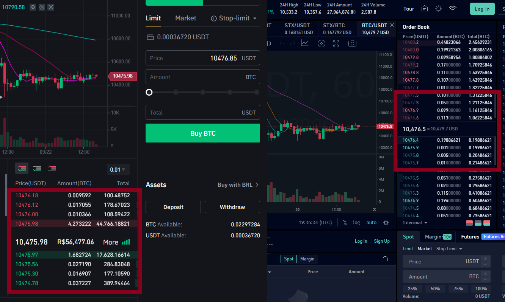
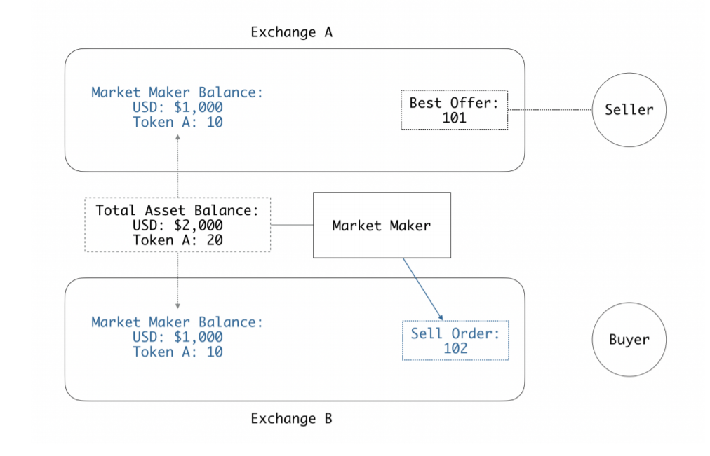
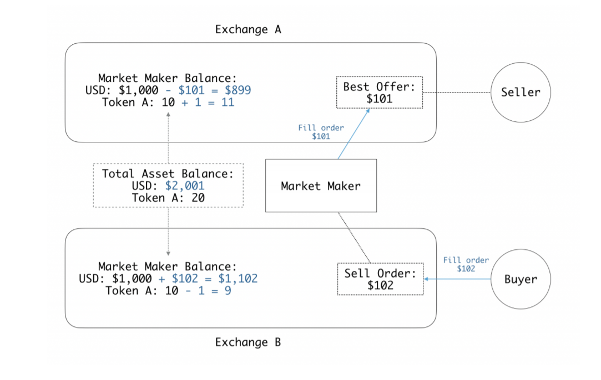
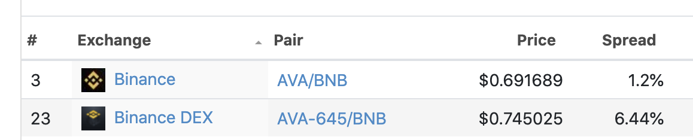
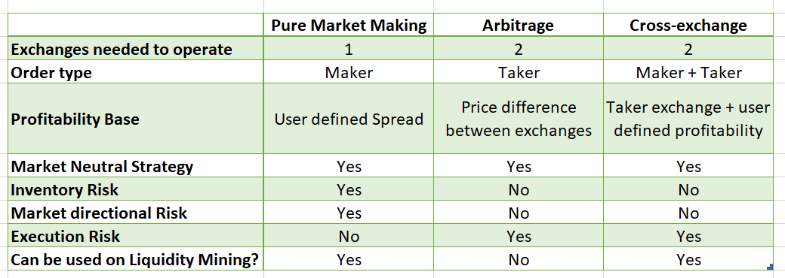

# What is Cross Exchange Market Making?

Welcome back to our Educational Center, where we aim to help you to learn more about [market making](../what-is-market-making/index.md), [arbitrage](../what-is-arbitrage/index.md), and everything related to algorithmic trading.

Today we will talk about one of the core strategies that can be used with [hummingbot](https://hummingbot.org): **cross-exchange market making**.

The objective of this article is to help you understand:

- **What is the cross-exchange market making strategy?**
- **What is the difference between cross-exchange market making and arbitrage?**
- **How is cross-exchange market making different from pure market making?**
- **Why and when should I use this strategy?**

<!-- more -->

If you already understand how [arbitrage](../what-is-arbitrage/index.md) and [pure market making](../what-is-inventory-risk/index.md) work, cross-exchange market making ("XEMM") becomes really simple: it's simply a hybrid of the two.

### So what is cross-exchange market making?

Here's a simple explanation of the concept of cross-exchange market making:

1. My friend Alice wants to sell her guitar and she's offering it for $100.
2. I go around to all of my other friends and tell them that **I am selling** a guitar for *$110*
3. If one of my friends, say Bob, agrees, I immediately buy the guitar from Alice for $100 and sell it to Bob for $110.

Pretty neat right?  I made $10 of profit selling something I didn't own by simply doing a back-to-back, simultaneous buy and sell of the guitar.

**Wait... that sounds a lot like arbitrage, so what's the difference?**

OK, here's how this situation would be for arbitrage:

1. My friend Alice wants to sell her guitar and she's offering it for $100.
2. I go around and try to find if someone, anyone, **is offering to buy** a guitar for some price higher than $100.  After looking around, I find an ad posted by my other friend Carol; **she wants to buy** a guitar and is willing to pay $110.
3.  Great, I immediately buy the guitar from Alice for $100 and sell it Carol for $110.

Did you notice the subtle difference?  For step #2 in cross-exchange market making, I was the one proactively telling people **I had something to sell** and **I was setting my price**.  Does this concept sound familiar?  In the transaction with Bob, **I was the maker** and Bob was the taker.

On the other hand, for step #2 in arbitrage, I was simply going around and searching to find if *someone else* had already said they wanted to buy a guitar at a higher price.  In the arbitrage scenario, **Carol was the maker**, and **I was the taker**.

In my transaction with Alice in both scenarios, I was a taker: I accepted her offer for a guitar and her price.

> 💡 An arbitrageur acts as "**taker/taker**"; he is the taker on the buy *and* the sell transaction.  Arbitrage is more *passive* because an arbitrageur just monitors prices and searches for opportunities to act on.  On the other hand, a cross-exchange market maker acts as "**maker/taker**"; he proactively tries to create trade opportunities by creating maker orders on one side of the trade.

### What does this have to do with market making?

In our previous article on [pure market making](../what-is-market-making/index.md), we explained that a market maker is someone who places both bid and ask orders in order to facilitate trading.  You can see that in the cross-exchange market making example above, I am acting as a **maker**, offering a guitar to sell and specifying a price.  So that's one half of what a market maker does.

But I can also do the same transaction for the buy side.  I have another friend, Dave, who wants to buy a guitar, but he is only willing to pay $95.  At this price, he and Alice can't trade, because his budget of $95 is below Alice's asking price of $100.  Since I know that I can sell a guitar to Dave, at the same time I'm going around trying to sell Alice's guitar, I can go around offering *to buy* another guitar that I can sell to Dave.

Now I have both sides: I can offer to buy a guitar for $85 and sell a guitar for $110.  I am now acting as a market maker.  The interesting thing about **cross-exchange market making** that you may have noticed is:

- I don't even own a guitar in the first place; if someone wants to buy a guitar from me, I just buy the one from Alice to sell them and,
- I don't even need to have the money to buy a guitar on the buy side; if someone wants to sell me a guitar for $85, I can pay for that purchase by selling that same guitar immediately to Dave!

> 💡 In **cross-exchange market making**, a trader acts as a normal market maker on one exchange (the "*maker exchange*"), creating buy and sell orders.  However, the trader eliminates the inventory risk usually associated with market making by using another exchange (the "*taker exchange*") to simultaneously offset (or "*hedge*") any trades filled on the maker exchange.

That is why we mentioned earlier that cross-exchange market making kind of looks like **a combination of pure market making + arbitrage**.

### So how does this translate to order book markets?

A financial environment where the same asset is traded in different marketplaces is susceptible to what is known as **market inefficiency**, where the information about the value of the asset takes some time to dissipate to all the exchanges.

This can be easily noticed by looking at the differences between bid and ask prices offered on each order book, as can be seen on the screenshot of the BTC/USDT order book on two different exchanges at the moment in time:

Bid prices:

- Exchange A: $10,475.97
- Exchange B: $10,476.40

Ask Prices

- Exchange A: $10,475.98
- Exchange B: $10,476.60

Applying the cross-exchange market making concept on the situation above:

1. I use one exchange (Exchange A) as my taker exchange.  In the example above, Alice and Dave, collectively, acted as my "taker exchange".  Basically, I need one exchange where there are buy and sell orders created by other people.  Using the above situation, the best bid price on Exchange A for Token A is currently $10,475.98 and the best sell price is $10,475.98.
2. On another exchange (Exchange B), I act as maker and create orders.  Since I know that I can sell as a market taker for $10,475.97 and buy for $10,475.98 on Exchange A, I place a buy order for BTC for $10,474,97 and sell order for $10,476.98 on Exchange B.
3. If my buy order on Exchange B is filled, then I immediately sell Token A on Exchange A for a $1.00 profit.  If my sell order on Exchange B is filled, then I immediately buy BTC on Exchange A for a $1.00 profit.

You can see that the only term I set here is my profit margin of $1.  The price of the order I place on Exchange B will always be based on the market price offered on Exchange A.  

For example, if the ask price on Exchange A falls to $10,400.00, then I would adjust my price ask offer on Exchange B to $10,401.00 (= $10,400.00 + $1):

###### (Exchange B maker price) = (Exchange A taker price) + (profit margin)

Notice that $1 may not be a realistic margin; more likely margins would be more in the low percentages or even fractions of percentages.  But even at lower margins, why would this strategy work?

> 💡 As with arbitrage, the potential to generate "risk-free" profits through **cross-exchange market making strategies** happens due to market inefficiencies.  The highly fragmented nature of the crypto markets (different types such as CEX/DEX, different regions/jurisdictions, the sheer number of different exchanges) lends itself to even more market inefficiencies.

### Why would anyone trade on Exchange B if the prices on Exchange A are better?  In other words, what makes cross-exchange market making possible?

Here are some examples:

- *Some people may not be able to open an account or don't want to open an account on Exchange A (market fragmentation)*: for example, Exchange A might be a centralized exchange requiring KYC, while Exchange B is a DEX.  Users of Exchange B may even know that they are getting worse pricing, but they just don't want to go through the hassle of setting up an account on Exchange A
- *Exchange B doesn't get information as quickly as Exchange A*: the crypto markets can move awfully quickly, and it doesn't always reach every exchange at the same time.  Prices may have moved on Exchange A but traders on Exchange B don't yet know about it.  As an example, exchange B is a DEX with on-chain order books.  Updating order books through blockchain transactions may result in lag.

### Practical considerations: deploying cross-exchange market making strategy in the financial markets

Now that you understand the fundamental concept of **cross-exchange marketing making**, we now consider the practical implications of deploying this strategy in the real-world.  The example at the beginning of this article assumes that: 

- I can easily move the guitar or Token A between people or exchanges instantaneously and,
- I can place orders for something even if I didn't yet have the item (i.e., I can offer to sell a guitar I didn't know yet, or I could offer to buy a guitar even though I didn't have the money).

However, in financial markets, moving assets between exchanges take time (e.g. requiring a certain number of block confirmations in the case of cryptocurrencies) and you need to have assets on the exchange in order to place orders (at least currently, in the spot market).

Capturing "risk-free" arbitrage opportunities is highly competitive, so these opportunities may be few and far between and are typically very short-lived.  By the time we identified an opportunity, transacted on one exchange, transferred assets to another exchange, and then did the second part of the trade (the "hedge"), it's highly likely the opportunity may have already disappeared.  So how do we solve this?

### Inventory equilibrium model

One way to address this operational inefficiency is to maintain an inventory on both exchanges. 

This might sound contradictory to what was explained in the above examples since one of the goals of the **cross-exchange market making** strategy is to avoid exposure to inventory risk, but let me explain it further.

The figure above shows the state of the market maker's account at the moment he starts the operation. As you can see, he begins with a total inventory of 20 units of the Token A, split across two exchanges.

This will allow the trader to create a position on the Exchange B order book, locking his minimum profit at 1% (101 * 1.01 = 102.01).

> 💡 Reminder: If the Best Offer price on Exchange A changes, the **market maker** will change his Ask Offer price on Exchange B, to guarantee the 1% profit. If on Exchange A the price rises to 105, he would change his Ask price on Exchange B to 106.

Now, let's see what happens the moment his sell offer is taken by another buyer:

At the exact moment his maker order is filled on the Exchange B, he will become a taker of the Best Offer on Exchange A.  As you can see in the figure above, the total amount of Token A on both exchanges is still the same (20), while his total USD balance has increased by $1.

### Rebalancing

A cross-exchange market maker from time to time may also need to rebalance his assets between exchanges.  In the example above, if the market keeps trading in this same direction and the trade occurs 9 more times, the market maker would end up having only tokens on Exchange A and only USD on exchange B.  In such a case, the trader would have to transfer some tokens from Exchange A to Exchange B, and some USD from Exchange B to Exchange A in order to continue running the strategy.

### Trading and asset transfer fees

A cross-exchange market maker needs to account for trading and asset transfer fees when setting his target profit margin for trades.

### Risks of cross-exchange market making

> ⚠️**Arbitrage** and **cross-exchange market making** are often considered and described as "risk-free" because these strategies *largely* mitigate the main risk associated with market making: **inventory risk**.  The main risk that remains is execution risk.

**Execution risk**

The markets move pretty fast.  As with what happens on arbitrage operations, the trader has to consider the speed and reliability of executing his trade orders.  In the example above, as soon as his trade is filled and Exchange B, he needs to immediately perform the offsetting trade on Exchange A before someone else takes that order or before that market maker adjusts his or her price.

Therefore, the execution risk lies on how fast and how reliable is the connection between the trader terminal and the exchanges.

This risk can be mitigated by using better infrastructure (e.g. cloud with reliable connections), lots of testing to ensure trading bot reliability, and choosing reliable exchanges.

**Market/volatility risk**: although limited as compared to pure market making.

As explained above, we need to deploy an inventory equilibrium model in order to have assets available on exchanges in order to take action on trading opportunities.  This introduces some amount of market risk because a cross-exchange market maker does have to have some amount of inventory.

However, the main difference in cross-exchange market making, vs. pure market making strategy, is that **the inventory exposure will stay constant over time**.  In the example above, the market maker keeps a constant amount of Token A balance (20 tokens) but uses this balance as a tool to try to grow the market maker's USD balance.

> 💡 Because deploying a cross-exchange market making strategy in the real-world requires some *fixed amount* of inventory, it does expose the market maker to some amount of market risk.  However, since the inventory amount is fixed and finite, cross-exchange market making has a similar risk profile as a buy-and-hold strategy; but unlike buy-and-hold, the inventory is deployed to try to generate incremental, additive returns without a fundamental change in risk profile.

This materially lowers the risk as compared to pure market making, because a cross-exchange market maker is avoiding large swings in inventory amounts.

> 🐦To create a **cross-exchange market making** strategy on hummingbot, use the command `create` followed by `cross_exchange_market_making`.

### Liquidity mirroring: another application of cross-exchange market making

As mentioned above, there is a lot of fragmentation in the cryptocurrency markets, which has led to large disparities in liquidity. For example, some exchanges may be much more active and liquid (such as centralized or established, widely-used exchanges) versus others (such as decentralized exchanges, or newly created exchanges).

Let's take a look, for example, at Travala (AVA) the most traded token on Binance DEX, and compare its bid-ask market spread with the centralized Binance.com, as shown on [Coingecko](https://www.coingecko.com/pt/moedas/travala#markets):

Binance DEX has less liquidity and lower trade volume than Binance.com which is reflected in a bid-ask spread on Binance DEX that is nearly 5x that on Binance.com.

A cross-exchange market maker could take advantage of this situation by posting offers on Binance DEX with his maker spread lower than the prevailing bid-ask market spread. This would put his orders in a good position and first in line to be taken by other participants.

For example, let's say the market maker set his bid-ask spread at 4%: 

- Binance DEX **maker** ask spread = 2%
- Binance CEX **market** ask spread = 0.6%

If another participant takes the market maker ask offer on Binance DEX (selling the asset), he will, at the same moment, take the best ask order offered on Binance CEX (re-buying the asset at a lower price), locking an instant profit of (2%-0.6%) = 1.4%

> 💡 This strategy also has the effect of 'transferring liquidity' from a more liquid exchange (remove liquidity by taking orders) to a less liquid exchange (increasing liquidity by making orders) and reduce spreads. Cross-exchange market making is also known as "*liquidity mirroring*" or "*liquidity porting*".

### Comparing strategies

With today's article, we presented all three strategies that can be implemented with Hummingbot ([pure_market_making](../what-is-market-making/index.md), [arbitrage](../what-is-arbitrage/index.md), cross_exchange_market_making), and each one has its own characteristics, advantages, and disadvantages.

Here is a comparison between these strategies:

There is still a lot more content planned for the Hummingbot Academy that will cover the details and inner workings of each one, helping you find and create a strategy that fits better with your trading plans, so make sure to check our blog for updates every week.

### Join our community

If you want to learn more, make sure to follow our blog updates for new articles every week.

While you wait for the next post, remember to join our [Discord server](https://discord.hummingbot.io/), a place where our community talks about **market making** and **arbitrage**, and all the possible ways you can use Hummingbot to improve your trading strategies.

Also, if there is any specific topic you want us to cover on the Hummingbot Academy, contact our team on Discord, or send an email to [academy@hummingbot.io](mailto:academy@hummingbot.io).

See you soon, and I wish you all a profitable trading session!
