# What is Inventory Risk?

Hello again Hummingbot community!

Today we will start to talk about what I consider the most important factor that is part of all types of trading operations: **risk and risk management.**

As one of the biggest investors of our time once said:

"Risk comes from not knowing what you're doing." ~ Warren Buffett

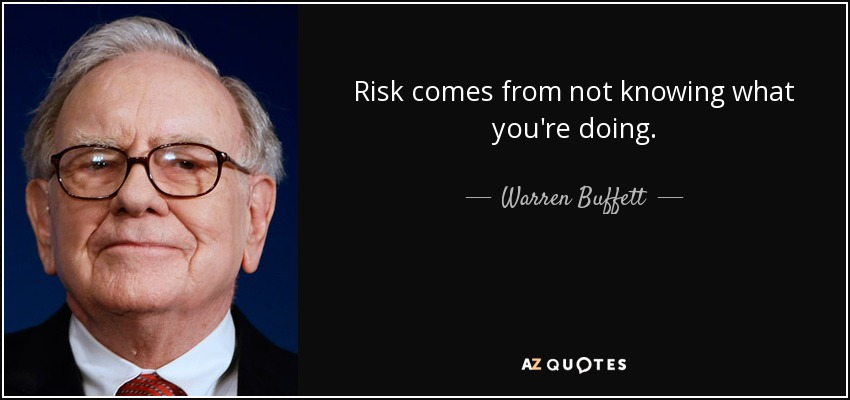

All kinds of financial operations have varying degrees of risk, and market making is no different.

While it seems more exciting to imagine and project future gains and fantasize about being the next Warren Buffet, the reality and less glamorous part of investing, and arguably the most important part, is trying to figure out what can go wrong and how to mitigate losses that can result.

There is a lot to cover about risk and risk management, but today we will focus on one major risk related to market making: **inventory risk.**

Here is what we’ll cover in today's article:

- **What is inventory value?**

- **What is inventory risk?**

- **How to mitigate inventory risk with Hummingbot**

<!-- more -->

And as always, you are welcome to join the #trader-chat on our [Discord](https://discord.com/invite/hummingbot) to discuss with the community how to improve your market making strategy.

### What is Inventory risk?

As a market maker, your main role is to provide liquidity to other market participants.

You are providing a service to other traders, offering to buy and sell assets from and to everyone else, while getting paid to do so through the spread size between your bid and ask offers (orders to buy low, sell high).

To be able to provide this service, the market maker must hold some amount of assets in inventory in order to create orders and make trades, and this inventory has a value associated with it.

**Inventory Value**

As any market participant already knows, the prices of assets are constantly changing, and all traders must have a way to track if they are making profit or not.

One simple way to track performance is to compare the total value of the assets owned by the trader. 

For example, let’s assume that you currently own 0.46820424 BTC and 14.6426 ETH:

**Day 1 Inventory**

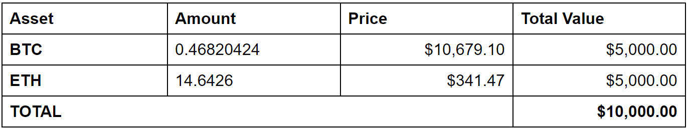

On the first day, the current value of your assets is $10,000. Even though you don't actually own any USD and only own BTC and ETH, you have the ability to convert your BTC and ETH to $10,000 at current market prices.

**Inventory value can fluctuate due to changes in market prices because the value of the assets relative to the benchmark asset can change**

If you haven’t traded (HODL!), on day 2 you would still have the same amount of BTC and ETH from the starting portfolio.

**Day 2 Inventory**

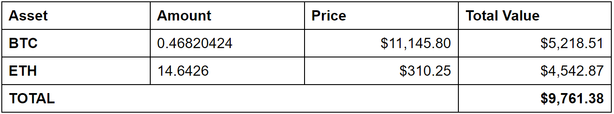

However, since the USD prices for these assets changed, the **inventory value** has gone down to $9,761.38. The BTC value went up, while the ETH value went down.

Inventory value is the current value of all assets held in a portfolio, quantified to some chosen benchmark or reference asset (e.g. USD).

Choosing the benchmark reference asset for determining value varies by investor.  For example, investors from the U.S. may use USD, whereas an investor in Europe may choose Euro.  This is because, at least currently, most of their costs (food, rent) are still denominated in USD (or Euro), and fiat is still the benchmark for their assets and buying power.

### Inventory risk in trading

The main objective of a market maker is to increase his total inventory value over time. The more common and general approach to investing is trying to buy assets that will appreciate in value in the future. This is “directional” investing, buying “cheap” assets and betting that the price of an asset will eventually go up.

In contrast, a market maker tries to increase portfolio value over time by capturing incremental bid-ask spreads and accumulating them over time. The market maker continually offers to simultaneously buy and sell assets, offering to be at a slightly lower price than he is offering to sell. If the market maker is able to complete a buy and sell, they are able to capture some of this difference, the “bid-ask spread”. The more times a market-maker can complete this cycle of buy and sell, the more profits they are able to accumulate.

As I mentioned in the [first academy article](../what-is-market-making/index.md), the ideal situation for a market maker is when the price is moving without a trend:

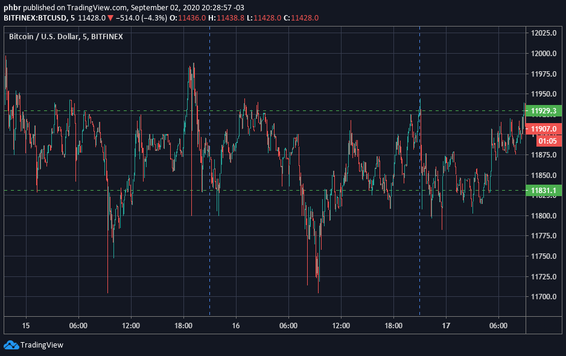

When prices are trading within a range, the more likely a market maker's buys and sells being filled with equal frequency, and the more likely the market maker is able to accumulate incremental profits.

The trouble begins when the prices start to trend in one direction.

For example, if the price starts to trend downward, his buy orders will start to be filled, but not the sell orders:

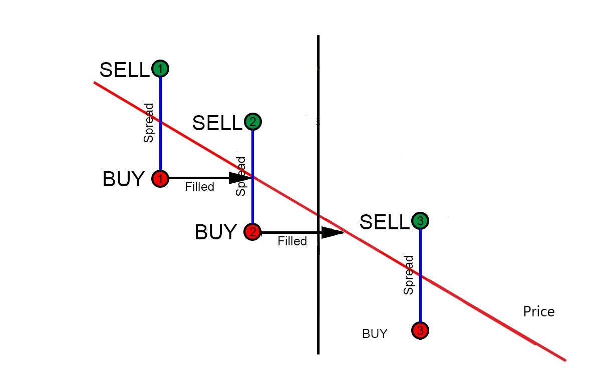

_Source: Our community member @Christian Feldmann_

The consequence of this situation is that the market maker will begin to increase the inventory of the asset that is losing value, resulting in total **inventory value** decreasing over time.

Eventually, the price could come back to a profitable level and the market maker would be able to sell his inventory at a profitable price. But the problem is that, if this situation persists and the price keeps dropping, all the market maker inventory will be locked on one side.

At some point, the market maker will have to decide between stopping his operation and wait for better prices or start selling his inventory at a loss to keep his operation going.

This similar to a retail store manager started to increase his inventory, buying more products from suppliers at better prices, but his customers aren't very interested in buying his products.

Even though the market maker creates both buy and sell orders, there’s no guarantee that both sides will be filled. In the example above, the bids keep getting filled but the sells never get filled. This also exposes the market maker to the risk of swings in the amount of inventory held. For example, the market maker might accumulate assets losing value; conversely, the market maker might end up selling off assets that are appreciating in value.

> **Inventory risk** is the probability a market maker can't find buyers for his inventory, resulting in the risk of holding more of an asset at exactly the wrong time, e.g. accumulating assets when prices are falling or selling too early when prices are rising.

### Inventory risk management with hummingbot

Inventory risk is the main risk of market making. That’s why Hummingbot allows a lot of strategy customization designed to mitigate inventory risk and why our team continues to work on even more features around this.

This flexibility allows the market maker to mitigate his operational risks in a lot of different ways, and make adjustments that fit his major strategy.

Here are a few examples on how the **inventory risk** can be controlled:

**History command**

The `history` command displays historical trades as well as a summary of changes in the total asset amounts since the bot started.

It's a good way to visualize how much the inventory changed on each side, and compare with the total value.

**Inventory skew**

Using `config inventory_skew_enabled` the bot will change the `order_amount` on every new order, to rebalance the total inventory size.

The target proportion of each asset on the inventory can be defined through the command `config inventory_target_base_pct` and how much the inventory can deviate from this proportion using `config inventory_range_multiplier`.

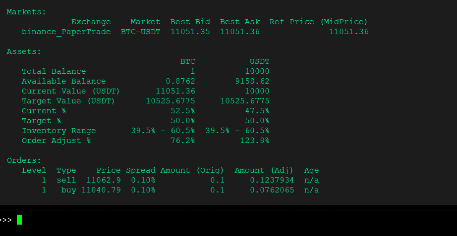

As can be seen above, there is more BTC than USDT on the inventory, and the bot is selling more than buying.

This parameter can be used as inventory protection, for example, if the market maker spots a trend forming in one direction: if the BTC price is trending up, the market maker could start to accumulate more BTC, setting `config inventory_target_base_pct` to 70.

Also, it is particularly useful, if you are trading a non-USD pair, (ETH-BTC for example), where the trader can evaluate the value of each asset paired with USD, and adjust the inventory skewness, if you think one of the assets will have a higher value in the future.

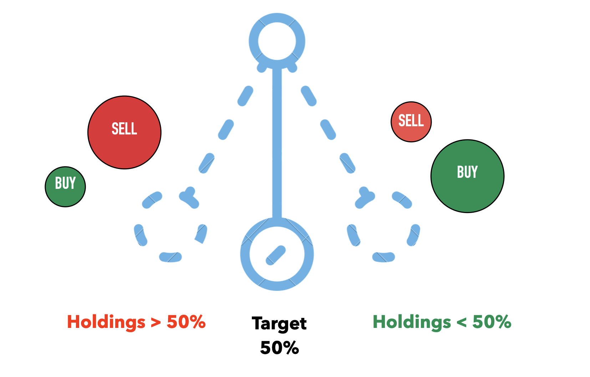

> Inventory skew is like an ongoing pendulum balancing act; once a trader accumulates more of one asset, Hummingbot adjusts order sizes (smaller buys, larger sells) to try to get back to the target holding amount, and vice versa.

Inventory skew aims to minimize the risk of inventory amounts swinging around too much.  Trying to maintain a target ratio such as 50% helps to ensure that the market maker can continue to quote both bid and ask sides and capture bid-ask spreads.

**Filled Order Delay**

Through the `filled_order_delay` parameter, the market maker is able to set a delay time for the bot to create subsequent new orders once a previous order has been filled.

For example, with a filled_order_delay = 300 when an order created by the bot is filled, the next pair of orders will only be created 300 seconds later.

This helps to manage periods when prices are trending. For example, in the diagram below, in a case when prices are trending down, bid orders keep getting filled once orders are refreshed.

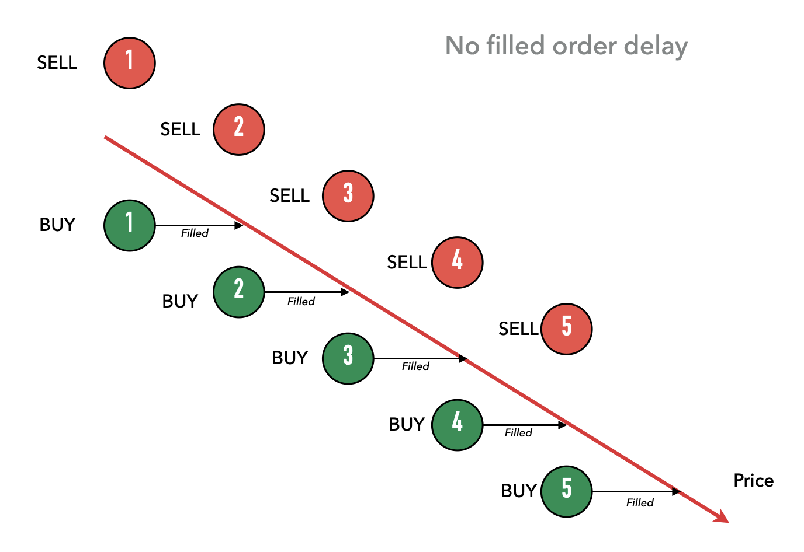

If this is repeated and continues to go on, the market maker could quickly end up accumulating large amounts of the asset within a matter of just a few order refresh cycles. In the example above, the trader has bought assets 5 times.

By introducing a delay between filled orders and placing new orders, this spaces out orders and dampens the potential accumulation of assets, allowing for some time for price trends to stabilize.

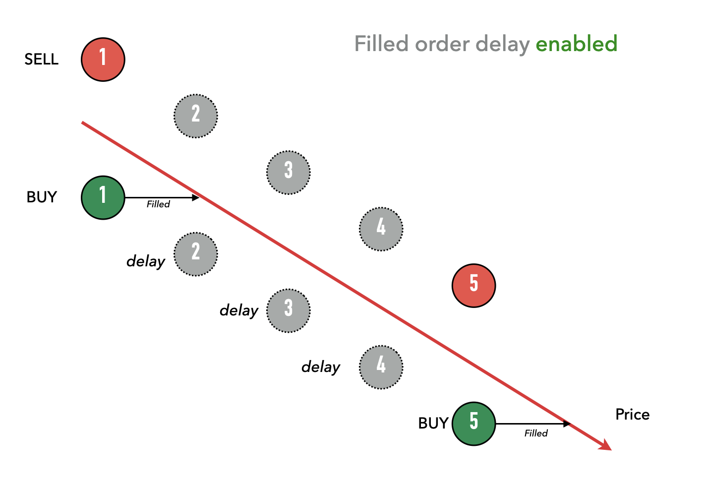

You can see above, since the bid order in period 1 was filled, the bot didn’t place orders in periods 2, 3, and 4.  So in this downward price trend, the bot only bought twice (periods 1 and 5) whereas when filled order delay was not enabled, the bot would have bought in all five periods.

**Hanging Orders**

Hanging orders is a function that instructs Hummingbot to treat buys and corresponding sell orders created at the same time as a pairing.  If one side gets filled, the bot keeps the other side of the pairing outstanding, creating the opportunity and possibility for that side to eventually get filled:

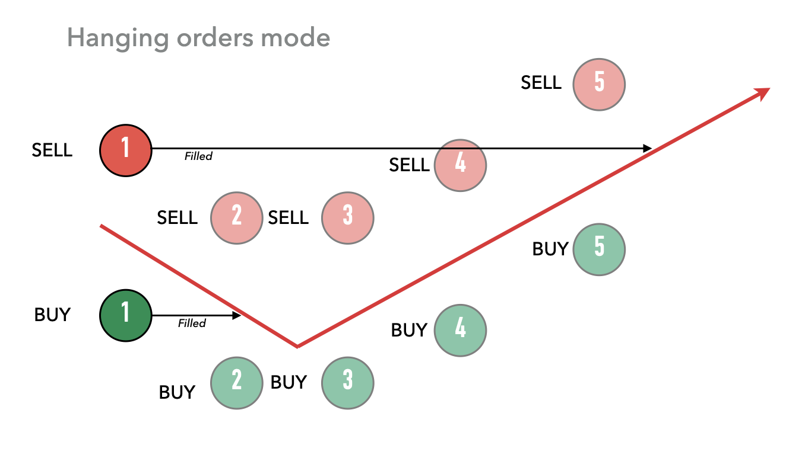

In the example above, the buy order for period 1 was filled. But since hanging orders mode was enabled, the original sell order from period 1 is not canceled during the refresh cycle (period 2) and remains outstanding. Meanwhile, the bot continues its operation of creating new orders (see periods 2 through 5). In the example, prices changed direction, and eventually at some point in the time, the hanging sell order was filled, around period 5.

The benefit of this strategy is that it creates the possibility of the pairings to be “completed” and balanced. In the example above, hanging orders allow the trader to match the buy and sell **eventually**, while locking in the bid-ask spread.

**Ping Pong**

The ping pong strategy is another strategy that tries to keep buys and sells balanced. It does so by creating orders only on the opposite side of an order that has been filled. For example:

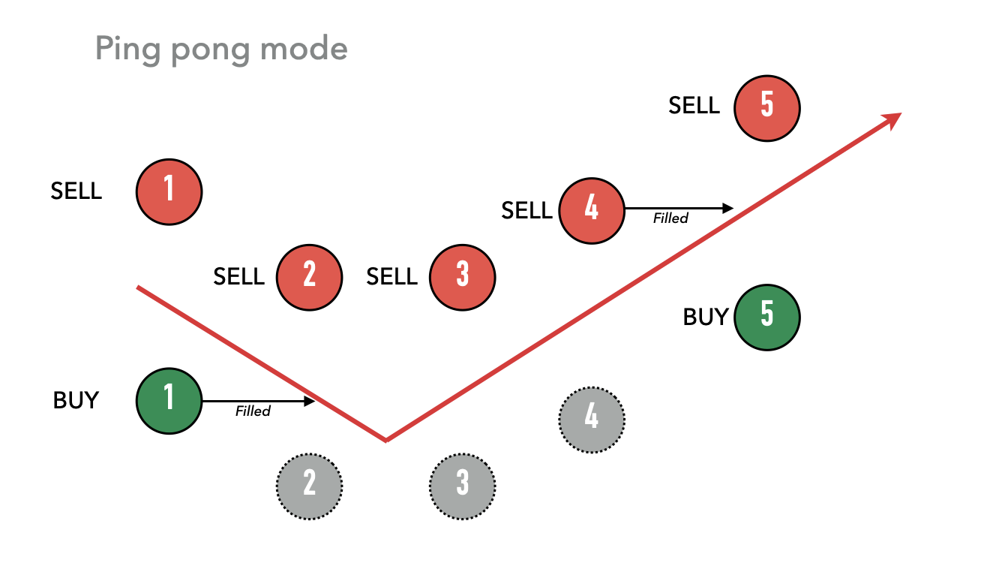

Because the buy order from period 1 was filled, the bot stops placing buy orders and only places sell orders (periods 2-4).  Only when a sell order is eventually filled (period 4) will the bot resume creating both buy and sell orders (period 5).

**Adjust spread on one side to follow a price trend**

Usually, the market makers apply the same `bid_spread` and `ask_spread`. This is great on sideways markets, because the price will be moving inside a range, and naturally the inventory will tend to be at a 50/50 rate, and the market maker will profit from the spread.

But like we said above, it gets problematic during a trending market, as the inventory may start to accumulate on the side of the less valuable asset.

An option to mitigate this is to tighten the spread on one side, to increase the probability of those orders being filled first.

Example:

Mark, the market maker started his operations on the BTC-USDT with bid_spread = 0.5 and ask_spread = 0.5. But the price started trending up, so he changed his parameters to bid_spread = 0.1 and ask_spread = 0.9.

That way, his total spread is still the same (1%), but his buy offers now have a higher chance to be filled before the sell offers.

**Scripts**

Hummingbot has a built-in script function, where you can create your own custom strategy, and the bot will adjust the parameters based on any strategy you want.

All you need is know how to code on Python, create a .py file integrated with Humminbot code base, and activate the script through config script_enabled command (you can find more information about scripts [here](../../../scripts/index.md).

You could even create a script that replicates an Automated Market Making logic, as [this reddit user asked](https://www.reddit.com/r/Hummingbot/comments/j6u8x0/amm_on_hummingbot/).

Our developer team is working on a lot of improvements for the scripts module, because this is the main way Hummingbot users will be able to implement their customized strategies.

### Wrapping up

Becoming a trader these days is really easy. 

But being a good trader, that’s another story.

What I realized after these years studying financial markets is that the main thing that separates good traders from bad traders is how much they know about risk and how they manage it.

A good strategy isn’t only about finding the best way to make money, but also about knowing what to do when the market moves against your plan.

Understanding the risks associated with each type of trading operation is essential to finding a sustainable and profitable strategy.

The major risk associated with market making is the inventory risk. Understanding and learning ways to mitigate it should be a priority for everyone looking to operate as a market maker on any market.

This article covered an explanation about the topic, and some practical ways to manage this risk using hummingbot, but this is such an important topic that there is a huge amount of research papers about it, like [Dealing with the Inventory Risk: A Solution to the Market Making Problem](https://www.researchgate.net/publication/51957950_Dealing_with_the_Inventory_Risk_A_Solution_to_the_Market_Making_Problem) and [Market making with asymmetric information and inventory risk](https://www.sciencedirect.com/science/article/abs/pii/S0022053116000065), and eventually, we will talk more about this topic in a close future.

Also, with the recent rise of the Automated Market Maker protocols (liquidity pools like Uniswap), liquidity mining, and everything related to Decentralized Finance (DeFi), it is really important to understand the risks if you are looking to be a passive market maker.

So, stay tuned on our blog, because soon we will publish an article comparing what are the key differences between these protocols and the traditional order book market making.

See you all next week.

### Join our community

If you want to learn more, make sure to follow our blog updates for new articles every week.

While you wait for the next post, remember to join our [Discord server](https://discord.hummingbot.io/), a place where our community talks about **market making** and **arbitrage**, and all the possible ways you can use Hummingbot to improve your trading strategies.

Also, if there is any specific topic you want us to cover on the Hummingbot Academy, contact our team on Discord, or send an email to [academy@hummingbot.io](mailto:academy@hummingbot.io).

See you soon, and I wish you all a profitable trading session!

See you all next week!
