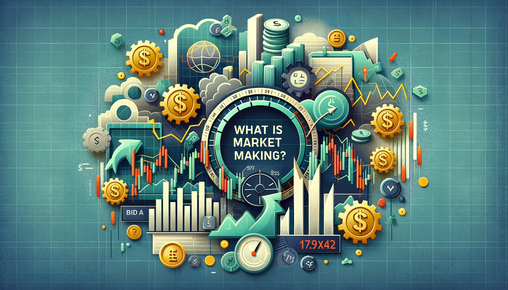
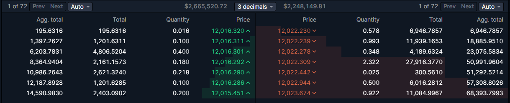
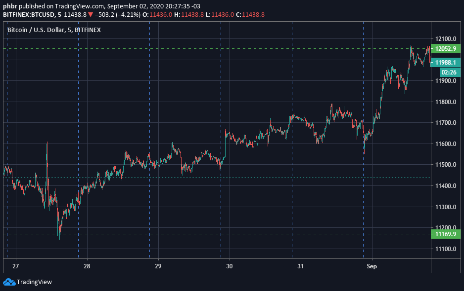
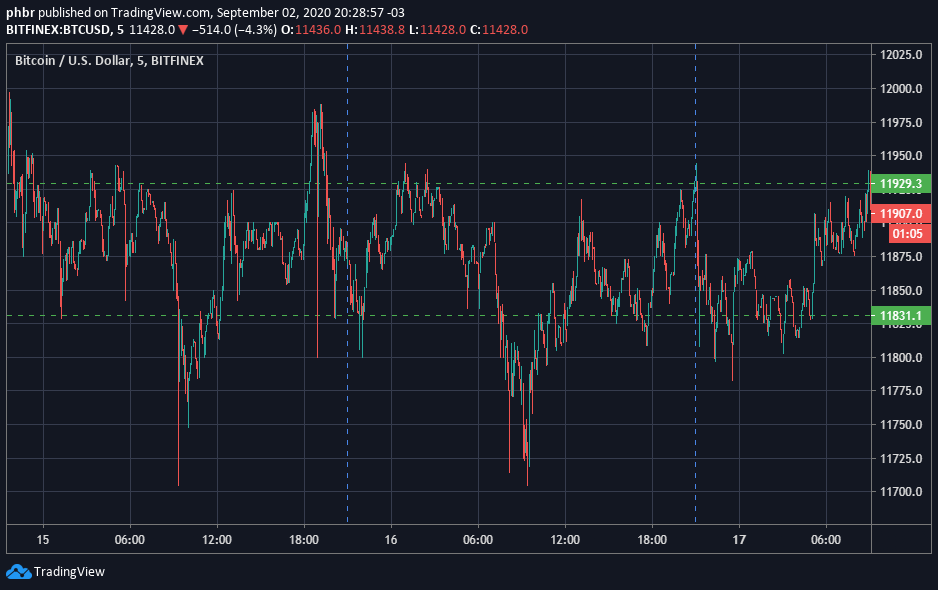
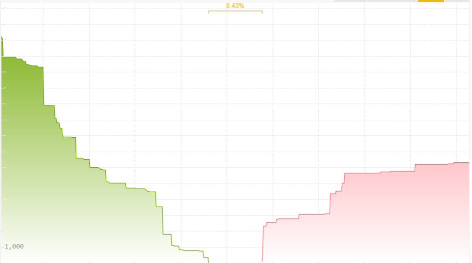

# What is Market Making?

## Welcome to Hummingbot Academy!

If you reached this page, there is a high probability that you have been asking one of these questions:

- **What is a market maker?**
- **What do market makers do?**
- **How can I become a market maker?**
- **How do I create a market making robot?**

Then you are on the right place!

Here at [Hummingbot](https://hummingbot.org/), our goal is to help you learn more about market making and how to use our free open-source robot to implement your own strategy.

<!-- more -->

### But what is a Market Maker?

> A market maker (MM) is a firm or individual who actively quotes two-sided markets in a security, providing bids and offers (known as asks) along with the market size of each. ([source](https://www.investopedia.com/terms/m/marketmaker.asp))

If the above quote didn't made any sense to you, imagine a pawnshop:

Let's say that Susan has an old guitar, doesn't have much time to play anymore, and could use some cash; meanwhile in another part of town, Mike has been learning to play his friend's guitar and now thinks that he is good enough to invest some cash to buy his own, but a brand new one might be too expensive.

Although we have two people that could close a deal, it might be difficult for them to find each other, or even to agree on a reasonable price for that guitar. 

This is where the pawn shop enter the picture:

Instead of looking around for someone that wants to buy a guitar, Susan could sell her guitar to the pawnshop, and Mike could go there knowing that he would find one.

The pawnshop owner is providing a **service** to both Susan and Mike. He offers an easy way to sell/buy what they want (**providing liquidity**) and a fair price, based on the demand for used guitar in the town (**spread reduction**). 

The pawnshop will be paid for this service by the difference in price he paid to Susan and the price he received from Mike (**spread size**).

> 💡 A **market maker,** like a pawnshop owner, provides the same kind of service in financial markets. He provides **liquidity** and helps to **reduce bid-ask spread sizes**, taking his profits from the difference between his buy and sell orders (**spread**).

### How does market making happen in financial markets?

A financial market isn't much different from the real economy open markets. Every day, millions of people access some kind of trading platform, looking to close deals among a wide range of assets, including company shares, bonds, oil, gold, contracts, and **cryptocurrencies**.

But instead of thousands of people gathering in the same place, holding signs and/or screaming for how much they are buying or selling something, **financial assets markets** use an **order book,** where all **buy and sell offers** are aggregated in the same place:

The order book is nothing more than a list of all buy and sell offers (with quantities and prices) available across all market participants.

In the picture above, we can see the BTC/USD pair **order book.** If someone is looking to **buy** Bitcoin right now, he/she will have to pay $12,022.230 (the lowest ask price) and there is 0.578 BTC available at that price.

But if someone wants to **sell** Bitcoin immediately, he/she will have to accept the price of $12,016.32 (the best bid price) for up to 0.016 BTC.

> 💡 The difference between the lowest of offer prices and the highest of demand prices for a good or asset is called **spread.**

Technically, any person that posts a buy or sell offer on the **order book** is acting as a market **maker**, while those who are accepting the prices offered on the **order book** is called a market **taker**.

Acting as a **market maker** is conceptually similar to participating in the market as the "pawnshop owner", creating offers to buy an asset at a low price, and selling it at a higher price **as fast as possible** and **as many times as possible**. 

> 💡 While the most common trading/investing strategy looks to profit from big price changes, a professional market maker is trying to capitalize on smaller but more consistent price swings between two price levels.

Most **traders and investors** want to see the market moving like this:

While market makers love to see market prices moving like this:

The price of an asset doesn't change at a constant flow but as waves, and while traders and investors are trying to find out if the sea is moving towards high or low tide, the market maker is watching the smaller waves on the beach.

### Bid-ask spread vs market maker spread

Looking at the state of the **order book** on the picture we saw earlier, a **market maker** could post two offers:

- Buy 1 Bitcoin for $12,016.320 (Bid price)
- Sell 1 Bitcoin for $12,022.230 (Ask Price)

When other market participants accept these prices, and a deal happens on both orders, the market maker will have a profit of $5.91 on this transaction.

This is also known as the market **Bid-Ask spread**, and in this example above, it's the $5.91 profit the **market maker** received for completing both sides of the operation:

(12,022.23-12,016.32) / 12,016.32 = 0.049%

Some exchanges even offer a way to visualize the ask-bid spread in real-time (along with the **book depth**, which is the accumulated size of all orders posted on the **order book**):

But this doesn't mean that a **market maker** must use always use this exact bid and ask prices. 

A **market maker** must still consider other factors when deciding what is going to be his **operational spread**, including:

- Market bid-ask spread;
- Transaction costs (including exchange fees and/or transfer fees);
- Trade volume;
- Market volatility;
- Operational costs (electric bills, cloud server costs, etc.);
- Any other costs related to the trading operation.

There is no right or wrong answer to how big or small the **market maker spread** should be, and in the end, the spread is just a part of the **market maker strategy**.

> 🐦 You can change your spread percentage on Hummingbot with the commands `config ask_spread` for sell orders and `config bid_spread` for buy orders.

### What goes into a strategy?

Being a profitable **market maker** isn't only about choosing a **spread size,** starting to send limit orders to the order book, and then turning around and forgetting about it.

Before starting a market making operation, you must ask yourself some questions:

- Should I keep the spread fixed all the time? Should I change it depending on market conditions?
- What should the size of my orders be?
- What should I do when there is a price trend in the market, or if there is no clear trend?
- How am I going to detect the market direction?
- How long should my orders stay on the book?
- If one side of the operation is filled, should I keep the opposing order until it is filled?
- Do I want to accumulate more of one asset over time, or do I want to always have a 50/50 balance?
- What should I do if there is price spike?
- Should I care about the average buying cost?
- When should I stay out of the market and for what reason, or should I trade all the time?
- What can I lose, and how much am I putting at risk?

The answers to these questions determine your actions (and reactions) based on the market conditions and will ultimately define your **strategy**.

A good **market making strategy** is nothing more than planning ahead on how you will react to market changes.

But before you get scared with all of these questions and give up on market making, here is a tip: 

> 💡 **Start Small.** Don't try to have all the answers to your strategy beforehand, but focus on one parameter at a time, testing and watching what happens in different market situations.
Over time, add another parameter and do more testing and watch how all the pieces are working together.

You are not going to find a cookie cutter, ready-to-use, one-size-fits-all and always profitable strategy/parameters just simply lying around, but after some time, you will start to understand the good and the bad of each **strategy**, and after experimenting with some of them will find one that fits your goals.

> 🐦 On Hummingbot, you can combine different settings in different ways using the `config` command to build a wide variety of strategies. Check out the [pure market making reference guide](https://docs.hummingbot.org/strategies/pure-market-making/) to see what each parameter is used for.

### Automated trading and market making

So, trading robots... That is probably another reason why you are reading this article; you are not just looking to become a **market maker**, you are looking to setup a **market making robot** to do all of the hard work.

After all, [Hummingbot](https://hummingbot.org/) is an **open-source trading robot**, available for **free** to anyone who wants to start an **automated trading strategy**.

While it is possible to do **market making** operations manually, a **trading robot** allows your strategy to be executed in a precise way, remove the emotional factor (greed and fear), and even create safety measures for better risk control.

But not all robots are made equal, and depending on what kind of strategy you are going to use (high-frequency, low-frequency, trend following, grid, straddle, quant... there are a lot of possibilities), one bot might do a better job than others.

After all, a trading robot is a tool and we must use the right tool for the job.

[Hummingbot](https://hummingbot.org/) is a great choice for algorithmic **market making** for the **cryptocurrency** markets because it is **focused** on this kind of trading operation.

But no matter what robot you choose to use, it's always important to remember:

> 🐦 What defines the **profitability** of a trading operation is the **strategy**. The algorithm is only the strategy translated into computer instructions and executed in an automated way.

### A quick note on profit and risk

**Market making is not a risk-free, always profitable trading operation.**

Like any other trade activity, running a robot to **capitalize on market imperfections** comes with its own set of **risk/reward** features. 

Therefore, before you start using real funds, make sure that you understand what the mechanics of this type of trading are and what kind of **risks** you will be exposing yourself to.

> 🐦 With Hummingbot you can enable the **paper trading mode** using the command `paper_trading`, which allows you to test your strategy in a **real-time simulated environment**, without the need to put your capital at risk.

### Join our community

This is only the first article of the Hummingbot Academy and there are a lot more articles to come where we will talk about other topics related to **market making** and **arbitrage** trading, including some **strategy analysis**. Our objective is to help you learn how to become a better market **maker/arbitrageur**.

If you want to learn more, make sure to follow our blog updates for new articles every week.

While you wait for the next post, remember to join our [Discord server](https://discord.gg/hummingbot), a place where our community talks about **market making** and **arbitrage**, and all the possible ways you can use Hummingbot to improve your trading strategies.

Also, if there is any specific topic you want us to cover on the Hummingbot Academy, contact our team on Discord, or send an email to academy@hummingbot.io.

See you soon, and I wish you all a profitable trading session!

