# Your Botcamp Membership Includes

-   ### 📺 __Live Sessions__

    ---

    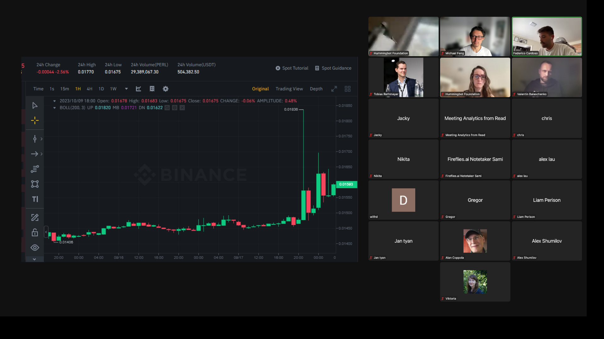

    Learn market making with live sessions and new content every month

-   ### ⚔️ __Bot Battles__

    ---

    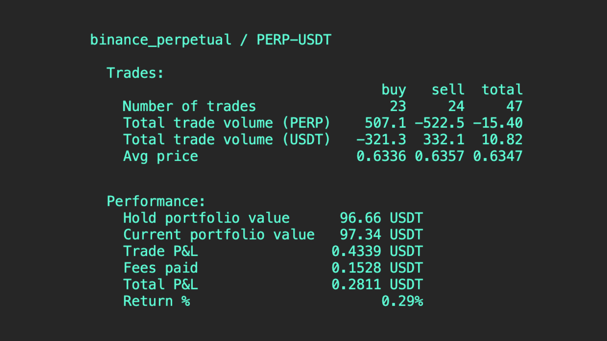

    Test your skills against other members in bot trading competitions

-   ### 📚 __Content Library__

    ---

    

    6+ modules that teach you how to code different trading strategies

-   ### 🕒 __Office Hours__

    ---

    

    Get individualized help from experts during monthly office hours

---

# Who is Botcamp For?

-   ## 👨‍🌾 __Crypto Traders__

    ---

    

    Use an open source framework to automate your trading strategies

-   ## 👩‍💻 __Quants and Developers__

    ---

    

    Apply your data science and coding skills to build a profitable crypto trading bot

-   ## 👨‍💼 __Market Makers__

    ---

    

    Backtest and deploy a fleet of market making bots across any CEX and DEX

---

# Join Traders and Engineers from Top Institutions

  

    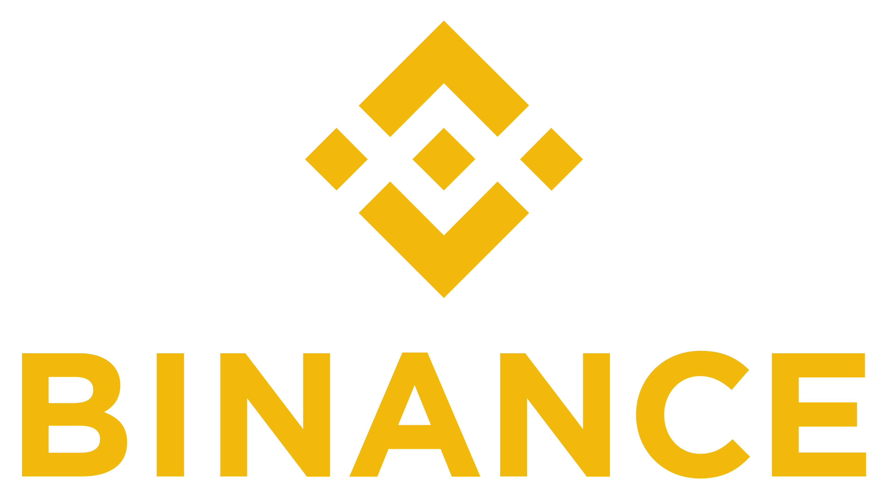
  

  

    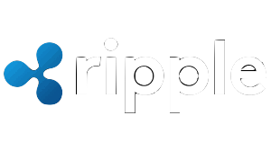
    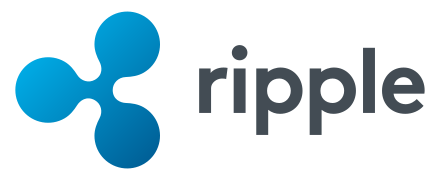
  

  

    
  

  

    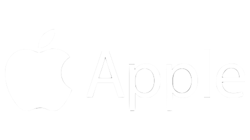
    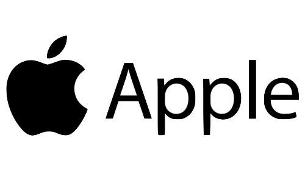
  

  

    
    
  

  

    
    
  

  

    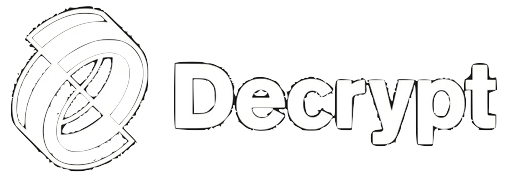
    
  

  

    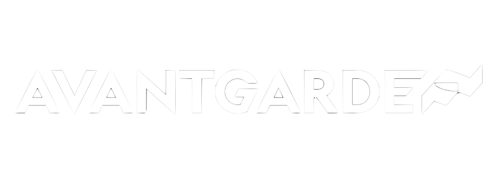
    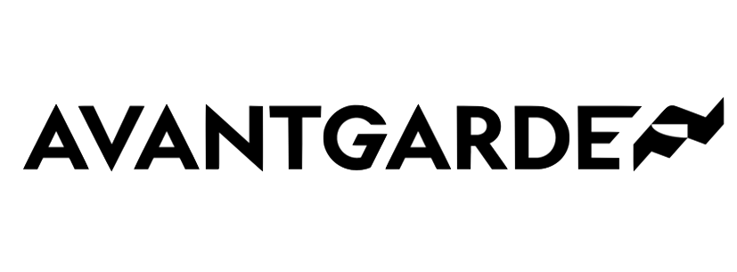
  

 

  :material-format-quote-open:
  Botcamp helped me utilize Hummingbot to its fullest, and I finally grasped the nuances of the cross-exchange market making strategy!
  :material-format-quote-close:

   
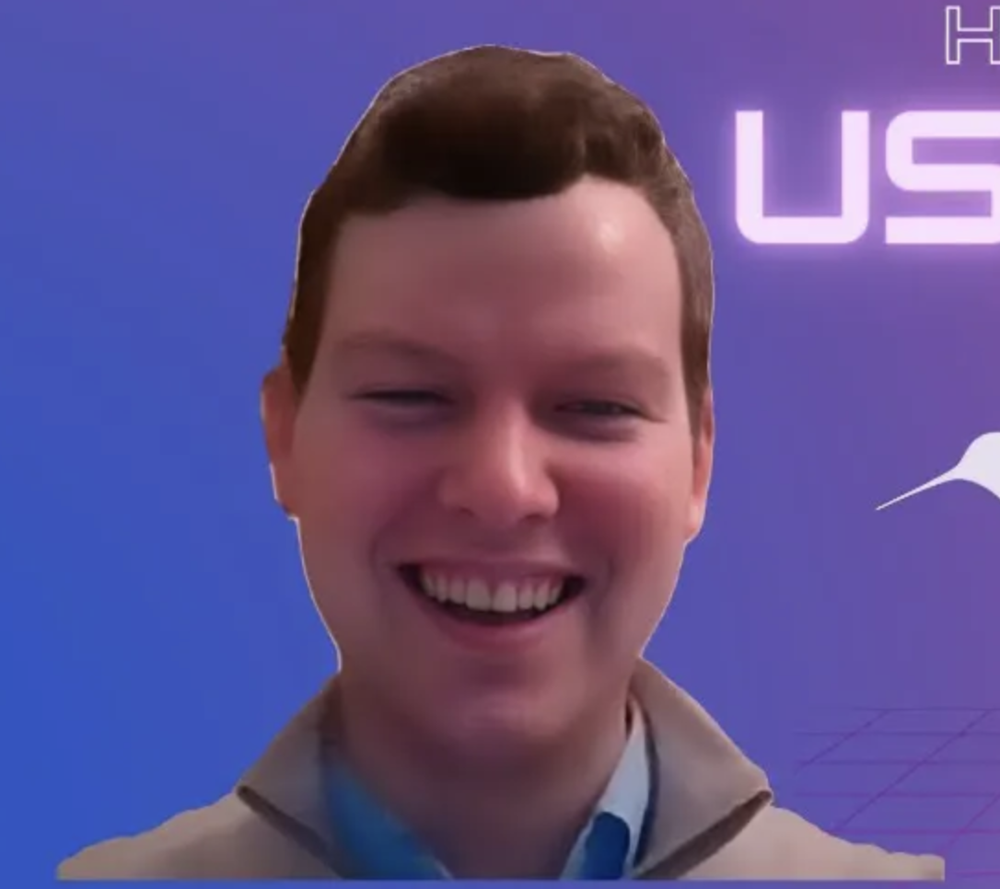
 
Toby
 
<a href="https://www.youtube.com/watch?v=QPnOPPoXcrM&list=PLDwlNkL_4MMeI3oyeACxbn-PZsobcEWJn&index=1" target="_blank" class="centered">Watch Testimonial ↗️</a>
{ .testimonial }

  :material-format-quote-open:
  I'm a software engineer, so learning the trader mindset, hedging, and how to navigate the DeFi jungle were important to help me grow as an algo trader!
  :material-format-quote-close:

   
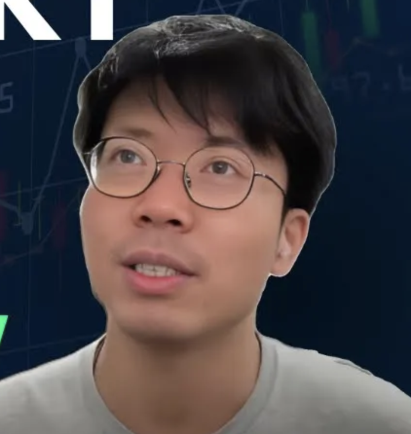
 
Alex
 
<a href="https://www.youtube.com/watch?v=4elUhsZdc6w&list=PLDwlNkL_4MMeI3oyeACxbn-PZsobcEWJn&index=2" target="_blank" class="centered">Watch Testimonial ↗️</a>
{ .testimonial }

  :material-format-quote-open:
  Coding was just a hobby, but then I found that I can make money from it. Now, I run Hummingbot to support my family's needs and serve as a Botcamp mentor!
  :material-format-quote-close:

   
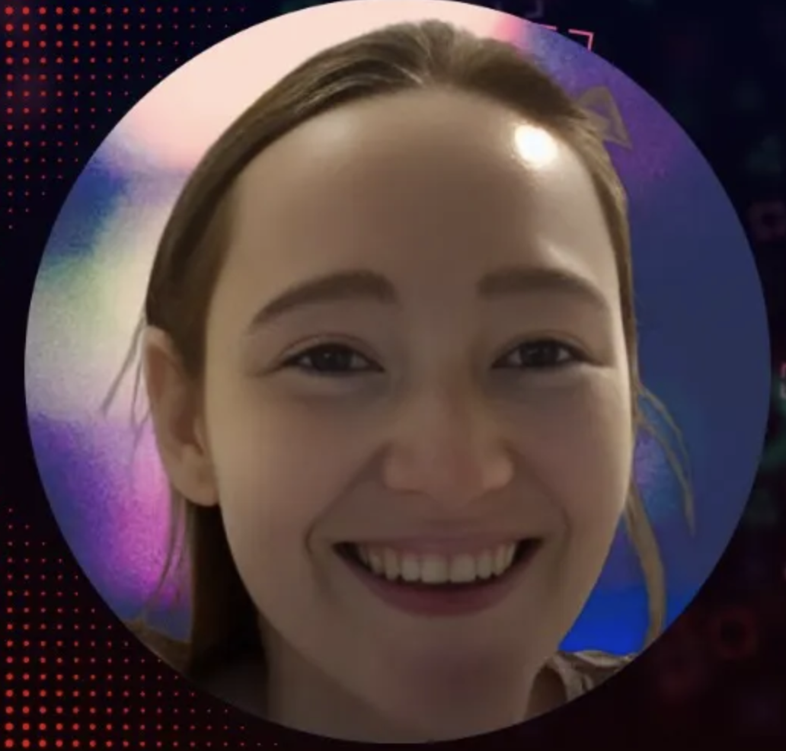
 
Viktoria
 
<a href="https://www.youtube.com/watch?v=rFq0Add0qJ0&list=PLDwlNkL_4MMeI3oyeACxbn-PZsobcEWJn&index=3" target="_blank" class="centered">Watch Testimonial ↗️</a>
{ .testimonial }

---

# Access a Growing Content Library

### Each module contains hours of videos, code examples, and quizzes. We continually add new content.

-   

    <a href="https://botcamp.hummingbot.org/p/1-bot-trading-basics" target="_blank" class="centered">Preview Content ↗️</a>

-   

    <a href="https://botcamp.hummingbot.org/p/2-hummingbot-developer-guide" target="_blank" class="centered">Preview Content ↗️</a>

-   

    <a href="https://botcamp.hummingbot.org/p/3-market-making-strategies" target="_blank" class="centered">Preview Content ↗️</a>

-   

    <a href="https://botcamp.hummingbot.org/p/4-arbitrage-xemm-strategies" target="_blank" class="centered">Preview Content ↗️</a>

-   

    <a href="https://botcamp.hummingbot.org/p/5-directional-strategies" target="_blank" class="centered">Preview Content ↗️</a>

-   

    <a href="https://botcamp.hummingbot.org/p/module-6-backtesting-strategies" target="_blank" class="centered">Preview Content ↗️</a>

-   

    Coming Q1 2024

-   

    Coming Q2 2024

-   

    <a href="https://botcamp.hummingbot.org/p/botcamp-event-recordings" target="_blank" class="centered">Preview Content ↗️</a>

---

# Meet Your Instructors

 
Michael Feng
 

  Michael co-founded CoinAlpha, the company behind Hummingbot, and wrote the Hummingbot whitepaper in 2019. Previously, he spent 7 years in credit derivatives at JPMorgan and Citigroup, where he structured some of the CDOs featured in <a href="https://www.youtube.com/watch?v=mdOctJI2UMg" target="_blank">The Big Short</a>. Michael lives in California, USA.

  

  In Botcamp, Michael teaches the theory modules and answers questions from members during monthly Office Hours.

  

  <a href="https://www.linkedin.com/in/mifeng/" target="_blank">LinkedIn↗️</a> | <a href="https://twitter.com/fengtality" target="_blank">Twitter↗️</a> | <a href="https://github.com/fengtality" target="_blank">Github↗️</a>

{ .testimonial }

 
Federico Cardoso
 

  Federico is the CTO of Hummingbot Foundation. In addition, he teaches Machine Learning and Big Data at the University of Buenos Aires. Previously, he was a quant trader at CTF Capital, a hedge fund that specialized in high-frequency market making. Federico lives in Mar del Plata, Argentina.

  

  In Botcamp, Fede teaches the coding and modules and shows members how to use Hummingbot to customize their strategies.

  

  <a href="https://www.linkedin.com/in/federico-cardoso-977ba13a/" target="_blank">LinkedIn↗️</a> | <a href="https://twitter.com/cardosofede" target="_blank">Twitter↗️</a> | <a href="https://github.com/cardosofede" target="_blank">Github↗️</a>

{ .testimonial }

---

# Plans & Pricing

-   ## All Plans Include

    ---

    - :books: **Content Library**: Hours of videos, code examples, quizzes, with regular updates.
    - :calendar_spiral: **Monthly Events**: Live Session, Office Hours, and a Bot Battle, totaling over 5 hours of interactive learning and competition each month.
    - :key: **Exclusive Access**: Private Botcamp repository and Discord channels for member-only strategies, challenges, and recaps.

-   ## 👨‍🌾 __Monthly Membership__

    ---

     
    # $199/month

    - **Most Flexible (Cancel anytime)**{ .text-highlight }
    - $199 monthly subscription
    - :material-credit-card: Pay via credit card

     

    [Enroll Now](https://botcamp.hummingbot.org/purchase?product_id=5180822){ .md-button }

-   ## 👩‍💻 __3-Month Pass__{ .card-highlight }

    ---

     
    # $167/month

    - **Most Popular (Save $100 vs monthly)**{ .text-highlight }
    - Billed as one payment of $500
    - :material-credit-card: :simple-bitcoin: Pay via credit card or crypto

     

    [Enroll Now](https://botcamp.hummingbot.org/purchase?product_id=5115670){ .md-button }

-   ## 👨‍💼 __12-Month Pass__

    ---

     
    # $99/month

    - **Best Value (Save 50% vs monthly)**{ .text-highlight }
    - $1188 annually
    - :material-credit-card: :simple-bitcoin: Pay via credit card or crypto

     

    [Enroll Now](https://botcamp.hummingbot.org/purchase?product_id=5180823){ .md-button }

### If you want to pay in crypto, ask about team discounts, or have any other questions, email us at <a href="mailto:operations@hummingbot.org" target="_blank">operations@hummingbot.org</a>.

---

# Hear from More Botcamp Members

  :material-format-quote-open:
  You come away from Botcamp having built your own script, and that's much more relevant and useful that just going through content and doing homework.
  :material-format-quote-close:

   

 
Calum
 
<a href="https://www.youtube.com/watch?v=bOGIpYqo3H4&list=PLDwlNkL_4MMeI3oyeACxbn-PZsobcEWJn&index=4" target="_blank" class="centered">Watch Testimonial ↗️</a>
{ .testimonial }

  :material-format-quote-open:
  If you’re new to crypto trading, Botcamp can be a great starting point - it covers everything from fetching order book data to coding strategies!
  :material-format-quote-close:

   

 
Makir
 
<a href="https://www.youtube.com/watch?v=_KvVs8SkdAg&list=PLDwlNkL_4MMeI3oyeACxbn-PZsobcEWJn&index=5" target="_blank" class="centered">Watch Testimonial ↗️</a>
{ .testimonial }

  :material-format-quote-open:
  I'm not a full-time coder, yet I was able to build a trading strategy that I'm proud of. Thanks to Botcamp, I'm now starting a crypto trading startup with my friend!
  :material-format-quote-close:

   
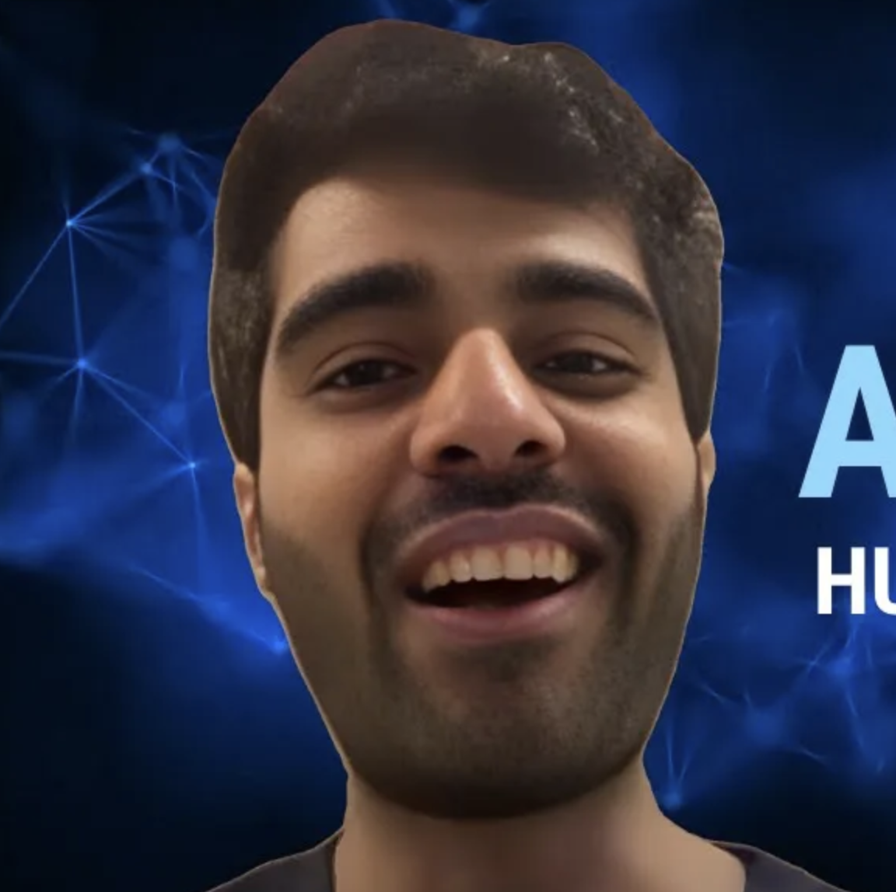
 
Alkalifah
 
<a href="https://www.youtube.com/watch?v=lamJjaHcRSs&list=PLDwlNkL_4MMeI3oyeACxbn-PZsobcEWJn&index=7" target="_blank" class="centered">Watch Testimonial ↗️</a>
{ .testimonial }

 

[More Testimonials](https://www.youtube.com/watch?v=m_PNTacb3Ks&list=PLDwlNkL_4MMeI3oyeACxbn-PZsobcEWJn&index=6){ .md-button .md-button--primary .centered }

---

# Frequently Asked Questions

### See the [Botcamp FAQ](faq.md) for more information.