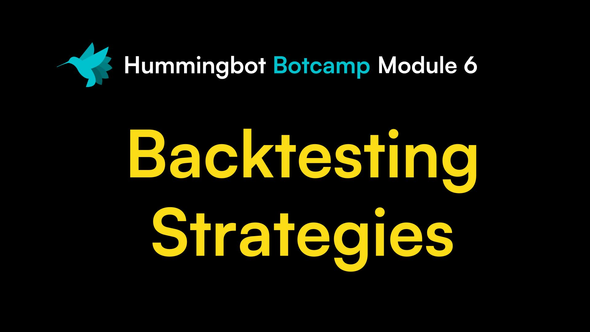

# Your Botcamp Membership Includes

-   ### 📺 __Live Sessions__

    ---

    Learn market making with live sessions and new content every month

-   ### ⚔️ __Bot Battles__

    ---

    Test your skills against other members in bot trading competitions

-   ### 📚 __Content Library__

    ---

    6+ modules that teach you how to code different trading strategies

-   ### 🕒 __Office Hours__

    ---

    Get individualized help from experts during monthly office hours

---

# Who is Botcamp For?

-   ## 👨‍🌾 __Crypto Traders__

    ---

    

    Use an open source framework to automate your trading strategies

-   ## 👩‍💻 __Quants and Developers__

    ---

    

    Apply your data science and coding skills to build a profitable crypto trading bot

-   ## 👨‍💼 __Market Makers__

    ---

    

    Backtest and deploy a fleet of market making bots across any CEX and DEX

---

# Hear from Botcamp Members

:material-format-quote-open:
Coding was just a hobby, but then I found that I can make money from it. Now, I run Hummingbot to support my family's needs and serve as a Botcamp mentor!
:material-format-quote-close:

   

 
Toby
 
<a href="https://www.youtube.com/watch?v=QPnOPPoXcrM&list=PLDwlNkL_4MMeI3oyeACxbn-PZsobcEWJn&index=1" target="_blank" class="centered">Watch Testimonial ↗️</a>
{ .testimonial }

:material-format-quote-open:
I'm not a full-time coder, yet I was able to build a trading strategy that I'm proud of. Thanks to Botcamp, I'm now starting a crypto trading startup with my friend!
:material-format-quote-close:

   

 
Alex
 
<a href="https://www.youtube.com/watch?v=4elUhsZdc6w&list=PLDwlNkL_4MMeI3oyeACxbn-PZsobcEWJn&index=2" target="_blank" class="centered">Watch Testimonial ↗️</a>
{ .testimonial }

:material-format-quote-open:
If you’re new to crypto trading, Botcamp can be a great starting point - it covers everything from fetching order book data to coding strategies!
:material-format-quote-close:

   

 
Calum
 
<a href="https://www.youtube.com/watch?v=_KvVs8SkdAg&list=PLDwlNkL_4MMeI3oyeACxbn-PZsobcEWJn&index=5" target="_blank" class="centered">Watch Testimonial ↗️</a>
{ .testimonial }

:material-format-quote-open:
I'm not a full-time coder, yet I was able to build a trading strategy that I'm proud of. Thanks to Botcamp, I'm now starting a crypto trading startup with my friend!
:material-format-quote-close:

   

 
Alkalifah
 
<a href="https://www.youtube.com/watch?v=lamJjaHcRSs&list=PLDwlNkL_4MMeI3oyeACxbn-PZsobcEWJn&index=7" target="_blank" class="centered">Watch Testimonial ↗️</a>
{ .testimonial }

:material-format-quote-open:
Coding was just a hobby, but then I found that I can make money from it. Now, I run Hummingbot to support my family's needs and serve as a Botcamp mentor!
:material-format-quote-close:

   

 
Viktoria
 
<a href="https://www.youtube.com/watch?v=rFq0Add0qJ0&list=PLDwlNkL_4MMeI3oyeACxbn-PZsobcEWJn&index=3" target="_blank" class="centered">Watch Testimonial ↗️</a>
{ .testimonial }

:material-format-quote-open:
If you’re new to crypto trading, Botcamp can be a great starting point - it covers everything from fetching order book data to coding strategies!
:material-format-quote-close:

   

 
Makir
 
<a href="https://www.youtube.com/watch?v=_KvVs8SkdAg&list=PLDwlNkL_4MMeI3oyeACxbn-PZsobcEWJn&index=5" target="_blank" class="centered">Watch Testimonial ↗️</a>
{ .testimonial }

 

[More Testimonials](https://www.youtube.com/watch?v=m_PNTacb3Ks&list=PLDwlNkL_4MMeI3oyeACxbn-PZsobcEWJn&index=6){ .md-button .md-button--primary .centered }

---

# Access a Growing Content Library

### You get access to 6 core modules, each containing hours of videos, code examples, and quizzes. We continually add advanced content that build upon the core modules.

 

## Core Modules

-   

    <a href="https://botcamp.hummingbot.org/p/1-bot-trading-basics" target="_blank" class="centered">Preview Content ↗️</a>

-   

    <a href="https://botcamp.hummingbot.org/p/2-hummingbot-developer-guide" target="_blank" class="centered">Preview Content ↗️</a>

-   

    <a href="https://botcamp.hummingbot.org/p/3-market-making-strategies" target="_blank" class="centered">Preview Content ↗️</a>

-   

    <a href="https://botcamp.hummingbot.org/p/4-arbitrage-xemm-strategies" target="_blank" class="centered">Preview Content ↗️</a>

-   

    <a href="https://botcamp.hummingbot.org/p/5-directional-strategies" target="_blank" class="centered">Preview Content ↗️</a>

-   

    <a href="https://botcamp.hummingbot.org/p/botcamp-event-recordings" target="_blank" class="centered">Preview Content ↗️</a>

## In Progress and Upcoming Modules

-   

    In Progress

-   

    Q1 2024

-   

    Q2 2024

---

# Monthly Live Sessions and Continual Support

### Each month of Botcamp features **three live events** that teach you the theory and application of quantitative market making. After each event, the recording and recaps are made available to Botcamp members in the **Botcamp Event Recordings** module.

 

-   ### 📺 __Live Session__

    ---

    

    The first week of the month features a live instructional session on a new topic.

-   ### 🕒 __Office Hours__

    ---

    

    Mid-month, we hold a public office hours to answer questions from members.

-   ### ⚔️ __Bot Battle__

    ---

    

    Each month ends with an exclusive bot trading competition for the Botcamp community

-   ### ⚔️ __Discord Support__

    ---

    

    Discord, Botcamp staff help members install Hummingbot and answer their questions.

---

# Meet Your Instructors

---

# Plans & Pricing

---

# FAQ

