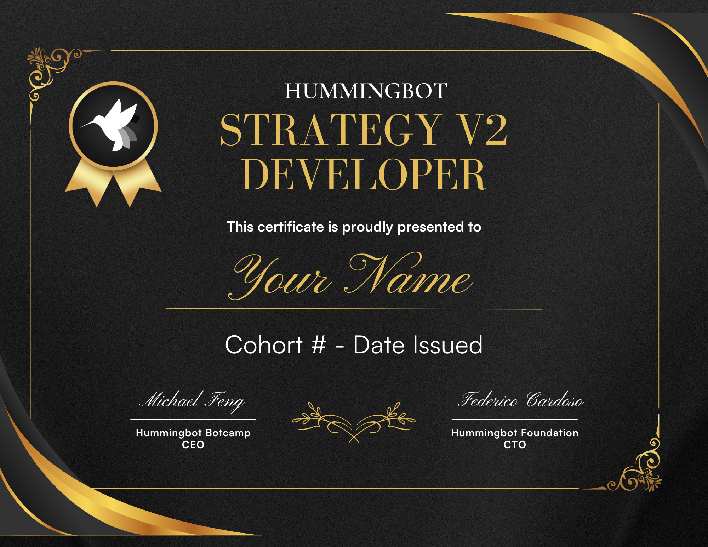

# Hummingbot Certified Developers

Hummingbot Certified Developers have successfully completed a [Hummingbot Botcamp](https://www.botcamp.xyz) cohort, demonstrating their ability to design, code, and present a custom trading strategy.

See [Certifications List](list.md) for current certified developers.

## Certification Types

### Hummingbot Strategy V2 Developer

Proficient in creating and deploying professional-grade algorithmic trading strategies using the [Hummingbot Strategy V2 framework](/v2-strategies). Skills include:

- Designing and coding custom strategies
- Familiarity with Hummingbot codebase
- Deployment expertise

### Hummingbot Market Maker

Offered starting [Cohort 9](https://www.botcamp.xyz/event/certified-market-maker-3/register) in August 2024. Skills include:

- Market making theory
- CEX and DEX proficiency
- Multiple strategy deployment

### Hummingbot Script Developer

*Replaced by Hummingbot Strategy V2 Developer certification starting in Cohort 6.*

Focuses on creating custom algorithmic trading strategies using [Scripts](/scripts).

## Certification Process

For detailed information on the certification process, please see the [Certification Process](process.md) page.

## Benefits of Certification

1. **Certificate**: Formal recognition of skills and achievements
2. **Certifications List**: Inclusion in the [master list](list.md) of certified developers
3. **LinkedIn Certification**: Add certification to LinkedIn profile
4. **Discord Badge**: Receive certification badge(s) on Discord server

For more information on adding the certification to LinkedIn, see [LinkedIn's help article](https://www.linkedin.com/help/linkedin/answer/a567169) or [this walkthrough](https://www.linkedin.com/pulse/how-add-certification-linkedin-step-by-step-maia-digital-ltd/).