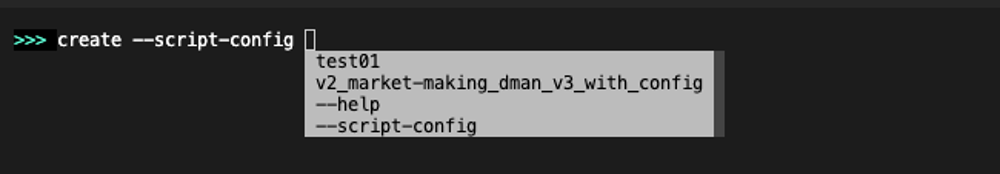
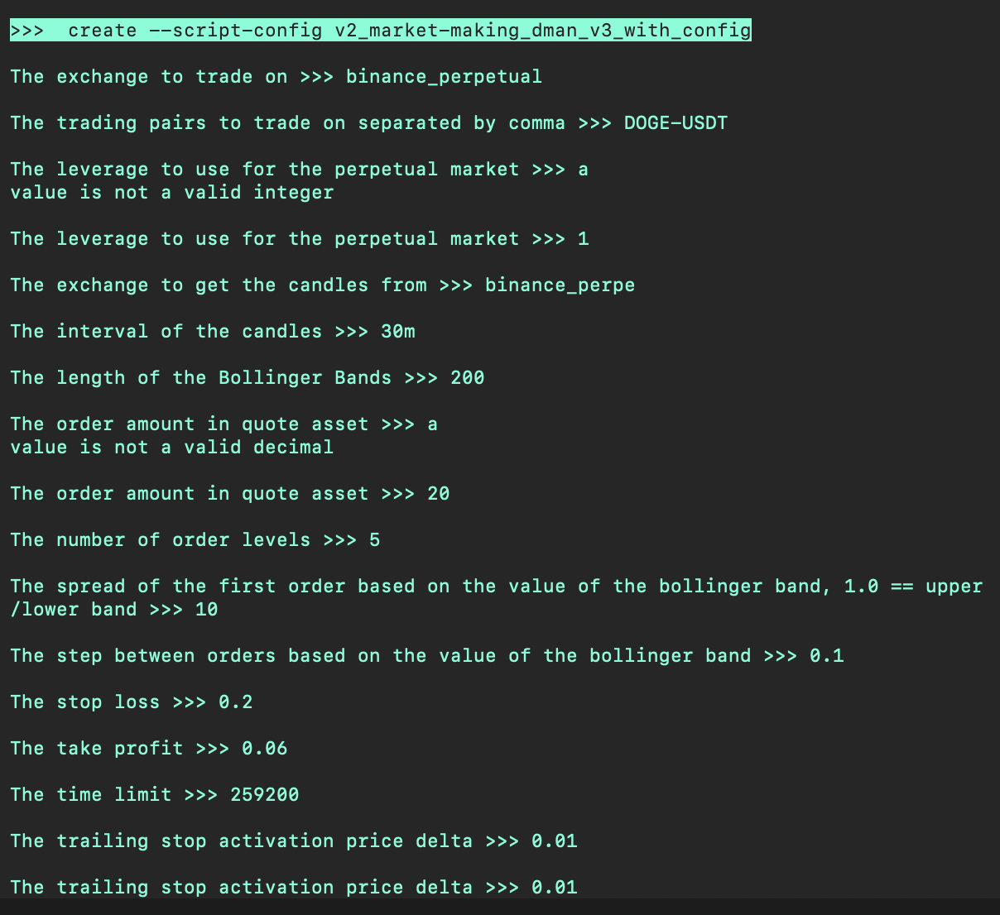
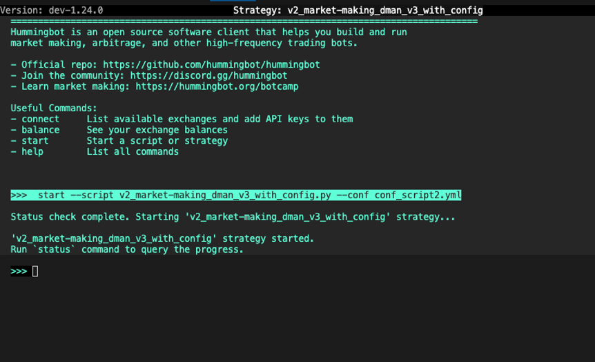

A config file allows you to define the parameters used in a YAML file. Later, you can modify the values of this file, share it with others, and and import it into your strategy.

## Where config files are stored

These configuration files created and used by Hummingbot are saved in the [`/conf`](https://github.com/hummingbot/hummingbot/tree/master/conf) directory of your instance, which you can edit directly with a standard text editor.

* `conf/scripts`: config files for scripts
* `conf/controllers`: config files for StrategyV2 controllers
* `conf/strategies`: config files for the original "V1" strategies

## Script config files

Starting in v1.24.0, [Scripts](/scripts) can define a `ScriptConfig` class that defines configuration parameters that users can store in a YAML file.

```python
class DManV3ScriptConfig(BaseClientModel):
    script_file_name: str = Field(default_factory=lambda: os.path.basename(__file__))

    # Account configuration
    exchange: str = Field("binance_perpetual", client_data=ClientFieldData(prompt_on_new=True, prompt=lambda mi: "Enter the name of the exchange where the bot will operate (e.g., binance_perpetual):"))
    trading_pairs: str = Field("DOGE-USDT,INJ-USDT", client_data=ClientFieldData(prompt_on_new=True, prompt=lambda mi: "List the trading pairs for the bot to trade on, separated by commas (e.g., BTC-USDT,ETH-USDT):"))
    leverage: int = Field(20, client_data=ClientFieldData(prompt_on_new=True, prompt=lambda mi: "Set the leverage to use for trading (e.g., 20 for 20x leverage):"))
```

This is an optional feature, and more basic scripts may elect to hardcode their parameters in the script file.

### Creating script config files

To create a configuration file for a compatible, run the `create` command and add the `--script-config` flag. 

In the auto-complete dropdown, only the configurable scripts located in the [/scripts](https://github.com/hummingbot/hummingbot/tree/master/scripts) 
folder will be shown.



Afterwards, you will be presented with prompts and default values defined in the config class above.



The last prompt will ask you to enter a name for the config file, which is saved in `conf/scripts`.

### Starting configurable scripts

Run `start` with both `--script` and `--conf` flags to run a script with a configuration file.



## Controller config files

The StrategyV2 framework abstracts strategy logic into [Controllers](/v2-strategies/controllers/). Each controller defines the config parameters that it accepts.

### Creating controller config files

To create a controller configuration file, run the `create` command and add the `-controller-config` flag. 

In the auto-complete dropdown, the controllers in each sub-folder in the [/controllers](https://github.com/hummingbot/hummingbot/tree/master/controllers) 
folder will be shown.

Similar to the script config, you will be presented with prompts and default values defined in the controller. 

The last prompt will ask you to enter a name for the config file, which is saved in `conf/controllers`.

### Starting controller configs

To start a controller configuration, define the configuration file of the [`v2_generic_with_controllers.py`](https://github.com/hummingbot/hummingbot/blob/master/scripts/v2_generic_with_controllers.py) loader script:

```
create --script-config v2_generic_with_controllers
```

Afterwards, start the loader script by running:
```
start --script v2_generic_with_controllers.py --conf conf_v2_generic_with_controllers_1.yml
```


## Strategy V1 config files

The original Hummingbot [V1 strategies](/v1-strategies) also allowed users to define config files.

### Creating Strategy V1 config files

Run `create` command without the `--script-config` flag to create a [Strategy V1](/v1-strategies) config file. The autocomplete command will display a list of the available V1 strategies, each one a folder in the [/hummingbot/strategy](https://github.com/hummingbot/hummingbot/tree/master/hummingbot/strategy) folder.

Next, answer the prompts to configure your bot's behavior depending on the strategy you want to use.

The last prompt will ask you to enter a name for the config file. You can also specify the name of your file at the beginning by running `create [file_name]` command.


### Import an existing config file

1. Run `import` command
2. Enter the name of your strategy config file


You can also skip the prompt by running `import [file_name]` command.


**Sample usage**

```
>>>`import conf_pure_mm_1.yml`
Configuration from conf_pure_mm_1.yml file is imported.

Preliminary checks:
 - Exchange check: All connections confirmed.
 - Strategy check: All required parameters confirmed.
 -All checks: Confirmed.

Enter "start" to start market making

>>> start

```

### Config file templates

While Scripts are single files that contain the types and messages for their parameters, V1 Strategies have a separate pre-defined template configuration file defined by the strategy author. 

Each V1 strategy template can be found here: [Config Templates](https://github.com/hummingbot/hummingbot/tree/master/hummingbot/templates).

