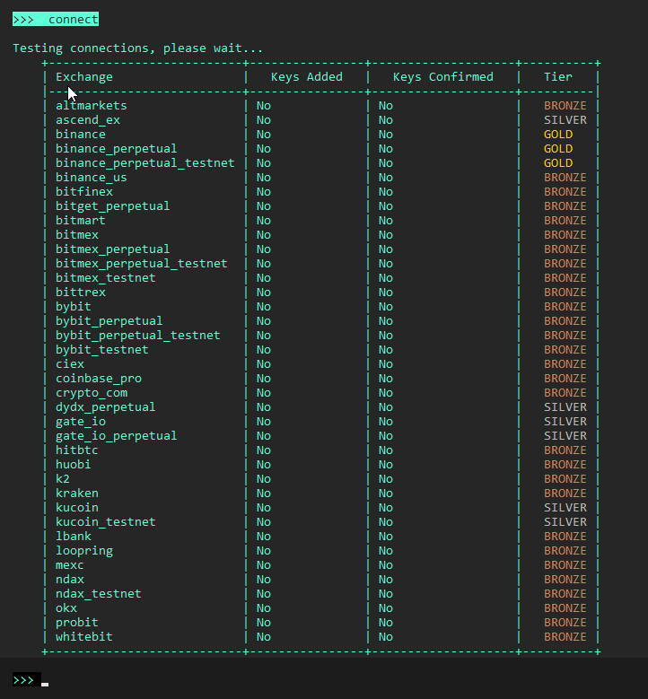

The `connect` command lets you add your user credentials in order to connect to an exchange or protocol. For centralized exchanges, this command asks you for your API key, while blockchain protocols asks you for your private key.

Hummingbot stores both API keys and private keys on the local machine in encrypted form, with the Hummingbot client password as the key.

## Connecting to exchanges

1. Run `connect [exchange_name]` command e.g. `connect binance`
1. Enter API and secret keys when prompted
1. Other exchanges may require additional details such as account ID, exchange address, etc.

See [Exchanges](/exchanges) for more information about how to create API keys for each exchange.

!!! warning "Only enable Read and Trade access"
    For security reasons, Hummingbot does not support deposit and withdrawal functionality. Therefore, we recommend using only **read + trade** enabled API keys. It is not necessary to enable **withdraw**, **transfer**, or anything equivalent to retrieving assets from your wallet.

## Checking connection status

Run the `connect` command to view the status of each connector. It also shows failed connections due to connectivity issues, invalid API key permissions, etc.

**Keys Added** column indicates if API keys are added to Hummingbot.

**Keys Confirmed** column shows the status if Hummingbot has successfully connected to the exchange or protocol.

**Tier** column shows the connector tier (Gold, Silver, Bronze). For more info on connector tiers see the [exchanges](/exchanges) documentation.
