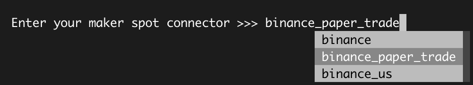
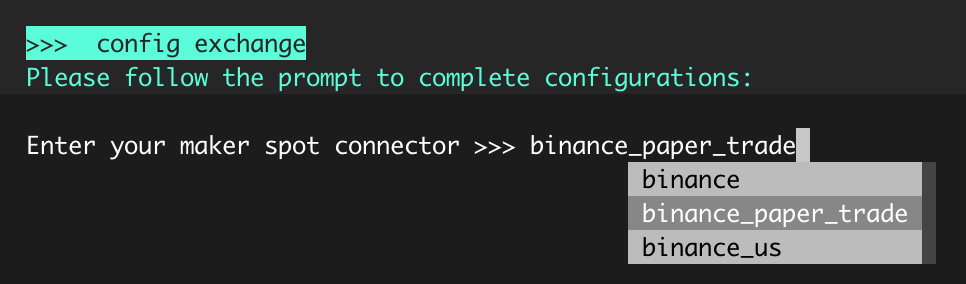
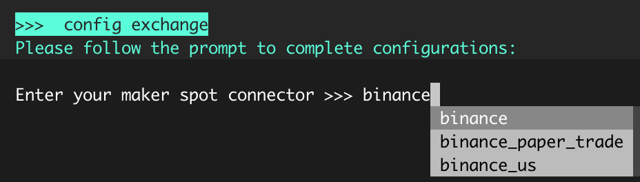

This feature allows users to test Hummingbot and simulate trading strategies without risking any actual assets.

!!! note
    Exchange APIs are not required to run the bot on paper_trade for Pure Market making, Cross Exchange Market Making and Avellaneda Market Making. 


## Adding Exchanges

Users can add paper exchanges by listing them under `paper_trade_exchanges` in `conf_client.yml`. By default, paper trade is enabled for Binance, KuCoin, Kraken, and Gate.io. You can find `conf_client.yml` at `hummingbot/conf/conf_client.yml`.

Add a paper trade exchange, for example Kraken, to `conf_client.yml`:

```
paper_trade:
  paper_trade_exchanges:
    - binance
    - kucoin
    - kraken
    - gate_io
```

In the Hummingbot client, `kraken_paper_trade` should now be available when you select an exchange:

Enter your maker spot connector >>> kraken_paper_trade

## Enabling and Disabling

Paper trading can be enabled when creating a strategy and choosing an exchange when prompted `Enter your maker spot connector` during the creation of the strategy.



Alternatively, you can enable paper trading by inputting `config exchange` then choose the exchange that supports paper trade. 



To choose a different connector and go live, simply choose the exchange name without the `paper_trade` suffix then do the command `stop` and `start` so the changes will reflect on your configuration.




## Adding Paper Trade Balance

By default, the paper trade account has the following tokens and balances, which you can see when you run the `balance paper` command.

```
>>>  balance paper
Paper account balances:
    Asset    Balance
      BTC     1.0000
     DOGE 1000000.0000
      ETH    20.0000
     HBOT 10000000.0000
      SOL   100.0000
     USDC 100000.0000
     USDT 100000.0000
     WETH    20.0000
```

When adding balances, specify the asset and balance you want by running this command `balance paper [asset] [amount]`.

For example, we want to add 0.5 BTC and check our paper account balance to confirm.

```
>>>  balance paper BTC 0.5
Paper balance for BTC token set to 0.5

>>>  balance paper
Paper account balances:
    Asset    Balance
      BTC     0.5000
     DOGE 1000000.0000
      ETH    20.0000
     HBOT 10000000.0000
      SOL   100.0000
     USDC 100000.0000
     USDT 100000.0000
     WETH    20.0000
```

You can also set default balances in `conf_client.yml` under `paper_trade.paper_trade_account_balance`.
