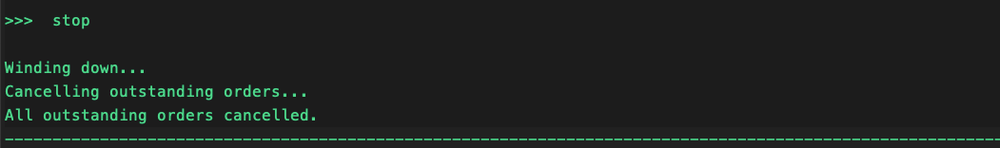

# Start and Stop Strategy

## Creating a V2 Strategy Config

Before starting a V2 strategy or controller, you need to create a config file using the `create` command.

### V2 Script Config

To create a config for a V2 script (located in `scripts/`):

```
create --v2-config <script_name>
```

**Example:**
```
create --v2-config simple_pmm
```

This prompts you for strategy parameters and saves the config to `conf/scripts/`.

### Controller Config

To create a config for a controller (located in `controllers/`):

```
create --controller-config <controller_name>
```

**Example:**
```
create --controller-config generic.lp_rebalancer.lp_rebalancer
```

This prompts you for controller parameters and saves the config to `conf/controllers/`.

## Starting a strategy

### V2 Strategy (Recommended)

To start a V2 strategy or controller using a config file:

```
start --v2 <config_file_name>
```

**Example:**
```
start --v2 conf_simple_pmm_1.yml
```

The config file must exist in `conf/scripts/`. It must include `script_file_name` pointing at the script to run (for example `simple_pmm.py`). Controller-based runs use the `v2_with_controllers` loader; see [Controller Walkthrough](../strategies/v2-strategies/walkthrough-controller.md).


### V1 Strategy (Legacy)

For classic V1 strategies (Pure Market Making, XEMM, etc.), use `import` to load a config file first, then `start`:

```
import
start
```

## Stop a running strategy

Run `stop` to stop the running strategy and cancel all active orders.

```
stop
```



## Strategy Autostart

Hummingbot can automatically start the execution of a previously configured trading strategy upon launch without needing user interaction. This feature works with both regular and headless modes.

### Docker Autostart

#### Prerequisites

- You have Hummingbot running via Docker Compose
- You have already run the instance at least once and have set the password and API keys
- You have at least one strategy configuration file that has been set up previously

#### How to Configure Docker Autostart

1. **Stop any running containers**
   ```bash
   docker compose down
   ```

2. **Modify docker-compose.yml**
   
   Edit the `environment` section to include:
   
   ```yaml
   environment:
     - CONFIG_PASSWORD=password
     # V2 script or controller loader: YAML in conf/scripts (maps to quickstart --v2)
     - SCRIPT_CONFIG=conf_v2_with_controllers_1.yml
     # Classic V1 strategy: YAML file name in conf/strategies (maps to quickstart -f)
     # - CONFIG_FILE_NAME=pure_market_making.yml
     - HEADLESS_MODE=true  # Optional: Enable headless mode
   ```

3. **Deploy the Hummingbot container**
   ```bash
   docker compose up -d
   ```

   This will start Hummingbot in detached mode (running in the background).

4. **View active containers**
   ```bash
   docker ps
   ```

   You should see your Hummingbot container running with the configured strategy.

5. **Attach to the running container**
   ```bash
   docker attach hummingbot
   ```

   When you attach, the strategy should already be running. To detach without stopping the container, use `Ctrl+P` followed by `Ctrl+Q`.

### Source Installation Autostart

#### Prerequisites

- You have Hummingbot installed via Source
- You have already connected exchanges by adding API keys
- You have at least one strategy configuration file that has been set up previously

#### How to Configure Source Autostart

Use the following command:

```bash
# V2 script or controller loader (YAML in conf/scripts)
bin/hummingbot_quickstart.py -p CONFIG_PASSWORD --v2 CONFIG_YML [--headless]

# Legacy V1 strategy (YAML in conf/strategies)
bin/hummingbot_quickstart.py -p CONFIG_PASSWORD -f STRATEGY_CONFIG_YML [--headless]
```

**Example:**

```bash
# V2: autostart using a script config under conf/scripts
bin/hummingbot_quickstart.py -p mypassword --v2 conf_simple_pmm_1.yml

# V1: autostart using a strategy config under conf/strategies
bin/hummingbot_quickstart.py -p mypassword -f conf_pure_mm_1.yml --headless
```

## Headless Mode

!!! warning
    Running any trading bots without manual supervision may incur additional risks. It is imperative that you thoroughly understand and test the strategy and parameters before deploying bots that can trade in an unattended manner.

Hummingbot can run in headless mode, which allows the bot to operate without the interactive CLI interface. This is particularly useful for deploying bots to cloud services or running multiple instances programmatically.

### Prerequisites for Headless Mode

- **MQTT must be enabled and running**: Since there's no CLI interface in headless mode, MQTT is required to control and monitor the bot
- **Hummingbot password must be set**: The password is needed to decrypt API keys and wallets
- **Strategy configuration must exist**: You need a pre-configured strategy or script file

### How to Run in Headless Mode

#### Using Command Line Arguments

```bash
bin/hummingbot_quickstart.py --headless -p PASSWORD [--v2 V2_CONFIG_YML | -f V1_STRATEGY_YML]
```

Where:

- `--headless`: Enables headless mode

- `-p PASSWORD`: Your Hummingbot password

- `--v2 V2_CONFIG_YML`: V2 script config file name in `conf/scripts/` (same as the CLI `start --v2` argument)

- `-f V1_STRATEGY_YML`: V1 strategy config file name in `conf/strategies/`

#### Using Environment Variables

You can also use environment variables, which is especially useful for Docker deployments:

```bash
export HEADLESS_MODE=true
export CONFIG_PASSWORD=your_password
export CONFIG_FILE_NAME=your_v1_strategy.yml  # V1 only: conf/strategies
export SCRIPT_CONFIG=your_v2_script_config.yml  # V2: conf/scripts (optional; same as --v2)
```

### Important Considerations for Headless Mode

**MQTT is Required**: Without a CLI interface, MQTT is the only way to:
   
   - Monitor bot status and performance
   
   - View logs and error messages
   
   - Stop the bot or modify parameters
   
   - Receive alerts and notifications

**Use with Hummingbot API**: We strongly recommend using headless mode alongside the [Hummingbot API](https://github.com/hummingbot/hummingbot-api) for:
   
   - Managing multiple bot instances
   
   - Real-time monitoring and control
   
   - Automated deployment and scaling
   
   - Integration with other systems

**Logging**: In headless mode, logs are still written to files, but you won't see them in real-time unless you're monitoring via MQTT or viewing log files directly.

### Autostart File Types

You can auto-start either:

- **Scripts**: Python files (`.py`) containing all strategy logic. Hummingbot looks for these in the `scripts` directory

- **Strategies**: Configurable strategy templates with YAML config files (`.yml`). Hummingbot looks for these in the `conf/strategies` directory

### Best Practices for Unattended Trading

1. **Test Thoroughly**: Always test your strategies in paper trading mode before running them unattended

2. **Set Appropriate Limits**: Configure kill switches, balance limits, and other safety parameters

3. **Monitor Regularly**: Even in headless/autostart mode, regularly check logs and performance

4. **Use MQTT/API**: Set up proper monitoring through MQTT or Hummingbot API for real-time alerts

5. **Secure Your System**: Ensure your deployment environment is secure, especially when running with autostart

