```mermaid
graph LR
    Hummingbot_Application_COE_Core_["Hummingbot Application (COE Core)"]
    Clock["Clock"]
    Event_Management_System["Event Management System"]
    Configuration_Manager["Configuration Manager"]
    Persistence_Layer["Persistence Layer"]
    Exchange_Connectors["Exchange Connectors"]
    Trading_Strategies["Trading Strategies"]
    Market_Data_Feeds["Market Data Feeds"]
    Client_User_Interface_CLI_["Client User Interface (CLI)"]
    Web_Assistant_Network_Utilities["Web Assistant / Network Utilities"]
    Hummingbot_Application_COE_Core_ -- "manages" --> Trading_Strategies
    Hummingbot_Application_COE_Core_ -- "initializes" --> Exchange_Connectors
    Hummingbot_Application_COE_Core_ -- "uses" --> Clock
    Hummingbot_Application_COE_Core_ -- "interacts with" --> Client_User_Interface_CLI_
    Clock -- "provides timing to" --> Hummingbot_Application_COE_Core_
    Clock -- "emits events to" --> Event_Management_System
    Event_Management_System -- "dispatches events to" --> Trading_Strategies
    Exchange_Connectors -- "receives events from" --> Event_Management_System
    Configuration_Manager -- "provides settings to" --> Hummingbot_Application_COE_Core_
    Configuration_Manager -- "configures" --> Trading_Strategies
    Persistence_Layer -- "stores data from" --> Trading_Strategies
    Hummingbot_Application_COE_Core_ -- "initializes" --> Persistence_Layer
    Exchange_Connectors -- "executes orders for" --> Trading_Strategies
    Exchange_Connectors -- "provides data to" --> Market_Data_Feeds
    Exchange_Connectors -- "uses" --> Web_Assistant_Network_Utilities
    Exchange_Connectors -- "publishes events to" --> Event_Management_System
    Trading_Strategies -- "requests orders from" --> Exchange_Connectors
    Trading_Strategies -- "consumes data from" --> Market_Data_Feeds
    Market_Data_Feeds -- "supplies data to" --> Trading_Strategies
    Market_Data_Feeds -- "uses" --> Web_Assistant_Network_Utilities
    Client_User_Interface_CLI_ -- "sends commands to" --> Hummingbot_Application_COE_Core_
    Hummingbot_Application_COE_Core_ -- "displays information to" --> Client_User_Interface_CLI_
    Web_Assistant_Network_Utilities -- "provides network services to" --> Exchange_Connectors
    Web_Assistant_Network_Utilities -- "provides network services to" --> Market_Data_Feeds
```

## Details

The Core Orchestration Engine (COE) in Hummingbot serves as the central nervous system, coordinating all critical operations of the algorithmic trading platform. It ensures the bot's smooth lifecycle, from initialization to shutdown, by integrating and managing various core services. The COE's design emphasizes modularity and extensibility, allowing for flexible integration of different trading strategies, exchange connectors, and data sources, all communicating efficiently through an event-driven architecture.

### Hummingbot Application (COE Core)
The primary orchestrator of the Hummingbot application. It manages the bot's overall lifecycle, initializes and coordinates all other core components, and integrates user interaction.

**Related Classes/Methods**:

- <a href="https://github.com/hummingbot/hummingbot/blob/master/hummingbot/client/hummingbot_application.py" target="_blank" rel="noopener noreferrer">`hummingbot.client.hummingbot_application`</a>

### Clock
Provides the fundamental time-based pulse for the entire application, ensuring all time-sensitive operations and scheduled tasks are synchronized.

**Related Classes/Methods**:

- <a href="https://github.com/hummingbot/hummingbot/blob/master/bin/hummingbot.py" target="_blank" rel="noopener noreferrer">`hummingbot.core.clock`</a>

### Event Management System
Facilitates decoupled communication and coordination between all components through a robust event-driven architecture, allowing components to react to system-wide events.

**Related Classes/Methods**:

- <a href="https://github.com/hummingbot/hummingbot/blob/master/hummingbot/core/event/event_forwarder.py" target="_blank" rel="noopener noreferrer">`hummingbot.core.event.event_forwarder`</a>

### Configuration Manager
Responsible for loading, saving, and applying the bot's configuration settings, including API keys, strategy parameters, and general application preferences.

**Related Classes/Methods**:

- <a href="https://github.com/hummingbot/hummingbot/blob/master/hummingbot/client/config/client_config_map.py" target="_blank" rel="noopener noreferrer">`hummingbot.client.config.client_config_map`</a>

### Persistence Layer
Manages the connection to the database and handles the logging and persistence of critical operational data, such as trade fills, order statuses, and balance updates.

**Related Classes/Methods**:

- <a href="https://github.com/hummingbot/hummingbot/blob/master/hummingbot/model/sql_connection_manager.py" target="_blank" rel="noopener noreferrer">`hummingbot.model.sql_connection_manager`</a>

### Exchange Connectors
Modules that provide the interface for interacting with various cryptocurrency exchanges (both spot and perpetual). They handle order placement, cancellation, balance queries, and receiving real-time trade and order updates.

**Related Classes/Methods**:

- <a href="https://github.com/hummingbot/hummingbot/blob/master/hummingbot/connector/exchange_py_base.py" target="_blank" rel="noopener noreferrer">`hummingbot.connector.exchange_py_base`</a>
- <a href="https://github.com/hummingbot/hummingbot/blob/master/hummingbot/connector/perpetual_derivative_py_base.py" target="_blank" rel="noopener noreferrer">`hummingbot.connector.perpetual_derivative_py_base`</a>

### Trading Strategies
Encapsulates the algorithmic trading logic and decision-making processes. Strategies consume market data, generate trading signals, and issue orders to exchange connectors.

**Related Classes/Methods**:

- <a href="https://github.com/hummingbot/hummingbot/blob/master/hummingbot/strategy/script_strategy_base.py" target="_blank" rel="noopener noreferrer">`hummingbot.strategy.script_strategy_base`</a>
- <a href="https://github.com/hummingbot/hummingbot/blob/master/hummingbot/strategy_v2/controllers/controller_base.py" target="_blank" rel="noopener noreferrer">`hummingbot.strategy_v2.controllers.controller_base`</a>

### Market Data Feeds
Components responsible for fetching and providing real-time and historical market data, such as order books, trade histories, and candlestick data, from various sources.

**Related Classes/Methods**:

- <a href="https://github.com/hummingbot/hummingbot/blob/master/hummingbot/data_feed/data_feed_base.py" target="_blank" rel="noopener noreferrer">`hummingbot.data_feed.data_feed_base`</a>

### Client User Interface (CLI)
The primary command-line interface for users to interact with the bot. It allows for configuration, starting/stopping strategies, and monitoring the bot's status and performance.

**Related Classes/Methods**:

- <a href="https://github.com/hummingbot/hummingbot/blob/master/hummingbot/client/ui/hummingbot_cli.py" target="_blank" rel="noopener noreferrer">`hummingbot.client.ui.hummingbot_cli`</a>

### Web Assistant / Network Utilities
Provides foundational utilities for secure and efficient network communication, including managing HTTP requests, WebSocket connections, and API rate limiting.

**Related Classes/Methods**:

- <a href="https://github.com/hummingbot/hummingbot/blob/master/hummingbot/core/web_assistant/web_assistants_factory.py" target="_blank" rel="noopener noreferrer">`hummingbot.core.web_assistant.web_assistants_factory`</a>
- <a href="https://github.com/hummingbot/hummingbot/blob/master/hummingbot/core/network_base.py" target="_blank" rel="noopener noreferrer">`hummingbot.core.network_base`</a>

### [FAQ](https://github.com/CodeBoarding/GeneratedOnBoardings/tree/main?tab=readme-ov-file#faq)