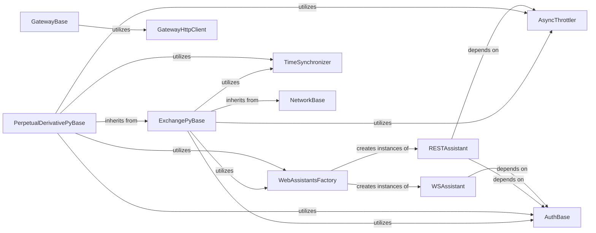

## Details

One paragraph explaining the functionality which is represented by this graph. What the main flow is and what is its purpose.

### ExchangePyBase
Serves as the abstract base class for all centralized exchange (CEX) spot connectors. It defines the common interface and fundamental functionalities that every spot exchange connector must implement, such as order placement, cancellation, balance tracking, and market data handling.

**Related Classes/Methods**:

- <a href="https://github.com/hummingbot/hummingbot/blob/master/hummingbot/connector/exchange_py_base.py#L39-L1096" target="_blank" rel="noopener noreferrer">`hummingbot.connector.exchange_py_base.ExchangePyBase` (39:1096)</a>

### PerpetualDerivativePyBase
Serves as the abstract base class for all perpetual derivative exchange connectors. It extends ExchangePyBase and defines functionalities specific to perpetual markets, including position management, funding rates, and leverage.

**Related Classes/Methods**:

- <a href="https://github.com/hummingbot/hummingbot/blob/master/hummingbot/connector/perpetual_derivative_py_base.py#L27-L437" target="_blank" rel="noopener noreferrer">`hummingbot.connector.perpetual_derivative_py_base.PerpetualDerivativePyBase` (27:437)</a>

### GatewayBase
Serves as the abstract base class for all decentralized exchange (DEX) and gateway connectors. It defines the interface for interacting with the Hummingbot Gateway, which mediates communication with various blockchain networks and DEX protocols.

**Related Classes/Methods**:

- <a href="https://github.com/hummingbot/hummingbot/blob/master/hummingbot/connector/gateway/gateway_base.py#L31-L569" target="_blank" rel="noopener noreferrer">`hummingbot.connector.gateway.gateway_base.GatewayBase` (31:569)</a>

### GatewayHttpClient
Handles HTTP communication with the Hummingbot Gateway. It is responsible for sending requests to the Gateway and receiving responses, forming the direct communication layer for DEX interactions.

**Related Classes/Methods**:

- <a href="https://github.com/hummingbot/hummingbot/blob/master/hummingbot/core/gateway/gateway_http_client.py#L44-L781" target="_blank" rel="noopener noreferrer">`hummingbot.core.gateway.gateway_http_client.GatewayHttpClient` (44:781)</a>

### WebAssistantsFactory
A factory class responsible for creating and managing instances of RESTAssistant and WSAssistant. It ensures that web communication components are properly initialized and configured for each connector.

**Related Classes/Methods**:

- <a href="https://github.com/hummingbot/hummingbot/blob/master/hummingbot/core/web_assistant/web_assistants_factory.py#L13-L80" target="_blank" rel="noopener noreferrer">`hummingbot.core.web_assistant.web_assistants_factory.WebAssistantsFactory` (13:80)</a>

### RESTAssistant
Provides a standardized way to make REST API calls to exchanges. It encapsulates logic for request signing, error handling, and response parsing for RESTful interactions.

**Related Classes/Methods**:

- <a href="https://github.com/hummingbot/hummingbot/blob/master/hummingbot/core/web_assistant/rest_assistant.py#L13-L124" target="_blank" rel="noopener noreferrer">`hummingbot.core.web_assistant.rest_assistant.RESTAssistant` (13:124)</a>

### WSAssistant
Provides a standardized way to manage WebSocket connections with exchanges for real-time market data and user stream updates. It handles connection establishment, message sending/receiving, and error handling for WebSocket interactions.

**Related Classes/Methods**:

- <a href="https://github.com/hummingbot/hummingbot/blob/master/hummingbot/core/web_assistant/ws_assistant.py#L10-L95" target="_blank" rel="noopener noreferrer">`hummingbot.core.web_assistant.ws_assistant.WSAssistant` (10:95)</a>

### AsyncThrottler
Manages and enforces API rate limits for all outgoing requests to exchanges. It prevents the bot from exceeding exchange-specific request limits, which could lead to temporary bans or degraded performance.

**Related Classes/Methods**:

- <a href="https://github.com/hummingbot/hummingbot/blob/master/hummingbot/core/api_throttler/async_throttler.py#L53-L80" target="_blank" rel="noopener noreferrer">`hummingbot.core.api_throttler.async_throttler.AsyncThrottler` (53:80)</a>

### AuthBase
An abstract base class defining the interface for authentication mechanisms. Concrete authentication classes for each exchange (e.g., BinanceAuth) inherit from this.

**Related Classes/Methods**:

- <a href="https://github.com/hummingbot/hummingbot/blob/master/hummingbot/core/web_assistant/auth.py#L5-L19" target="_blank" rel="noopener noreferrer">`hummingbot.core.web_assistant.auth.AuthBase` (5:19)</a>

### TimeSynchronizer
Synchronizes the bot's local time with the exchange's server time. This is critical for many exchange APIs that require requests to be timestamped accurately to prevent replay attacks and ensure order validity.

**Related Classes/Methods**:

- <a href="https://github.com/hummingbot/hummingbot/blob/master/hummingbot/connector/time_synchronizer.py#L11-L95" target="_blank" rel="noopener noreferrer">`hummingbot.connector.time_synchronizer.TimeSynchronizer` (11:95)</a>

### NetworkBase
Provides a foundational base for network-related functionalities, likely including common methods for managing network state and interactions.

**Related Classes/Methods**:

- <a href="https://github.com/hummingbot/hummingbot/blob/master/hummingbot/core/network_base.py#L12-L118" target="_blank" rel="noopener noreferrer">`hummingbot.core.network_base.NetworkBase` (12:118)</a>

### [FAQ](https://github.com/CodeBoarding/GeneratedOnBoardings/tree/main?tab=readme-ov-file#faq)