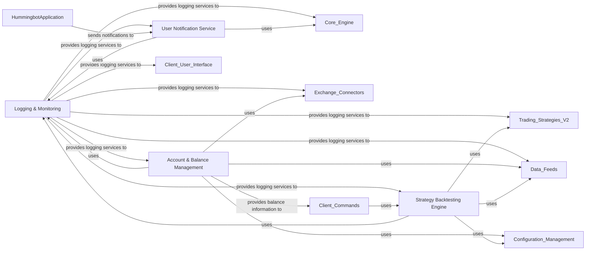

## Details

The `Performance & Reporting (PR)` subsystem, as initially described, is a broad area encompassing several critical functionalities within the Hummingbot project. Based on the project's architectural patterns (Event-Driven, Modular/Plugin, Layered) and the provided related classes, it can be effectively broken down into four distinct and fundamental components: `Logging & Monitoring`, `User Notification Service`, `Account & Balance Management`, and `Strategy Backtesting Engine`. These components are essential for the operation, user interaction, and strategic development within an algorithmic trading platform.

### Logging & Monitoring
This component is responsible for capturing, formatting, and dispatching various types of logs, including operational messages, errors, and performance data. It provides a structured logging mechanism and can send logs to a remote server for centralized monitoring and analysis. It also handles application-specific warnings. This component is fundamental for debugging, auditing, and understanding the real-time behavior and health of the trading bot.

**Related Classes/Methods**:

- <a href="https://github.com/hummingbot/hummingbot/blob/master/hummingbot/logger/logger.py#L1-L1" target="_blank" rel="noopener noreferrer">`hummingbot.logger.logger` (1:1)</a>
- <a href="https://github.com/hummingbot/hummingbot/blob/master/hummingbot/logger/log_server_client.py#L1-L1" target="_blank" rel="noopener noreferrer">`hummingbot.logger.log_server_client` (1:1)</a>
- <a href="https://github.com/hummingbot/hummingbot/blob/master/hummingbot/logger/application_warning.py#L1-L1" target="_blank" rel="noopener noreferrer">`hummingbot.logger.application_warning` (1:1)</a>
- <a href="https://github.com/hummingbot/hummingbot/blob/master/hummingbot/logger/struct_logger.py#L1-L1" target="_blank" rel="noopener noreferrer">`hummingbot.logger.struct_logger` (1:1)</a>

### User Notification Service
This component is dedicated to sending real-time notifications to users about important bot events, such as trade executions, errors, or status updates. It abstracts the underlying communication mechanism, allowing for different notification channels (e.g., MQTT). This ensures users are promptly informed about critical events without needing to constantly monitor the bot's console.

**Related Classes/Methods**:

- <a href="https://github.com/hummingbot/hummingbot/blob/master/hummingbot/notifier/notifier_base.py#L1-L1" target="_blank" rel="noopener noreferrer">`hummingbot.notifier.notifier_base` (1:1)</a>
- <a href="https://github.com/hummingbot/hummingbot/blob/master/hummingbot/remote_iface/mqtt.py#L504-L533" target="_blank" rel="noopener noreferrer">`hummingbot.remote_iface.mqtt.MQTTNotifier` (504:533)</a>

### Account & Balance Management
This component is responsible for securely connecting to various cryptocurrency exchanges, retrieving, and consolidating user asset balances. It provides a unified view of the user's portfolio across different trading venues, which is essential for accurate risk management and strategy execution.

**Related Classes/Methods**:

- <a href="https://github.com/hummingbot/hummingbot/blob/master/hummingbot/user/user_balances.py#L1-L1" target="_blank" rel="noopener noreferrer">`hummingbot.user.user_balances` (1:1)</a>

### Strategy Backtesting Engine
This component provides a robust framework for simulating trading strategies against historical market data. It allows users to test and optimize their strategies without risking real capital, offering detailed performance metrics and insights. This is crucial for strategy development, validation, and risk assessment before live deployment.

**Related Classes/Methods**:

- <a href="https://github.com/hummingbot/hummingbot/blob/master/hummingbot/strategy_v2/backtesting/backtesting_engine_base.py#L1-L1" target="_blank" rel="noopener noreferrer">`hummingbot.strategy_v2.backtesting.backtesting_engine_base` (1:1)</a>
- <a href="https://github.com/hummingbot/hummingbot/blob/master/hummingbot/strategy_v2/backtesting/backtesting_data_provider.py#L1-L1" target="_blank" rel="noopener noreferrer">`hummingbot.strategy_v2.backtesting.backtesting_data_provider` (1:1)</a>
- <a href="https://github.com/hummingbot/hummingbot/blob/master/hummingbot/strategy_v2/backtesting/executor_simulator_base.py#L1-L1" target="_blank" rel="noopener noreferrer">`hummingbot.strategy_v2.backtesting.executor_simulator_base` (1:1)</a>
- <a href="https://github.com/hummingbot/hummingbot/blob/master/hummingbot/strategy_v2/backtesting/executors_simulator/dca_executor_simulator.py#L1-L1" target="_blank" rel="noopener noreferrer">`hummingbot.strategy_v2.backtesting.executors_simulator.dca_executor_simulator` (1:1)</a>
- <a href="https://github.com/hummingbot/hummingbot/blob/master/hummingbot/strategy_v2/backtesting/executors_simulator/position_executor_simulator.py#L1-L1" target="_blank" rel="noopener noreferrer">`hummingbot.strategy_v2.backtesting.executors_simulator.position_executor_simulator` (1:1)</a>

### [FAQ](https://github.com/CodeBoarding/GeneratedOnBoardings/tree/main?tab=readme-ov-file#faq)